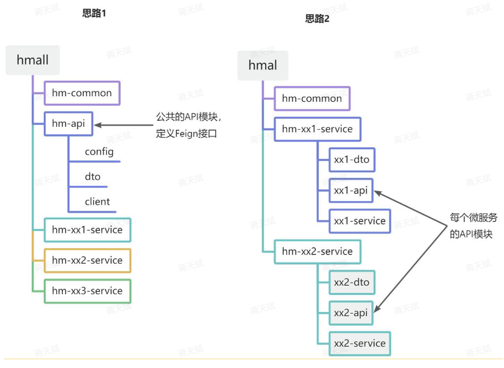

# OpenFeign 

OpenFeign 用于简化服务的远程调用。

远程调用主要在于：

- 请求方式
- 请求路径
- 请求参数
- 返回值类型

OpenFeign 利用 SpringMVC 的相关注解声明上述 4 个参数，然后基于动态代理生成远程调用的代码。

## 基本使用

- 依赖

```xml
  <!--openFeign-->
  <dependency>
      <groupId>org.springframework.cloud</groupId>
      <artifactId>spring-cloud-starter-openfeign</artifactId>
  </dependency>
  <!--负载均衡器-->
  <dependency>
      <groupId>org.springframework.cloud</groupId>
      <artifactId>spring-cloud-starter-loadbalancer</artifactId>
  </dependency>
```

- 启用 OpenFeign 

	在 application 启动类上使用 `@EnableFeignClients` 注解，并指定 client 所在的包。

- 编写 OpenFeign 客户端。

定义一个 client 接口：（OpenFeign 会通过动态代理自动实现该接口）

```java
@FeignClient("item-service")   // 服务名称
public interface ItemClient {

    @GetMapping("/items")
    List<ItemDTO> queryItemByIds(@RequestParam("ids") Collection<Long> ids);
}
```

其中：

- 请求方式

	由 Mapping 注解指定。

- 请求路径

	由 Mapping 注解指定。

- 请求参数

	由接口形参指定。

- 返回值类型

	由接口返回值类型指定。

## 连接池

Feign 底层发起 http 请求依赖支持的 http 客户端实现包括：

- HttpURLConnection：不支持连接池（默认实现）
- Apache HttpClient ：支持连接池
- OKHttp：支持连接池

配置成支持请求连接池的实现能够显著提升效率。

## 公共代码抽取

多个微服务间存在一些公共类的代码（DTO，Client 等），可以将其抽取出来集中存放，一般有两种方式：



- 思路 1

	抽取到微服务之外的独立 module ，每个微服务导入该 module 的坐标。

	- 优点：抽取更加简单，工程结构清晰。
	- 缺点：client 的 module 内耦合度偏高。

- 思路 2

	每个微服务内部建立一个 module ，微服务导入所需要的其它微服务 module 的坐标。

	- 优点：抽取相对麻烦，工程结构更复杂。
	- 缺点：服务间耦合度降低。

具体用哪种方式视项目情况而定。

## 服务日志

OpenFeign 只会在 FeignClient 所在包的日志级别为**DEBUG**时，才会输出日志，同时 OpenFeign 还有自己的日志级别：

- NONE

	不记录任何日志信息，这是默认级别，所以默认看不到请求日志。

- BASIC

	仅记录请求的方法，URL以及响应状态码和执行时间。

- HEADERS

	在BASIC的基础上，额外记录了请求和响应的头信息。

- FULL

	记录所有请求和响应的明细，包括头信息、请求体、元数据。

