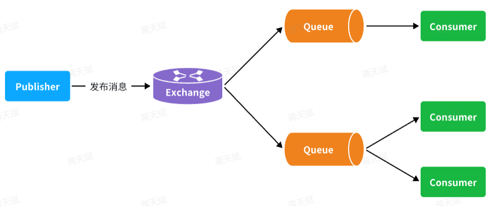

# RabbitMQ

RabbitMQ 有两个主要的端口：

- 15672

	管理控制台端口

- 5672

	消息发送处理端口

RabbitMQ 的架构：


其中：

- publisher

	生产者，发布者，也就是发送消息的一方。

- consumer

	消费者，也就是消费消息的一方。

- queue

	队列，存储消息。生产者投递的消息会暂存在消息队列中，等待消费者处理。

- exchange

	交换机，负责消息路由。生产者发送的消息由交换机决定投递到哪个队列。

	- exchange 需要与 queue 按照一定规则进行 binding（绑定）。

- virtual host

	虚拟主机，起到每个服务数据隔离的作用。每个虚拟主机相互独立，有各自的 exchange、queue 。

## 基本收发消息

`RabbitMQ` 实现了 AMQP 协议（一个消息队列协议），并且`RabbitMQ`官方也提供了各种不同语言的客户端。

RabbitMQ 官方提供的 Java 客户端编码相对复杂，一般结合 Spring 的 SpringAMQP 使用。

SpringAMQP  提供了三个功能：

- 自动声明队列、交换机及其绑定关系。
- 基于注解的监听器编码方式，异步接收消息。
- 封装 RabbitMQ 的官方实现，使用 RabbitTemplate 发送消息。

### 配置 MQ

```yaml
spring:
  rabbitmq:
    host: 192.168.150.101 # IP
    port: 5672 # 端口
    virtual-host: /hmall # 虚拟主机
    username: hmall # 用户名
    password: 123 # 密码
```

### 发送消息

```Java
@SpringBootTest
public class SpringAmqpTest {

    @Autowired
    private RabbitTemplate rabbitTemplate;

    @Test
    public void testSimpleQueue() {
        // 队列名称
        String queueName = "simple.queue";
        // 一般先发送到 exchange ， 再由 exchange 发送到 queue 。
        String exchangeName = "";
        
        // 消息
        String message = "hello, spring amqp!";
        // 发送消息
        rabbitTemplate.convertAndSend(queueName, message);   // 发送 String
    }
}
```

### 接收消息

发送消息和接收消息的参数类型应当对应，本例为 String 。

```Java
package com.itheima.consumer.listener;

import org.springframework.amqp.rabbit.annotation.RabbitListener;
import org.springframework.stereotype.Component;

@Component
public class SpringRabbitListener {
        // 利用RabbitListener来声明要监听的队列信息
    // 将来一旦监听的队列中有了消息，就会推送给当前服务，调用当前方法，处理消息。
    @RabbitListener(queues = "simple.queue")
    public void listenSimpleQueueMessage(String msg) throws InterruptedException {   // 接收 String
        System.out.println("spring 消费者接收到消息：【" + msg + "】");
    }
}
```

### WorkQueues 模型

work 模型同时使用多个消费者共同处理消息，以提升消息处理速度。

默认情况下，work 模型平均分配消息数量到各个消费者（依次读取所有消息）。

spring 中可以设置 prefetch ：

```yaml
spring:
  rabbitmq:
    listener:
      simple:
        prefetch: 1 # 每次预获取消息的数量
```

- 设置 prefetch 后，处理速度快的消费者能够在处理完 prefetch 条消息后，快速获取下 prefetch 条消息，从而让处理能力强的 consumer 获取到更多次消息（能者多劳）。

## 交换机

一般不直接将消息发给 Queue，而是先发送给 Exchange ：



Exchange 只负责转发消息，不具备存储消息的能力，因此如果没有任何队列与Exchange绑定，或者没有符合路由规则的去向的队列，那么消息会丢失。

交换机有四种类型：

- Fanout

	广播，将消息交给所有绑定到交换机的队列。

- Direct

	定向路由，基于 RoutingKey（路由 key ）发送给订阅了消息的队列。

- Topic

	话题订阅，与 Direct 类似，只不过 RoutingKey 可以使用通配符。

- Headers

	头匹配，基于 MQ 的消息头匹配，用的较少。

#### Fanout


- 每个队列都要绑定到 Exchange 。
- 交换机把消息发送给绑定过的所有队列。
- 订阅队列的消费者都能拿到消息。

#### Direct


- 队列和交换机通过 BindingKey 绑定。
	- 一个队列可绑定多个 BindingKey 。
	- 不同队列可绑定相同 BindingKey 。

- 消息在发送时需要指定 RoutingKey ，会被路由到所有 BindingKey 与该 RoutingKey 一致的队列中。

#### Topic

`Topic`类型`Exchange` 可以让队列在绑定`BindingKey` 的时候使用通配符。

通配符规则：

- `#`：匹配一个或多个词
- `*`：匹配不多不少恰好1个词


假如此时 publisher 发送的消息使用的`RoutingKey`共有四种：

- `china.news `代表有中国的新闻消息；
- `china.weather` 代表中国的天气消息；
- `japan.news` 则代表日本新闻；
- `japan.weather` 代表日本的天气消息；

#### 声明队列和交换机

一般由代码创建队列和交换机。

##### 基于配置类声明

```java
package com.itheima.consumer.config;

import org.springframework.amqp.core.Binding;
import org.springframework.amqp.core.BindingBuilder;
import org.springframework.amqp.core.FanoutExchange;
import org.springframework.amqp.core.Queue;
import org.springframework.context.annotation.Bean;
import org.springframework.context.annotation.Configuration;

@Configuration
public class FanoutConfig {
    /**
     * 声明交换机
     * @return Fanout类型交换机
     */
    @Bean
    public FanoutExchange fanoutExchange(){
        return new FanoutExchange("hmall.fanout");
    }

    /**
     * 第1个队列
     */
    @Bean
    public Queue fanoutQueue1(){
        return new Queue("fanout.queue1");
    }

    /**
     * 绑定队列和交换机
     */
    @Bean
    public Binding bindingQueue1(Queue fanoutQueue1, FanoutExchange fanoutExchange){
        return BindingBuilder.bind(fanoutQueue1).to(fanoutExchange);
    }

    /**
     * 第2个队列
     */
    @Bean
    public Queue fanoutQueue2(){
        return new Queue("fanout.queue2");
    }

    /**
     * 绑定队列和交换机
     */
    @Bean
    public Binding bindingQueue2(Queue fanoutQueue2, FanoutExchange fanoutExchange){
        return BindingBuilder.bind(fanoutQueue2).to(fanoutExchange);
    }
}
```

##### 基于注解声明

基于配置类的方式声明队列和交换机比较麻烦，Spring还提供了基于注解方式来声明（不存在则自动创建）。

```java
@RabbitListener(bindings = @QueueBinding(
    value = @Queue(name = "direct.queue1"),
    exchange = @Exchange(name = "hmall.direct", type = ExchangeTypes.DIRECT),
    key = {"red", "blue"}
))
public void listenDirectQueue1(String msg){
    System.out.println("消费者1接收到direct.queue1的消息：【" + msg + "】");
}

@RabbitListener(bindings = @QueueBinding(
    value = @Queue(name = "direct.queue2"),
    exchange = @Exchange(name = "hmall.direct", type = ExchangeTypes.DIRECT),
    key = {"red", "yellow"}
))
public void listenDirectQueue2(String msg){
    System.out.println("消费者2接收到direct.queue2的消息：【" + msg + "】");
}
```

## 消息转换器

默认情况下，MQ 的消息采用 JDK 序列化，但 JDK 序列化存在下列问题：

- 数据体积过大
- 有安全漏洞
- 可读性差

我们希望消息体的体积更小、可读性更高，因此可以使用 JSON 方式来做序列化和反序列化。

配置消息转换器：

```java
@Bean
public MessageConverter messageConverter(){
    // 1.定义消息转换器
    Jackson2JsonMessageConverter jackson2JsonMessageConverter = new Jackson2JsonMessageConverter();
    // 2.配置自动创建消息id，用于识别不同消息，也可以在业务中基于ID判断是否是重复消息
    jackson2JsonMessageConverter.setCreateMessageIds(true);
    return jackson2JsonMessageConverter;
}
```

## 可靠性

### 问题

消息从生产者到消费者的每一步都可能导致消息丢失：

- 发送消息时丢失（生产者可靠性）

	- 生产者发送消息时连接MQ失败
	- 生产者发送消息到达MQ后未找到`Exchange`
	- 生产者发送消息到达MQ的`Exchange`后，未找到合适的`Queue`
- MQ导致消息丢失（MQ 可靠性）
	- 消息到达MQ后，处理消息的进程发生异常
	- 消息到达MQ，保存到队列后，尚未消费就突然宕机

- 消费者处理消息时（消费者可靠性）

  - 消息接收后尚未处理突然宕机
  - 消息接收后处理过程中抛出异常
  - 业务幂等


### 生产者可靠性

#### 生产者重试

生产者发送消息时，出现了网络故障，导致与MQ的连接中断。

SpringAMQP 提供了消息发送时的重试机制，与 MQ 连接超时后会多次重试。

配置：

```yaml
spring:
  rabbitmq:
    connection-timeout: 1s # 设置MQ的连接超时时间
    template:
      retry:
        enabled: true # 开启超时重试机制
        initial-interval: 1000ms # 失败后的初始等待时间
        multiplier: 1 # 失败后下次的等待时长倍数，下次等待时长 = initial-interval * multiplier
        max-attempts: 3 # 最大重试次数
```

SpringAMQP 提供的重试机制是**阻塞式**的重试，即多次重试等待的过程中，当前线程是被阻塞的。

如果对于业务性能有要求，建议禁用重试机制。

如果一定要使用，需要合理配置等待时长和重试次数，或者使用异步线程来执行发送消息的代码。

#### 生产者确认

在少数情况下，也会出现消息发送到MQ之后丢失的现象。

RabbitMQ 提供了生产者消息确认机制，包括：Publisher Confirm（ACK 和 NACK）和 Publisher Return两种。

当生产者发送消息给MQ后，MQ会根据消息处理的情况返回不同的**回执**。


其中：

- 当消息投递到 MQ，但是路由失败时，交换机通过 Publisher Return 返回异常信息，同时返回 ack 的确认信息，代表投递成功（到 MQ 成功）。
- 临时消息（non durable）投递到了MQ，并且入队成功，交换机返回 ACK，告知投递成功
- 持久消息（durable）投递到了MQ，并且入队完成持久化，交换机返回 ACK ，告知投递成功
- 其它情况都会返回 NACK，告知投递失败

##### 配置

```yaml
spring:
  rabbitmq:
    publisher-confirm-type: correlated # 开启publisher confirm机制，并设置confirm类型
    publisher-returns: true # 开启publisher return机制
```

其中，`publisher-confirm-type`有三种模式可选：

- `none`：关闭confirm机制
- `simple`：同步阻塞等待MQ的回执
- `correlated`：MQ异步回调返回回执（推荐方式）

##### 定义 ReturnCallback

每个`RabbitTemplate`只能配置一个`ReturnCallback`，可在配置类配置。

```java
package com.itheima.publisher.config;

@Slf4j
@AllArgsConstructor
@Configuration
public class MqConfig {
    private final RabbitTemplate rabbitTemplate;

    @PostConstruct
    public void init(){
        rabbitTemplate.setReturnsCallback(new RabbitTemplate.ReturnsCallback() {
            @Override
            public void returnedMessage(ReturnedMessage returned) {
                log.error("触发return callback,");
                log.debug("exchange: {}", returned.getExchange());
                log.debug("routingKey: {}", returned.getRoutingKey());
                log.debug("message: {}", returned.getMessage());
                log.debug("replyCode: {}", returned.getReplyCode());
                log.debug("replyText: {}", returned.getReplyText());
            }
        });
    }
}
```

##### 定义 ConfirmCallback

每个消息发送时的处理逻辑不一定相同，因此 ConfirmCallback 需要在每次发消息时定义。具体来说，是在调用 RabbitTemplate 中的 convertAndSend 方法时，多传递一个 CorrelationData 参数。

CorrelationData 包含：

- `id`

	消息的唯一标识，MQ 对不同的消息的回执以此做判断，避免混淆

- `SettableListenableFuture`

	回执结果的 Future 对象，该对象包含一个回调函数，用于异步处理消息回执。

```java
@Test
void testPublisherConfirm() {
    // 1.创建CorrelationData
    CorrelationData cd = new CorrelationData();
    // 2.给Future添加ConfirmCallback
    cd.getFuture().addCallback(new ListenableFutureCallback<CorrelationData.Confirm>() {
        @Override
        public void onFailure(Throwable ex) {
            // 2.1.Future发生异常时的处理逻辑，基本不会触发
            log.error("send message fail", ex);
        }
        @Override
        public void onSuccess(CorrelationData.Confirm result) {
            // 2.2.Future接收到回执的处理逻辑，参数中的result就是回执内容
            if(result.isAck()){ // result.isAck()，boolean类型，true代表ack回执，false 代表 nack回执
                log.debug("发送消息成功，收到 ack!");
            }else{ // result.getReason()，String类型，返回nack时的异常描述
                log.error("发送消息失败，收到 nack, reason : {}", result.getReason());
            }
        }
    });
    // 3.发送消息
    rabbitTemplate.convertAndSend("hmall.direct", "q", "hello", cd);
}
```

##### 注意

开启生产者确认比较消耗MQ性能，一般不建议开启。

路由失败和交换机名称错误都是可以避免的编程错误，而 MQ 内部故障发生概率非常低，所以只需要开启 ConfirmCallback 处理 NACK 就行。

### MQ 可靠性

#### 数据持久化

默认情况下 MQ 的数据都是在内存存储的临时数据，宕机重启后就会消失。

为了保证数据的可靠性，必须配置数据持久化，包括：

- 交换机持久化（Durable）
- 队列持久化（Durable）
- 消息持久化（Persistent）
	- 出于性能考虑，为了减少IO次数，发送到MQ的消息并不是逐条持久化到数据库的，而是每隔一段时间批量持久化。
	- 消息持久化时，不会等到内存被消息占满再一次转移到磁盘，而是一边处理，一边将消息持久化到磁盘，这样性能更好，且不会丢失消息。

#### Lazy Queue

（惰性队列）

当出现消息堆积问题时，RabbitMQ 的一般 queue 会将内存中的消息刷到磁盘上，这个行为称为 `PageOut`，`PageOut`会耗费一段时间，并且会阻塞队列进程。

而 Lazy Queue 采用以下方案：

- 接收到消息后直接存入磁盘而非内存。（减少一次内存到磁盘的 IO）（默认消息持久化）
- 消费者要消费消息时才会从磁盘中读取并加载到内存（也就是 lazy 懒加载）（会预加载部分到内存）。
- 支持数百万条的消息存储。

### 消费者可靠性

#### 消费者确认机制

（Consumer Acknowledgement）

当消费者处理消息结束后，应该向 RabbitMQ 发送一个回执，告知 RabbitMQ 自己的消息处理状态：

- ack

	成功处理消息，RabbitMQ 从队列中删除该消息。

- nack

	消息处理失败，RabbitMQ 需要再次投递消息，直到消费者返回 ack 或 reject 。 

- reject

	消息处理失败并拒绝该消息，RabbitMQ 从队列中删除该消息。

SpringAMQP 允许通过配置文件设置 ACK 处理方式：

- **`none`**：不处理。即消息投递给消费者后立刻ack，消息会立刻从MQ删除。非常不安全，不建议使用
- **`manual`**：手动模式。需要自己在业务代码中调用api，发送`ack`或`reject`，存在业务入侵，但更灵活
- **`auto`**：自动模式。SpringAMQP利用AOP对我们的消息处理逻辑做了环绕增强，当业务正常执行时则自动返回`ack`.  当业务出现异常时，根据异常判断返回不同结果：
	- 如果是**业务异常**，会自动返回`nack`；
	- 如果是**消息处理或校验异常**，自动返回`reject`;

#### 失败重试机制

如果消费者不断出现异常，那么消息会不断requeue（重入队）到队列，再重新发送给消费者，极端情况下会导致 MQ 不断消息 requeue 。

Spring 提供了消费者失败重试机制：在消费者出现异常时利用本地重试，而不是无限制的requeue到mq队列。

配置：

```yaml
spring:
  rabbitmq:
    listener:
      simple:
        retry:
          enabled: true # 开启消费者失败重试
          initial-interval: 1000ms # 初识的失败等待时长为1秒
          multiplier: 1 # 失败的等待时长倍数，下次等待时长 = multiplier * last-interval
          max-attempts: 3 # 最大重试次数
          stateless: true # true无状态；false有状态。如果业务中包含事务，这里改为false
```

其中：

- 消费者在失败后消息不会 requeue 到队列，而是在消费者本地重试（即存储在消费者内，并重试处理消息）。
- 重试最大次数后，抛出`AmqpRejectAndDontRequeueException`异常，并给 queue 返回 reject 抛弃消息。

##### 失败重试策略

Spring 允许自定义重试次数耗尽后的消息处理策略，这个策略是由 `MessageRecovery` 接口来定义的，它有3个不同实现：

-  `RejectAndDontRequeueRecoverer`：重试耗尽后，直接`reject`，丢弃消息。（默认方式）
-  `ImmediateRequeueMessageRecoverer`：重试耗尽后，返回`nack`，消息重新入队。（重试的频率更低）
-  `RepublishMessageRecoverer`：重试耗尽后，将失败消息投递到指定的交换机，保存到一个指定的，专门存放异常消息的队列，后续由人工集中处理。（推荐）

```java
@Configuration
@ConditionalOnProperty(name = "spring.rabbitmq.listener.simple.retry.enabled", havingValue = "true")
public class ErrorMessageConfig {
    @Bean
    public DirectExchange errorMessageExchange(){
        return new DirectExchange("error.direct");
    }
    @Bean
    public Queue errorQueue(){
        return new Queue("error.queue", true);
    }
    @Bean
    public Binding errorBinding(Queue errorQueue, DirectExchange errorMessageExchange){
        return BindingBuilder.bind(errorQueue).to(errorMessageExchange).with("error");
    }

    @Bean
    public MessageRecoverer republishMessageRecoverer(RabbitTemplate rabbitTemplate){
        return new RepublishMessageRecoverer(rabbitTemplate, "error.direct", "error");
    }
}
```

#### 业务幂等性

业务幂等性指同一个业务，执行一次或多次对业务状态的影响是一致的。

在实际业务场景中，由于意外经常会出现业务被重复执行的情况，例如：

- 页面卡顿时频繁刷新导致表单重复提交
- 服务间调用的重试
- MQ消息的重复投递

保证消息处理的幂等性一般有两种方案：

- 唯一消息 ID
- 业务状态判断

##### 唯一消息 ID

方案：

1. 每一条消息都生成一个唯一的id，与消息一起投递给消费者。
2. 消费者接收到消息后处理自己的业务，业务处理成功后将消息ID保存到数据库
3. 如果下次又收到相同消息，去数据库查询判断是否存在，存在则为重复消息放弃处理。

SpringAMQP 的 MessageConverter 自带了 MessageID 的功能：

```java
@Bean
public MessageConverter messageConverter(){
    // 1.定义消息转换器
    Jackson2JsonMessageConverter jjmc = new Jackson2JsonMessageConverter();
    // 2.配置自动创建消息id，用于识别不同消息，也可以在业务中基于ID判断是否是重复消息
    jjmc.setCreateMessageIds(true);
    return jjmc;
}
```

##### 业务判断

基于业务本身的逻辑或状态来判断是否是重复的请求或消息，不同的业务场景判断的思路也不一样。

以支付修改订单的业务为例：

对于把订单状态从未支付修改为已支付的业务逻辑，可以在执行业务时判断订单状态是否是未支付，如果不是则证明订单已经被处理过，无需重复处理。

```java
    @Override
    public void markOrderPaySuccess(Long orderId) {
        // 1.查询订单
        Order old = getById(orderId);
        // 2.判断订单状态
        if (old == null || old.getStatus() != 1) {
            // 订单不存在或者订单状态不是1，放弃处理
            return;
        }
        // 3.尝试更新订单
        Order order = new Order();
        order.setId(orderId);
        order.setStatus(2);
        order.setPayTime(LocalDateTime.now());
        updateById(order);
    }
```

上述代码逻辑上符合了幂等判断的需求，但是由于判断和更新是两步动作，因此在极小概率下可能存在线程安全问题。

可以合并上述操作到一条数据库语句中：

```java
@Override
public void markOrderPaySuccess(Long orderId) {
    // 等同于：
    // UPDATE `order` SET status = ? , pay_time = ? WHERE id = ? AND status = 1
    // status 为 1 才更新
    lambdaUpdate()
            .set(Order::getStatus, 2)
            .set(Order::getPayTime, LocalDateTime.now())
            .eq(Order::getId, orderId)
            .eq(Order::getStatus, 1)
            .update();
}
```

### 兜底方案

MQ 通知仍然有因为网络失败的可能性，这种情况下如何保证订单的支付状态一致呢？

- 可以由交易服务自己**主动去查询**支付状态，这样即便支付服务的 MQ 通知失败，依然能通过主动查询来保证订单状态的一致。


其中，黄色部分：

- 收到通知就立刻更新支付状态。
- 在没有收到通知时，设置一个定时任务作为兜底方案，定期判断支付状态，如果发现订单已经支付，则立刻更新订单状态为已支付。

## 延迟消息

有些商品，例如电影票，高铁票，假如用户下单后一直不付款，就会一直占有库存资源，导致其他客户无法正常交易。

一般的做法是：对于超过一定时间未支付的订单，应该立刻取消订单并释放占用的库存。

例如，设置一个延迟任务，在用户下单后的第30分钟检查订单支付状态，如果发现未支付，应该立刻取消订单，释放库存。


可以用 RabbitMQ 实现延迟任务，有两种方式：

- 死信交换机
- 延迟消息插件


RabbitMQ 采用懒加载和垃圾回收的方式以减少大量消息过期时间检测对 CPU 的消耗：

- 懒加载

	当消息的 TTL 到期时，RabbitMQ 不会立即遍历整个队列去查找并删除这些消息，而是在消息准备被消费或与队列交互时，才会检查消息的状态，判断是否过期。

- 垃圾回收

	RabbitMQ 在后台会定期执行一些垃圾回收任务，这些任务包括清理过期消息、检测无用连接等。这种机制并不会频繁地影响队列的性能，但可以保证系统资源不会被不必要的过期消息长时间占用。

### 死信交换机

当一个队列中的消息满足下列情况之一时，会成为死信（dead letter）：

- 消费者使用`basic.reject`或 `basic.nack`声明消费失败，并且消息的`requeue`参数设置为false
- 消息是一个过期消息，超时无人消费
- 要投递的队列消息满了，无法投递

如果一个队列中的消息已经成为死信，并且这个队列通过**`dead-letter-exchange`**属性指定了一个交换机，那么队列中的死信就会投递到这个交换机中，而这个交换机就称为**死信交换机**（Dead Letter Exchange）。而此时假如有队列与死信交换机绑定，则死信就会被投递到这个队列中。

死信交换机一般的作用为：

1. 收集因处理失败而被拒绝的消息
2. 收集因队列满了而被拒绝的消息
3. 收集 TTL（有效期）到期的消息

可以通过死信交换机实现延迟消息：


其中：

- 交换机（`ttl.fanout`）和队列（`ttl.queue`）绑定。
- `ttl.queue`没有消费者监听，而是设定了死信交换机 `hmall.direct` 。
- 队列`direct.queue1`与死信交换机绑定，RoutingKey 是 blue 。

发送延迟消息的过程：

1. 发送一条消息到`ttl.fanout`，RoutingKey 为 blue，并设置消息的**有效期**为5000毫秒。
2. 消息被投递到`ttl.queue`，由于没有消费者，因此消息无人消费。5秒之后，消息的有效期到期，成为死信。
3. 死信被投递到死信交换机`hmall.direct`，并沿用之前的 RoutingKey，也就是`blue` 。
4. 消息路由到 `ttl.queue1` ，消费者获得消息，已经是 5 秒之后。

受 RabbitMQ 的消息过期时间处理机制（懒加载和垃圾回收）影响，死信交换机的延迟消息的时间不会特别精确，存在一定误差。

### 延迟消息插件

基于死信队列虽然可以实现延迟消息，但是太麻烦了。因此 RabbitMQ 社区提供了一个延迟消息插件 [DelayExchange](https://www.rabbitmq.com/blog/2015/04/16/scheduling-messages-with-rabbitmq)（延迟交换机）来实现相同的效果。

安装后声明延迟交换机：

```java
@RabbitListener(bindings = @QueueBinding(
        value = @Queue(name = "delay.queue", durable = "true"),
        exchange = @Exchange(name = "delay.direct", delayed = "true"),   // 设置 delayed 属性
        key = "delay"
))
public void listenDelayMessage(String msg){
    log.info("接收到delay.queue的延迟消息：{}", msg);
}
```

基于 @Bean 的方式：

```java
@Slf4j
@Configuration
public class DelayExchangeConfig {

    @Bean
    public DirectExchange delayExchange(){
        return ExchangeBuilder
                .directExchange("delay.direct") // 指定交换机类型和名称
                .delayed() // 设置delay的属性为true
                .durable(true) // 持久化
                .build();
    }

    @Bean
    public Queue delayedQueue(){
        return new Queue("delay.queue");
    }
    
    @Bean
    public Binding delayQueueBinding(){
        return BindingBuilder.bind(delayedQueue()).to(delayExchange()).with("delay");
    }
}
```

发送延迟消息时，通过 `delay` 属性设置延迟时间即可：

```java
@Test
void testPublisherDelayMessage() {
    // 1.创建消息
    String message = "hello, delayed message";
    // 2.发送消息，利用消息后置处理器添加消息头
    rabbitTemplate.convertAndSend("delay.direct", "delay", message, new MessagePostProcessor() {
        @Override
        public Message postProcessMessage(Message message) throws AmqpException {
            
            message.getMessageProperties().setDelay(5000);   // 添加延迟消息时间
            return message;
        }
    });
}
```

注意：

延迟消息插件内部会维护一个本地数据库表，同时使用 Elang Timers 功能实现计时。如果消息的延迟时间设置较长，可能会导致堆积的延迟消息非常多，会带来较大的CPU开销，同时延迟消息的时间会存在误差。因此，不建议设置延迟时间过长的延迟消息。

