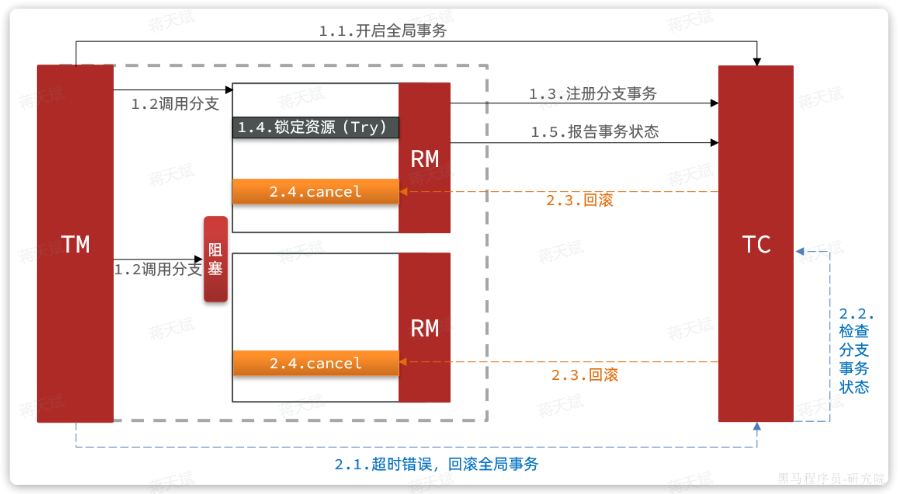

# Seata

## 基本方案

角色：

- 事务协调者 (Transaction Coordinator， TC) 

	维护全局和分支事务的状态，协调全局事务提交或回滚。 

- 事务管理器 (Transaction Manager，TM)

	执行抽象的全局事务，定义全局事务的范围、开始全局事务、提交或回滚全局事务。 

- 资源管理器 (Resource Manager，RM)

	管理分支事务，与 TC 交谈以注册分支事务和报告分支事务的状态，并驱动分支事务提交或回滚。 

其中：

- TM 和 RM 相当于 Seata 的客户端部分，需要引入到参与事务的微服务依赖中。
- TC 是事务协调中心，是一个独立的微服务，需要单独部署。

## 搭建

详细过程略。

TC 作为一个独立服务部署。

每个微服务都需要集成 Seata，公有配置可以作为共享配置放到 Nacos 里（还需要集成 Nacos）。

Seata 解决分布式事务所需要的一些中间数据表放在数据库中（AT 以及 TC 都有数据）。

在服务入口方法上使用 `@GlobalTransactional` 注解。

## 分布式事务模式

Seata 支持四种不同的分布式事务解决方案：

- XA
- AT
- TCC
- SAGA

### XA 模式

`XA` 规范 是` X/Open` 组织定义的分布式事务处理（DTP，Distributed Transaction Processing）标准。

XA 规范 描述了全局的`TM`与局部的`RM`之间的接口，几乎所有主流的数据库都对 XA 规范 提供了支持。

#### 原始 XA 模式

基于两阶段提交：

一阶段：

- 事务协调者通知每个事务参与者执行本地事务
- 本地事务执行完成后报告事务执行状态给事务协调者，此时事务不提交，继续持有数据库锁。

二阶段：

- 事务协调者基于一阶段的报告来判断下一步操作
- 如果一阶段都成功，则通知所有事务参与者，提交事务
- 如果一阶段任意一个参与者失败，则通知所有事务参与者回滚事务

正常情况：

异常情况：

#### Seata 的 XA 模式

Seata 对 XA 模式做了简单的封装和改造，以适应自己的事务模型。

阶段一:

- `RM`

	1. 注册分支事务到 `TC`

	1. 执行分支业务 sql 但不提交（一直占用数据库资源）

	1. 报告执行状态到 `TC`

阶段二：

- `TC` 检测各分支事务执行状态
	- 如果都成功，通知所有 RM 提交事务
	
	- 如果有失败，通知所有 RM 回滚事务 
	
- `RM`
	- 接收`TC`指令，提交或回滚事务

##### 优缺点

优点：

- 事务的强一致性，满足ACID原则
- 常用数据库都支持，实现简单，并且没有代码侵入

缺点：

- 因为一阶段需要锁定数据库资源，需要等待二阶段结束才释放，性能较差
- 依赖关系型数据库实现事务

### AT 模式

`AT`模式同样是分阶段提交的事务模型，不过弥补了`XA`模型中资源锁定周期过长的缺陷。

阶段一：

- `RM`
	- 注册分支事务
	- 记录 undo-log（数据快照）
	- 执行业务 sql 并提交。（可能产生短暂的数据不一致）
	- 报告事务状态

阶段二：

- 提交时

	`RM` 删除 undo-log 即可。

- 回滚时

	`RM`根据 undo-log 恢复数据到更新前。

### AT 与 XA 的区别

- 阶段一的事务提交方式不同
	- `XA`模式一阶段不提交事务，锁定资源；
	- `AT`模式一阶段直接提交，不锁定资源。
- 回滚方式不同
	- `XA`模式依赖数据库机制实现回滚；
	- `AT`模式利用数据快照实现数据回滚。
- 一致性不同
	- `XA`模式强一致，事务每个时刻都保持一致性。
	- `AT`模式最终一致，中途某些事务分支先提交而全局未提交，此时该分支的微服务被访问则可能导致短暂的数据不一致。
- 性能不同
  - XA 模式性能稍低，因为事务分支会一直持有数据库资源，直到全局事务完成。
  - AT 模式性能更高，因为牺牲了一些一致性（只有最终一致性）。

### AT 模式脏写问题

#### 脏写问题

在极端情况下，特别是多线程并发访问AT模式的分布式事务时，有可能出现脏写问题：

其中，事务 1 在提交事务，释放 DB 锁后，等待确认或者回滚，在 2.1 之前，事务 2 进来执行一些操作，导致了事务 1 回滚时发生错误。

#### 全局锁

解决方案：

引入全局锁，在释放 DB 锁之前，先拿到全局锁，避免同一时刻有另外一个事务来操作当前数据。

即由 TC 记录当前正在操作的：xid（事务 id），table（表名），pk（主键，即记录行）。

持有全局锁的事务才具有对某行数据的操作权。

其中：

- 事务如果获取不到 DB 琐或全局锁，则会阻塞重复尝试获取锁。
- 事务 2 在事务 1 等待确认或回滚期间（1.3 之后，2.1 之前），获取不到全局锁，不能修改该行数据。
- 事务 2 获取 DB 锁后（1.1 之后），事务 1 如果要回滚，需要先获取 DB 锁，但此时 DB 锁在事务 2 上，于是事务 1 需要等待 DB 锁。（产生临时死锁）
- 事务 2 获取全局锁超时失败后，释放 DB 锁，临时死锁现象解除，事务 1 获取到 DB 锁，开始回滚恢复数据。

##### 锁定粒度

有全局锁后，AT 模式不就和 XA 模式一样了，不都会锁定资源吗？

答：

- 全局锁由 TC 管理，而 DB 锁是由数据库管理，锁的粒度不一样。
- DB 锁锁住的行，其它任何事务都不可以增删改查。
- 全局锁锁住的行，对于没有被 seata 管理的事务，仍然可以进行增删改查。
- 这样的情况下性能仍然比 XA 模式高。

##### 写隔离

上述的隔离依然不是很彻底，其他未被 seata 管理的事务如果也对同一行数据进行了修改，也会丢失更新：

其中：

seata 在保存快照时，保存了两份，一份是更新前的数据用于恢复数据，一份是更新后的数据，用于判断事务一在阶段1和阶段2这个过程中是否有其他事务操作过这个数据，若经过对比发现与自己更新后的数据不同，则seata无法去回滚了，记录异常，由人工介入。

### TCC 模式

TCC模式与AT模式非常相似，每阶段都是独立事务，不同的是TCC通过人工编码来实现数据恢复。

需要人工实现三个方法：

-  `try`（阶段一）

	资源的检测和预留； 

-  `confirm`（阶段二）

	完成资源操作业务；要求 `try` 成功 `confirm` 一定要能成功。 

-  `cancel`（阶段二）

	预留资源释放，可以理解为 try 的反向操作。 

#### 资源预留

举例，一个扣减用户余额的业务。假设账户A原来余额是100，需要余额扣减30元。

- 阶段一（ Try ）

	检查余额是否充足，如果充足则冻结金额增加 30 元（资源预留），可用余额扣除 30 。

初始余额：

余额充足，可以冻结：

此时，总金额 = 冻结金额 + 可用金额，数量依然是100不变，事务直接提交无需等待其它事务。（此处没有加锁）

- 阶段二（Confirm)

	如果要提交，之前可用金额已经扣减，并转移到冻结金额。因此可用金额不变，直接冻结金额扣减 30 即可。（扣减预留的资源）

此时，总金额 = 冻结金额 + 可用金额 = 0 + 70  = 70元

- 阶段二（Canncel）

	如果要回滚，则释放之前冻结的金额，也就是冻结金额扣减 30，可用余额增加 30 。（释放预留资源）

这种基于**资源预留**的方式不用加锁，性能会比加锁好，但需要人工设计资源预留的方式。

#### 事务悬挂和空回滚

假如一个分布式事务中包含两个分支事务，try阶段，一个分支成功执行，另一个分支事务阻塞：

如果阻塞时间太长，可能导致全局事务超时而触发二阶段的`cancel`操作。两个分支事务都会执行cancel操作：

- 其中一个分支是未执行`try`操作的，直接执行了`cancel`操作，反而会导致数据错误。因此，这种情况下，尽管`cancel`方法要执行，但其中不能做任何回滚操作，这就是**空回滚**。
- 对于整个空回滚的分支事务，将来try方法阻塞结束依然会执行。但是整个全局事务其实已经结束了，因此永远不会再有confirm或cancel，也就是说这个事务执行了一半，处于**悬挂状态**，这就是业务悬挂问题。

以上问题都需要我们在编写try、cancel方法时处理。

#### TCC 优缺点

优点：

- 一阶段完成直接提交事务，释放数据库资源，性能好
- 相比AT模型，无需生成快照，无需使用全局锁，性能最强
- 不依赖数据库到事务机制，而是依赖补偿操作，可以用于非事务型数据库

缺点：

- 有代码侵入，需要人为编写try、Confirm和Cancel接口，太麻烦
- 软状态，事务是最终一致
- 需要考虑Confirm和Cancel的失败情况，做好幂等处理、事务悬挂和空回滚处理。

### 最大努力通知方案

最大努力通知是一种最终一致性的分布式事务解决方案，相比 XA，AT 和 TCC 的实现成本更低。

最大努力通知方案通过消息通知的方式报告分支事务的执行状态，如果执行失败会多次通知，无需任何分布式事务组件介入。

方案包含两部分：

- 失败重试（尽最大努力）

	分支事务向全局事务报告状态，失败则不断重试，直到返回确认成功（ack），或达到重试上限。

- 兜底方案

	分支事务在一定条件下（一般隔一段时间）主动查询其它分支事务状态并与全局事务核对。

其中，可以人工编码实现消息重试（调用接口，人工判断），这样可以去掉消息中间件的依赖。

## 分布式事务理论 - CAP定理

1998年，加州大学的计算机科学家 Eric Brewer 提出，分布式系统有三个指标：

- **C**onsistency（一致性）

	用户访问分布式系统中的任意节点，得到的数据必须一致。

	- 节点间需要进行数据同步。

- **A**vailability（可用性）

	用户访问分布式系统时，读或写操作总能成功。

	- 只能读不能写，或者只能写不能读，或者两者都不能执行，就说明系统弱可用或不可用。

- **P**artition tolerance （分区容错性）

	当分布式系统节点之间出现网络故障导致节点之间无法通信而产生通信节点分区时，分布式系统仍能够正常工作。

	- 即便是系统出现网络分区，整个系统也要持续对外提供服务。

Eric Brewer 认为任何分布式系统架构方案都不可能同时满足这 3 个目标，这个结论就叫做 CAP 定理。

### 矛盾取舍

在分布式系统中，网络不能100%保证畅通，也就是说网络分区的情况一定会存在。而我们的系统必须要持续运行，对外提供服务。所以分区容错性（`P`）是硬性指标，所有分布式系统都要满足。

那么在设计分布式系统时要取舍的就是一致性（`C`）和可用性（`A`）了。

假如现在出现了网络分区，如图：

其中，由于网络故障，当把数据写入node01时，可以与node02完成数据同步，但是无法同步给node03。

有两种选择：

- 允许用户任意读写，保证可用性。（满足 AP）

	由于 node03 无法完成同步，会出现数据不一致的情况。

- 不允许用户写，可以读，直到网络恢复，分区消失。（满足 CP）

	确保了一致性，但牺牲了可用性。

### BASE 理论

BASE 理论是一种对 CAP 定理的取舍解决方案：

- **B**asically **A**vailable （基本可用）

	分布式系统在出现故障时，允许损失部分可用性，保证核心可用。

- **S**oft State（软状态）

	在一定时间内，允许出现中间状态，比如临时的不一致状态。

- **E**ventually Consistent（最终一致性）

	虽然无法保证强一致性，但是在软状态结束后，最终达到数据一致。

有两个实现方向：

- AP 思想，一定程度牺牲 C（例如 `AT`模式）

	各个子事务分别执行和提交，无需锁定数据。允许出现结果不一致，然后采用弥补措施恢复，实现最终一致即可。

- CP 思想，一定程度牺牲 A（例如 `XA`模式）

	各个子事务执行后不要提交，而是等待彼此结果，然后同时提交或回滚。在这个过程中锁定资源，不允许其它人访问，数据处于不可用状态，但能保证一致性。