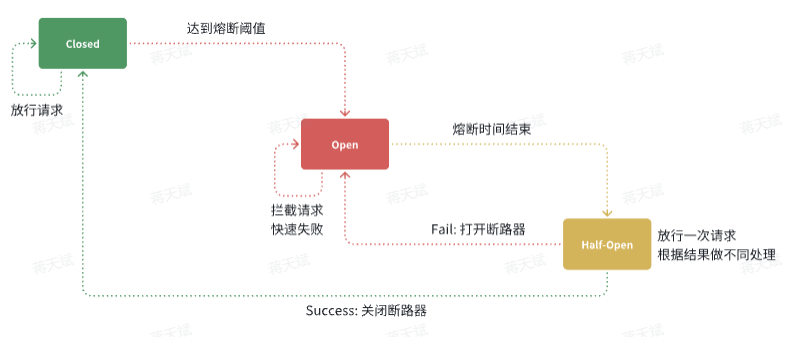

# Sentinel

Sentinel 的使用可以分为两个部分:

- **核心库**（Jar包）

	不依赖任何框架/库，能够运行于 Java 8 及以上的版本的运行时环境，同时对 Dubbo / Spring Cloud 等框架也有较好的支持。在项目中引入依赖即可实现服务限流、隔离、熔断等功能。

- **控制台**（Dashboard）

	Dashboard 主要负责管理推送规则、监控、管理机器信息等。

## 引入 sentinel

在微服务中引入依赖：

```xml
<!--sentinel-->
<dependency>
    <groupId>com.alibaba.cloud</groupId> 
    <artifactId>spring-cloud-starter-alibaba-sentinel</artifactId>
</dependency>
```

配置端口：

```yaml
spring:
  cloud: 
    sentinel:
      transport:
        dashboard: localhost:8090
      http-method-specify: true # 开启请求方式前缀
```

访问微服务接口，只有访问微服务接口后，微服务才能被 sentinel 监听到。

- 簇点链路

	就是单机调用链路，用户请求产生的微服务间的不断相互调用组成了一条调用链路，链路上每个结点就是簇点。

默认情况下 Sentinel 会把路径作为簇点资源的名称，无法区分相同路径但不同请求方式的接口，因此查询、删除、修改等都被识别为一个簇点资源，可以选择打开Sentinel 的请求方式前缀，把`请求方式 + 请求路径`作为簇点资源名。

## 请求限流

可使用控制台的 流控 -> QPS 阈值类型。

## 线程隔离

可使用控制台的 流控 -> 并发线程数 阈值类型。

## 服务熔断

### 编写 fallback

1. 实现 `FallbackFactory<>` ，重写 Client 中的方法。

```java
@Slf4j
public class ItemClientFallback implements FallbackFactory<ItemClient> {
    @Override
    public ItemClient create(Throwable cause) {
        return new ItemClient() {
            @Override
            public List<ItemDTO> queryItemByIds(Collection<Long> ids) {
                log.error("远程调用ItemClient#queryItemByIds方法出现异常，参数：{}", ids, cause);
                // 查询购物车允许失败，查询失败，返回空集合
                return CollUtils.emptyList();
            }

            @Override
            public void deductStock(List<OrderDetailDTO> items) {
                // 库存扣减业务需要触发事务回滚，查询失败，抛出异常
                throw new BizIllegalException(cause);
            }
        };
    }
}
```

2. 在配置类中返回 ItemClientFallback 类。
3. 在 ItemClient 中指定 fallbackFactory 参数。

```java
@FeignClient(value = "item-service",
        fallbackFactory = ItemClientFallback.class)   // 指定参数
public interface ItemClient {

    @GetMapping("/items")
    List<ItemDTO> queryItemByIds(@RequestParam("ids") Collection<Long> ids);   // 被 fallback 重写的方法。

    @PostMapping("/items/stock/deduct")
    void deductStock(@RequestBody List<OrderDetailDTO> items);   // 被 fallback 重写的方法。
}
```

### 断路器

可使用控制台的 熔断 配置断路器统计规则。

Sentinel 的断路器可以统计：

- 慢请求比例

	基于接口的 RT（Response Time， 响应时间）。

- 异常请求比例

断路器的工作状态切换由一个状态机来控制：



其中：

- Closed

	关闭状态，断路器放行所有请求，并开始统计异常比例、慢请求比例。

	- 超过阈值则切换到 open 状态。

- Open

	打开状态，服务调用被熔断，访问被熔断服务的请求会被拒绝，快速失败，直接走降级逻辑。

	- Open 状态持续一段时间后（熔断时间）自动进入 half-open 状态。

- Half-Open

	半开状态，放行一次请求，根据执行结果来判断接下来的操作。

	- 请求成功，切换到 closed 状态（关闭断路器）
	- 请求失败，切换到 open 状态（保持断路器，保持熔断）