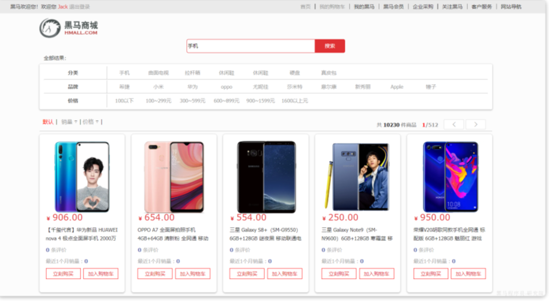

# 业务介绍

课程完整文档： [飞书云文档](https://b11et3un53m.feishu.cn/wiki/FYNkwb1i6i0qwCk7lF2caEq5nRe)

## 用户服务

- 用户登录，信息校验

## 商品服务

- 搜索商品
- 浏览商品详情
- 加入购物车

## 购物车服务

- 管理购物车
- 由于要判断商品最新的价格和状态，所以还需要查询商品信息

## 订单服务（交易服务）

购物车中点击【结算】即到达订单服务。

- 创建一个新的订单
- 扣减商品库存
- 清理购物车中商品

## 支付服务

下单完成后会跳转到支付页面，只实现了**余额支付**。

在选择**余额支付**这种方式后，会发起请求到服务端，服务端会立刻创建一个**支付流水单（支付记录）**，并返回支付流水单号到前端。

当用户输入用户密码，然后点击确认支付时，页面会发送请求到服务端，而服务端会做几件事情：

- 校验用户密码
- 扣减余额
- 修改支付流水单状态
- 修改交易订单状态

