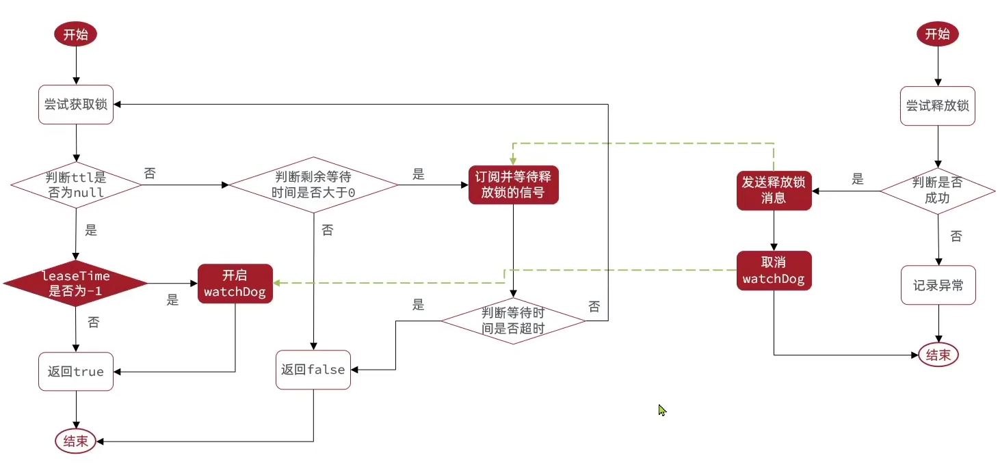
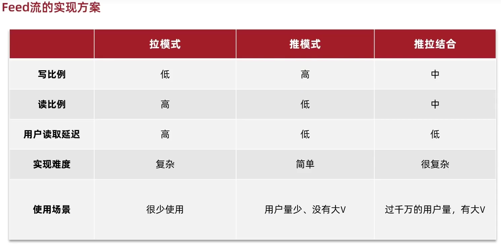

# 黑马点评

## 重点总结 - 优惠卷秒杀

### 基本下单

1. 校验用户信息，优惠卷有效期。
2. 查询库存。
3. 扣减库存。

查询和扣减的过程使用乐观锁解决并发时的超卖问题。

### 实现一人一单

1. 查询库存。
2. 根据用户 id 和优惠卷 id 查询是否已经存在订单。
3. 如果没有下过单则扣减库存。
4. 创建订单

2、3、4 的过程使用 synchronized 锁，保证不会重复下单。

### 分布式锁

在分布式集群时，synchronized 会出现多个 monitor 实例，需要用分布式锁。

可以用 Redis 实现分布式锁，利用 SETNX 命令。

- 分布式锁误删问题

	可用锁标识解决。

- 分布式锁原子性问题

	可用 lua 脚本解决。

### 异步优化

从下单到扣减库存，创建订单这个过程用消息队列异步化，异步下单入库。

## 重点经验

- 垃圾回收时某些实例的 STW 容易是由某些线程的诡异阻塞引发的问题的罪魁祸首。

可能存在并发问题，可能需要加锁或确保原子性的情况为：

- 对**共享数据**的**修改**。
	- 共享数据包括程序变量，数据库里的数据，公共缓存里的数据……
	- 对于先查询然后依据查询结果进行修改的场景，一般要对“先校验后修改”这整个过程加锁或确保原子性。
- 锁
  - 乐观锁只能控制更新和删除行为
  - 悲观锁才能控制插入行为


## 开篇导读

实战篇我们要学习一些什么样的内容

* 短信登录

这一块我们会使用redis共享session来实现

* 商户查询缓存

通过本章节，我们会理解缓存击穿，缓存穿透，缓存雪崩等问题

* 优惠卷秒杀

通过本章节，我们可以学会Redis的计数器功能， 结合Lua完成高性能的redis操作，同时学会Redis分布式锁的原理，包括Redis的三种消息队列

* 附近的商户

我们利用Redis的GEOHash来完成对于地理坐标的操作

* UV统计

主要是使用Redis来完成统计功能

* 用户签到

使用Redis的BitMap数据统计功能

* 好友关注

基于Set集合的关注、取消关注，共同关注等等功能，这一块知识咱们之前就讲过，这次我们在项目中来使用一下

* 达人探店

基于List来完成点赞列表的操作，同时基于SortedSet来完成点赞的排行榜功能


## 1、短信登录

#### 1.1.2、有关当前模型

nginx：

一台4核8G的tomcat，在优化和处理简单业务的加持下，大不了就处理1000左右的并发， 经过nginx的负载均衡分流后，利用集群支撑起整个项目，同时nginx在部署了前端项目后，更是可以做到动静分离，进一步降低tomcat服务的压力。

redis：

如果让tomcat直接去访问Mysql，根据经验Mysql企业级服务器只要上点并发，一般是16或32 核心cpu，32 或64G内存，像企业级mysql加上固态硬盘能够支撑的并发，大概就是4000起~7000左右。如果是上万并发， 瞬间就会让Mysql服务器的cpu，硬盘全部打满，容易崩溃。所以我们在高并发场景下，会选择使用mysql集群，同时为了进一步降低Mysql的压力，同时增加访问的性能，我们也会加入Redis，同时使用Redis集群使得Redis对外提供更好的服务。


### 1.2 、基于Session实现登录流程

Session 是由 Web 框架实现的会话管理功能，利用了前端浏览器的 Cookie 。

Servlet 提供了 HttpSession 的功能，Spring MVC 集成了该功能。

**发送验证码：**

用户在提交手机号后，会校验手机号是否合法，如果不合法，则要求用户重新输入手机号

如果手机号合法，后台此时生成对应的验证码，同时将验证码进行保存，然后再通过短信的方式将验证码发送给用户

**短信验证码登录、注册：**

用户将验证码和手机号进行输入，后台从session中拿到当前验证码，然后和用户输入的验证码进行校验，如果不一致，则无法通过校验，如果一致，则后台根据手机号查询用户，如果用户不存在，则为用户创建账号信息，保存到数据库，无论是否存在，都会将用户信息保存到session中，方便后续获得当前登录信息

**校验登录状态:**

用户在请求时候，会从cookie中携带JsessionId到后台，后台通过JsessionId从session中拿到用户信息，如果没有session信息，则进行拦截，如果有session信息，则将用户信息保存到threadLocal中，并且放行


#### 为什么要放到 ThreadLocal ？

通常情况下不建议直接在 Service 层操作 session 数据，因为 Service 层的职责是业务逻辑处理，而 session 操作通常与 HTTP 请求上下文相关，属于 Web 层的事务。

Controller 是访问 session 数据最常见的地方，但它并不是唯一的地方。也可以通过 Service 层、AOP、Filter 或者 Interceptor 来访问或操作 session 数据。不过，为了保持代码的清晰和职责分离，通常建议将 session 的管理和访问保持在 Web 层（Controller 或者 Interceptor）。

### 1.3 、实现发送短信验证码功能

**页面流程**


### 1.4、实现登录拦截功能


### 1.6、session共享问题


### 1.7 Redis 代替 session 的业务流程

#### 1.7.1、设计key的结构

首先我们要思考一下利用redis来存储数据，那么到底使用哪种结构呢？


#### 1.7.3、整体访问流程

当注册完成后，用户去登录会去校验用户提交的手机号和验证码，是否一致，如果一致，则根据手机号查询用户信息，不存在则新建，最后将用户数据保存到redis，并且生成token作为redis的key，当我们校验用户是否登录时，会去携带着token进行访问，从redis中取出token对应的value，判断是否存在这个数据，如果没有则拦截，如果存在则将其保存到threadLocal中，并且放行。


其中，保存用户到 Redis 即表示已登录。

### 1.9 解决状态登录刷新问题

如果用户在持续使用服务，需要刷新登录 token 令牌的存活时间。

#### 1.9.1 初始方案思路总结：

如果直接用拦截器刷新登录token令牌的存活时间，但是现在拦截器他只是拦截需要被拦截的路径，假设当前用户一直访问一些不需要拦截的路径，那么这个拦截器就不会生效，所以此时令牌刷新的动作实际上就不会执行，所以这个方案他是存在问题的


####  1.9.2 优化方案

既然之前的拦截器无法对不需要拦截的路径生效，那么我们可以添加一个拦截器：

- 在第一个拦截器，拦截所有的路径，查询是否有用户，存到 ThreadLocal，同时刷新令牌。
- 第二个拦截器，拦截需要用户登录的路径，判断 ThreadLocal 中的 user对象是否存在即可判断用户是否登录。


### 问题

如果要给拦截器类标 @Component ，如何操作：[为什么你写的拦截器中不能注入Java bean](https://cloud.tencent.com/developer/article/1752271) 。

要点：

自定义的配置类`WebConfiguration`，如果添加拦截器的时候用的是`new LoginInterceptor()`，那么代表并没有将拦截器托管给IOC容器，所以就无法引入Spring 的 bean 对象。

要将拦截器托管给 IOC 容器只需要使用 @Componet 然后将 new 拦截器改为注入即可。

## 2、商户查询缓存

### 2.1 什么是缓存?

**缓存(**Cache)，就是数据交换的**缓冲区**，俗称的缓存就是**缓冲区内的数据**，一般从数据库中获取,存储于本地代码，例如:

```java
例1:Static final ConcurrentHashMap<K,V> map = new ConcurrentHashMap<>(); 本地用于高并发

例2:static final Cache<K,V> USER_CACHE = CacheBuilder.newBuilder().build(); 用于redis等缓存

例3:Static final Map<K,V> map =  new HashMap(); 本地缓存
```

由于其被**Static**修饰,所以随着类的加载而被加载到**内存之中**,作为本地缓存,由于其又被**final**修饰,所以其引用(例3:map)和对象(例3:new HashMap())之间的关系是固定的,不能改变,因此不用担心引用被覆盖从而导致缓存失效。

####  2.1.1 为什么要使用缓存

缓存数据存储于代码中,而代码运行在内存中,内存的读写性能远高于磁盘，缓存可以大大降低**用户访问并发量带来的**服务器读写压力

但是缓存也会增加代码复杂度和运营的成本:


#### 2.1.2 如何使用缓存

实际开发中,会构筑多级缓存来使系统运行速度进一步提升,例如:本地缓存与redis中的缓存并发使用

**浏览器缓存**：主要是存在于浏览器端的缓存

**应用层缓存：**可以分为tomcat本地缓存，比如之前提到的map，或者是使用redis作为缓存

**数据库缓存：**在数据库中有一片空间是 buffer pool，增改查数据都会先加载到mysql的缓存中

**CPU缓存：**当代计算机最大的问题是 cpu性能提升了，但内存读写速度没有跟上，所以为了适应当下的情况，增加了cpu的L1，L2，L3级的缓存

### 2.2 添加商户缓存

在我们查询商户信息时，可以增加缓存

#### 2.2.1 、缓存模型和思路

标准的操作方式就是查询数据库之前先查询缓存，如果缓存数据存在，则直接从缓存中返回，如果缓存数据不存在，再查询数据库，然后将数据存入redis。


### 2.3 缓存更新策略

缓存更新是redis为了节约内存而设计出来的一个东西，主要是因为内存数据宝贵，当我们向redis插入太多数据，此时就可能会导致缓存中的数据过多，所以redis会对部分数据进行更新，或者把他叫为淘汰更合适。

**内存淘汰：**redis自动进行，当redis内存达到咱们设定的max-memery的时候，会自动触发淘汰机制，淘汰掉一些不重要的数据(可以自己设置策略方式)

**超时剔除：**当我们给redis设置了过期时间ttl之后，redis会将超时的数据进行删除，方便咱们继续使用缓存

**主动更新：**我们可以手动调用方法把缓存删掉，通常用于解决缓存和数据库不一致问题


#### 2.3.1 、数据库缓存不一致解决方案：

由于我们的**缓存的数据源来自于数据库**,而数据库的**数据是会发生变化的**,因此,如果当数据库中**数据发生变化,而缓存却没有同步**,此时就会有**一致性问题存在**。

Cache Aside Pattern 人工编码方式：缓存调用者在更新完数据库后再去更新缓存，也称之为**双写方案**

Read/Write Through Pattern : 由系统本身完成，数据库与缓存的问题交由一个单独的一致性组件去处理

Write Behind Caching Pattern ：调用者只操作缓存，其他线程去异步处理数据库，实现最终一致


#### 2.3.2 、数据库和缓存不一致采用什么方案

综合考虑使用方案一，但是方案一调用者如何处理呢？这里有几个问题

操作缓存和数据库时有三个问题需要考虑：

如果采用第一个方案，那么假设我们每次操作数据库后，都操作缓存，但是中间如果没有人查询，那么这个更新动作实际上只有最后一次生效，中间的更新动作意义并不大，我们可以把缓存删除，等待再次查询时，将缓存中的数据加载出来

* 修改数据库数据时，删除缓存还是更新缓存？
  * 更新缓存：每次更新数据库都更新缓存，**无效写**操作较多
  * 删除缓存：更新数据库时让缓存失效，查询时再更新缓存

* 如何保证缓存与数据库的操作的同时成功或失败？
  * 单体系统，将缓存与数据库操作放在一个事务
  * 分布式系统，利用TCC等分布式事务方案

- 修改数据库数据时，应当先操作数据库，再删除缓存
	原因在于，如果你选择第一种方案，在两个线程并发来访问时，假设线程1先来，他先把缓存删了，此时线程 2 过来，他查询缓存数据并不存在，此时他写入缓存，当他写入缓存后，线程 1 再执行更新动作时，实际上写入的就是旧的数据，新的数据被旧数据覆盖了。

**分析缓存和数据库的一致性问题，可以考虑一个线程在缓存和数据库的操作之前，被另一个线程介入的异常场景**的情况：


### 2.4 实现商铺的缓存与数据库双写一致

核心思路如下：

根据id查询店铺时，如果缓存未命中，则查询数据库，将数据库结果写入缓存，并设置超时时间

根据id修改店铺时，先修改数据库，再删除缓存

### 2.5 缓存穿透问题的解决思路

缓存穿透 ：缓存穿透是指客户端请求的数据在缓存中和数据库中都不存在，这样缓存永远不会生效，这些请求都会打到数据库。


常见的解决方案有以下几种：

* **缓存空对象**，
  用户再次来访问不存在的数据时，在 redis 中返回空对象。（要设置一定时间的 TTL，避免过多空对象）
  * 优点
  	* 实现简单，维护方便
  * 缺点
    * 额外的内存消耗
    * 可能造成短期的不一致
* **布隆过滤**
  如果布隆过滤器判断这个数据不存在，则直接返回。
  * 优点
  	* 内存占用少，没有多余key
  * 缺点
    * 实现复杂
    * 存在哈希冲突导致误判
* 增强id的复杂度，避免被猜测id规律，从而访问不存在的数据。
* 做好数据的基础格式校验，避免错误格式的不存在数据。
* 加强用户权限校验，避免非法用户恶意访问。
* 做好热点参数的限流。


### 2.7 缓存雪崩问题及解决思路

缓存雪崩是指在同一时段大量的缓存 key 同时失效或者 Redis 服务宕机，导致大量请求到达数据库，带来巨大压力。


对于大量 key 密集失效：

- 给不同的 Key 的 TTL 添加随机值，减少同一时间过期的数量。

对于 Redis 宕机：

* 利用 Redis 集群提高服务的可用性
* 给缓存业务添加降级限流策略
* 给业务添加多级缓存


### 2.8 缓存击穿问题及解决思路

缓存击穿问题也叫热点Key问题，就是一个被高并发访问并且缓存重建业务逻辑较复杂的 key 突然失效了，无数的请求访问会在瞬间给数据库带来巨大的冲击。

问题分析：假设线程1在查询缓存之后，本来应该去查询数据库，然后把这个数据重新加载到缓存，此时只要线程1走完这个逻辑，其他线程就都能从缓存中加载这些数据了。但是假设在线程1没有走完的时候，后续的线程2，线程3，线程4同时过来访问当前这个方法， 那么这些线程都不能从缓存中查询到数据，接着同一时间去访问数据库，然后重建缓存，对数据库访问压力大，多个同时重建缓存对 Redis 性能消耗大。


常见的解决方案有两种：

* 互斥锁
* 逻辑过期

#### 解决方案一、使用锁来解决

因为锁能实现互斥性。假设线程过来，只能一个人一个人的来访问数据库，从而避免对于数据库访问压力过大，但这也会影响查询的性能，因为此时会让查询的性能从并行变成了串行，我们可以采用 tryLock 来解决这样的问题。

```java
if (lock.tryLock()) {
    try {
		// 临界区，获取到锁后的操作
    } finally {
        lock.unlock();
    }
} else {
    // 获取不到锁，可以选择直接跳过、稍后再试、或者阻塞等待
}
```

假设现在线程1过来访问，他查询缓存没有命中，但是此时他获得到了锁的资源，那么线程1就会一个人去执行逻辑，假设现在线程2过来，线程2在执行过程中，并没有获得到锁，那么线程2就可以进行到休眠，直到线程1把锁释放后，线程2获得到锁，然后再来执行逻辑，此时就能够从缓存中拿到数据了。


#### 解决方案二、逻辑过期方案

方案分析：我们之所以会出现这个缓存击穿问题，主要原因是在于我们对key设置了过期时间，假设我们不设置过期时间，其实就不会有缓存击穿的问题，但是不设置过期时间，这样数据不就一直占用我们内存了吗，我们可以采用逻辑过期方案。

我们把过期时间设置在 redis的value中，注意：这个过期时间并不会直接作用于redis，而是我们后续通过逻辑去处理。假设线程1去查询缓存，然后从value中判断出来当前的数据已经过期了，此时线程1去获得互斥锁，那么其他线程会进行阻塞，获得了锁的线程他会开启一个 线程去进行 以前的重构数据的逻辑，直到新开的线程完成这个逻辑后，才释放锁， 而线程1直接进行返回，假设现在线程3过来访问，由于线程线程2持有着锁，所以线程3无法获得锁，线程3也直接返回数据，只有等到新开的线程2把重建数据构建完后，其他线程才能走返回正确的数据。

- 这种方案巧妙在于，异步地构建缓存。
- 缺点在于在构建完缓存之前，返回的都是脏数据。


#### 对比

**互斥锁方案：**由于保证了互斥性，所以数据一致，且实现简单，因为仅仅只需要加一把锁而已，也没其他的事情需要操心，所以没有额外的内存消耗，缺点在于有锁就有死锁问题的发生，且只能串行执行性能肯定受到影响。

**逻辑过期方案：** 线程读取过程中不需要等待，性能好，有一个额外的线程持有锁去进行重构数据，但是在重构数据完成前，其他的线程只能返回之前的数据，且实现起来麻烦。

两个方案都要用到锁，但对锁的反应行为不同：

- 互斥锁方案中，获取锁失败后会阻塞或者自旋。
- 逻辑过期中，获取锁失败后直接返回旧数据。


### 2.9 利用互斥锁解决缓存击穿问题


**操作锁的代码：**

核心思路就是利用redis的 **setnx** 方法来表示获取锁。

该方法含义是redis中如果没有这个key，则插入成功，返回1，在stringRedisTemplate中返回true；

 如果有这个key则插入失败，返回0，在stringRedisTemplate返回false。

可以通过true，或者是false，来表示是否有线程成功插入key，成功插入的key的线程我们认为他就是获得到锁的线程。

```java
private boolean tryLock(String key) {
    Boolean flag = stringRedisTemplate.opsForValue().setIfAbsent(key, "1", 10, TimeUnit.SECONDS);
    return BooleanUtil.isTrue(flag);
}

private void unlock(String key) {
    stringRedisTemplate.delete(key);
}
```

###  3.0 、利用逻辑过期解决缓存击穿问题

**需求：修改根据id查询商铺的业务，基于逻辑过期方式来解决缓存击穿问题**


## 3、优惠卷秒杀

### 3.1 -全局唯一ID

每个店铺都可以发布优惠券：


当用户抢购时，就会生成订单并保存到tb_voucher_order这张表中，而订单表如果使用数据库自增ID就存在一些问题：

* id的规律性太明显

	如果我们的id具有太明显的规则，用户或者说商业对手很容易猜测出来我们的一些敏感信息，比如商城在一天时间内，卖出了多少单，这明显不合适。

* 单表数据量的限制

	随着我们商城规模越来越大，mysql的单表的容量不宜超过500W，数据量过大之后，我们要进行拆库拆表，但拆分表了之后，他们从逻辑上讲他们是同一张表，所以他们的id是不能一样的， 于是乎我们需要保证id的唯一性。

**全局ID生成器**，是一种在分布式系统下用来生成全局唯一ID的工具，一般要满足下列特性：


为了增加ID的安全性，我们可以不直接使用Redis自增的数值，而是拼接一些其它信息：


ID的组成部分：

- 符号位：1bit，永远为 0
- 时间戳：31bit，以秒为单位，可以使用69年
- 序列号：32bit，秒内的计数器，支持每秒产生2^32（> 10^9）个不同ID

使用 Redis 的 increment 命令实现序列号部分。

### 3.4 实现秒杀下单


下单时需要判断两点：

* 秒杀是否开始或结束，如果尚未开始或已经结束则无法下单
* 库存是否充足，不足则无法下单

下单核心逻辑分析：

当用户开始进行下单，我们应当去查询优惠卷信息，查询到优惠卷信息，判断是否满足秒杀条件

比如时间是否充足，如果时间充足，则进一步判断库存是否足够，如果两者都满足，则扣减库存，创建订单，然后返回订单id，如果有一个条件不满足则直接结束。


### 3.5 库存超卖问题分析

有关超卖问题分析：在我们原有代码中是这么写的

```java
 if (voucher.getStock() < 1) {
        // 库存不足
        return Result.fail("库存不足！");
    }

//5，扣减库存
boolean success = seckillVoucherService.update()
        .setSql("stock = stock -1")
        .eq("voucher_id", voucherId).update();
if (!success) {
    //扣减库存
    return Result.fail("库存不足！");
}
```

假设线程1过来查询库存，判断出来库存大于1，正准备去扣减库存，但是还没有来得及扣减完毕，此时线程2过来，线程2也去查询库存，发现这个数量一定也大于1，那么这两个线程都会去扣减库存，最终多个线程相当于一起去扣减库存，此时就会出现**库存的超卖问题**。


超卖问题是典型的多线程安全问题，针对这一问题的常见解决方案就是加锁，而对于加锁，我们通常有两种解决方案：

**悲观锁：**

悲观锁可以实现对于数据的串行化执行，比如syn，和lock都是悲观锁的代表，同时，悲观锁中又可以再细分为公平锁，非公平锁，可重入锁，等等。

在判断还有库存后，开始加锁，再判断一次是否有库存，然后扣减。（在第一次判断内部加锁，是为了避免过多加锁；再判断一次是为了防止多减，原理详见单例模式的双重校验锁）

**乐观锁：**

乐观锁会有一个版本号，每次操作数据会对版本号+1，再提交回数据时，会去校验是否比之前的版本大1 ，如果大1 ，则进行操作成功，这套机制的核心逻辑在于，如果在操作过程中，版本号只比原来大1 ，那么就意味着操作过程中没有人对他进行过修改，他的操作就是安全的，如果不大1，则数据被修改过，当然乐观锁还有一些变种的处理方式比如 cas 。

乐观锁的典型代表：就是cas，利用cas进行无锁化机制加锁，将操作前读取的内存值，和一个预估值进行比较，如果预估值等于内存值，则代表中间没有被人修改过，此时就将新值去替换内存值。

### 3.6 乐观锁解决超卖问题

查询数据库时判断stock大于0 即可，数据库会保证 SQL 语句的原子性。

```java
boolean success = seckillVoucherService.update()
            .setSql("stock= stock -1")
            .eq("voucher_id", voucherId).update().gt("stock",0); //where id = ? and stock > 0
```

### 3.6 优惠券秒杀-一人一单

需求：修改秒杀业务，要求同一个优惠券，一个用户只能下一单


**存在问题：**现在的问题还是和之前一样，并发过来，查询数据库，都不存在订单，所以我们还是需要加锁，但**乐观锁比较适合更新数据，而现在是插入数据，所以我们需要使用悲观锁操作**。（**乐观锁控制不了不存在的数据，所以在插入时需要悲观锁去锁住它**）


首先我们的初始方案是封装了一个 createVoucherOrder 方法（内部包含判断订单是否存在和扣减库存两步操作），同时为了确保他线程安全，在方法上添加了一把 synchronized 锁。

但是这样添加锁，锁的粒度太粗了，在使用锁过程中，控制**锁粒度**是一个非常重要的事情，因为如果锁的粒度太大，会导致每个线程进来都会锁住，所以我们需要去控制锁的粒度，

但是以上代码还是存在问题，问题的原因在于 **createVoucherOrder  方法被 spring 的事务控制，如果你在方法内部加锁，可能会出现当前方法事务还没有提交，但是锁已经释放的问题**，所以我们选择将当前方法整体包裹起来，确保事务不会出现问题，如下：

在 createVoucherOrder  的外部方法 seckillVoucher 方法中，添加以下逻辑，这样就能保证事务的特性，同时也控制了锁的粒度


但是以上做法依然有问题，因为你调用的方法，其实是this.的方式调用的，事务想要生效，还得利用代理来生效，所以这个地方，我们需要获得原始的事务对象， 来操作事务


重点：

- 目的：通过代理对象调用，保证锁的范围在事务范围以外
- 原因：事务由 AOP 进行 环绕通知实现，对代理对象加锁才能保证在前置方法开始前加锁，在后置方法结束后解锁。

**其实在 createVoucherOrder 方法中封装一个事务方法，然后对该方法加锁即可，这样会更简单，清晰。**

### 3.7 集群环境下的并发问题

通过加锁可以解决在单机情况下的一人一单安全问题，但是在集群模式下就不行了。

由于现在我们部署了多个tomcat，每个tomcat都有一个属于自己的jvm，那么假设在服务器A的tomcat内部，有两个线程，这两个线程由于使用的是同一份代码，那么他们的锁对象是同一个，是可以实现互斥的，但是如果现在是服务器B的tomcat内部，又有两个线程，但是他们的锁对象代码虽然和服务器A一样，但是锁对象却不是同一个，所以线程3和线程4可以实现互斥，但是却无法和线程1和线程2实现互斥，这就是 集群环境下，syn锁失效的原因，在这种情况下，我们就需要使用分布式锁来解决这个问题。

单机（单个应用实例）的代码如果不加修改放到集群（多个单机或者多个实例）上，那么同样的加锁代码会产生多个锁。


## 4、分布式锁

### 4.1 、基本原理和实现方式对比

分布式锁：满足分布式系统或集群模式下多进程可见并且互斥的锁。

分布式锁的核心思想就是让大家都使用同一把锁。


那么分布式锁他应该满足一些什么样的条件呢？

可见性：多个线程都能看到相同的结果，注意：这个地方说的可见性并不是并发编程中指的内存可见性，只是说多个进程之间都能感知到变化的意思

互斥：互斥是分布式锁的最基本的条件，使得程序串行执行

高可用：程序不易崩溃，时时刻刻都保证较高的可用性

高性能：由于加锁本身就让性能降低，所以对于分布式锁本身需要他就较高的加锁性能和释放锁性能

安全性：安全也是程序中必不可少的一环


常见的分布式锁有三种

Mysql：mysql本身就带有锁机制，但是由于mysql性能本身一般，所以采用分布式锁的情况下，使用mysql作为分布式锁比较少见

Redis：redis作为分布式锁是非常常见的一种使用方式，现在企业级开发中基本都使用redis或者zookeeper作为分布式锁，利用setnx这个方法，如果插入key成功，则表示获得到了锁，如果有人插入成功，其他人插入失败则表示无法获得到锁，利用这套逻辑来实现分布式锁

Zookeeper：zookeeper也是企业级开发中较好的一个实现分布式锁的方案


### 4.2 、Redis分布式锁的实现核心思路

实现分布式锁时需要实现的两个基本方法：

* 获取锁：

  * 互斥：确保只能有一个线程获取锁
  * 非阻塞：成功返回true，失败返回false，等待后重试（自旋）

* 释放锁：

  * 手动释放
  * 超时释放：获取锁时添加一个超时时间


核心思路：

我们利用 redis 的 setNx 方法，当有多个线程进入时，我们就利用该方法，第一个线程进入时，redis 中就有这个key 了，返回了1，如果结果是1，则表示他抢到了锁，那么他去执行业务，然后再删除锁，退出锁逻辑，没有抢到锁的哥们，等待一定时间后重试即可

 


### 4.4 Redis分布式锁误删情况说明

问题：

持有锁的线程在锁的内部出现了阻塞，导致他的锁自动超时释放，这时其他线程，线程2来尝试获得锁，就拿到了这把锁，然后线程2在持有锁执行过程中，线程1反应过来，继续执行，而线程1执行过程中，走到了删除锁逻辑，此时就会把本应该属于线程2的锁进行删除，这就是误删别人锁的情况。

解决方案：

解决方案就是在每个线程释放锁的时候，去判断一下当前这把锁是否属于自己，如果不属于自己，则不进行锁的删除。假设还是上边的情况，线程1卡顿，锁自动释放，线程2进入到锁的内部执行逻辑，此时线程1反应过来，然后删除锁，但是线程1，一看当前这把锁不是属于自己，于是不删除锁，当线程2走到删除锁逻辑时，如果没有卡过自动释放锁的时间点，则判断当前这把锁是属于自己的，于是删除这把锁。

- 为什么不每一个线程都设置一把锁呢？

	防止重复订单的锁的锁定目标是某个用户的一个订单，如果用户的每个线程都使用一把锁，那么多个线程就对应了多个订单，不合需求。

- 这里是否还是会发生一个用户多单的情况呢？（线程 2 和线程 1 是同一把锁）

	不会，因为在执行业务时，会在创建订单前检查是否已经下过单，线程 2 如果是线程 1 的相同用户，那么不会重复创建订单。

- Redis 分布式锁这一章节主要是多个线程抢一张优惠卷，一人一单的问题已经通过在创建订单前检查是否已经下过单的方式解决了。

### 4.5 解决Redis分布式锁误删问题

实现：在获取锁时存入线程标示（可以用UUID表示），在释放锁时先获取锁中的线程标示，判断是否与当前线程标示一致

* 如果一致则释放锁
* 如果不一致则不释放锁


核心逻辑：在存入锁时，放入自己线程的标识，在删除锁时，判断当前这把锁的标识是不是自己存入的，如果是，则进行删除，如果不是，则不进行删除。


锁标识中不仅要用线程号，还要加上 UUID 前缀（每台 tomcat 服务对应一个 UUID 即可），这是为了防止多个实例的线程号重复。

### 4.6 分布式锁的原子性问题

更为极端的误删逻辑说明：

线程1现在持有锁之后，在执行业务逻辑过程中，他正准备删除锁，而且已经走到了条件判断的过程中，比如他已经拿到了当前这把锁确实是属于他自己的，正准备删除锁，但是此时他的锁到期了，那么此时线程2进来，但是线程1他会接着往后执行，当他卡顿结束后，他直接就会执行删除锁那行代码，相当于条件判断并没有起到作用。

这就是删锁时的原子性问题，之所以有这个问题，是因为**线程1的拿锁，比锁，删锁，实际上并不是原子性的**，我们要防止刚才的情况发生。

**这种阻塞可以由垃圾回收的 STW 产生**：线程 1 判断锁是自己的后，正准备删锁，当前应用实例突然 STW，然后 redis 中的锁超时释放，最后另一个应用实例的线程 2 过来获取锁，导致这个问题。

产生问题时的情况：


### 4.7 Lua脚本解决多条命令原子性问题

Redis提供了Lua脚本功能，在一个脚本中编写多条Redis命令，可以确保多条 redis 命令执行的原子性。

Redis提供的调用函数，语法如下：

```lua
redis.call('命令名称', 'key', '其它参数', ...)
```

例如，我们要执行set name jack，则脚本是这样：

```lua
# 执行 set name jack
redis.call('set', 'name', 'jack')
```

例如，我们要先执行set name Rose，再执行get name，则脚本如下：

```lua
# 先执行 set name jack
redis.call('set', 'name', 'Rose')
# 再执行 get name
local name = redis.call('get', 'name')
# 返回
return name
```

写好脚本以后，需要用Redis命令来调用脚本，调用脚本的常见命令如下：


例如，我们要执行 redis.call('set', 'name', 'jack') 这个脚本，语法如下：


如果脚本中的key、value不想写死，可以作为参数传递。key类型参数会放入KEYS数组，其它参数会放入ARGV数组，在脚本中可以从KEYS和ARGV数组获取这些参数：


接下来我们来回顾一下我们释放锁的逻辑：

释放锁的业务流程是这样的

​	1、获取锁中的线程标示

​	2、判断是否与指定的标示（当前线程标示）一致

​	3、如果一致则释放锁（删除）

​	4、如果不一致则什么都不做

如果用Lua脚本来表示则是这样的：

最终我们操作redis的拿锁比锁删锁的lua脚本就会变成这样

```lua
-- 这里的 KEYS[1] 就是锁的key，这里的ARGV[1] 就是当前线程标示
-- 获取锁中的标示，判断是否与当前线程标示一致
if (redis.call('GET', KEYS[1]) == ARGV[1]) then
  -- 一致，则删除锁
  return redis.call('DEL', KEYS[1])
end
-- 不一致，则直接返回
return 0
```

### 4.8 利用Java代码调用Lua脚本改造分布式锁

我们的RedisTemplate中，可以利用execute方法去执行lua脚本，参数对应关系就如下图：


### 总结

基于Redis的分布式锁实现思路：

* 利用set nx ex获取锁，并设置过期时间，保存线程标示
* 释放锁时先判断线程标示是否与自己一致，一致则删除锁
  * 特性：
    * 利用set nx满足互斥性
    * 利用set ex保证故障时锁依然能释放，避免死锁，提高安全性
    * 利用Redis集群保证高可用和高并发特性

笔者总结：我们一路走来，利用添加过期时间，防止死锁问题的发生，但是有了过期时间之后，可能出现误删别人锁的问题，这个问题我们开始是利用删之前 通过拿锁，比锁，删锁这个逻辑来解决的，也就是删之前判断一下当前这把锁是否是属于自己的，但是现在还有原子性问题，也就是我们没法保证拿锁比锁删锁是一个原子性的动作，最后通过lua表达式来解决这个问题。

但是目前还剩下一个问题锁不住，如果当过期时间到了之后，我们可以给他续期一下，比如续个30s后边的问题就都不会发生了，续期问题可以依赖于 redisson 解决。

## 5、分布式锁-redisson

### 基于 setnx 实现的分布式锁存在下面的问题：

**重入问题**：重入问题是指 获得锁的线程可以再次进入到相同的锁的代码块中，可重入锁的意义在于防止死锁，比如HashTable这样的代码中，他的方法都是使用synchronized修饰的，假如他在一个方法内，调用另一个方法，那么此时如果是不可重入的，不就死锁了吗？所以可重入锁他的主要意义是防止死锁，我们的synchronized和Lock锁都是可重入的。

**不可重入**：是指目前的分布式只能尝试一次，我们认为合理的情况是：当线程在获得锁失败后，他应该能再次尝试获得锁。

**超时释放：**我们在加锁时增加了过期时间，这样我们可以防止死锁，但是如果卡顿的时间超长，虽然我们采用了lua表达式防止误删别人的锁，但是毕竟没有锁住，有安全隐患。

**主从一致性：** 如果Redis提供了主从集群，当我们向集群写数据时，主机需要异步的将数据同步给从机，而万一在同步过去之前，主机宕机了，就会出现死锁问题。（都一直获取不到锁）

### 5.1 分布式锁-redisson功能介绍

Redisson是一个在Redis的基础上实现的Java驻内存数据网格（In-Memory Data Grid）。

它不仅提供了一系列的分布式的Java常用对象，还提供了许多分布式服务，其中就包含了各种分布式锁的实现。

Redission提供了分布式锁的多种多样的功能


### 5.2 分布式锁-Redisson快速入门

配置Redisson客户端：

```java
@Configuration
public class RedissonConfig {

    @Bean
    public RedissonClient redissonClient(){
        // 配置
        Config config = new Config();
        config.useSingleServer().setAddress("redis://192.168.150.101:6379")
            .setPassword("123321");
        // 创建RedissonClient对象
        return Redisson.create(config);
    }
}
```

### 5.3 分布式锁-redisson可重入锁原理

在Lock锁中，他是借助于底层的一个voaltile的一个state变量来记录重入的状态的，比如当前没有人持有这把锁，那么state=0，假如有人持有这把锁，那么state=1，如果持有这把锁的人再次持有这把锁，那么state就会+1 ，如果是对于synchronized而言，他在c语言代码中会有一个count，原理和state类似，也是重入一次就加一，释放一次就-1 ，直到减少成0 时，表示当前这把锁没有被人持有。  

在redisson中，也使用了 Lua 表达式。

它在 redis 中用 hash 结构存储锁，其中大 key （Key）表示表示这把锁是否存在，用小 key （field）表示当前这把锁被哪个线程持有。

接下来我们一起分析一下 redisson 中的一个使用 lua 表达式的例子。

这个地方一共有3个参数

**KEYS[1] ： 锁名称**

**ARGV[1]：  锁失效时间**

**ARGV[2]：  id + ":" + threadId; 锁的小key**

exists: 判断数据是否存在  name：是lock是否存在,如果==0，就表示当前这把锁不存在

redis.call('hset', KEYS[1], ARGV[2], 1);此时他就开始往redis里边去写数据 ，写成一个hash结构

Lock{

​    id + **":"** + threadId :  1

}

如果当前这把锁存在，则第一个条件不满足，再判断

redis.call('hexists', KEYS[1], ARGV[2]) == 1

此时需要通过大key+小key判断当前这把锁是否是属于自己的，如果是自己的，则进行

redis.call('hincrby', KEYS[1], ARGV[2], 1)

将当前这个锁的value进行+1 ，redis.call('pexpire', KEYS[1], ARGV[1]); 然后再对其设置过期时间，如果以上两个条件都不满足，则表示当前这把锁抢锁失败，最后返回pttl，即为当前这把锁的失效时间

看它的源码， 你会发现他会去判断当前这个方法的返回值是否为null，如果是null，则对应则前两个if对应的条件，退出抢锁逻辑，如果返回的不是null，即走了第三个分支，在源码处会进行while(true)的自旋抢锁。

```lua
"if (redis.call('exists', KEYS[1]) == 0) then " +
                  "redis.call('hset', KEYS[1], ARGV[2], 1); " +
                  "redis.call('pexpire', KEYS[1], ARGV[1]); " +
                  "return nil; " +
              "end; " +
              "if (redis.call('hexists', KEYS[1], ARGV[2]) == 1) then " +
                  "redis.call('hincrby', KEYS[1], ARGV[2], 1); " +
                  "redis.call('pexpire', KEYS[1], ARGV[1]); " +
                  "return nil; " +
              "end; " +
              "return redis.call('pttl', KEYS[1]);"
```

这段 lua 脚本的流程图：


### 5.4 分布式锁-redisson锁重试和WatchDog机制

redisson 通过 watchdog（一个周期性定时任务），不断刷新锁的有效期（TTL）：



其中，左边的开始是获取锁的过程，右边的开始是释放锁的过程。

- leaseTime != -1 表示没有设置过期时间，那么会不断通过 watchdog 每 30 s进行一次续约，永不过期。

假设我们的线程出现了宕机他还会续约吗？当然不会，因为等到时间之后自然就释放了。

### 5.5 分布式锁-redisson锁的MutiLock原理

为了提高redis的可用性，我们会搭建集群或者主从，现在以主从为例

此时我们去写命令，写在主机上， 主机会将数据同步给从机，但是假设在主机还没有来得及把数据写入到从机去的时候，此时主机宕机，哨兵会发现主机宕机，并且选举一个slave变成master，而此时新的master中实际上并没有锁信息，此时锁信息就已经丢掉了。


为了解决这个问题，redisson提出来了MutiLock锁，使用这把锁咱们就不使用主从了，每个节点的地位都是一样的， 这把锁加锁的逻辑需要写入到每一个主丛节点上，只有所有的服务器都写入成功，此时才是加锁成功，假设现在某个节点挂了，那么他去获得锁的时候，只要有一个节点拿不到，都不能算是加锁成功，就保证了加锁的可靠性。


## 6、秒杀优化

### 6.1 秒杀优化-异步秒杀思路

我们来回顾一下下单流程

1、查询优惠卷

2、判断秒杀库存是否足够

3、查询订单

4、校验是否是一人一单

5、扣减库存

6、创建订单

在这六步操作中，又有很多操作是要去操作数据库的，而且还是一个线程串行执行， 这样就会导致我们的程序执行的很慢，所以我们需要异步程序执行。


优化方案：我们将耗时比较短的逻辑判断放入到redis中，比如是否库存足够，比如是否一人一单，这样的操作，只要这种逻辑可以完成，就意味着我们是一定可以下单完成的，我们只需要进行快速的逻辑判断，根本就不用等下单逻辑走完，我们直接给用户返回成功， 再在后台开一个线程，后台线程慢慢的去执行queue里边的消息，这样程序不就超级快了吗？而且也不用担心线程池消耗殆尽的问题，因为这里我们的程序中并没有手动使用任何线程池，当然这里边有两个难点

第一个难点是我们怎么在redis中去快速校验一人一单，还有库存判断

第二个难点是由于我们校验和tomct下单是两个线程，那么我们如何知道到底哪个单他最后是否成功，或者是下单完成，为了完成这件事我们在redis操作完之后，我们会将一些信息返回给前端，同时也会把这些信息丢到异步queue中去，后续操作中，可以通过这个id来查询我们tomcat中的下单逻辑是否完成了。


我们现在来看看整体思路：当用户下单之后，判断库存是否充足只需要到redis中去根据key找对应的value是否大于0即可，如果不充足，则直接结束，如果充足，继续在redis中判断用户是否可以下单，如果set集合中没有这条数据，说明他可以下单，如果set集合中没有这条记录，则将userId和优惠卷存入到redis中，并且返回0，整个过程需要保证是原子性的，我们可以使用lua来操作。

当以上判断逻辑走完之后，我们可以判断当前redis中返回的结果是否是0 ，如果是0，则表示可以下单，则将之前说的信息存入到到queue中去，然后返回，然后再来个线程异步的下单，前端可以通过返回的订单id来判断是否下单成功。


### 6.2 秒杀优化-Redis完成秒杀资格判断

需求：

* 新增秒杀优惠券的同时，将优惠券信息保存到Redis中

* 基于Lua脚本，判断秒杀库存、一人一单，决定用户是否抢购成功

* 如果抢购成功，将优惠券id和用户id封装后存入阻塞队列

* 开启线程任务，不断从阻塞队列中获取信息，实现异步下单功能

  

完整lua表达式

```lua
-- 1.参数列表
-- 1.1.优惠券id
local voucherId = ARGV[1]
-- 1.2.用户id
local userId = ARGV[2]
-- 1.3.订单id
local orderId = ARGV[3]

-- 2.数据key
-- 2.1.库存key
local stockKey = 'seckill:stock:' .. voucherId
-- 2.2.订单key
local orderKey = 'seckill:order:' .. voucherId

-- 3.脚本业务
-- 3.1.判断库存是否充足 get stockKey
if(tonumber(redis.call('get', stockKey)) <= 0) then
    -- 3.2.库存不足，返回1
    return 1
end
-- 3.2.判断用户是否下单 SISMEMBER orderKey userId
if(redis.call('sismember', orderKey, userId) == 1) then
    -- 3.3.存在，说明是重复下单，返回2
    return 2
end
-- 3.4.扣库存 incrby stockKey -1
redis.call('incrby', stockKey, -1)
-- 3.5.下单（保存用户）sadd orderKey userId
redis.call('sadd', orderKey, userId)
return 0
```

现在我们去下单时，是通过lua表达式去原子执行判断逻辑，如果判断我出来不为0 ，则要么是库存不足，要么是重复下单，返回错误信息，如果是0，则把下单的逻辑保存到队列中去，然后异步执行

**小总结：**

秒杀业务的优化思路是什么？

* 先利用Redis完成库存余量、一人一单判断，完成抢单业务
* 再将下单业务放入阻塞队列，利用独立线程异步下单
* 基于阻塞队列的异步秒杀存在哪些问题？
  * 内存限制问题（可能超过 JVM 的内存限制）
  * 数据安全问题（宕机后，JVM 中的数据丢失）

## 7、Redis消息队列，异步下单入库

### 7.1 Redis消息队列-认识消息队列

什么是消息队列：字面意思就是存放消息的队列。最简单的消息队列模型包括3个角色：

* 消息队列：存储和管理消息，也被称为消息代理（Message Broker）
* 生产者：发送消息到消息队列
* 消费者：从消息队列获取消息并处理消息


### 7.2 Redis消息队列-基于List实现消息队列

Redis的list数据结构是一个双向链表，很容易模拟出队列效果。

队列是入口和出口不在一边，因此我们可以利用：LPUSH 结合 RPOP、或者 RPUSH 结合 LPOP来实现。
不过要注意的是，当队列中没有消息时RPOP或LPOP操作会返回null，并不像JVM的阻塞队列那样会阻塞并等待消息。因此这里应该使用BRPOP或者BLPOP来实现阻塞效果。


基于List的消息队列有哪些优缺点？
优点：

* 利用Redis存储，不受限于JVM内存上限
* 基于Redis的持久化机制，数据安全性有保证
* 可以满足消息有序性

缺点：

* 无法避免消息丢失
* 只支持单消费者

### 7.3 Redis消息队列-基于PubSub的消息队列

PubSub（发布订阅）是Redis2.0版本引入的消息传递模型。顾名思义，消费者可以订阅一个或多个channel，生产者向对应channel发送消息后，所有订阅者都能收到相关消息。

 SUBSCRIBE channel [channel] ：订阅一个或多个频道
 PUBLISH channel msg ：向一个频道发送消息
 PSUBSCRIBE pattern[pattern] ：订阅与pattern格式匹配的所有频道


基于PubSub的消息队列有哪些优缺点？
优点：

* 采用发布订阅模型，支持多生产、多消费

缺点：

* 不支持数据持久化
* 无法避免消息丢失
* 消息堆积有上限，超出时数据丢失

### 7.4 Redis消息队列-基于Stream的消息队列

Stream 是 Redis 5.0 引入的一种新数据类型，可以实现一个功能非常完善的消息队列。

发送消息的命令：


例如：


读取消息的方式之一：XREAD


在业务开发中，我们可以循环的调用XREAD阻塞方式来查询最新消息，从而实现持续监听队列的效果，伪代码如下


注意：当我们指定起始ID为$时，代表读取最新的消息，如果我们处理一条消息的过程中，又有超过1条以上的消息到达队列，则下次获取时也只能获取到最新的一条，会出现漏读消息的问题

STREAM类型消息队列的XREAD命令特点：

* 消息可回溯
* 一个消息可以被多个消费者读取
* 可以阻塞读取
* 有消息漏读的风险

### 7.5 Redis消息队列-基于Stream的消息队列-消费者组

消费者组（Consumer Group）：将多个消费者划分到一个组中，监听同一个队列。具备下列特点：


要先创建消费者组，然后从消费者组读取消息：

STREAM 类型消息队列的特点：

* 消息可回溯
* 可以多消费者争抢消息，加快消费速度
* 可以阻塞读取
* 没有消息漏读的风险
* 有消息确认机制，保证消息至少被消费一次

基于 Redis 的 Stream 实现的消息队列相对于 RabbitMQ、Kafka 等消息队列的不足：

- Stream 没有持久化机制，不能应对 Redis 宕机。
- Stream 没有生产者确认机制。（有消费者确认机制）
- Stream 没有消息的过期时间机制。
- Stream 没有消息路由机制，不能应对复杂的场景。

### 7.6 基于Redis的Stream结构作为消息队列，实现异步秒杀下单

需求：

* 创建一个Stream类型的消息队列，名为stream.orders
* 修改之前的秒杀下单Lua脚本，在认定有抢购资格后，直接向stream.orders中添加消息，内容包含voucherId、userId、orderId
* 项目启动时，开启一个线程任务，尝试获取stream.orders中的消息，完成下单

## 8、达人探店

### 8.1、达人探店-发布探店笔记

发布探店笔记

探店笔记类似点评网站的评价，往往是图文结合。对应的表有两个：
tb_blog：探店笔记表，包含笔记中的标题、文字、图片等
tb_blog_comments：其他用户对探店笔记的评价


在实际开发中图片一般会放在nginx上或者是云存储上。

### 8.2 达人探店-查看探店笔记

实现查看发布探店笔记的接口


### 8.3 达人探店-点赞功能


完善点赞功能

需求：

* 同一个用户只能点赞一次，再次点击则取消点赞
* 如果当前用户已经点赞，则点赞按钮高亮显示

### 8.4 达人探店-点赞排行榜

在探店笔记的详情页面，应该把给该笔记点赞的人显示出来，比如最早点赞的TOP5，形成点赞排行榜：

之前的点赞是放到set集合，但是set集合是不能排序的，所以这个时候，咱们可以采用一个可以排序的set集合，就是咱们的sortedSet


我们接下来来对比一下这些集合的区别是什么

所有点赞的人，需要是唯一的，所以我们应当使用set或者是sortedSet

其次我们需要排序，就可以直接锁定使用sortedSet啦


## 9、好友关注，Feed 流推送

### 9.1 好友关注-关注和取消关注

针对用户的操作：可以对用户进行关注和取消关注功能。


实现思路：

需求：基于该表数据结构，实现两个接口：

* 关注和取关接口
* 判断是否关注的接口

### 9.2 好友关注-共同关注

需求：在博主个人页面展示出当前用户与博主的共同关注。

在set集合中，有交集并集补集的api，我们可以把两人的关注的人分别放入到一个set集合中，然后再通过api去查看这两个set集合中的交集数据。


### 9.3 好友关注-Feed流实现方案

当我们关注了用户后，这个用户发了动态，那么我们应该把这些数据推送给用户，这个需求，其实我们又把他叫做Feed流，关注推送也叫做Feed流，直译为投喂。为用户持续的提供“沉浸式”的体验，通过无限下拉刷新获取新的信息。

对于传统的模式的内容解锁：我们是需要用户去通过搜索引擎或者是其他的方式去解锁想要看的内容


对于新型的Feed流的的效果：不需要我们用户再去寻找信息，而是系统分析用户到底想要什么，然后直接把内容推送给用户，从而使用户能够更加的节约时间，不用主动去寻找。


Feed流的实现有两种模式：

- Timeline：不做内容筛选，简单的按照内容发布时间排序，常用于好友或关注。例如朋友圈

	* 优点：信息全面，不会有缺失。并且实现也相对简单

	* 缺点：信息噪音较多，用户不一定感兴趣，内容获取效率低

- 智能排序：利用智能算法屏蔽掉违规的、用户不感兴趣的内容。推送用户感兴趣信息来吸引用户

	* 优点：投喂用户感兴趣信息，用户粘度很高，容易沉迷

	* 缺点：如果算法不精准，可能起到反作用


本例中的个人页面，是基于关注的好友来做Feed流，因此采用Timeline的模式，只需要拿到我们关注用户的信息，然后按照时间排序即可。

该模式的实现方案有三种：

* 拉模式
* 推模式
* 推拉结合

#### 拉模式（读扩散）

该模式的核心含义就是：当张三和李四和王五发了消息后，都会保存在自己的邮箱中，假设赵六要读取信息，那么他会读取自己的收件箱，此时系统会从他关注的人群中，把他关注人的信息全部都进行拉取，然后再进行排序

优点：比较节约空间，因为赵六在读信息时，并没有重复读取，而且读取完之后可以把他的收件箱进行清理。

缺点：比较延迟，当用户读取数据时才去关注的人那里读取数据，假设用户关注了大量的用户，那么此时就会拉取海量的内容，用户如果多次读取，那么会对服务器压力巨大（即便加上缓存，校验缓存是否存在也需要大量查询）。


#### 推模式（写扩散）

推模式是没有写邮箱的，当张三写了一个内容，此时会主动的把张三写的内容发送到他的粉丝收件箱中去，假设此时李四再来读取，就不用再去临时拉取了

优点：时效快，不用临时拉取

缺点：内存压力大，假设一个大V写信息，很多人关注他， 就会写很多分数据到粉丝那边去


#### 推拉结合模式（读写混合）

兼具推和拉两种模式的优点。

推拉模式是一个折中的方案

- 站在发件人这一端
	- 如果是个普通的人，那么我们采用写扩散的方式，直接把数据写入到他的粉丝中去，因为普通的人他的粉丝关注量比较小，所以这样做没有压力，
	- 如果是大V，那么直接将数据先写入一份到发件箱里边去，然后再直接写一份到活跃粉丝收件箱里边去。
- 站在收件人这端
	- 如果是活跃粉丝（查看活跃，关注量大），那么大V和普通的人发的都会直接写入到自己收件箱里边来
	- 如果是普通的粉丝，由于他们上线不是很频繁，所以等他们上线时，再从发件箱里边去拉信息。




### 9.4 好友关注-推送到粉丝收件箱

需求：

* 新增探店笔记时，在保存blog到数据库的同时，推送到粉丝的收件箱
* 收件箱满足可以根据时间戳排序，此处用Redis的数据结构实现
* 查询收件箱数据时，可以实现分页查询

Feed流中的数据会不断更新，所以数据的角标也在变化，因此不能采用传统的分页模式。

传统的分页在feed流是不适用的，因为我们的数据会随时发生变化

假设在t1 时刻，我们去读取第一页，此时page = 1 ，size = 5 ，那么我们拿到的就是10~6 这几条记录，假设现在t2时候又发布了一条记录，此时t3 时刻，我们来读取第二页，读取第二页传入的参数是page=2 ，size=5 ，那么此时读取到的第二页实际上是从6 开始，然后是6~2 ，那么我们就读取到了重复的数据，所以feed流的分页，不能采用原始方案来做。


Feed流的滚动分页

我们需要记录每次操作的最后一条，然后从这个位置开始去读取数据（新增的数据在回到第一页时再查询出来）

举个例子：我们从t1时刻开始，拿第一页数据，拿到了10~6，然后记录下当前最后一次拿取的记录，就是6，t2时刻发布了新的记录，此时这个11放到最顶上，但是不会影响我们之前记录的6，此时t3时刻来拿第二页，第二页这个时候拿数据，还是从6后一点的5去拿，就拿到了5-1的记录。我们这个地方可以采用sortedSet来做，可以进行范围查询，并且还可以记录当前获取数据时间戳最小值，就可以实现滚动分页了


### 9.5好友关注-实现分页查询收件箱

需求：在个人主页的“关注”卡片中，查询并展示推送的Blog信息：

具体操作如下：

1、每次查询完成后，我们要分析出查询出数据的最小时间戳，这个值会作为下一次查询的条件

2、我们需要找到与上一次查询重复的数据个数作为偏移量（它们的时间戳相等），下次查询时，跳过这些查询过的数据，拿到我们需要的数据

综上：我们的请求参数中就需要携带 lastId：上一次查询的最小时间戳 和偏移量这两个参数。（offset 是需要跳过的产生重复的数据量）

这两个参数第一次会由前端来指定，以后的查询就根据后台结果作为条件，再次传递到后台。

实际上，与其传 offset ，直接传最后一个浏览过的 blogId 会使得编码更简单，语义更清晰。


## 10、附近商户

### 10.1、附近商户-GEO数据结构的基本用法

GEO就是Geolocation的简写形式，代表地理坐标。Redis在3.2版本中加入了对GEO的支持，允许存储地理坐标信息，帮助我们根据经纬度来检索数据。常见的命令有：

* GEOADD：添加一个地理空间信息，包含：经度（longitude）、纬度（latitude）、值（member）
* GEODIST：计算指定的两个点之间的距离并返回
* GEOHASH：将指定member的坐标转为hash字符串形式并返回
* GEOPOS：返回指定member的坐标
* GEORADIUS：指定圆心、半径，找到该圆内包含的所有member，并按照与圆心之间的距离排序后返回。6.以后已废弃
* GEOSEARCH：在指定范围内搜索member，并按照与指定点之间的距离排序后返回。范围可以是圆形或矩形。6.2.新功能
* GEOSEARCHSTORE：与GEOSEARCH功能一致，不过可以把结果存储到一个指定的key。 6.2.新功能

### 10.2、 附近商户-导入店铺数据到GEO

具体场景说明：


当我们点击美食之后，会出现一系列的商家，商家中可以按照多种排序方式，我们此时关注的是距离，这个地方就需要使用到我们的GEO，向后台传入当前app收集的地址(我们此处是写死的) ，以当前坐标作为圆心，同时绑定相同的店家类型type，以及分页信息，把这几个条件传入后台，后台查询出对应的数据再返回。


我们要做的事情是：将数据库表中的数据导入到redis中去，redis中的GEO，GEO在redis中就一个menber和一个经纬度，我们把x和y轴传入到redis做的经纬度位置去，但我们不能把所有的数据都放入到menber中去，毕竟作为redis是一个内存级数据库，如果存海量数据，redis还是力不从心，所以我们在这个地方存储他的id即可。

但是这个时候还有一个问题，就是在redis中并没有存储type，所以我们无法根据type来对数据进行筛选，所以我们可以按照商户类型做分组，类型相同的商户作为同一组，以typeId为key存入同一个GEO集合中。

## 11、用户签到

#### 11.1、用户签到-BitMap功能演示

我们针对签到功能如果通过mysql来完成，比如说以下这张表


用户一次签到，就是一条记录，假如有1000万用户，平均每人每年签到次数为10次，则这张表一年的数据量为 1亿条

每签到一次需要使用（8 + 8 + 1 + 1 + 3 + 1）共22 字节的内存，一个月则最多需要600多字节


我们如何能够简化一点呢？其实可以考虑小时候一个挺常见的方案，就是小时候，咱们准备一张小小的卡片，你只要签到就打上一个勾，我最后判断你是否签到，其实只需要到小卡片上看一看就知道了

我们可以采用类似这样的方案来实现我们的签到需求。

我们**按月来统计用户签到信息**，签到记录为1，未签到则记录为0.

把每一个bit位对应当月的每一天，形成了映射关系。用0和1标示业务状态，这种思路就称为位图（BitMap）。这样我们就用极小的空间，来实现了大量数据的表示

Redis中是利用string类型数据结构实现BitMap，因此最大上限是512M，转换为bit则是 2^32个bit位。


BitMap的操作命令有：

* SETBIT：向指定位置（offset）存入一个0或1
* GETBIT ：获取指定位置（offset）的bit值
* BITCOUNT ：统计BitMap中值为1的bit位的数量
* BITFIELD ：操作（查询、修改、自增）BitMap中bit数组中的指定位置（offset）的值
* BITFIELD_RO ：获取BitMap中bit数组，并以十进制形式返回
* BITOP ：将多个BitMap的结果做位运算（与 、或、异或）
* BITPOS ：查找bit数组中指定范围内第一个0或1出现的位置


