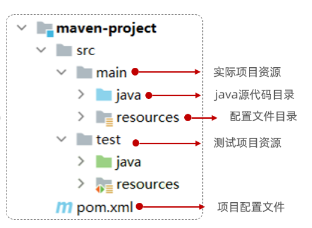
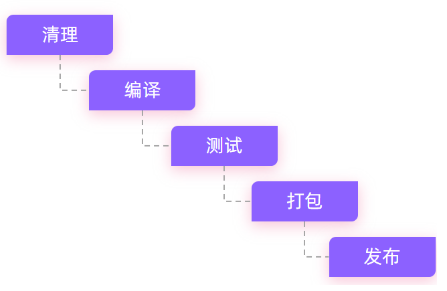
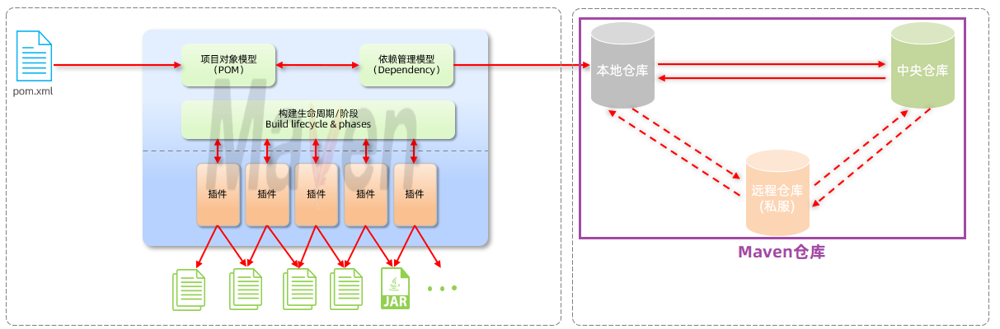

# Maven

一个 Java 项目管理工具，提供：

1. 依赖管理

	管理依赖 jar 包，避免冲突。

2. 统一项目结构

	提供标准、统一的项目结构。



3. 项目构建

	提供了标准的、跨平台（Linux、Windows、MacOS）的自动化项目构建方式。



## maven 模型

基于通过配置项来管理项目的构建、报告和文档。

主要概念：

* 构建生命周期/阶段（Build lifecycle & phases）
	- maven 对项目构建流程的每个阶段都提供一个控制插件。（编译插件，打包插件等）
* 项目对象模型（Project Object Model，POM）
	* maven 将项目抽象为一个对象模型，项目本身和每个依赖（本质也是项目）都由一个“坐标”描述。
	* 坐标是 jar 包的统一标识，可以通过坐标定位到 jar 包的位置。

* 依赖管理模型（Dependency）
	- 使用 `pom.xml` 配置文件。
	- 使用坐标来描述当前项目依赖哪些第三方 jar 包。



## maven 仓库

maven 仓库用于存储资源，管理各种 jar 包。

分类：

- 本地仓库：自己计算机上的一个目录(用来存储jar包)
- 中央仓库：由Maven团队维护的全球唯一的。仓库地址：https://repo1.maven.org/maven2/
- 远程仓库：一般由公司团队搭建的私有仓库

当项目中使用坐标引入对应依赖 jar 包后，查找顺序：

1. 本地仓库
2. 中央仓库
3. 远程仓库(私服)

## 依赖管理

maven 可直接在 IDEA 中使用。

### pom.xml

```xml
<?xml version="1.0" encoding="UTF-8"?>
<project xmlns="http://maven.apache.org/POM/4.0.0"
         xmlns:xsi="http://www.w3.org/2001/XMLSchema-instance"
         xsi:schemaLocation="http://maven.apache.org/POM/4.0.0 http://maven.apache.org/xsd/maven-4.0.0.xsd">
    <!-- POM模型版本 -->
    <modelVersion>4.0.0</modelVersion>

    <!-- 当前项目坐标 -->
    <groupId>com.itheima</groupId>
    <artifactId>maven_project1</artifactId>
    <version>1.0-SNAPSHOT</version>
    
    <!-- 打包方式 -->
    <packaging>jar</packaging>
 
</project>
```

### 坐标

* Maven中的坐标是资源的唯一标识 , 通过该坐标可以唯一定位资源位置（资源可以以插件、依赖、当前项目）。
* 使用坐标来定义项目或引入项目中需要的依赖、

Maven坐标主要组成：

* groupId：定义当前Maven项目隶属组织名称（通常是域名反写，例如：com.itheima）
* artifactId：定义当前Maven项目名称（通常是模块名称，例如 order-service、goods-service）
* version：定义当前项目版本号

### 排除依赖

```xml
<!-- 排除该依赖 -->
<exclusions>
    <exclusion>
        <groupId>junit</groupId>
        <artifactId>junit</artifactId>
    </exclusion>
</exclusions>
```

### 依赖范围

一般的依赖有全部的作用范围：

1. 主程序范围有效（main文件夹范围内）

2. 测试程序范围有效（test文件夹范围内）

3. 是否参与打包运行（package指令范围内）

可以用 `scope` 标签指定依赖的作用范围：

```xml
<dependency>
    <groupId>junit</groupId>
    <artifactId>junit</artifactId>
    <version>4.12</version>
    <scope>test</scope>   <!-- 只在 test 文件夹范围内有效 -->
</dependency>
```

| **scope**值     | **主程序** | **测试程序** | **打包（运行）** | **范例**    |
| --------------- | ---------- | ------------ | ---------------- | ----------- |
| compile（默认） | Y          | Y            | Y                | log4j       |
| test            | -          | Y            | -                | junit       |
| provided        | Y          | Y            | -                | servlet-api |
| runtime         | -          | Y            | Y                | jdbc驱动    |

### 生命周期

Maven 的生命周期对所有的构建过程进行抽象和统一，描述了一次项目构建会经历哪些阶段。

在 Maven 出现之前，项目构建的生命周期就已经存在，软件开发人员每天都在对项目进行清理，编译，测试及部署。虽然大家都在不停地做构建工作，但公司和公司间、项目和项目间，往往使用不同的方式做类似的工作。

Maven从大量项目和构建工具中学习和反思，然后总结了一套高度完美的，易扩展的项目构建生命周期。这个生命周期包含了项目的清理，初始化，编译，测试，打包，集成测试，验证，部署和站点生成等几乎所有构建步骤。

Maven 对项目构建的生命周期划分为 3 套（相互独立）：

- clean：清理工作。

- default：核心工作。如：编译、测试、打包、安装、部署等。

- site：生成报告、发布站点等。


三套生命周期中又包含一些阶段：


常用阶段：

• clean：移除上一次构建生成的文件

• compile：编译项目源代码

• test：使用合适的单元测试框架运行测试(junit)

• package：将编译后的文件打包，如：jar、war等

• install：安装项目到本地仓库

注意：

- 每个阶段由一个插件负责。

- 同一套生命周期中，执行一个阶段时，前面的阶段都会自动执行。（不同套的生命周期中的阶段可以不满足这个关系）

	当运行package生命周期时，clean不会运行，compile会运行。  因为compile与package属于同一套生命周期，而clean与package不属于同一套生命周期。
