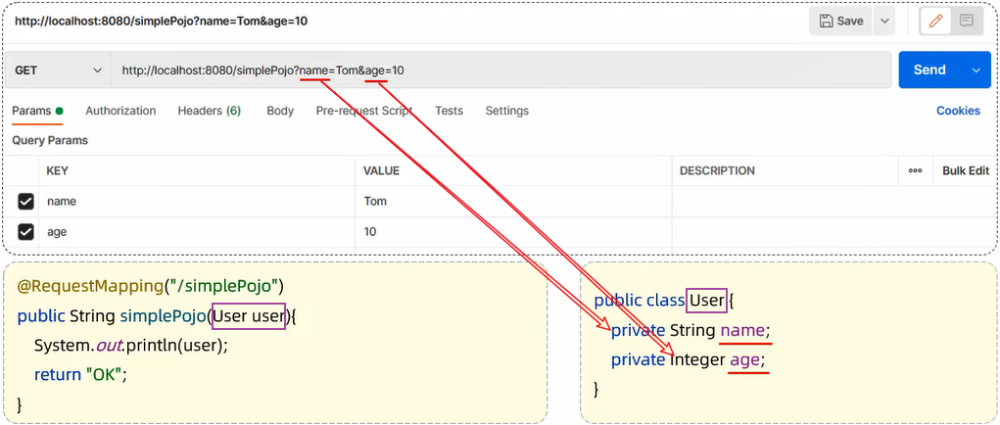
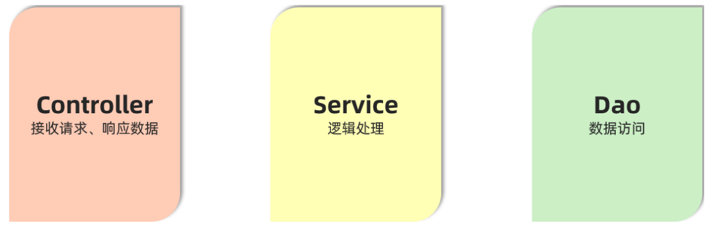

# Spring Boot  Web 基础

可以使用网页的 [Spring Initializr](https://start.spring.io/) 初始化 spring boot 项目，然后用 IDEA 打开。

Sprig Boot web 在起步依赖（spring-boot-starter-web）中内嵌了 Tomcat web 服务器，可以直接使用。

对于 BS 架构（Browser/Server），主要包含：

- 请求
- 后端
- 响应


- Postman

	一个接口测试工具，可以模拟浏览器请求，方便在前后端分类开发时测试后端代码。

## 请求

以下均为 Spring Boot 中的参数接收方式。

### 简单参数

简单参数也叫 query 参数。

用形参接收请求参数：

```java
@RestController
public class RequestController {
    // http://localhost:8080/simpleParam?name=Tom&age=10
    // 第1个请求参数： name=Tom   参数名:name，参数值:Tom
    // 第2个请求参数： age=10     参数名:age , 参数值:10
    
    @RequestMapping("/simpleParam")
    public String simpleParam(String name , Integer age ){//形参名和请求参数名保持一致
        System.out.println(name+"  :  "+age);
        return "OK";
    }
}
```

如果需要形参和请求参数不一致，可以使用 `@RequestParam` ：

```java
// @RequestParam("name", required = True)
// 默认 required = True

@RestController
public class RequestController {
    // http://localhost:8080/simpleParam?name=Tom&age=20
    // 请求参数名：name
    // 指定形参名为：username

    //springboot方式
    @RequestMapping("/simpleParam")
    public String simpleParam(@RequestParam("name") String username , Integer age ){
        System.out.println(username+"  :  "+age);
        return "OK";
    }
}
```

### 实体参数

将请求参数封装到一个实体类对象中，需要请求参数名与实体类的属性名相同。



#### 简单实体对象

定义 POJO 实体类：（Plain Old Java Object，POJO）

```java
public class User {
    private String name;
    private Integer age;

    public String getName() {
        return name;
    }

    public void setName(String name) {
        this.name = name;
    }

    public Integer getAge() {
        return age;
    }

    public void setAge(Integer age) {
        this.age = age;
    }

    @Override
    public String toString() {
        return "User{" +
                "name='" + name + '\'' +
                ", age=" + age +
                '}';
    }
}
```

Controller 方法：

```java
@RestController
public class RequestController {
    //实体参数：简单实体对象
    @RequestMapping("/simplePojo")
    public String simplePojo(User user){
        System.out.println(user);
        return "OK";
    }
}
```

- 未匹配的形参会被赋为 null 。
- 未匹配的请求参数会被忽略。

#### 复杂实体对象

复杂实体对象指，在实体类中有属性也是实体对象类型。


需要：请求参数名与形参对象属性名相同，按照对象层次结构关系接收嵌套实体类属性参数。

定义POJO实体类：

- Address实体类

```java
public class Address {
    private String province;
    private String city;

    public String getProvince() {
        return province;
    }

    public void setProvince(String province) {
        this.province = province;
    }

    public String getCity() {
        return city;
    }

    public void setCity(String city) {
        this.city = city;
    }

    @Override
    public String toString() {
        return "Address{" +
                "province='" + province + '\'' +
                ", city='" + city + '\'' +
                '}';
    }
}
```

- User实体类

```java
public class User {
    private String name;
    private Integer age;
    private Address address; //地址对象

    public String getName() {
        return name;
    }

    public void setName(String name) {
        this.name = name;
    }

    public Integer getAge() {
        return age;
    }

    public void setAge(Integer age) {
        this.age = age;
    }

    public Address getAddress() {
        return address;
    }

    public void setAddress(Address address) {
        this.address = address;
    }

    @Override
    public String toString() {
        return "User{" +
                "name='" + name + '\'' +
                ", age=" + age +
                ", address=" + address +
                '}';
    }
}
```

Controller方法：

```java
@RestController
public class RequestController {
    //实体参数：复杂实体对象
    @RequestMapping("/complexPojo")
    public String complexPojo(User user){
        System.out.println(user);
        return "OK";
    }
}
```

### 多值参数

有时，一个参数可能包含多个值，它的 url 有两种表现。

- 表现 1


- 表现 2


有两种接收方式：

- 数组
- 集合

注意对比它们的 Controller 方法的形参类型。

#### 数组

Controller方法：

```java
@RestController
public class RequestController {
    //数组集合参数
    @RequestMapping("/arrayParam")
    public String arrayParam(String[] hobby){
        System.out.println(Arrays.toString(hobby));
        return "OK";
    }
}
```

#### 集合

Controller 方法：

```java
@RestController
public class RequestController {
    //数组集合参数
    @RequestMapping("/listParam")
    public String listParam(@RequestParam List<String> hobby){
        System.out.println(hobby);
        return "OK";
    }
}
```

### 日期参数

日期类型的参数在进行封装时，需要通过 `@DateTimeFormat` ，以及其 pattern 属性来设置日期的格式。


Controller 方法：

```java
@RestController
public class RequestController {
    //日期时间参数
   @RequestMapping("/dateParam")
    public String dateParam(@DateTimeFormat(pattern = "yyyy-MM-dd HH:mm:ss") LocalDateTime updateTime){
        System.out.println(updateTime);
        return "OK";
    }
}
```

### JSON 参数

- json 格式的数据需要放在 web 请求的 body 中。
- 在 Controller 中使用实体类进行封装
	- json 数据键名与形参对象属性名相同，定义POJO类型形参即可接收参数。
	- 需要使用 @RequestBody 标识，将 JSON 数据映射到形参的实体类对象中（JSON 中的 key 和实体类中的属性名保持一致）


实体类：Address

```java
public class Address {
    private String province;
    private String city;
    
	//省略GET , SET 方法
}
```

实体类：User

```java
public class User {
    private String name;
    private Integer age;
    private Address address;
    
    //省略GET , SET 方法
}    
```

Controller方法：

```java
@RestController
public class RequestController {
    // JSON 参数
    @RequestMapping("/jsonParam")
    public String jsonParam(@RequestBody User user){
        System.out.println(user);
        return "OK";
    }
}
```

### 路径参数

请求参数一般：

- 放在 body 中（POST 请求）
- 或在 url 后面通过 `?key=value` 形式传递（GET 请求）

目前，也可以：

- 直接在 url 中传递参数（路径参数）

例如：

```
http://localhost:8080/user/1		
http://localhost:880/user/1/0
```

接收路径参数：

- 使用 `{…}` 标识该路径参数。
- 使用 `@PathVariable` 获取路径参数。
- 该方法也可以传递多个路径参数


Controller方法：

```java
@RestController
public class RequestController {
    //路径参数
    @RequestMapping("/path/{id}")
    public String pathParam(@PathVariable Integer id){
        System.out.println(id);
        return "OK";
    }
}
```

## 响应

### @ResponseBody

使用 `@ResponseBody`注解可以将 controller 方法 return 的结果响应给浏览器。

`@ResponseBody注解`：

- 类型：方法注解、类注解
- 位置：书写在 Controller 类的方法上或类上
	- 类上有 `@RestController` 注解或 `@ResponseBody` 注解时，表示当前类下所有的方法返回值都做为响应数据。
- 作用：将方法返回值直接响应给浏览器
  - 如果返回值类型是实体对象/集合，将会转换为 JSON 格式后再响应给浏览器

对于以下情况：

```java
@RestController
public class HelloController {
    @RequestMapping("/hello")
    public String hello(){
        System.out.println("Hello World ~");
        return "Hello World ~";
    }
}
```

以上我们所书写的Controller中，只在类上添加了@RestController注解、方法添加了@RequestMapping注解，并没有使用@ResponseBody注解，怎么给浏览器响应呢？

- `@RestController` 是一个组合注解。

	`@RestController = @Controller + @ResponseBody `

@RestController源码：

```java
@Target({ElementType.TYPE})   //元注解（修饰注解的注解）
@Retention(RetentionPolicy.RUNTIME)  //元注解
@Documented    //元注解
@Controller   
@ResponseBody 
public @interface RestController {
    @AliasFor(
        annotation = Controller.class
    )
    String value() default "";
}
```

demo 代码：

```java
@RestController
public class ResponseController {
    //响应字符串
    @RequestMapping("/hello")
    public String hello(){
        System.out.println("Hello World ~");
        return "Hello World ~";
    }
    //响应实体对象
    @RequestMapping("/getAddr")
    public Address getAddr(){
        Address addr = new Address();//创建实体类对象
        addr.setProvince("广东");
        addr.setCity("深圳");
        return addr;
    }
    //响应集合数据
    @RequestMapping("/listAddr")
    public List<Address> listAddr(){
        List<Address> list = new ArrayList<>();//集合对象
        
        Address addr = new Address();
        addr.setProvince("广东");
        addr.setCity("深圳");

        Address addr2 = new Address();
        addr2.setProvince("陕西");
        addr2.setCity("西安");

        list.add(addr);
        list.add(addr2);
        return list;
    }
}
```

上面 demo 代码的各请求返回的数据格式没有统一规范。

### 统一返回格式


定义一个统一的返回格式，包含：

- 响应状态码：当前请求是成功，还是失败

- 状态码信息：给页面的提示信息

- 返回的数据：给前端响应的数据（字符串、对象、集合）


定义在一个实体类 Result 来包含以上信息，代码如下：

```java
public class Result {
    private Integer code;// 响应码，1 代表成功; 0 代表失败
    private String msg;  // 响应码 描述字符串
    private Object data; // 返回的数据

    public Result() { }
    public Result(Integer code, String msg, Object data) {
        this.code = code;
        this.msg = msg;
        this.data = data;
    }

    public Integer getCode() {
        return code;
    }

    public void setCode(Integer code) {
        this.code = code;
    }

    public String getMsg() {
        return msg;
    }

    public void setMsg(String msg) {
        this.msg = msg;
    }

    public Object getData() {
        return data;
    }

    public void setData(Object data) {
        this.data = data;
    }

    // 增删改 成功响应(不需要给前端返回数据)
    public static Result success(){
        return new Result(1,"success",null);
    }
    // 查询 成功响应(把查询结果做为返回数据响应给前端)
    public static Result success(Object data){
        return new Result(1,"success",data);
    }
    // 失败响应
    public static Result error(String msg){
        return new Result(0,msg,null);
    }
}
```

统一返回格式的 Controller 代码：

```java
@RestController
public class ResponseController { 
    //响应统一格式的结果
    @RequestMapping("/hello")
    public Result hello(){
        System.out.println("Hello World ~");
        //return new Result(1,"success","Hello World ~");
        return Result.success("Hello World ~");
    }

    //响应统一格式的结果
    @RequestMapping("/getAddr")
    public Result getAddr(){
        Address addr = new Address();
        addr.setProvince("广东");
        addr.setCity("深圳");
        return Result.success(addr);
    }

    //响应统一格式的结果
    @RequestMapping("/listAddr")
    public Result listAddr(){
        List<Address> list = new ArrayList<>();

        Address addr = new Address();
        addr.setProvince("广东");
        addr.setCity("深圳");

        Address addr2 = new Address();
        addr2.setProvince("陕西");
        addr2.setCity("西安");

        list.add(addr);
        list.add(addr2);
        return Result.success(list);
    }
}
```

## 分层解耦

### 三层架构

一般项目代码可以分为三个功能部分：

- 数据访问

	负责业务数据的维护操作，包括增、删、改、查等操作。

- 逻辑处理

	负责业务逻辑处理的代码。

- 请求处理、响应数据

	负责，接收页面的请求，给页面响应数据。

可以将这三个功能部分为三层：



- Controller：控制层

	接收前端发送的请求，对请求进行处理，并响应数据。

- Service：业务逻辑层

	处理具体的业务逻辑。

- Dao：数据访问层(Data Access Object)，也称为持久层

	负责数据访问操作，包括数据的增、删、改、查。

基于三层架构的程序执行流程：


- 前端发起的请求，由Controller层接收（Controller响应数据给前端）
- Controller层调用Service层来进行逻辑处理（Service层处理完后，把处理结果返回给Controller层）
- Serivce层调用Dao层（逻辑处理过程中需要用到的一些数据要从Dao层获取）
- Dao层操作文件中的数据（Dao拿到的数据会返回给Service层）

各层代码可独立修改。

### 案例

- 控制层包名：xxxx.controller
- 业务逻辑层包名：xxxx.service
- 数据访问层包名：xxxx.dao


其中：

- dao 中的 EmpDao 是接口。
- service 中的 EmpService 是接口。
- impl 包含实现该接口的类。

案例代码如下：

#### 控制层

接收前端发送的请求，对请求进行处理，并响应数据

```java
@RestController
public class EmpController {
    //业务层对象，用 接口对象 引用 实现了接口的对象
    private EmpService empService = new EmpServiceA();

    @RequestMapping("/listEmp")
    public Result list(){
        //1. 调用service层, 获取数据
        List<Emp> empList = empService.listEmp();

        //3. 响应数据
        return Result.success(empList);
    }
}
```

#### 业务逻辑层

处理具体的业务逻辑

- 业务接口

~~~java
//业务逻辑接口（制定业务标准）
public interface EmpService {
    //获取员工列表
    public List<Emp> listEmp();
}
~~~

- 业务实现类

```java
//业务逻辑实现类（按照业务标准实现）
public class EmpServiceA implements EmpService {
    //dao层对象，用 接口对象 引用 实现了接口的对象
    private EmpDao empDao = new EmpDaoA();

    @Override
    public List<Emp> listEmp() {
        //1. 调用dao, 获取数据
        List<Emp> empList = empDao.listEmp();

        //2. 对数据进行转换处理 - gender, job
        empList.stream().forEach(emp -> {
            //处理 gender 1: 男, 2: 女
            String gender = emp.getGender();
            if("1".equals(gender)){
                emp.setGender("男");
            }else if("2".equals(gender)){
                emp.setGender("女");
            }

            //处理job - 1: 讲师, 2: 班主任 , 3: 就业指导
            String job = emp.getJob();
            if("1".equals(job)){
                emp.setJob("讲师");
            }else if("2".equals(job)){
                emp.setJob("班主任");
            }else if("3".equals(job)){
                emp.setJob("就业指导");
            }
        });
        return empList;
    }
}
```

#### 数据访问层

负责数据的访问操作，包含数据的增、删、改、查

- 数据访问接口

~~~java
//数据访问层接口（制定标准）
public interface EmpDao {
    //获取员工列表数据
    public List<Emp> listEmp();
}
~~~

- 数据访问实现类

```java
//数据访问实现类
public class EmpDaoA implements EmpDao {
    @Override
    public List<Emp> listEmp() {
        //1. 加载并解析emp.xml（获取数据）
        String file = this.getClass().getClassLoader().getResource("emp.xml").getFile();
        System.out.println(file);
        List<Emp> empList = XmlParserUtils.parse(file, Emp.class);
        return empList;
    }
}
```


### 解耦

#### 耦合问题

在上述案例中，会有耦合问题：把业务类变为 EmpServiceB 时，需要修改 controller 层的代码：


我们在编写代码时，需要什么对象，就直接 new 一个就可以了，但这种做法会导致层与层之间代码耦合，当 service 层的实现改变之后， 还需要修改 controller 层的代码。

#### 解耦方式

首先不能在 EmpController 中直接 new 对象。代码如下：


此时，就存在另一个问题了，不能 new，就意味着没有业务层对象（程序运行就报错），怎么办呢？

解决方法：

- 提供一个容器，容器中存储一些对象(例：EmpService对象)
- controller 程序从容器中获取 EmpService 类型的对象

实现上述解耦操作，就涉及到Spring中的两个核心概念：

- **控制反转：** Inversion Of Control，简称 IOC

	对象的创建控制权由程序自身转移到外部（容器），这种思想称为控制反转。

	> 对象的创建权由程序员主动创建转移到容器(由容器创建、管理对象)。这个容器称为：IOC容器或Spring容器

- **依赖注入：** Dependency Injection，简称 DI

	容器为应用程序提供运行时所依赖的资源，称之为依赖注入。

	> 程序运行时需要某个资源，此时容器就为其提供这个资源。
	>
	> 例：EmpController程序运行时需要EmpService对象，Spring容器就为其提供并注入EmpService对象

IOC 容器中创建、管理的对象，称之为：bean 对象。

### IOC & DI

#### 入门实现

对上述案例代码做如下修改，以完成 Controller 层、Service 层、Dao 层的代码解耦。

思路：

1. 删除 Controller 层、Service 层中 new 对象的代码
2. Service 层及 Dao 层的实现类，交给 IOC 容器管理（@Component）
3. 为 Controller 及 Service 注入运行时依赖的对象（@Autowired）
	- Controller 程序中注入依赖的 Service 层对象
	- Service 程序中注入依赖的 Dao 层对象

第1步：删除 Controller 层、Service 层中 new 对象的代码


第2步：Service 层及 Dao 层的实现类，交给 IOC 容器管理

- 使用 Spring 提供的注解：`@Component`，就可以实现类交给 IOC 容器管理


第3步：为 Controller 及 Service 注入运行时依赖的对象

- 使用 Spring 提供的注解：`@Autowired` ，就可以实现程序运行时 IOC 容器自动注入需要的依赖对象


#### IOC 详解

IOC 控制反转，就是将对象的控制权交给 Spring 的 IOC 容器，由 IOC 容器创建及管理对象。

IOC 容器创建的对象称为 bean 对象。

Spring 框架为了更好的标识 web 应用程序开发当中，bean 对象到底归属于哪一层，又提供了 @Component 的衍生注解：

| 注解        | 说明                 | 位置                                           |
| :---------- | -------------------- | ---------------------------------------------- |
| @Controller | @Component的衍生注解 | 标注在 Controller 类上                         |
| @Service    | @Component的衍生注解 | 标注在 Service 类上                            |
| @Repository | @Component的衍生注解 | 标注在 DAO 类上（由于与 mybatis 整合，用的少） |
| @Component  | 声明bean的基础注解   | 不属于以上三类时，用此注解                     |

注意，使用以上四个注解都可以声明 bean，但是在 springboot 集成 web 开发中，声明控制器 bean 只能用 @Controller 。（不能用 @Componet）

在 IOC 容器中，每一个 Bean 唯一的名字，可以通过注解的 value 属性指定 bean 的名字，如果没有指定，默认为首字母小写的类名：


##### 组件扫描

使用前面四个注解声明的 bean，不一定会生效，bean 想要生效，还需要保证被组件扫描。

将定义的 controller，service，dao 这些包，都放在引导类所在包 com.itheima 的子包下，这样定义的 bean 就会被自动的扫描到：


- 在启动类中，@SpringBootApplication 已经包含了 @ComponentScan 注解，默认扫描范围是 SpringBoot 启动类所在包及其子包。
- 对于其它位置的包，可以手动配置 @ComponentScan 注解，指定要扫描的包。（不推荐）

#### DI 详解

依赖注入，是指 IOC 容器要为应用程序去提供运行时所依赖的资源，而资源指的就是对象。

@Autowired 注解，默认是按照**类型**进行自动装配的（去IOC容器中找某个类型的对象，然后完成注入操作）

当在 IOC 容器中存在多个相同类型的 bean 对象时：（同一接口有多个不同实现类）


可以使用以下注解：

- @Primary
	- 当存在多个相同类型的 Bean 注入时，加上 @Primary 注解，来确定默认（优先）的实现。

- @Qualifier
	- 可在 @Qualifier 的 value 属性中，指定注入的 bean 的名称。

	- @Qualifier 注解不能单独使用，必须配合 @Autowired 使用。

- @Resource
	- 按照 bean 的名称进行注入。
	- 通过 name 属性指定要注入的 bean 的名称。


@Primary：

 

@Qualifier：


@Resource：


注意， @Autowird 与 @Resource 的区别：

- @Autowired 是 spring 框架提供的注解，而 @Resource 是 JDK 提供的注解
- @Autowired 默认是按照类型注入，而 @Resource 是按照名称注入

