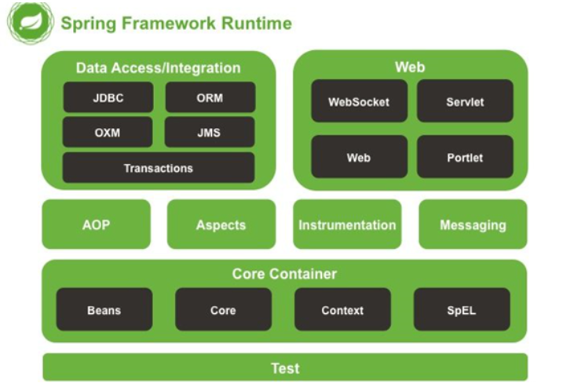

# Spring 全家桶

## Spring

一个 Java 开源轻量级框架，用以整合各类框架，可管理项目，管理类的实例化与生命周期等。

核心：

- 控制反转（Inversion of Control，IOC）

  Spring 在运行时，依据 xml 格式的配置文件和注解等，动态地调用、创建对象与使用方法，将对象交由 IOC 容器统一管理。

  - IOC 包含依赖注入（Dependency Injection，DI）和依赖查找（Dependency Lookup，DL）两种方式。
  - Spring 采用 DI 。

- 面向切面编程（Aspect-oriented Programming，AOP）

  将代码逻辑进一步模块化，使其更便于管理与使用。

### 模块框架

Spring 的每个模块（或组件，也可以是框架）都可以单独存在，或者与其它一个或多个模块联合实现。

- Core Container

	- Beans

		提供了 BeanFactory，是工厂模式的一个经典实现，Spring 将被管理对象称为 Bean 。

	- Core

		提供 IOC 功能。

	- Context

		提供一个框架式的对象访问方式，是访问定义和配置的任何对象的媒介。

	- SpEL（Spring Extension Language）

		一种表达式语言，支持查询、操作运行时对象图，以及解析逻辑、算术表达式。

## Spring Boot

基于 Spring，主要是自动化 Spring 配置，简化 Spring 操作，也就是对 Spring 的加强。

- Spring Boot 使用嵌入式的 Servlet 容器（例如 Tomcat、Jetty 或 Undertow 等），应用无需打成 WAR 包 。
- Spring Boot 提供了一系列的“starter”项目对象模型（POMS）来简化 Maven 配置。

可使用 Spring Initializr （网页）创建 Spring Boot 项目。

## Spring Cloud

提供微服务化支持与管理。

## Spring Data Flow

数据集成。