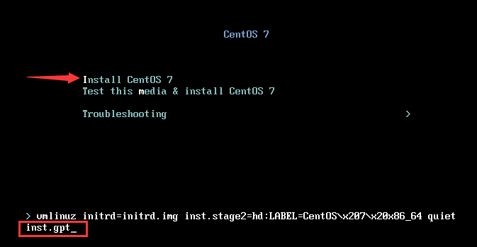
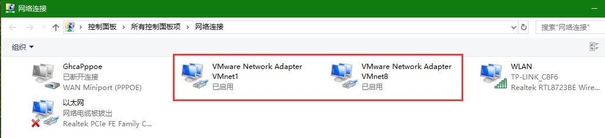
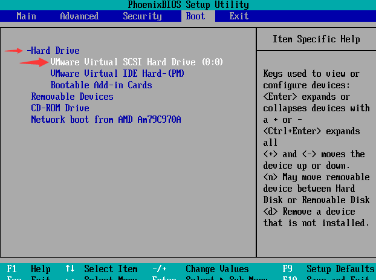

# CentOS 安装

## 虚拟机安装

启动虚拟机，在开机界面迅速按下 F2 进入 BIOS 设置，在 Boot 下将光标移至 CD-ROM Drive（以光盘启动）；按 + 号键，将其移至第一位（即调整启动顺序，按什么启动）

因为虚拟机此时并未分配硬盘空间，所以只能以 CD 启动。

注意：设置好后，

- 若是使用虚拟机
	选择不保存退出即可，虚拟机较智能，会自动在第一次启动时以 CD 启动，并在以后以 Hard Drive（以硬盘启动）。
- 若是实际中
	选择保存退出，在下一次启动时将 Hard Drive（以硬盘启动） 移至第一位，否则：仍会以 CD启动，即是又重新安装系统。


- 如果选择安装后黑屏，（在虚拟机中安装才会出现这种情况）
原因是自身电脑 BIOS 的 Virtualization Technology（虚拟技术） 设置被禁止了，需要进入 BIOS 将其设置为Enabled（使可用）。

- 如果重启时按键无法进入BIOS，则进入 win系统恢复->高级启	动->疑难解答->高级选项->UEFI固件设置  后进入BIOS即可（注意，不同系统等BIOS中  虚拟技术  的英文和位置有可能不同，但大体一致，找到后设置为 Enabled 即可）

选择安装后，会进行系统自检（除错模式）

时区选择上海（即是东八区，与北京一致，选择列表中没有北京）

## 手动分区

在虚拟机中：vda 就是 sda 。

必须分三个分区：（较新版本不必分 /boot 分区）
- /boot
  系统引导分区，系统启动等从此开始，所以其必定在最前方，200M 足够。
- /
  根分区（大小为其它分区后剩余的所有空间）
- swap
  交换分区（相当于虚拟内存，一般大小为内存的 2 倍）其它分区依具体用途分区。

注意：

- 无论 /boot 是首先分区还是后分区，/boot 都会被自动调整为 sda1，因为 /boot 包含系统运行的要素 。
- swap 的文件系统只能是 swap 。

## 分区表类型

- MBR
- GPT

- 磁盘容量小于 2TB 时，系统默认使用 MBR 分区表。
- 若要强制使用 GPT 分区表：到下方界面，将光标移至红色箭头处，按下 tab 键，，输入 额外的内核参数  inst.gpt。



硬盘容量小于 512 MB时，无法显示安装系统的图形安装界面。

## 软件包选择

- 服务器选最小安装，为其它功能让出资源
- 个人学习选基本安装，有一定基础组件
- 个人用户选桌面安装，有桌面
- KDUMP
用于内核开发者除错，对性能影响不大

## 虚拟机网络配置

进入虚拟机后，真实机将新增两块虚拟网卡：VMnet1  和  VMnet8 。



网络适配器：


- 桥接模式
（虚拟网卡 VMnet0）
虚拟机使用真实网卡通信，与真实机共用一个IP地址，主机多时可能会出现IP地址冲突
相当于一台真实的电脑，可与真实机和局域网其它的电脑通信

真实机未联网的情况下，以下两种都可与真实机通信
- NET模式
通过虚拟网卡 VMnet8 与真实机通信
能与本真实机通信，只能通过本真实机与其它电脑通信
- 仅主机模式（host only）
通过虚拟网卡 VMnet1 与真实机通信
只能与本真实机通信，不能与局域网其它的电脑通信

## 用户设置

- 默认用户
用户名：root（最高权限）
输入密码时 linux 不会显示任何字符，输入完成后回车即可。

注意：安装完成后重启时记得将 硬盘启动 移至最前方。

root密码：
- 八位字符以上，大小写字母、数字、符号
- 不能是英文单词
- 不能是和用户相关的内容
- 易记忆性
- 时效性：
- 定期更换密码
  例：flzx_3QC(飞流直下三千尺)

注意：若设置简单密码，则要按两次Done键或双击完成按钮才可以

- 创建一般用户
	如果希望这个一般用户可以使用自己的密码来变成 root，而不用知道 root 密码，则将箭头处勾选。

	

所有设置以及 root 密码等，都会被记录到  /root/anaconda-ks.cfg （记住它）文件内，未来想要创建一个一模一样的系统时，可以参考该文件。

## 安装后重启注意事项

1. 进入 boot，
2. 将 硬盘启动移至最前，
3. 进入硬盘启动选项（按回车）
4. 将安装了系统的硬盘移至最前



### 制作启动 U 盘

假设  /USB 设备为 /dev/sdc，而系统 ISO 文件名为 CentOS7.iso 。

则：

```
dd if=CentOS7.iso of=/dev/sdc
```

这条命令会将系统从 iso 文件刻录到 U 盘中，可以用于安装或从 U 盘启动。
