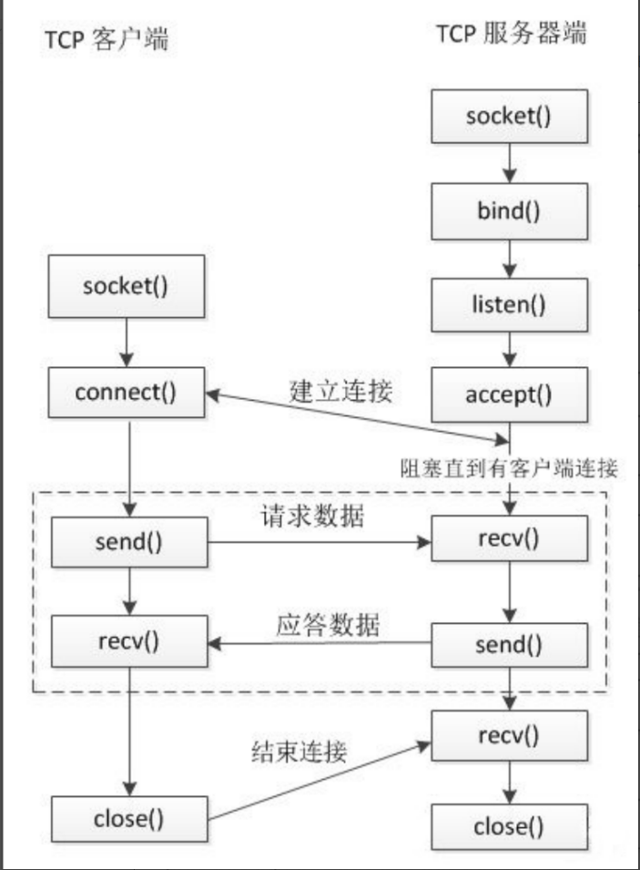

# 通信基础

网络通信主要由套接字（Socket）完成，其是应用程序与网络协议交互的接口，由 IP 地址和端口号组成。

在 Linux 中，Socket 本质是一个文件，可以用文件描述符引用套接字。

- 服务器端

	监听连接，被动接受连接。

- 用户端

	主动发起连接。

## 字节序

数据在内存中的排列顺序。必须要统一数据的字节序后，通信双方才能正常通信。

- 大端序（Big-endian）

	整数的高位字节存储在内存低地址处。（内存地址一般表示为左低右高）

	- 大端序更符合书写和阅读习惯，一般使用于网络传输和文件存储等计算机外部。 

- 小端序（Little-endian）

	整数的低位字节存储在内存低地址处。

	- 计算机早期使用小端能更好地利用逻辑电路，传统得到了保留，一般使用于 CPU 等计算机内部。

大小端只与 CPU 架构有关，与操作系统无关。

以字节为单位，只有一个字节的数据大端和小端是一样的。

### 检测

大小端检测只需灵活运用指针即可：

```c++
#include <cstdio>
#include <iostream>
#include <cstring>
#include <algorithm>

int main() {
    int num = 'a';   // 0 0 0 a
    char * ch = (char *) &num;   // 强转为 char * ，便于查看字节信息。
    if (*ch == 'a') {
        puts("Little-endian.");
    } else {
        puts("Big-endian.");
    }
    
    // 查看内存具体情况。
    for (int i = 0; i < 4; ++i, ++ch) {   // 依次输出。
        if (isalpha(*ch)) {
            putchar(*ch);
        } else {
            putchar('#');   // 不可显示字符由 # 代替。
        }
    }
    putchar('\n');
    return 0;
}
```

### 转换函数

主机字节序依 CPU 架构而定（一般为小端），网络字节序规定为大端序。

Socket 提供了转换接口：

```c
#include <arpa/inet.h>


// 一般用于转换端口号
uint16_t htons(uint16_t hostshort);
uint16_t ntohs(uint16_t netshort);

// 一般用于转换 IP 地址
uint32_t htonl(uint32_t hostlong);
uint32_t ntohl(uint32_t netlong);

函数名规律：

h
    host 主机字节序
to
    转换
n
    network 网络字节序
s
    short : unsigned short
l
	long : unsigned int（一般 long 与 int 长度是一样的）
```

## Socket 地址

### 通用 Socket 地址

#### sockaddr

原始 Socket 地址定义如下：

```c
#include <bits/socket.h>


typedef unsigned short int sa_family_t;


struct sockaddr {
    sa_family_t sa_family;   // 地址族（协议族）（Protocol Family，也叫 Domain）
    char sa_data[14];   // 存放地址数据
};
```

协议族与地址族常量的值是对应相等的，可以混用。

| 协议族   | 地址族   | 描述              | 地址数据构成                                                 |
| -------- | -------- | ----------------- | ------------------------------------------------------------ |
| PF_UNIX  | AF_UNIX  | UNIX 本地域协议族 | 文件的路径名，可达 108 字节                                  |
| PF_INET  | AF_INET  | TCP/IPv4 协议族   | 16 bit 端口号和 32 bit IPv4 地址，共 6 字节                  |
| PF_INET6 | AF_INET6 | TCP/IPv6 协议族   | 16 bit 端口号，32 bit 流标识，128 bit IPv6 地址，32 bit scope ID，共 26 字节 |

原始 Socket 地址的出现比 IPv4 更早，存在数据容量的缺陷，需要使用其它 Socket 地址。

**为了向下兼容，在传入 Socket 网络编程函数时，所有非 sockaddr 地址都需要强转为 sockaddr 地址类型。**（会要求指定结构体大小，不用担心溢出。）

#### sockaddr_storage

sockaddr_storage 地址类型是  sockaddr  后提出的通用地址类型，提供了 128 字节的容量，足够任何协议族使用。

```c
#include <bits/socket.h>


typedef unsigned short int sa_family_t;


struct sockaddr_storage { 
    sa_family_t sa_family;   // 地址族（协议族）
    unsigned long int __ss_align;   // 地址对齐的宽度
    char __ss_padding[ 128 - sizeof(__ss_align) ];   // 填充
};
```

### 专用 Socket 地址

通用 Socket 地址不便于划分数据字段，于是诞生了专用 Socket 地址。

#### sockaddr_un

用于UNIX 本地域协议族。

```c
#include <sys/un.h> 


struct sockaddr_un { 
    sa_family_t sin_family; 
    char sun_path[108];   // 伪文件地址，指定后会自动创建，大小永远为 0 。
};
```

#### sockaddr_in

用于 IPv4 协议族。

```c
#include <netinet/in.h> 


#define __SOCKADDR_COMMON_SIZE (sizeof (unsigned short int))


struct sockaddr_in {   // i Net
    sa_family_t sin_family; /* __SOCKADDR_COMMON(sin_) */ 
    in_port_t sin_port; /* Port number. */ 
    struct in_addr sin_addr; /* Internet address. */ 
    /* Pad to size of `struct sockaddr'. */ 
    unsigned char sin_zero[sizeof (struct sockaddr) - __SOCKADDR_COMMON_SIZE - sizeof (in_port_t) - sizeof (struct in_addr)];
};
```

#### sockaddr_in6

用于 IPv6 协议族。

```c
#include <netinet/in.h> 


struct sockaddr_in6 {    // i Net 6
    sa_family_t sin6_family; 
    in_port_t sin6_port; /* Transport layer port # */ 
    uint32_t sin6_flowinfo; /* IPv6 flow information */ 
    struct in6_addr sin6_addr; /* IPv6 address */ 
    uint32_t sin6_scope_id; /* IPv6 scope-id */ 
}; 
```

### 地址转换

字符串形式的地址与二进制数形式的地址之间的转换，同时转换为网络字节序。

- inet_pton

	将 IP 地址字符串转换为网络字节序整数。

- inet_ntop

	将网络字节序整数转换为 IP 地址字符串。

```c
#include <arpa/inet.h>


int inet_pton(int af, const char *src, void *dst);   // p : IP ；n : network 。

af
    地址族
    AF_INET ：IPv4
    AF_INET6 ：IPv6
src
    需要转换的 IP 字符串
dst
    转换后的网络字节序整数

返回值
    成功返回 0
    失败非 0 ，并设置 errno 。
    

const char *inet_ntop(int af, const void *src, char *dst, socklen_t size);

src
    需要转换的 IP 的整数形式
dst
	转换后的 IP 地址字符串
size
    存放 IP 地址字符串的数组的大小。
    
返回值
    返回转换后的数据的地址（字符串），和 dst 一致。
```

## TCP 通信

### 通信流程



服务器端：

1. 建立用于监听的套接字。
2. 绑定地址与端口。
3. 开始监听，阻塞等待。
4. 系统收到客户端连接请求，接受请求。
5. 通信数据交换。
6. 断开连接。

客户端：

1. 建立用于通信的套接字。（无需绑定）
2. 发起连接请求。
3. 通信数据交换。
4. 断开连接。

### 函数

- socket

	创建一个套接字。

- bind

	将套接字与 socket 地址（IP 和端口）绑定。

- listen

	监听 socket 绑定的 ip 和端口上的连接请求。

- accept

	同意连接请求，建立连接。阻塞等待。

- connect

	客户端请求连接。

```c
#include <sys/types.h> 
#include <sys/socket.h> 
#include <arpa/inet.h> // 包含了这个头文件，上面两个就可以省略


int socket(int domain, int type, int protocol);

domain
    协议族
    AF_INET : ipv4 
	AF_INET6 : ipv6 
	AF_UNIX, AF_LOCAL : 本地套接字通信（进程间通信）
type
	通信协议类型。
	SOCK_STREAM : 流式协议 
	SOCK_DGRAM : 报式协议
protocol
	通信协议，一般写 0，系统采用默认值。
    流式协议默认使用 TCP（字节流）
	报式协议默认使用 UDP（数据报）
返回值
	返回 socket 的文件描述符
	失败返回 -1 


int bind(int sockfd, const struct sockaddr *addr, socklen_t addrlen); // 也叫 socket 命名

sockfd
    socket 的文件描述符
addr
    需要绑定的 socket 地址，这个地址封装了 ip 和端口号信息。
addrlen
    传入 addr 的结构体的大小。
    
    
int listen(int sockfd, int backlog);

backlog
    请求队列的最大值。一般写 5 即可。
    
    
int accept(int sockfd, struct sockaddr *addr, socklen_t *addrlen);

addr
    记录连接成功后的客户端 socket 地址。
addrlen
    addr 参数的内存大小。
返回值
    成功返回用于通信的 socket 文件描述符。
    失败返回 -1 
    
    
int connect(int sockfd, const struct sockaddr *addr, socklen_t addrlen);

sockfd
    用于通信的 socket 文件描述符（无需绑定）。
addr
    请求连接的服务端的 socket 地址。
addrlen
    addr 参数的内存大小。
    
    
// 读写数据可使用操作文件的方式。
ssize_t write(int fd, const void *buf, size_t count);
ssize_t read(int fd, void *buf, size_t count);
```

### 服务器端示例

```c
#include <stdio.h>
#include <arpa/inet.h>
#include <unistd.h>
#include <string.h>
#include <stdlib.h>

int main() {

    // 创建socket(用于监听)
    int lfd = socket(AF_INET, SOCK_STREAM, 0);
    if(lfd == -1) {
        perror("socket");
        exit(-1);
    }

    // 绑定
    struct sockaddr_in saddr;   // 专用 socket 地址，便于操作。
    saddr.sin_family = AF_INET;

    // inet_pton(AF_INET, "192.168.193.128", &saddr.sin_addr.s_addr);
    saddr.sin_addr.s_addr = INADDR_ANY;  // 0.0.0.0 服务器任意网卡的 ip 地址

    saddr.sin_port = htons(9999);   // 转换为网络字节序。

    int ret = bind(lfd, (struct sockaddr *)&saddr, sizeof(saddr));
    if(ret == -1) {
        perror("bind");
        exit(-1);
    }

    // 监听
    ret = listen(lfd, 8);
    if(ret == -1) {
        perror("listen");
        exit(-1);
    }

    // 接受客户端连接请求
    struct sockaddr_in clientaddr;   // 存储客户端 socket 地址。
    int len = sizeof(clientaddr);
    int cfd = accept(lfd, (struct sockaddr *)&clientaddr, &len);
    
    if(cfd == -1) {
        perror("accept");
        exit(-1);
    }

    // 输出客户端的信息
    char clientIP[16];
    inet_ntop(AF_INET, &clientaddr.sin_addr.s_addr, clientIP, sizeof(clientIP));   // 转换为字符串描述。
    unsigned short clientPort = ntohs(clientaddr.sin_port);   // 转换为主机字节序。
    printf("client ip is %s, port is %d\n", clientIP, clientPort);

    // 通信
    char recvBuf[1024] = {0};   // 数据缓冲区
    while(1) {
        
        // 获取客户端数据
        int num = read(cfd, recvBuf, sizeof(recvBuf));
        if(num == -1) {
            exit(-1);
        } else if(num > 0) {
            printf("recv client data : %s\n", recvBuf);
        } else if(num == 0) {
            // 表示客户端断开连接
            printf("clinet closed...");
            break;
        }

        char * data = "hello, i am server";
        // 给客户端发送数据
        write(cfd, data, strlen(data));
    }
   
    // 关闭 socket 文件描述符
    close(cfd);   // 客户 socket 描述符
    close(lfd);   // 监听 socket 描述符

    return 0;
}
```

### 客户端示例

```c
#include <stdio.h>
#include <arpa/inet.h>
#include <unistd.h>
#include <string.h>
#include <stdlib.h>

int main() {

    // 创建套接字
    int fd = socket(AF_INET, SOCK_STREAM, 0);
    if(fd == -1) {
        perror("socket");
        exit(-1);
    }

    // 连接服务器端
    struct sockaddr_in serveraddr;
    serveraddr.sin_family = AF_INET;
    inet_pton(AF_INET, "192.168.193.128", &serveraddr.sin_addr.s_addr);
    serveraddr.sin_port = htons(9999);
    int ret = connect(fd, (struct sockaddr *)&serveraddr, sizeof(serveraddr));
    if(ret == -1) {
        perror("connect");
        exit(-1);
    }

    // 通信
    char recvBuf[1024] = {0};
    while(1) {

        char * data = "hello,i am client";
        // 给客户端发送数据
        write(fd, data , strlen(data));

        sleep(1);
        
        int len = read(fd, recvBuf, sizeof(recvBuf));
        if(len == -1) {
            perror("read");
            exit(-1);
        } else if(len > 0) {
            printf("recv server data : %s\n", recvBuf);
        } else if(len == 0) {
            // 表示服务器端断开连接
            printf("server closed...");
            break;
        }

    }

    // 关闭连接
    close(fd);

    return 0;
}
```

### 读写关闭

- shutdown

	可关闭指定套接字的读写功能。

```c
#include <sys/socket.h>


int shutdown(int sockfd, int how);

how
    操作选项。
    SHUT_RD : 关闭读功能，该套接字不再接收数据。
	SHUT_WR : 关闭写功能，该套接字不再发送数据。
    SHUT_RDWR : 关闭读写功能。
```

- `close()` 只是减少描述符的引用计数，只有引用为 0 时才关闭连接。
- `shutdown()` 直接关闭读或写连接。

### 端口复用

主要用于TCP 连接半关闭时端口还未释放，以及程序突然中断而系统没有释放端口时需要使用该端口的情况。

- setsockopt

	设置 socket 选项，可实现端口复用。必须在绑定端口（`bind()`）前调用该函数。

```c
#include <sys/types.h> 
#include <sys/socket.h> 


int setsockopt(int sockfd, int level, int optname, const void *optval, socklen_t optlen);

level
    被设置选项级别，套接字级别使用 SOL_SOCKET 。
optname
    选项名，端口复用使用 SO_REUSEADDR 。
optval
    存放选项值的缓冲区。端口复用使用 1 即可。
optlen
    缓冲区长度。

示例
int optval = 1;
setsockopt(lfd, SOL_SOCKET, SO_REUSEPORT, &optval, sizeof(optval));
```

## 原始并发通信

以服务器端为例。

### 多进程

- 一个父进程，多个子进程。
- 父进程监听请求，子进程进行通信。
- 注册信号用于回收子进程。

### 多线程

- 一个主线程，多个子线程。
- 主线程监听请求，子线程进行通信。
- 主线程需要给子线程传递必要的参数。（必要时使用全局变量）
- 通过分离子线程释放资源。

## I/O 多路复用

也叫 I/O 多路转接，用于与多个客户端通信。

主要有 select、poll、epoll 三种模型。

### select

使用描述符标志数组记录通信情况。委托系统检测描述符，直到这些描述符的一个或多个有数据时，才返回信息给进程。

- select

	检测描述符的读写缓冲区。

- 一些标志位操作

	- FD_CLR
	- FD_ISSET
	- FD_SET
	- FD_ZERO


```c
#include <sys/time.h>
#include <sys/types.h>
#include <unistd.h>
#include <sys/select.h>


fd_set;   // 描述符数组 sizeof(fd_set) = 128 含有 1024 位，可标志 1024 个描述符。


struct timeval {
    long tv_sec; /* seconds */
    long tv_usec; /* microseconds */
};


int select(int nfds, fd_set *readfds, fd_set *writefds, fd_set *exceptfds, struct timeval *timeout);

nfds
    要检测的描述符的个数，所有描述符的最大值 + 1 ，其决定了描述符数组的遍历范围。
readfds
    要检测读属性的描述符集合，空则写 null 。（读缓冲区是否有数据，是否有请求）
writefds
    要检测写属性的描述符集合，空则写 null 。（写缓冲区是否有数据）
exceptfds
    要检测发生异常的描述符的集合，空则写 null。
timeout
    指定超时时间（阻塞时间），即检测的时间。
    NULL : 阻塞，直到检测到文件描述符有变化
	tv_sec = 0 tv_usec = 0， 不阻塞
	tv_sec > 0 tv_usec > 0， 阻塞对应的时间
返回值
	返回检测到缓冲区数据改变的描述符的总个数（0,1,2,3...），内核会将检测结果写入 fd_set 参数。
	错误返回 -1

// 将 fd 对应的标志位置为 0
void FD_CLR(int fd, fd_set *set);

// 判断 fd 对应的标志位是 0 还是 1
int FD_ISSET(int fd, fd_set *set);

// 将 fd 对应的标志位置为 1
void FD_SET(int fd, fd_set *set);

// fd_set 一共有 1024 bit, 全部初始化为 0
void FD_ZERO(fd_set *set);
```

#### 示例

监听描述符和连接描述符要区别处理。

```c
#include <stdio.h>
#include <arpa/inet.h>
#include <unistd.h>
#include <stdlib.h>
#include <string.h>
#include <sys/select.h>

int main() {

    // 创建 socket
    int lfd = socket(PF_INET, SOCK_STREAM, 0);
    struct sockaddr_in saddr;
    saddr.sin_port = htons(9999);
    saddr.sin_family = AF_INET;
    saddr.sin_addr.s_addr = INADDR_ANY;

    // 绑定
    bind(lfd, (struct sockaddr *)&saddr, sizeof(saddr));

    // 监听
    listen(lfd, 8);

    // 创建一个 fd_set 的集合，存放的是需要检测的文件描述符
    fd_set rdset, tmp;
    FD_ZERO(&rdset);
    FD_SET(lfd, &rdset);
    int maxfd = lfd;

    while(1) {

        tmp = rdset;   // 要保存原始数据

        // 调用 select 系统函数，让内核帮检测哪些文件描述符有数据
        int ret = select(maxfd + 1, &tmp, NULL, NULL, NULL);
        if(ret == -1) {
            perror("select");
            exit(-1);
        } else if(ret == 0) {
            continue;
        } else if(ret > 0) {
            // 说明检测到了有文件描述符的对应的缓冲区的数据发生了改变
            if(FD_ISSET(lfd, &tmp)) {
                // 表示有新的客户端连接进来了
                struct sockaddr_in cliaddr;
                int len = sizeof(cliaddr);
                int cfd = accept(lfd, (struct sockaddr *)&cliaddr, &len);

                // 将新的文件描述符加入到集合中
                FD_SET(cfd, &rdset);

                // 更新最大的文件描述符
                maxfd = maxfd > cfd ? maxfd : cfd;
            }

            for(int i = lfd + 1; i <= maxfd; i++) {
                if(FD_ISSET(i, &tmp)) {
                    // 说明这个文件描述符对应的客户端发来了数据
                    char buf[1024] = {0};
                    int len = read(i, buf, sizeof(buf));
                    if(len == -1) {
                        perror("read");
                        exit(-1);
                    } else if(len == 0) {
                        printf("client closed...\n");
                        close(i);
                        FD_CLR(i, &rdset);
                    } else if(len > 0) {
                        printf("read buf = %s\n", buf);
                        write(i, buf, strlen(buf) + 1);
                    }
                }
            }
        }
    }
    close(lfd);
    return 0;
}
```

#### 缺点

- 每次调用 select 都要将 `fd_set` 从用户态复制到内核态，遍历后又要复制为用户态。
- 遍历 `fd_set` 的复杂度不优秀。
- select 支持的文件描述符的数量太少。
- `fd_set` 不能重用，需要额外记录。

### poll

使用结构体描述通信情况，可以自由决定支持的文件描述符的数量。

- poll

	检测描述符的读写缓冲区。

```c
#include <poll.h>


struct pollfd {
    int fd; /* 委托内核检测的文件描述符 */
    short events; /* 委托内核检测文件描述符的什么事件，不同时间可由 | 连接 */
    short revents; /* 文件描述符发生的事件 returned event */
};


int poll(struct pollfd *fds, nfds_t nfds, int timeout);

fds
    结构体数组，需要检测的描述符的集合。
nfds
    要检测的描述符的个数，所有描述符的最大值 + 1 ，其决定了数组的遍历范围。
timeout
    超时时间。
    0 : 不阻塞
	-1 : 阻塞，直到检测到文件描述符有指定的变化
	> 0 : 阻塞的时长
```

常用常量：

| 事件 | 常量    | event 值 | revent 值 |
| ---- | ------- | -------- | --------- |
| 读   | POLLIN  | 可用     | 可用      |
| 写   | POLLOUT | 可用     | 可用      |
| 错误 | POLLERR |          | 可用      |

#### 示例

```c
#include <stdio.h>
#include <arpa/inet.h>
#include <unistd.h>
#include <stdlib.h>
#include <string.h>
#include <poll.h>

int main() {

    // 创建 socket
    int lfd = socket(PF_INET, SOCK_STREAM, 0);
    struct sockaddr_in saddr;
    saddr.sin_port = htons(9999);
    saddr.sin_family = AF_INET;
    saddr.sin_addr.s_addr = INADDR_ANY;

    // 绑定
    bind(lfd, (struct sockaddr *)&saddr, sizeof(saddr));

    // 监听
    listen(lfd, 8);

    // 初始化检测的文件描述符数组
    struct pollfd fds[1024];
    for(int i = 0; i < 1024; i++) {
        fds[i].fd = -1;
        fds[i].events = POLLIN;
    }
    fds[0].fd = lfd;
    int nfds = 0;

    while(1) {

        // 调用 poll 系统函数，让内核帮检测哪些文件描述符有数据
        int ret = poll(fds, nfds + 1, -1);
        if(ret == -1) {
            perror("poll");
            exit(-1);
        } else if(ret == 0) {
            continue;
        } else if(ret > 0) {
            // 说明检测到了有文件描述符的对应的缓冲区的数据发生了改变
            if(fds[0].revents & POLLIN) {
                // 表示有新的客户端连接进来了
                struct sockaddr_in cliaddr;
                int len = sizeof(cliaddr);
                int cfd = accept(lfd, (struct sockaddr *)&cliaddr, &len);

                // 将新的文件描述符加入到集合中
                for(int i = 1; i < 1024; i++) {
                    if(fds[i].fd == -1) {
                        fds[i].fd = cfd;
                        fds[i].events = POLLIN;
                        break;
                    }
                }

                // 更新最大的文件描述符的索引
                nfds = nfds > cfd ? nfds : cfd;
            }

            for(int i = 1; i <= nfds; i++) {
                if(fds[i].revents & POLLIN) {
                    // 说明这个文件描述符对应的客户端发来了数据
                    char buf[1024] = {0};
                    int len = read(fds[i].fd, buf, sizeof(buf));
                    if(len == -1) {
                        perror("read");
                        exit(-1);
                    } else if(len == 0) {
                        printf("client closed...\n");
                        close(fds[i].fd);
                        fds[i].fd = -1;
                    } else if(len > 0) {
                        printf("read buf = %s\n", buf);
                        write(fds[i].fd, buf, strlen(buf) + 1);
                    }
                }
            }
        }
    }
    close(lfd);
    return 0;
}
```

#### 缺点

- 每次调用 poll 都要将描述符数组从用户态复制到内核态，遍历后又要复制为用户态。
- 遍历描述符数组的复杂度不优秀。

### epoll

epoll 直接在内核区建立一个 eventpoll 数据结构，包含：

- 红黑树

	记录待检测的描述符。

- 双链表（就绪列表）

	记录发生事件的描述符。

epoll 只在返回发生事件的描述符集合时进行一次内核区到用户区的复制。

遍历方面与使用数组相当，当待检测的描述符数量非常大时， epoll 遍历更快。

epoll 直接返回所有的发生事件的描述符，无需再遍历没有发生事件的描述符。

- epoll_create

	创建 epoll 实例。

- epoll_ctl

	控制 epoll 实例，变更其内容。

- epoll_wait

	检测描述符事件。

```c
#include <sys/epoll.h>


int epoll_create(int size);

size
    现已被忽略，任意数即可，但要大于 0 ，建议使用 1 。
返回值
    -1 : 失败
    > 0 : 操作 epoll 实例的描述符。

typedef union epoll_data {
    void *ptr;
    int fd;
    uint32_t u32;
    uint64_t u64;
} epoll_data_t;

struct epoll_event {
    uint32_t events; /* Epoll events */ 
    epoll_data_t data; /* User data variable */
};
// 常见检测事件
	EPOLLIN
    EPLLOUT
	EPOLLERR
	EPOLLET   // 使用 ET 模式。（需要结合非阻塞使用）


int epoll_ctl(int epfd, int op, int fd, struct epoll_event *event);

epfd
    epoll 实例的描述符。
op
    操作类型
    EPOLL_CTL_ADD: 添加
	EPOLL_CTL_MOD: 修改
	EPOLL_CTL_DEL: 删除
fd
	操作的描述符。
event
    描述符的事件。
        
        
int epoll_wait(int epfd, struct epoll_event *events, int maxevents, int timeout);

events
    记录了发生事件的描述符信息。
maxevents
    events 数组的大小。
timeout
    超时时间。
    0 : 不阻塞
	-1 : 阻塞，直到检测到文件描述符有指定的变化
	> 0 : 阻塞的时长
```

#### 示例

```c
#include <stdio.h>
#include <arpa/inet.h>
#include <unistd.h>
#include <stdlib.h>
#include <string.h>
#include <sys/epoll.h>

int main() {

    // 创建 socket
    int lfd = socket(PF_INET, SOCK_STREAM, 0);
    struct sockaddr_in saddr;
    saddr.sin_port = htons(9999);
    saddr.sin_family = AF_INET;
    saddr.sin_addr.s_addr = INADDR_ANY;

    // 绑定
    bind(lfd, (struct sockaddr *)&saddr, sizeof(saddr));

    // 监听
    listen(lfd, 8);

    // 调用 epoll_create() 创建一个 epoll 实例
    int epfd = epoll_create(100);

    // 将监听的文件描述符相关的检测信息添加到 epoll 实例中
    struct epoll_event epev;
    epev.events = EPOLLIN;
    epev.data.fd = lfd;
    epoll_ctl(epfd, EPOLL_CTL_ADD, lfd, &epev);

    struct epoll_event epevs[1024];

    while(1) {

        int ret = epoll_wait(epfd, epevs, 1024, -1);
        if(ret == -1) {
            perror("epoll_wait");
            exit(-1);
        }

        printf("ret = %d\n", ret);

        for(int i = 0; i < ret; i++) {

            int curfd = epevs[i].data.fd;

            if(curfd == lfd) {
                // 监听的文件描述符有数据达到，有客户端连接
                struct sockaddr_in cliaddr;
                int len = sizeof(cliaddr);
                int cfd = accept(lfd, (struct sockaddr *)&cliaddr, &len);

                epev.events = EPOLLIN;
                epev.data.fd = cfd;
                epoll_ctl(epfd, EPOLL_CTL_ADD, cfd, &epev);
            } else {
                if(epevs[i].events & EPOLLOUT) {
                    continue;
                }   
                // 有数据到达，需要通信
                char buf[1024] = {0};
                int len = read(curfd, buf, sizeof(buf));
                if(len == -1) {
                    perror("read");
                    exit(-1);
                } else if(len == 0) {
                    printf("client closed...\n");
                    epoll_ctl(epfd, EPOLL_CTL_DEL, curfd, NULL);
                    close(curfd);
                } else if(len > 0) {
                    printf("read buf = %s\n", buf);
                    write(curfd, buf, strlen(buf) + 1);
                }
            }
        }
    }

    close(lfd);
    close(epfd);
    return 0;
}
```

#### 工作模式

- LT 模式（水平触发，Level Triggered）
	- 默认模式，同时支持阻塞和非阻塞 socket 。
	- 发生事件的描述符，在其（该次事件）缓冲区处理完毕前，会反复被就绪列表返回。
- ET 模式（边沿触发，Edge Triggered）
	- 最高速的工作模式，只支持非阻塞 socket 。
	- 发生事件的描述符，在其（该次事件）缓冲区处理完毕前，只会被就绪列表返回一次。
	- ET 模式减少了 epoll 事件重复触发的次数，因此效率比 LT 模式高。

## UDP 通信

### 通信流程


服务器端：

1. 直接建立用于通信的套接字。
2. 绑定地址与端口。
3. 通信数据交换。

客户端：

1. 直接建立用于通信的套接字。
2. 通信数据交换。

### 函数

- sendto

	发送数据。

- recvfrom

	接收数据。

```c
#include <sys/types.h>
#include <sys/socket.h>


ssize_t sendto(int sockfd, const void *buf, size_t len, int flags, const struct sockaddr *dest_addr, socklen_t addrlen);

flags
    一些标志，一般填 NULL 即可。
    
    
ssize_t recvfrom(int sockfd, void *buf, size_t len, int flags, struct sockaddr *src_addr, socklen_t *addrlen);

flags
    一些标志，一般填 NULL 即可。
src_addr
    用于保存另一端的地址信息，不需要可以指定 NULL 。
```

### 服务端示例

```c
#include <stdio.h>
#include <stdlib.h>
#include <unistd.h>
#include <string.h>
#include <arpa/inet.h>

int main() {

    // 1.创建一个通信的socket
    int fd = socket(PF_INET, SOCK_DGRAM, 0);
    
    if(fd == -1) {
        perror("socket");
        exit(-1);
    }   

    struct sockaddr_in addr;
    addr.sin_family = AF_INET;
    addr.sin_port = htons(9999);
    addr.sin_addr.s_addr = INADDR_ANY;

    // 2.绑定
    int ret = bind(fd, (struct sockaddr *)&addr, sizeof(addr));
    if(ret == -1) {
        perror("bind");
        exit(-1);
    }

    // 3.通信
    while(1) {
        char recvbuf[128];
        char ipbuf[16];

        struct sockaddr_in cliaddr;
        int len = sizeof(cliaddr);

        // 接收数据
        int num = recvfrom(fd, recvbuf, sizeof(recvbuf), 0, (struct sockaddr *)&cliaddr, &len);

        printf("client IP : %s, Port : %d\n", 
            inet_ntop(AF_INET, &cliaddr.sin_addr.s_addr, ipbuf, sizeof(ipbuf)),
            ntohs(cliaddr.sin_port));

        printf("client say : %s\n", recvbuf);

        // 发送数据
        sendto(fd, recvbuf, strlen(recvbuf) + 1, 0, (struct sockaddr *)&cliaddr, sizeof(cliaddr));

    }

    close(fd);
    return 0;
}
```

### 客户端示例

```c
#include <stdio.h>
#include <stdlib.h>
#include <unistd.h>
#include <string.h>
#include <arpa/inet.h>

int main() {

    // 1.创建一个通信的socket
    int fd = socket(PF_INET, SOCK_DGRAM, 0);
    
    if(fd == -1) {
        perror("socket");
        exit(-1);
    }   

    // 服务器的地址信息
    struct sockaddr_in saddr;
    saddr.sin_family = AF_INET;
    saddr.sin_port = htons(9999);
    inet_pton(AF_INET, "127.0.0.1", &saddr.sin_addr.s_addr);

    int num = 0;
    // 3.通信
    while(1) {

        // 发送数据
        char sendBuf[128];
        sprintf(sendBuf, "hello , i am client %d \n", num++);
        sendto(fd, sendBuf, strlen(sendBuf) + 1, 0, (struct sockaddr *)&saddr, sizeof(saddr));

        // 接收数据
        int num = recvfrom(fd, sendBuf, sizeof(sendBuf), 0, NULL, NULL);
        printf("server say : %s\n", sendBuf);

        sleep(1);
    }

    close(fd);
    return 0;
}
```

## 广播

- 服务器端
	- 需指定广播地址。
	- 需设置广播属性。
- 客户端必需绑定本地的端口才能接收广播消息。

```c
// 设置广播属性的函数
int setsockopt(int sockfd, int level, int optname,const void *optval, socklen_t optlen);

level
    指定 SOL_SOCKET 即可。
optname
    指定 SO_BROADCAST 即可。
optval
    int 类型的值，为 1 表示允许广播。
optlen
    optval 的大小。
```

### 服务器端示例

```c
#include <stdio.h>
#include <stdlib.h>
#include <unistd.h>
#include <string.h>
#include <arpa/inet.h>

int main() {

    // 1.创建一个通信的socket
    int fd = socket(PF_INET, SOCK_DGRAM, 0);
    if(fd == -1) {
        perror("socket");
        exit(-1);
    }   

    // 2.设置广播属性
    int op = 1;
    setsockopt(fd, SOL_SOCKET, SO_BROADCAST, &op, sizeof(op));
    
    // 3.创建一个广播的地址
    struct sockaddr_in cliaddr;
    cliaddr.sin_family = AF_INET;
    cliaddr.sin_port = htons(9999);
    inet_pton(AF_INET, "192.168.193.255", &cliaddr.sin_addr.s_addr);

    // 3.通信
    int num = 0;
    while(1) {
       
        char sendBuf[128];
        sprintf(sendBuf, "hello, client....%d\n", num++);
        // 发送数据
        sendto(fd, sendBuf, strlen(sendBuf) + 1, 0, (struct sockaddr *)&cliaddr, sizeof(cliaddr));
        printf("广播的数据：%s\n", sendBuf);
        sleep(1);
    }

    close(fd);
    return 0;
}
```

### 客户端示例

```c
#include <stdio.h>
#include <stdlib.h>
#include <unistd.h>
#include <string.h>
#include <arpa/inet.h>

int main() {

    // 1.创建一个通信的socket
    int fd = socket(PF_INET, SOCK_DGRAM, 0);
    if(fd == -1) {
        perror("socket");
        exit(-1);
    }   

    struct in_addr in;

    // 2.客户端绑定本地的IP和端口
    struct sockaddr_in addr;
    addr.sin_family = AF_INET;
    addr.sin_port = htons(9999);
    addr.sin_addr.s_addr = INADDR_ANY;

    int ret = bind(fd, (struct sockaddr *)&addr, sizeof(addr));
    if(ret == -1) {
        perror("bind");
        exit(-1);
    }

    // 3.通信
    while(1) {
        
        char buf[128];
        // 接收数据
        int num = recvfrom(fd, buf, sizeof(buf), 0, NULL, NULL);
        printf("server say : %s\n", buf);

    }

    close(fd);
    return 0;
}
```

## 组播（多播）

- 服务器端使用多播地址发送数据。
- 客户端需要加入多播组才能接收到该多播组的数据。

组播地址在 IPv4 中的范围从 224.0.0.0 到 239.255.255.255 并被划分为局部链接多播地址、预留多播地址和管理权限多播地址三类。

```c
int setsockopt(int sockfd, int level, int optname,const void *optval, socklen_t optlen);

// 服务器设置多播的信息，外出接口
level
    IPPROTO_IP
optname
    IP_MULTICAST_IF
optval
    struct in_addr

// 客户端加入到多播组
level
	IPPROTO_IP
optname
	IP_ADD_MEMBERSHIP
optval
	struct ip_mreq
        
struct ip_mreq {
    /* IP multicast address of group. */
    struct in_addr imr_multiaddr; // 组播的IP地址
    
    /* Local IP address of interface. */
    struct in_addr imr_interface; // 本地的IP地址
};

typedef uint32_t in_addr_t;
struct in_addr {
    in_addr_t s_addr;
};
```

### 服务器端示例

```c
#include <stdio.h>
#include <stdlib.h>
#include <unistd.h>
#include <string.h>
#include <arpa/inet.h>

int main() {

    // 1.创建一个通信的socket
    int fd = socket(PF_INET, SOCK_DGRAM, 0);
    if(fd == -1) {
        perror("socket");
        exit(-1);
    }   

    // 2.设置多播的属性，设置外出接口
    struct in_addr imr_multiaddr;
    // 初始化多播地址
    inet_pton(AF_INET, "239.0.0.10", &imr_multiaddr.s_addr);
    setsockopt(fd, IPPROTO_IP, IP_MULTICAST_IF, &imr_multiaddr, sizeof(imr_multiaddr));
    
    // 3.初始化客户端的地址信息
    struct sockaddr_in cliaddr;
    cliaddr.sin_family = AF_INET;
    cliaddr.sin_port = htons(9999);
    inet_pton(AF_INET, "239.0.0.10", &cliaddr.sin_addr.s_addr);

    // 3.通信
    int num = 0;
    while(1) {
       
        char sendBuf[128];
        sprintf(sendBuf, "hello, client....%d\n", num++);
        // 发送数据
        sendto(fd, sendBuf, strlen(sendBuf) + 1, 0, (struct sockaddr *)&cliaddr, sizeof(cliaddr));
        printf("组播的数据：%s\n", sendBuf);
        sleep(1);
    }

    close(fd);
    return 0;
}
```

### 客户端示例

```c
#include <stdio.h>
#include <stdlib.h>
#include <unistd.h>
#include <string.h>
#include <arpa/inet.h>

int main() {

    // 1.创建一个通信的socket
    int fd = socket(PF_INET, SOCK_DGRAM, 0);
    if(fd == -1) {
        perror("socket");
        exit(-1);
    }   

    struct in_addr in;
    // 2.客户端绑定本地的IP和端口
    struct sockaddr_in addr;
    addr.sin_family = AF_INET;
    addr.sin_port = htons(9999);
    addr.sin_addr.s_addr = INADDR_ANY;

    int ret = bind(fd, (struct sockaddr *)&addr, sizeof(addr));
    if(ret == -1) {
        perror("bind");
        exit(-1);
    }

    struct ip_mreq op;
    inet_pton(AF_INET, "239.0.0.10", &op.imr_multiaddr.s_addr);
    op.imr_interface.s_addr = INADDR_ANY;

    // 加入到多播组
    setsockopt(fd, IPPROTO_IP, IP_ADD_MEMBERSHIP, &op, sizeof(op));

    // 3.通信
    while(1) {
        
        char buf[128];
        // 接收数据
        int num = recvfrom(fd, buf, sizeof(buf), 0, NULL, NULL);
        printf("server say : %s\n", buf);

    }

    close(fd);
    return 0;
}
```

## 本地套接字

可通过本地套接字进行本地的进程间通信。

伪文件用于简化操作，实际仍然是依靠两个进程内核中的缓冲区通信。

交互逻辑与 TCP 通信一致，服务器端需绑定。

```c
使用本地套接字地址 struct sockaddr_un

socket() 函数需使用 AF_LOCAL

family 需使用 AF_LOCAL
```

