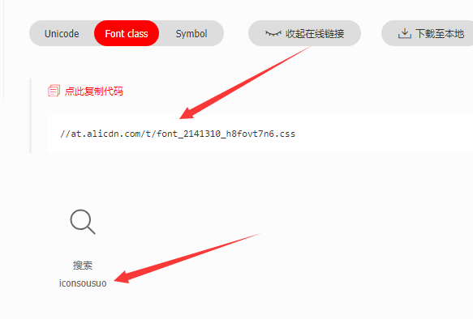
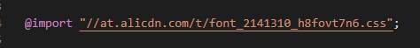
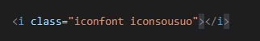

# Web 字体与图标

## web 字体

解决用户电脑上没有安装对应字体有要求不准使用候选字体的问题。

强制让用户下载该字体，该字体由浏览器从网络服务器上下载。
并临时安装。

使用 @font-face 指令制作一个新字体：

web 字体的下载会影响网页的加载速度。

## 字体图标

雪碧图外另一种图标的快速加载的使用方式。

字体中一个“字”可以看做一个“图标”。

字体图标即只生成要使用图标的 CSS 代码（base64 等手段），加载速度较快。

字体图标本质上是表现为图片的文字，可以像设置字体一样设置它的颜色、加粗、斜体等属性。

常用 i 元素将其包含。

一个字体图标库：iconfont.cn

### 一般使用方法

使用 iconfont 生成 css 文件链接：

在代码中引用它：

或：

一般使用 i 元素包含：

注意类样式名：

iconfont 是所有字体图标的公共样式。

iconsousuo 是其中一个图标的样式。
