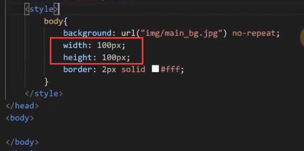
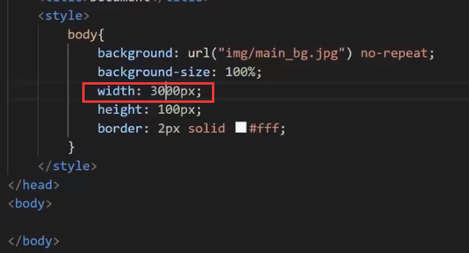
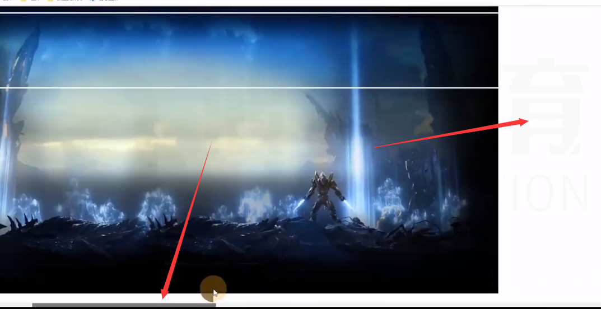
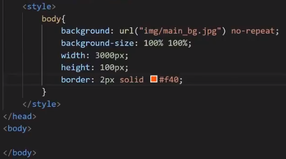
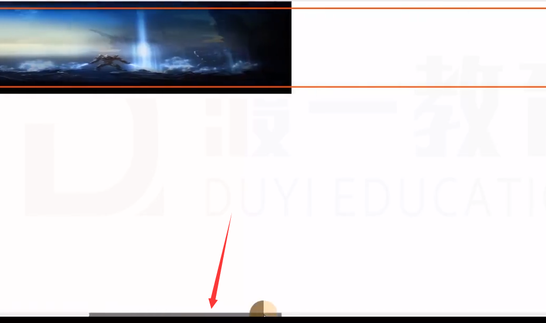
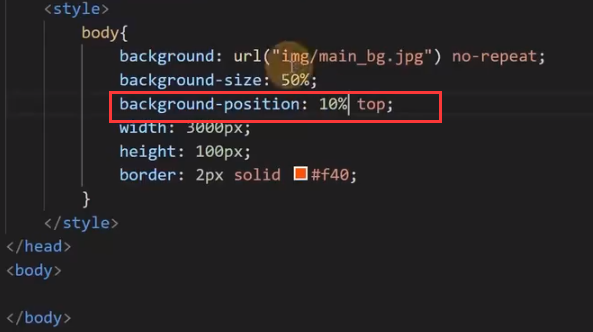
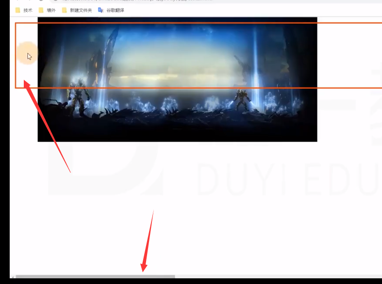
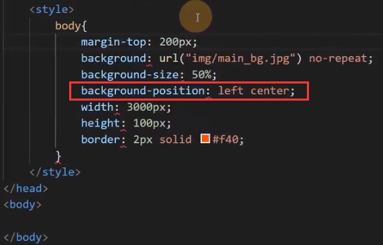
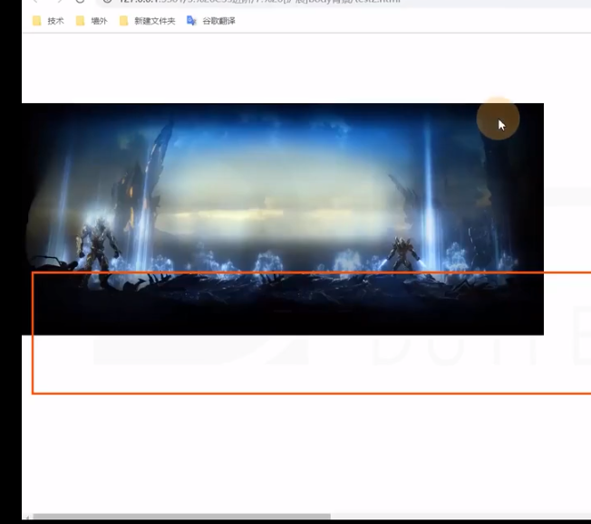

# body 的背景

画布 canvas
一块区域（不是指 HTML 的 canvas 元素）

特点：
1. 最小宽度为视口宽度
2. 最小高度为视口高度

背景颜色

html 元素的背景（```<html> </html>```）

覆盖画布

- body 元素的背景（```<body> </body>```）
- 如果 html 元素有背景，body 元素正常（背景覆盖边框盒）。
- 如果 html 元素没有背景，body 元素的背景覆盖画布。

## 关于画布的背景图

背景图在 html 或 body 元素上时（即画布上时）。

html 元素没有背景时。

1. 背景图的宽度百分比，相对于视口。
2. 背景图的高度百分比，相对于 html 元素高度（网页高度）。
3. 背景图的横向位置百分比，预设值，都相对于视口。
4. 背景图的纵向位置百分比，预设值，都相对于 html 元素高度（网页高度）



效果：


### 宽度



效果：



### 高度



效果：



### 位置横向



效果：



### 位置纵向



效果：


