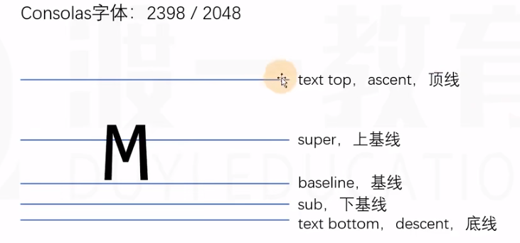
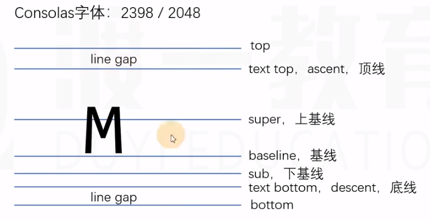

# 参考线 字体

## 文字

文字是通过一些文字制作软件制作的，比如 fontforge 。

制作文字时会有几根参考线，不同的文字类型，参考线不一样；同一种文字类型，参考线一致。

五条参考线（大概存在方式，实际较多变换）

## font-size

字体大小，设置的是文字的相对大小。

相对大小基准数字：1000、1024 或 2048 （无单位）辅以各线之间的距离，即可按比例变化文字大小。

文字顶线到底线的距离，是文字显示区域的实际大小（content area 内容区）。

行盒的背景覆盖 content area 。

## line-height

行高，顶线向上延伸的空间（ascent 到 top）和底线向下延伸的空间（descent 到 bottom），两个空间相等，该空间叫做 gap 或 line gap（空隙）

top 和 bottom 分别是顶线与底线的延伸线。

- gap 默认是由字体设计者设计的。（可为负数）
- top 到 bottom 间的空间叫做 virtual-area（虚拟区）
- 行高就是 virtual-area 的高度，平常设置的行高，实际代表 gap 的大小。
- line-height：normal 代表使用默认的 gap 值。
- content-area 一定出现在 virtual-area 的中间。

## vertical-align

一个元素如果出现了行盒的子元素，该元素内部也会产生参考线。

文字间默认是按照基线对齐的（不同字体也是）。

预设值：
- baseline：该元素的基线与父元素的基线对齐。
- super：该元素的基线与父元素的上基线对齐。
- sub：该元素的基线与父元素的下基线对齐。
- text-top：该元素的 virtual-area 的顶边对齐父元素的 text-top。
- text-bottom：该元素的 virtual-area 的底边对齐父元素的 text-bottom。
- middle：该元素的中线（content-area 的一半）与父元素的 x 字母的高度一半的位置对齐。

行盒组合起来可以形成多行，每一行的区域叫做 line-box 行框（不是 inline-box）line-box 的顶边是该行内所有行盒的最高顶边，底边是该行内所有行盒的最低底边。

- top：该元素的 virtual-area 的顶边对齐 line-box 的顶边（该行中的最高顶边）
- bottom：该元素的 virtual-area 的底边对齐 line-box 的底边（该行中的最低底边）

一个元素的实际占用高度（高度自动时）通过 line-box 计算。

数值：

相对于基线的偏移量，向上为正数，向下为负数。

百分比：

相对于基线的偏移量，其值相对于自身 virtual-area 的高度。

line-box 是承载文字内容的必要条件，以下情况不生成 line-box：

1. 某元素内部没有任何行盒。
2. 某元素字体大小为 0。

## 可替换元素和行块盒的基线

- 图片
	基线的位置位于图片的下外边距。
- 表单元素
	基线位置在内容底边。
- 行块盒
	1. 如果内部有行盒（文字等），行块盒最后一行有 line-box，用最后一行的基线作为整个行块盒的基线。
	2. 如果内部最后一行没有行盒，则使用下外边距做为基线。