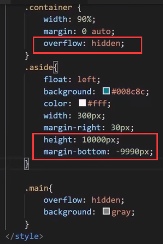

# 布局

## 多栏布局

两栏布局，三栏布局等。

侧栏使用浮动即可。

- 注意高度坍塌问题
- 注意宽度适应问题（考虑 overflow：hidden ）

## 等高

一般主栏内容较多，侧栏内容较少，常常导致侧栏高度不够。

解决办法：
1. CSS3 的弹性盒

2. JS 控制

3. 伪等高（不建议）

	

	上图为伪等高示意。

## 主区域代码前置

侧栏是浮动的，因此其代码需要书写在主区域前，否则无法正常显示。

但搜索引擎认为代码靠前的内容是主要的，这样，有时就需要将主区域代码前置。
此时不使用浮动。

以三栏布局为例：
将主栏外边距调大，留出给侧栏的区域。侧栏采用绝对定位的方式放置于主栏两侧。

