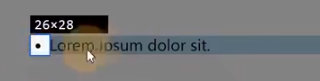
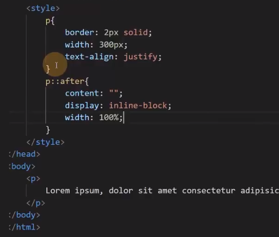
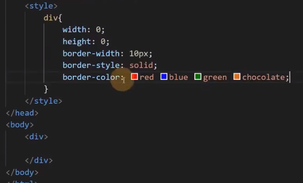
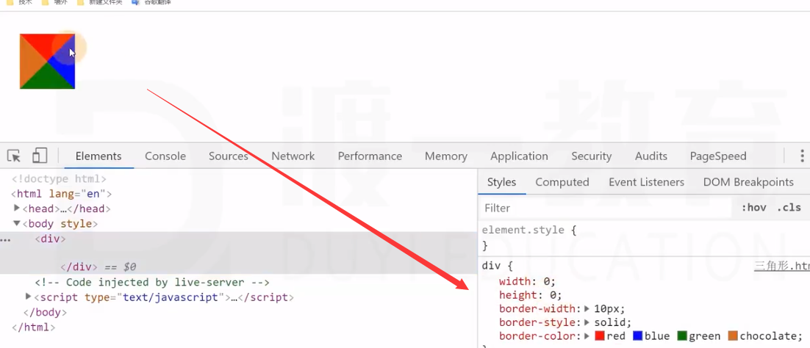
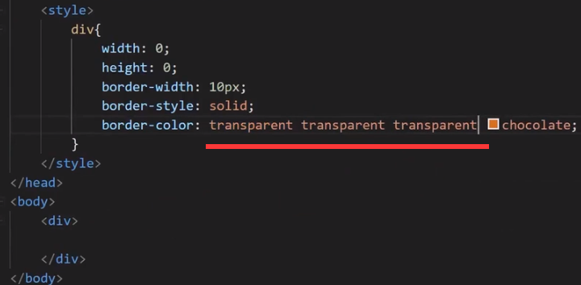
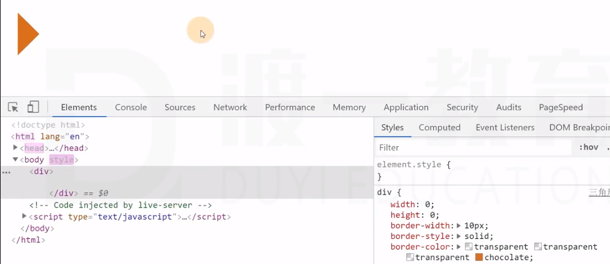
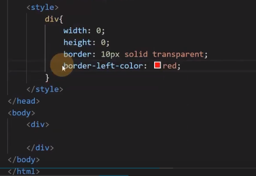

# 样式补充

## display：list-item

设置为该属性的盒子，本质上仍然是一个块盒，但同时，该盒子会附带另一个盒子。
元素本身生成的盒子叫主盒子，附带的盒子叫次盒子，次盒子和主盒子水平排列。

上图圆点即是次盒子。

涉及的 CSS：
1. list-style-type
	设置次盒子内容的类型。
2. list-style-position
	设置的是次盒子相对于主盒子的位置。
3. list-style：none
	清空次盒子。

## 图片失效时的宽高问题

如果 img 元素的图片链接无效，img 元素的特性和普通行盒一样，无法设置宽高。
将其设置为块盒或行块盒即可设置宽高。

## 行盒中包含行块盒或可替换元素

行盒的高度与其内部包含的行块盒或可替换元素的高度无关。

## text-align：justify

除最后一行外，分散对齐。

在元素后加一个 after，则最后一行也可以分散对齐。

## 元素三角形

代码：

效果：

三角形代码：

效果：

利用层叠设置：

效果：

## direction 和 writing-mode

开始（start）和结束（end）时相对的，不同国家可能有不同习惯。

左右是绝对的。

- direction 设置开始到结束的方向。
- writing-mode 设置文字的书写方向。
