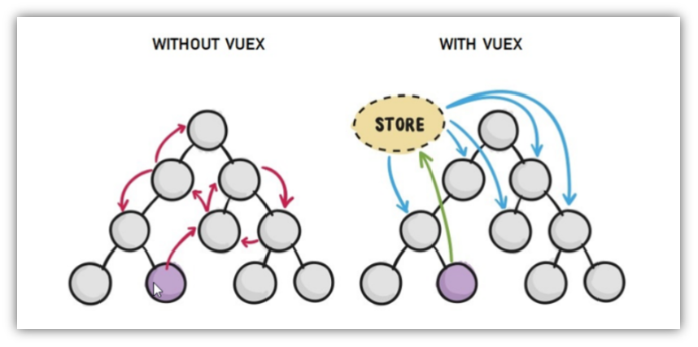
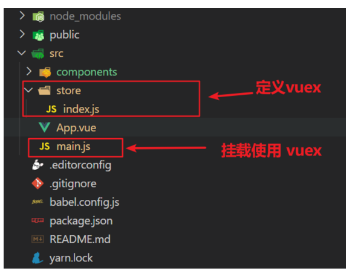
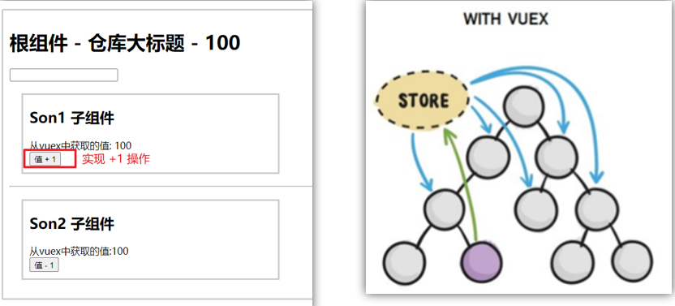
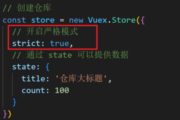
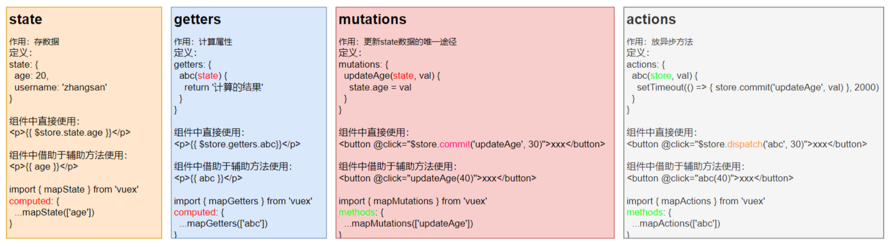
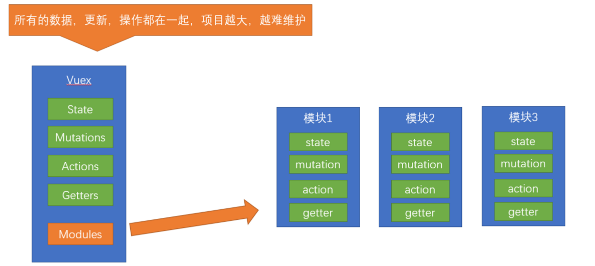

# Vuex

Vuex 是一个 Vue 的 状态管理工具。

状态（state）指可以由多个组件共同维护，即是多个组件共同使用的数据。（数据集中化管理）

Vuex 在 store 中存储 state（数据），并遵循响应式变化。



## 环境准备

vuex 与 vue-router 类似，都是一个独立存在的插件。

一般在 src 目录下新建一个 store 目录，放置一个 `index.js` 文件。 (和 `router/index.js` 类似)



1. ``store/index.js` ` 创建仓库

```js
// 导入 vue
import Vue from 'vue'
// 导入 vuex
import Vuex from 'vuex'
// vuex也是vue的插件, 需要use一下, 进行插件的安装初始化
Vue.use(Vuex)

// 创建仓库 store
const store = new Vuex.Store()

// 导出仓库
export default store
```

2. 在 main.js 中导入到 Vue 实例中

```js
import Vue from 'vue'
import App from './App.vue'
import store from './store'

Vue.config.productionTip = false

new Vue({
  render: h => h(App),
  store
}).$mount('#app')
```

此刻起, 就成功创建了一个空 store 。

## state

### 提供数据

State 提供唯一的公共数据源，所有的共享数据都要存储到 Store 的 State 中。

打开项目中的 store.js 文件，在 state 对象中添加要共享的数据：

```jsx
// 创建仓库 store
const store = new Vuex.Store({
  // state 状态, 即数据, 类似于vue组件中的data,
  // 区别：
  // 1.data 是组件自己的数据, 
  // 2.state 中的数据整个vue项目的组件都能访问到
  state: {
    count: 101 // 数据
  }
})
```

### 访问数据


获取 store：

```
Vue模板中获取 this.$store
js文件中获取 import 导入 store
```

按引用使用：

```
模板中：     {{ $store.state.xxx }}
组件逻辑中：  this.$store.state.xxx
JS模块中：   store.state.xxx
```

也可以将 state 的数据定义为计算属性，然后使用：

```html
<h1>state 的数据 - {{ count }}</h1>

// 把state中数据，定义在组件内的计算属性中
  computed: {
    count () {
      return this.$store.state.count
    }
  }
```


也可以通过辅助函数 mapState 简便地访问。

### mapState

mapState 是 vuex 中的一个辅助函数，可以把 store 中的数据映射到组件的计算属性中，属于一种方便的用法。

1. 导入 mapState

```js
import { mapState } from 'vuex'
```

2. 采用数组形式引入state属性

```js
mapState(['count']) 


// 上面代码最终得到的效果，类似于以下形式：
count () {
    return this.$store.state.count
}
```

3. 利用**展开运算符**将导出的状态映射给计算属性

```js
  computed: {
    ...mapState(['count'])
  }
```

4. 使用：

```vue
 <div> state的数据：{{ count }}</div>
```

## 单向数据流

vuex 遵循单向数据流，组件中不能直接修改仓库的数据，只能通过 mutations 。



vuex 默认不会监测直接修改的行为，可以开启严格模式，使得直接修改时报错：



## mutations

### 基本使用

定义 mutations：

```js
const store  = new Vuex.Store({
  state: {
    count: 0
  },
  // 定义mutations
  mutations: {
     
  }
})
```

mutations 是一个对象，存放修改 state 的方法：

```js
mutations: {
    // 方法里参数 第一个参数是当前store的state属性
    // payload 载荷 运输参数 调用mutaiions的时候 可以传递参数 传递载荷
    addCount (state) {
      state.count += 1
    }
  },
```

组件中使用 mutations 中的方法：

```jsx
this.$store.commit('addCount')
```

可传递参数：（只能传递一个参数，多个参数可以传递对象）

```js
this.$store.commit('addCount', 10)

this.$store.commit('addCount', {count:10})
```

#### mapMutations

mapMutations 和 mapState 类似，它可以提取 mutations 中的方法。

将 mutations 的方法导入 methods 中：

```js
import  { mapMutations } from 'vuex'
methods: {
    ...mapMutations(['addCount'])
}
```

上面的代码等价于：

```js
methods: {
      // commit(方法名, 载荷参数)
      addCount () {
          this.$store.commit('addCount')
      }
 }
```

此时，就可以直接通过 this.addCount 调用了

```jsx
<button @click="addCount">值+1</button>
```

注意：

-  Vuex 规定 mutations 中不能写异步代码，如果有异步 ajax 请求，应该放置在 actions 中。

## actions

- mutations 负责同步操作。
- actions 负责异步操作。

### 基本使用

1. 定义 actions

```js
mutations: {
  changeCount (state, newCount) {
    state.count = newCount
  }
}


actions: {
  setAsyncCount (context, num) {
    // 一秒后, 给一个数, 去修改 num（一个异步操作）
    setTimeout(() => {
      context.commit('changeCount', num)
    }, 1000)
  }
},
```

2. 在组件中通过 dispatch 调用

```js
setAsyncCount () {
  this.$store.dispatch('setAsyncCount', 666)
}
```


### mapActions

mapActions 把位于 actions中的方法提取出来，映射到组件的 methods 中。

```js
import { mapActions } from 'vuex'
methods: {
   ...mapActions(['changeCountAction'])
}

//mapActions映射的代码 本质上是以下代码的写法
//methods: {
//  changeCountAction (n) {
//    this.$store.dispatch('changeCountAction', n)
//  },
//}
```

直接通过 this.方法 就可以调用

```vue
<button @click="changeCountAction(200)">+异步</button>
```

## getters

getters 相当于 state 的计算属性。

### 基本使用

假设，state 中定义了 list，为 1-10 的数组，

```js
state: {
    list: [1, 2, 3, 4, 5, 6, 7, 8, 9, 10]
}
```

组件中，需要显示所有大于5的数据，正常的方式，是需要list在组件中进行再一步的处理，但是getters可以帮助我们实现它：

1. 定义 getters

```js
  getters: {
    // getters函数的第一个参数是 state
    // 必须要有返回值
     filterList:  state =>  state.list.filter(item => item > 5)
  }
```

2. 使用getters

```vue
<div>{{ $store.getters.filterList }}</div>
```

### mapGetters

```js
computed: {
    ...mapGetters(['filterList'])
}
```

```vue
 <div>{{ filterList }}</div>
```

## 基本操作总结



## module

Vuex 默认使用 **单一状态树**，应用的所有 state **会集中到一个比较大的对象**，当应用变得非常复杂时，store 对象就有可能变得臃肿且难以维护。

Vuex 提供模块化：



### 定义模块

假设定义两个模块   **user** 和  **setting** ：

user中管理用户的信息状态  userInfo  `modules/user.js`

```jsx
const state = {
  userInfo: {
    name: 'zs',
    age: 18
  }
}

const mutations = {}

const actions = {}

const getters = {}

export default {
  namespaced: true,
  state,
  mutations,
  actions,
  getters
}

```

setting中管理项目应用的  主题色 theme，描述 desc， `modules/setting.js`

```jsx
const state = {
  theme: 'dark'
  desc: '描述真呀真不错'
}

const mutations = {}

const actions = {}

const getters = {}

export default {
  namespaced: true,
  state,
  mutations,
  actions,
  getters
}
```

在`store/index.js`文件中的modules配置项中，注册这两个模块

```js
import user from './modules/user'
import setting from './modules/setting'

const store = new Vuex.Store({
    modules:{
        user,
        setting
    }
})
```

使用模块中的数据,  可以直接通过模块名访问：

```js
state --> $store.state.模块名.数据项名
getters --> $store.getters['模块名/属性名']
mutations --> $store.commit('模块名/方法名', 其他参数)
actions --> $store.dispatch('模块名/方法名', 其他参数)

其中，【/】 是需要使用的斜杠符号，不是 或 。
```

也可以通过辅助函数映射。

### 辅助函数

```js
// 导入辅助函数
import { mapXxxx, mapXxx } from 'vuex'

computed、methods: {

	// ...mapState、...mapGetters 放 computed 中；

	//  ...mapMutations、...mapActions 放 methods 中；

	 ...mapXxxx('模块名', ['数据名或方法名']),

	 ...mapXxxx('模块名', { 新的名字: 原来的名字 }),

}
```

在辅助函数中设置模块名后，相当于为后面的数据和方法设置了当前组件的命名空间，从而当前组件中可以直接使用属性 `{{ age }}` 或 方法 `@click="updateAge(2)"` 。

#### 以获取 getters 数据为例

`modules/user.js`

```js
const getters = {
  // 分模块后，state指代子模块的state
  UpperCaseName (state) {
    return state.userInfo.name.toUpperCase()
  }
}
```

直接访问getters：

```html
<!-- 测试访问模块中的getters - 原生 -->
<div>{{ $store.getters['user/UpperCaseName'] }}</div>
```

通过命名空间访问：（设置辅助函数）

```js
computed:{
  ...mapGetters('user', ['UpperCaseName'])
}
```

