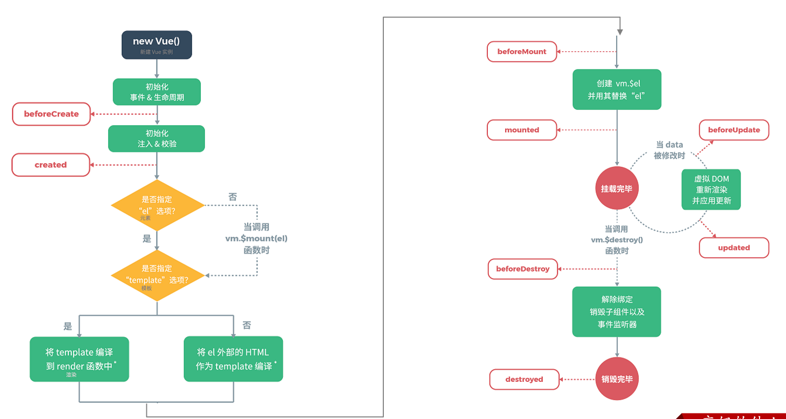

# 基本用法

## Vue 对象

```html
<!DOCTYPE html>
<html lang="en">
<head>
    <meta charset="UTF-8">
    <meta http-equiv="X-UA-Compatible" content="IE=edge">
    <meta name="viewport" content="width=device-width, initial-scale=1.0">
    <title>Vue-快速入门</title>
    
    // vue.js -> vue 的独立文件用法，使用简单的项目
    <script src="js/vue.js"></script>
</head>
<body>

    <div id="app">
        <input type="text" v-model="message">
        {{message}}
    </div>

</body>
<script>
    // 定义Vue对象
    new Vue({
        el: "#app", // vue 接管区域
        data:{
            message: "Hello Vue"
        }
    })
</script>
</html>
```

## Vue 指令

- v-bind

  为HTML标签绑定属性值，如设置  href , css 样式等。

  - 数据发生变化，标签的属性值也会发生变化。

- v-model

  在表单元素上创建双向数据绑定。

  - 视图随数据变化，数据也可被视图产生变化，所以双向绑定一定是使用在表单项标签上的（获取视图提交的数据）。

- v-on

	为 HTML 标签绑定事件。

- v-if

	条件性的渲染某元素，判定为 true 时渲染，否则不渲染。（false 导致无元素）

- v-else

- v-else-if

- v-show

	条件为真时展示某元素，区别在于切换的是 display 属性的值。（false 导致有元素，只是 `display: none`）

- v-for

	列表渲染，遍历容器的元素或者对象的属性。

演示：

```html
Vue 指令（指令字符串）只能表示以下内容：
- JS 表达式
- 变量（本质上也是表达式）
- 函数（本质上也是表达式）


<a v-bind:href="url">链接1</a>
可简写为：
<a :href="url">链接2</a>


js 绑定函数：
<input onclick="handle()">

vue 绑定函数：（事件名没有 on）
<input v-on:click="handle()">
 methods: {
        handle: function(){
           alert("你点我了一下...");
        }
}

v-on 可简写为 @
<input type="button" value="点我一下" @click="handle()">


v-for
<标签 v-for="变量名 in 集合模型数据">
    {{变量名}}
</标签>

v-for 使用索引
<标签 v-for="(变量名,索引变量) in 集合模型数据">
   {{索引变量}} {{变量名}}
</标签>
```

## 生命周期



比较常用的是 `mounted` 。

- created

	在 DOM 初始化完成前被调用，即通常初始化某些属性值，然后再渲染成视图。

	- 可在 created 时更改数据，但更改操作不能依赖 DOM 树，因为 DOM 树此时还没有初始化好。
	- 执行顺序：父组件 -> 子组件

- mounted

	表示挂载完成，Vue 初始化成功，一般用于 DOM 初始化后，使用 ajax 请求后台数据。

	- mounted 一般用于组件的使用，组件一般需要 DOM 渲染完成后才能配置数据。
	- 执行顺序：子组件 -> 父组件

