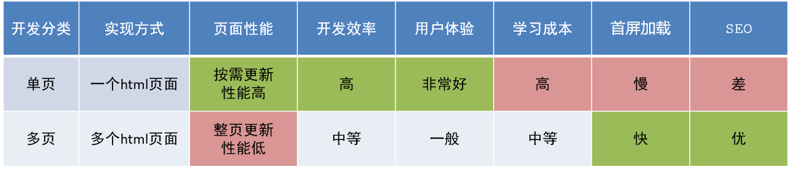
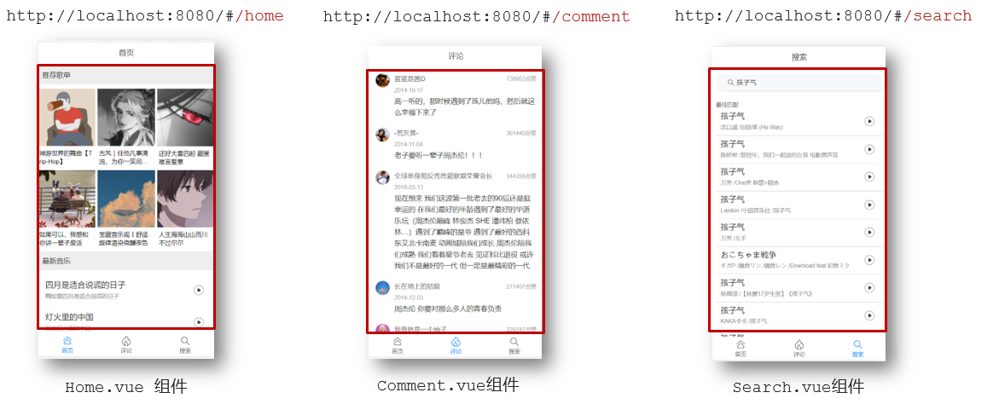
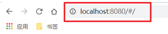
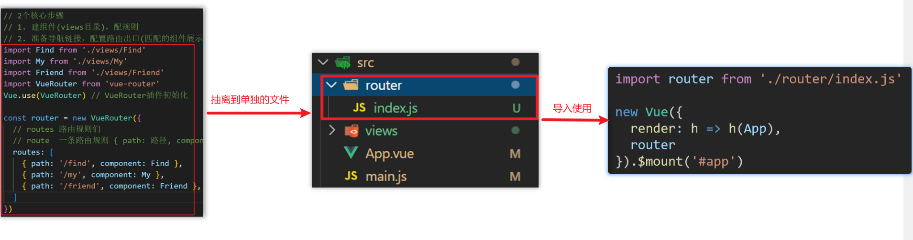
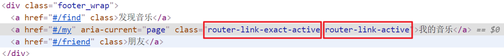
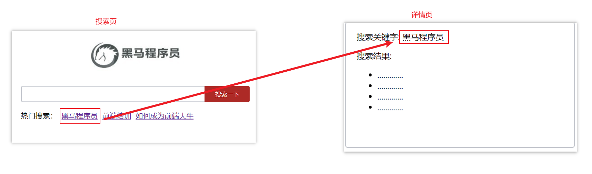
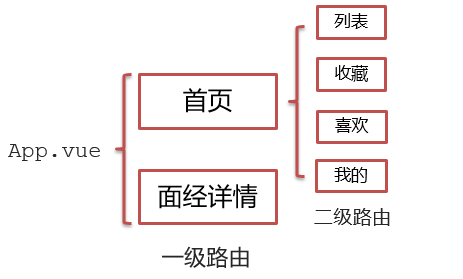
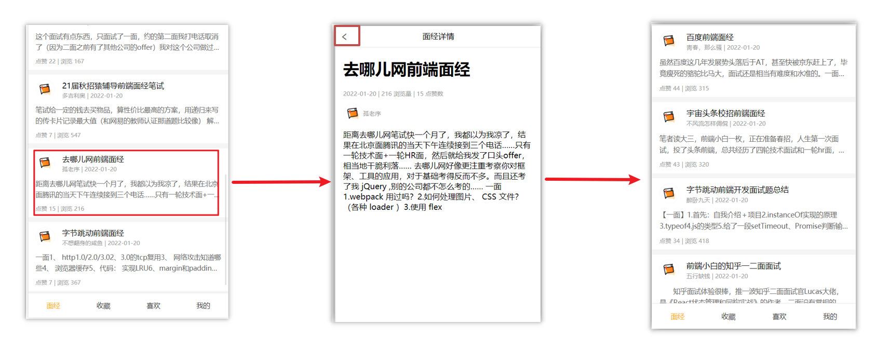

# 路由

- 单页应用程序（Single Page Application，SPA）
	- 所有的功能都在一个 html 页面上实现。
	- 通过 JS 变换页面。
	- 当浏览器拿到这份 HTML 之后，会请求页面所需的 JavaScript 代码，通过执行 JavaScript 代码完成 DOM 树的构建和 DOM 的事件绑定，从而让页面可以交互。
	- SPA 的页面内容需要执行 JS 才能拉取到，不利于 SEO 。
- 多页面应用（Multi Page Application，MPA）
	- 多个 html 页面实现。
	- 通过 URL 跳转页面。
	- MPA 中服务端会针对每个页面返回完整的 HTML 内容，对 SEO 更加友好。



Vue 中的路由表示路径和组件的映射关系：



## 路由基础

路由可以在修改地址栏路径时，切换显示匹配的组件。

VueRouter 是  Vue 官方的一个路由插件，是一个第三方包。（单纯的 Vue 是一个单页面应用）

### 基本使用

1. 设置 VueRouter 管理路由

```js
// main.js 中引入VueRouter
import VueRouter from 'vue-router'

// 注册，插件初始化
Vue.use(VueRouter)

// 创建路由对象
const router = new VueRouter()

// 将路由对象注入到 Vue 实例中，建立关联
new Vue({
  render: h => h(App),
  router:router
}).$mount('#app')
```

浏览器地址栏中的地址变成了 `/#/` 的形式，表示项目的路由已经被 Vue-Router 管理了：



2. 创建需要的组件 (在 views 目录)，配置路由规则


3. 在路由配置文件（一个 js 文件）中配置导航
3. 在当前组件中配置路由出口 `<router-view>`（路径匹配的组件显示的位置）

App.vue：

```vue
<div class="footer_wrap">
  <a href="#/find">发现音乐</a>
  <a href="#/my">我的音乐</a>
  <a href="#/friend">朋友</a>
</div>
<div class="top">
  <router-view></router-view>
</div>
```

### 路由的封装抽离

路由模块的配置不要都卸载 main.js 中，抽离出来，变成一个单独的文件，利于维护：



## 组件的存放目录

 .vue 文件功能上分为 2 类：

- 页面组件 （配置路由规则时使用的组件）
- 复用组件（多个组件中都使用到的组件）


将两类功能的组件分开存放，以便于维护：

- `src/views` 文件夹

	页面组件 - 页面展示 - 配合路由用

- `src/components` 文件夹

	复用组件 - 展示数据 - 常用于复用

## 声明式导航

### 导航链接

在导航栏中，如果使用 a 标签进行跳转的话，需要给当前跳转的导航加高亮样式，同时要移除上一个 a 标签的样式，非常麻烦。

vue-router 提供了一个全局组件 router-link（取代 a 标签)：

```vue
  <div>
    <div class="footer_wrap">
      <router-link to="/find">发现音乐</router-link>
      <router-link to="/my">我的音乐</router-link>
      <router-link to="/friend">朋友</router-link>
    </div>
    <div class="top">
      <!-- 路由出口 → 匹配的组件所展示的位置 -->
      <router-view></router-view>
    </div>
  </div>
```

其中，to 不需要使用 `/#/` 。

### 自动样式类

使用 router-link 跳转后，会自动为当前页面所有与此路由匹配的链接添加默认 class：



匹配规则：

- `router-link-exact-active`

	精确匹配。

	- `to="/my"`仅可以匹配` /my` 。

- `router-link-active`

	模糊匹配。

	- `to="/my"`可以匹配 `/my  /my/a  /my/b  ...  ` 。
	- 只要是以 `/my` 开头的路径都可以和 `to="/my"`匹配到。

可以利用这两个自动添加的 class 指定一些 css 样式。

### 传参

#### 目标

如果要在跳转路由时，进行传参。



比如：现在我们在搜索页点击了热门搜索链接，跳转到详情页，**需要把点击的内容带到详情页**，该怎么办呢？

#### 查询参数传参

query 参数。

```
传递参数：

<router-link to="/path?参数名=值"></router-link>


使用参数：

固定用法：$route.query.参数名
在模版中： {{$route.query.参数名}}
在 JS 中：this.$route.query.参数名
```

#### 动态路由传参

路径参数。

1. 配置动态路由

```js
const router = new VueRouter({
  routes: [
    ...,
    { 
      path: '/path/:words',  // 指定参数名
      component: Search 
    }
  ]
})
```

2. 配置导航链接

	`to="/path/参数值"`

3. 对应页面组件**接受参数**

	`$route.params.参数名`

可选参数：

`path: '/path/:words'` 表示必须传递参数，如果路径没有参数，则会显示空白页面。

如果要指定可选参数，可使用问号：`path: '/search/:words?'` 。

#### 对比

- 查询参数传参 

	比较适合传多个参数。

- 动态路由传参

	简洁，传单个参数比较方便。（也可以传多个参数，但一般只传一个）

## 重定向

网页打开时， url 默认是 / 路径，未匹配到组件时，会出现空白：


可以使所有重定向，使得匹配 / 后, 强制跳转 /home 路径：

```
const router = new VueRouter({
  routes: [
    { path: '/', redirect: '/home'},
 	 ...
  ]
})
```

## 404

404 的路由，虽然配置在任何一个位置都可以，但一般都**配置在其他路由规则的最后面**：

```js
import NotFind from '@/views/NotFind'

const router = new VueRouter({
  routes: [
    ...
    { path: '*', component: NotFind } // 放在最后，匹配任意路径
  ]
})
```

## 路由模式

路由有两种模式： ，能否切成真正路径形式?

- hash 路由（默认）        例如:  http://localhost:8080/#/home

	有 `#` 。

- history 路由（常用）     例如: http://localhost:8080/home   

	以后上线需要服务器端支持，开发环境 webpack 给规避掉了 history 模式的问题。

配置方式：

```js
const router = new VueRouter({
    mode:'histroy', // 默认是hash
    routes:[]
})
```

## 编程式导航

注意与声明式导航对比。

### 路由跳转方式

一般有两种路由跳转方式：

- path 路径跳转 （简易方便）
- name 命名路由跳转 (适合 path 路径长的场景)

#### path 路径跳转

```js
//简单写法
this.$router.push('路由路径')

//完整写法
this.$router.push({
  path: '路由路径'
})
```

#### name 命名跳转

1. 先配置 name 配置项

```js
{ name: '路由名', path: '/path/xxx', component: XXX },
```

2. 通过 name 进行跳转

```js
this.$router.push({
  name: '路由名'
})
```

### 传参

跳转方式：

- path 路径跳转
- name 命名跳转

传参方式：

- 查询参数 
- 动态路由传参

两种跳转方式，对于两种传参方式都支持。

#### 目标

点击搜索按钮，跳转需要把文本框中输入的内容传到下一个页面如何实现？


#### path 路径跳转传参

- query 传参：

```js
//简单写法
this.$router.push('/路径?参数名1=参数值1&参数2=参数值2')
//完整写法
this.$router.push({
  path: '/路径',
  query: {
    参数名1: '参数值1',
    参数名2: '参数值2'
  }
})
```

接受参数的方式依然是：$route.query.参数名

- 动态路由传参：

```
//简单写法
this.$router.push('/路径/参数值')

//完整写法
this.$router.push({
  path: '/路径/参数值'
})
```

接受参数的方式依然是：$route.params.参数值

**注意：**path 不能和 params 使用在一个路径上同时使用。

#### name 命名跳转传参

- query 传参

	```js
	this.$router.push({
	  name: '路由名字',
	  query: {
	    参数名1: '参数值1',
	    参数名2: '参数值2'
	  }
	})
	```

- 动态路由传参 (需要先配置动态路由)

	```js
	this.$router.push({
	  name: '路由名字',
	  params: {
	    参数名: '参数值',
	  }
	})
	```


## 多级路由

多级路由也叫嵌套路由，可以嵌套二级、三级、四级……

### 需求

- 主要的功能页面有两个，一个是**列表页**，一个是**详情页**，并且在列表页点击时可以跳转到详情页
- 底部导航可以来回切换，并且切换时，只有上面的主题内容在动态渲染


### 路由分析

- 首页和面经详情页，两个一级路由
- 首页内嵌套4个可切换的页面（嵌套二级路由）



### 配置

以下以二级路径配置为例。

1. 在一级路由下，配置 children 属性： 

```js
const router = new VueRouter({
  routes: [
    {
      path: '/',
      component: Layout,
      children:[
        //children中的配置项 跟一级路由中的配置项一模一样 
        {path:'xxxx',component:xxxx.vue},
        {path:'xxxx',component:xxxx.vue},
      ]
    }
  ]
})
```

注意：

- 一级的路由 path 需要加 `/`   ，二级路由的 path 不需要加 `/`
- 二级路由对应的组件渲染到哪个一级路由下，children 就配置到哪个路由下。

2. 配置嵌套路由一定要配置对应的路由出口 `<router-view> </router-view>`，否则不会渲染出对应的组件

```vue
<template>
  <div class="h5-wrapper">
    <div class="content">
      <router-view> </router-view>
    </div>
  ....
  </div>
</template>
```

### 完整路由配置

router/index.js

```js
...
import Article from '@/views/Article.vue'
import Collect from '@/views/Collect.vue'
import Like from '@/views/Like.vue'
import User from '@/views/User.vue'
...

const router = new VueRouter({
  routes: [
    {
      path: '/',
      component: Layout,
      redirect: '/article',
      children:[
        {
          path:'/article',
          component:Article
        },
        {
          path:'/collect',
          component:Collect
        },
        {
          path:'/like',
          component:Like
        },
        {
          path:'/user',
          component:User
        }
      ]
    },
    ....
  ]
})

```

Layout.vue

```vue
<template>
  <div class="h5-wrapper">
    <div class="content">
      <!-- 内容部分 -->
      <router-view></router-view>
    </div>
    <nav class="tabbar">
      <router-link to="/article">面经</router-link>
      <router-link to="/collect">收藏</router-link>
      <router-link to="/like">喜欢</router-link>
      <router-link to="/user">我的</router-link>
    </nav>
  </div>
</template>
```

## 缓存组件

### 需求

从面经列表 点到 详情页，又点返回，数据重新加载了：



- 当路由被跳转后，原来所看到的组件就被销毁了（会执行组件内的beforeDestroy和destroyed生命周期钩子）

- 重新返回后组件又被重新创建了（会执行组件内的beforeCreate,created,beforeMount,Mounted生命周期钩子），数据被再次请求并加载了。

### keep-alive

keep-alive 是 Vue 的内置组件，当它包裹动态组件时，**会缓存不活动的组件实例，而不是销毁**它们。

keep-alive 是一个抽象组件：它自身不会渲染成一个 DOM 元素，也不会出现在父组件中。

优点：

- 在组件切换过程中把切换出去的组件保留在内存中，防止重复渲染 DOM，
- 减少加载时间及性能消耗，提高用户体验性。

App.vue

```vue
<template>
  <div class="h5-wrapper">
    <keep-alive>
      <router-view></router-view>
    </keep-alive>
  </div>
</template>
```

### keep-alive 属性

keep-alive 默认缓存所有被切换的组件。

可以指定属性进行设置需要缓存哪些组件：

- include  ： 组件名数组，只有匹配的组件**会被缓存**
- exclude ： 组件名数组，任何匹配的组件都**不会被缓存**
- max       ： 最多可以**缓存多少**组件实例

App.vue

```vue
<template>
  <div class="h5-wrapper">
    <keep-alive :include="['LayoutPage']">
      <router-view></router-view>
    </keep-alive>
  </div>
</template>
```

### keep-alive 钩子

keep-alive 的使用会触发两个生命周期函数（钩子）：

- activated

	当组件被激活（使用）的时候触发（进入这个页面的时候触发）

- deactivated

	当组件不被使用的时候触发（离开这个页面的时候触发）

组件缓存后就不会执行组件的 created, mounted, destroyed 等钩子了。

所以 keep-alive 提供了 actived 和 deactived 钩子，用于实现业务需求。