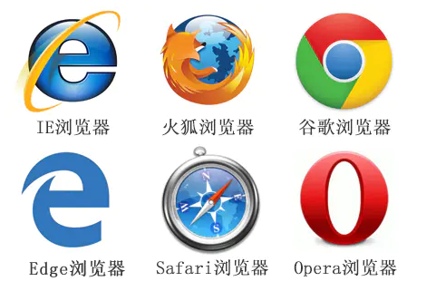

# 基本概念

标准制定组织：W3C（World Wide Web Consortium, 万维网联盟）

参考网站：MDN 等，含有标准信息以及参考手册等。[MDN Web 文档](https://developer.mozilla.org/zh-CN/)

## 语言

- XML（Extensible Markup Language）可扩展标记语言
	描述元素数据的性质与结构（数据结构）
	
- HTML （Hyper Text Markup Language）超文本标记语言
	定义基本组成元素（描述有什么，与 XML 相比重在使用数据显示）
	
- CSS（Cascading Style Sheets）层叠样式表
	描述元素属性（什么样）
	
- JavaScript

	定义页面行为（做什么）。

## 浏览器

分为两部分：
- Shell：外壳
- Rendering Engine：渲染引擎，常称为内核

手机，微信等需要显示网页的场合，需要安装内核。

只讨论具有独立内核的浏览器。

### 五大浏览器

（具有独立内核）

IE（Internet Explorer）最新版为 Edge 。

| 浏览器 | 内核 |
| - | - |
| IE |			Trident|
| Firfox|		Geoko|
| Chrome|	Webkit（以前，与苹果合作开发，后分家），Blink（现在）|
| Safari|	Webkit|
| Opera|		Presto（已弃用），Blink（现在）|



### 杂项

- 浏览器行为
	- 浏览器会对一些错误的代码进行纠错或忽略。
	- 如果浏览器调试时显示的代码格式（元素包含关系等）与源代码不一致，可能是源代码出错。


- 打开调试面板

	`Ctrl + Shift + i`

- F12

	抓包，并打开 console 。

- 悬浮窗定位

	`Ctrl + Shift + C`，调试使用，可使悬浮的元素保持显示。

## 注释

html 注释

起始标记和结束标记内可多行，Ctrl + / 可以快速建立和取消注释

```html
<!-- 注释内容 -->
<!-- 注释内容
多行
  -->  
```

CSS 注释

```css
/* content */
```

## 页面快速搭建

- 手写代码

- 代码片段

- 组件库

	大型项目，高度定制化项目不宜使用第三方组件（不易修改 bug 和个性化）。

	- 原生组件库
	- 框架组件库（Element UI、Element Plus（Element UI 的新版）等）
