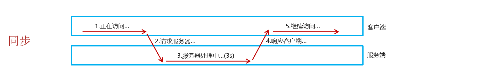

# 异步交互

## 基本概念

- 同步请求发送过程如下图所示：

	

	浏览器页面在发送请求给服务器，在服务器处理请求的过程中，浏览器页面不能做其他的操作。只能等到服务器响应结束后才能，浏览器页面才能继续做其他的操作。 

- 异步请求发送过程如下图所示：

	 

	浏览器页面发送请求给服务器，在服务器处理请求的过程中，浏览器页面还可以做其他的操作。
	
	
	
- 异步交互

	可以在**不重新加载整个页面**的情况下，与服务器交换数据并**更新部分网页**的技术（局部刷新）。如：搜索联想、用户名是否可用的校验等等。
	
- XHR

  就是 XMLHttpRequest 对象，浏览器内部表示封装数据的 JavaScript 对象。

## Ajax

（Asynchronous JavaScript And XML，Ajax，异步的 JS 和 XML）

可以使用 Ajax 实现异步交互。

原生 Ajax 演示：（不重要）

```html
<!DOCTYPE html>
<html lang="en">
<head>
    <meta charset="UTF-8">
    <meta http-equiv="X-UA-Compatible" content="IE=edge">
    <meta name="viewport" content="width=device-width, initial-scale=1.0">
    <title>原生Ajax</title>
</head>
<body>
    
    <input type="button" value="获取数据" onclick="getData()">

    <div id="div1"></div>
    
</body>
<script>
    function getData(){
        //1. 创建XMLHttpRequest 
        var xmlHttpRequest  = new XMLHttpRequest();
        
        //2. 发送服务端异步请求
        xmlHttpRequest.open('GET','http://yapi.smart-xwork.cn/mock/169327/emp/list');
        xmlHttpRequest.send();//发送请求
        
        //3. 获取服务响应数据
        xmlHttpRequest.onreadystatechange = function(){
            if(xmlHttpRequest.readyState == 4 && xmlHttpRequest.status == 200){
                document.getElementById('div1').innerHTML = xmlHttpRequest.responseText;
            }
        }
    }
</script>
</html>
```

## Axios

Axios 是对原生 AJAX 的封装，简化了书写。

请求一般写在 mounted 函数中。

```html
<!DOCTYPE html>
<html lang="en">
<head>
    <meta charset="UTF-8">
    <meta http-equiv="X-UA-Compatible" content="IE=edge">
    <meta name="viewport" content="width=device-width, initial-scale=1.0">
    <title>Ajax-Axios</title>
    
    <!-- 引入 Axios 文件 -->
    <script src="js/axios-0.18.0.js"></script>
</head>
<body>
    
    <input type="button" value="获取数据GET" onclick="get()">

    <input type="button" value="删除数据POST" onclick="post()">

</body>
<script>
    function get(){
        //通过axios发送异步请求-get
        // axios({
        //     method: "get",
        //     url: "http://yapi.smart-xwork.cn/mock/169327/emp/list"
        // }).then(result => {
        //     console.log(result.data);
        // })


        axios.get("http://yapi.smart-xwork.cn/mock/169327/emp/list").then(result => {
            console.log(result.data);
        })
    }

    function post(){
        //通过axios发送异步请求-post
        // axios({
        //     method: "post",
        //     url: "http://yapi.smart-xwork.cn/mock/169327/emp/deleteById",
        //     data: "id=1"
        // }).then(result => {
        //     console.log(result.data);
        // })

        axios.post("http://yapi.smart-xwork.cn/mock/169327/emp/deleteById","id=1").then(result => {
            console.log(result.data);
        })
    }
</script>
</html>
```

其中，`then()` 需要传递一个匿名函数回调函数。

回调函数在发送请求时不会被调用，而是在成功响应后调用。

而该回调函数中的 resp 参数是对响应的数据进行封装的对象，通过 resp.data 可以获取到响应的数据。

请求方法的别名：

Axios 还针对不同的请求，提供了别名方式的 api，具体如下：

| 方法                               | 描述           |
| ---------------------------------- | -------------- |
| axios.get(url [, config])          | 发送get请求    |
| axios.delete(url [, config])       | 发送delete请求 |
| axios.post(url [, data[, config]]) | 发送post请求   |
| axios.put(url [, data[, config]])  | 发送put请求    |
