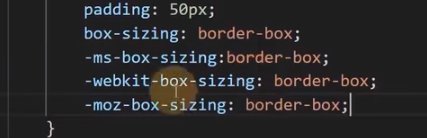
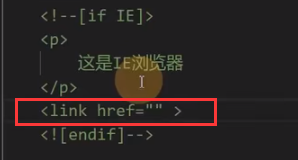
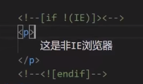

# 浏览器兼容性

问题产生原因：

- 市场竞争，各家公司自定标准以增强竞争力。
- 标准版本变化。

## 厂商前缀

比如：box-sizing，谷歌旧版浏览器中使用 -webkit-box-sizing：border-box
原因：
- 市场竞争，标准未发布。
- 标准仍在讨论（草案），浏览器厂商希望先支持。

| 浏览器 | 常见前缀 |
| - | - |
| IE		|		-ms- |
| chrome，safari |	-webkit- |
| opera |			-o- |
| firefox |		-moz- |

可以在 VScode 安装一个插件 autoprefixer，在所有代码书写完后，按 F1，搜索，选择后自动做厂商前缀补充。

## css hack

根据不同的浏览器设置不同的样式和元素。（主要针对 IE）

IE 中 CSS 的特殊符号:
1. 属性前加 * 号，兼容 IE5~7
2. 属性前加 _ （下划线） ，兼容 IE5~6
3. 属性值后加 \9 ，兼容 IE5~11
4. 属性值后加 \0 ，兼容 IE8~11
5. 属性值后加 \9\0，兼容 IE9~10

条件判断:

低版本 IE 可以识别注释中的一些特殊字符。

低版本 IE 中你甚至可以在注释中引用针对 IE 的 CSS 样式表:

低版本 IE 可识别，其它浏览器不能识别的神写法：

## 两种解决兼容性问题的思路

可能会影响代码的书写风格。

1. 渐近增强

先适应大部分浏览器，然后针对新版本浏览器加入新的样式。

书写代码时，先尽量避免书写有兼容性问题的代码，完成之后，在逐步加入新标准中的代码。

2. 优雅降级

先制作完整的功能，然后针对低版本进行特殊处理。

在书写代码时，先不用特别在意兼容性，完成整个功能之后，在针对低版本浏览器处理特殊样式。

实用网站 caniuse

[Can I use... Support tables for HTML5, CSS3, etc](https://caniuse.com/)

查找 CSS 兼容性。