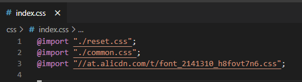
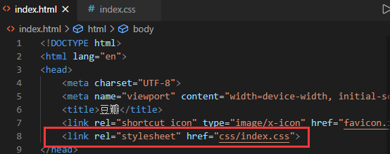

# 基本概念

- CSS 规则

一条 CSS 规则 = 选择器 + 声明块

```
<style>
h1{
	color:orange;
	text-align:center;
}
</style>
```

style 元素表明是 CSS 代码。

- 选择器基本写法

	1. id 选择器，选中对应 id 元素
	2. 元素选择器，同名元素都会被选中
	3. 类选择器，将 CSS 代码封装为类，再以类赋值給元素 class 属性

- 声明块
	包含了若干声明（CSS 属性），每一个声明（CSS 属性）对应某些样式。
	属性名:属性值;
	
## CSS 代码书写位置

- 内部样式表
	使用 style 元素。
- 内联样式表（元素样式表）
	使用某个元素的 style 属性。
- 外部样式表
	将 CSS 代码书写到独立的文件中，使用 link 元素链接 .CSS 文件。
	- 有利于解决多页面样式重复的问题。
	- 有利于浏览器缓存 CSS 文件，从而提高下一次页面的访问速度。
	- 有利于代码分离。

部分样式表推荐先使用 @import 包含到一个 css 文件中，再链接到 html 。



