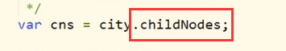

# 常用

## document.onload 事件

页面解释的顺序是自身而下的（包括 JS 代码），如果要使用元素的 JS 代码在被使用元素前方存在，则需要使用 onload 事件，使该 JS 代码在 元素被加载后再解释。

## childNodes 属性

该属性会返回元素子节点，包括空白子节点，即元素间的换行或空格。

这个空白子节点的“空白”属于文本类型（text）。

返回的空白子节点并非无用，它可以带来更大的可扩展性。

## style 属性

直接通过 style 属性，只能获取到元素的内联样式表的样式，不能获取到外部样式表的样式。

## currentStyle 属性

元素当前显示的样式。

## getComputedStyle() 方法

- 是 window 对象的方法。
- 获取指定元素当前显示的样式。
- 返回一个包含样式的对象。
