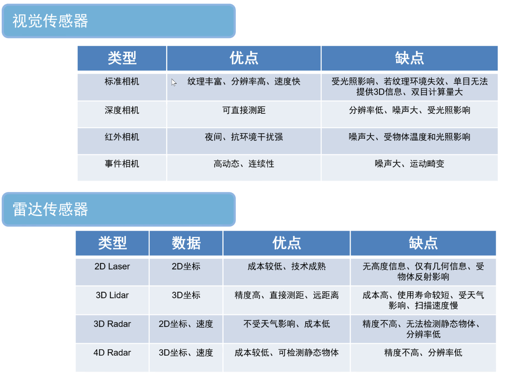

# 传感器

## 运动

- 里程计（Geometry）

	记录运动状态，可根据运动状态计算轨迹与里程。
	
- 惯性测量单元（Inertial Measurement Unit，IMU）

  测量物体姿态角（角速度）和加速度。

## 相机

- 单目相机（Monocular）

- 双目相机（Stereo，立体摄像头）

	通过两个单目镜头的视差计算深度。

- 深度相机（RGB-D）

	依据 ToF 原理，通过发射红外结构光测距。

- 全景相机（Omnidirectional Camera，360-degree Camera）

	通过对单个多个相机的成像进行旋转拼接生成视场 360 度的图像。

- 事件相机（Event-based Camera，Event Camera），动态视觉传感器（Dynamic Vision Sensor，DVS），动态活动像素视觉传感器（Dynamic and Active-Pixel Vision Sensor，DAVIS）

	只记录像素亮度的变化情况，即事件。

## 雷达

### LiDAR

（激光雷达，Light Detection and Ranging）

依据含有机械运动部件的程度划分的 LiDAR 类别：

- 机械激光雷达
- 半固态激光雷达（semi-solid lidars）
- 固态激光雷达

[Lidar 轻科普 | 一文了解固态和半固态激光雷达 - 技术前沿 - AI汽车网](https://auto.vogel.com.cn/c1270452.shtml)

### Radar

（毫米波雷达，Radio Detection and Ranging）

### 对比

- LIDAR
  - 基于激光。
  - 精确度更高（特别是小物体），成本高。
- Radar
  - 基于无线电波。
  - 探测距离更远，恶劣环境影响小，成本更低。
  - 依据多普勒效应可以计算目标的移动速度。

| 参数             | Radar                                  | LiDAR                                    |
| ---------------- | -------------------------------------- | ---------------------------------------- |
| 最大感知范围(m)  | 1000                                   | 200                                      |
| 速度范围（km/h） | > 1000                                 | >200                                     |
| 径向运动分辨率   | 好                                     | 好                                       |
| 切向运动分辨率   | 差                                     | 差                                       |
| 静止测距         | 复杂                                   | 简单                                     |
| 角度测量能力     | 较好                                   | 好                                       |
| 环境适应         | 强                                     | 弱                                       |
| 成本             | 较低                                   | 高                                       |
| 穿透性           | 强                                     | 弱                                       |
| 优点             | 不受天气、昼夜光线的影响，探测距离远   | 测距精度高，方向性强，不易受地面杂波干扰 |
| 缺点             | 目标识别难度稍大，精度稍低，有杂波干扰 | 成本高，探测范围小，遇到恶劣天气无法工作 |
