# SVM

（Support Vector Machine，SVM）

SVM 主要包含两部分：

- Hinge Loss
- Kernel Method

## Hinge Loss

以 Binary Classification 为例：

- 数据

	$x,\hat y$（用 $+1, -1$ 书写公式会比 $0, 1$ 方便）

- 函数 $g(x)$

- loss function

	$g$ 出错的次数，需要最小化它。

	- 由于是否出错这个操作 $\delta( \not =)$ 不可微，用一个可导函数 $l$ 代替。

- 训练

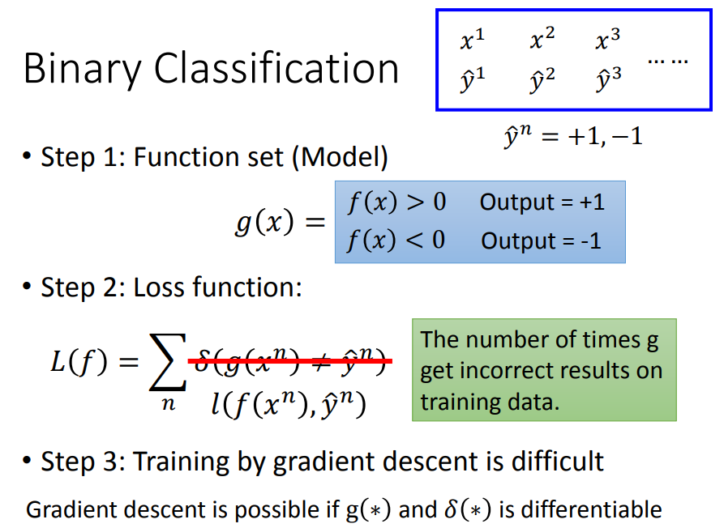

### 理想 loss 的近似

$l$ 的形式多种多样：

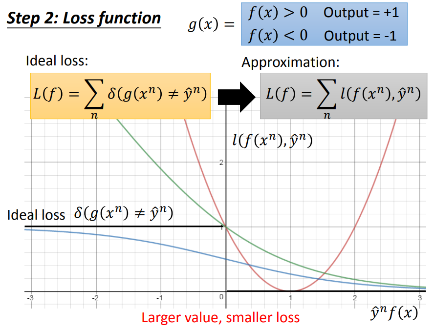

其中，横轴为 $\hat y^n f(x)$ ，纵轴为 $l$：

- $\hat y^n = +1$ 时 $f(x)$ 越正越好。
- $\hat y^n = -1$ 时 $f(x)$ 越负越好。
- 所以，理想上，越往横轴右侧，$l$ 越小越好。
- 也即 $f(x)$ 与 $\hat y$ 越同向越好。

ideal loss 的曲线为黑实线，但它不可微。

为了近似 ideal loss ，使用 $L$ 替代。

### square loss

如果使用 Square loss 作为 $L$ 是不合理的，它的右侧有一个很大的 loss：（红色线）

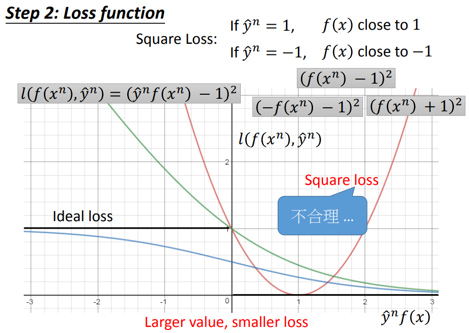

其中，Square loss 部分表示：

- 如果 $\hat y^n = 1$ ，$f(x)$ 越接近 $1$ 越好。
- 如果 $\hat y^n = -1$ ，$f(x)$ 越接近 $-1$ 越好。

下同。

### sigmoid + square loss

如果用 sigmoid + square loss ：（蓝色线）

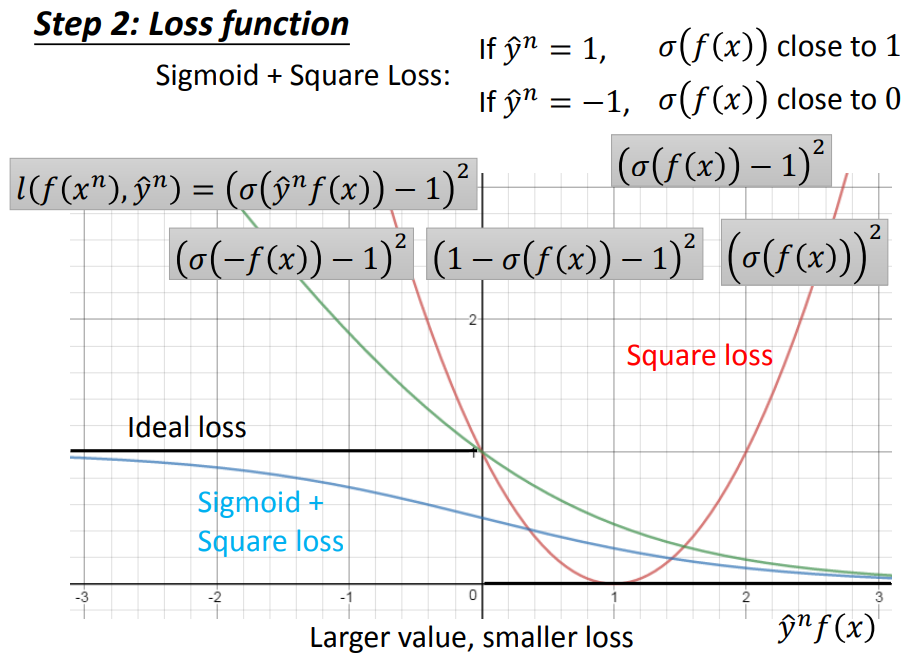

可见 sigmoid + square loss 特别平坦，不好优化。

### sigmoid + cross entropy

如果使用 sigmoid + cross entropy ：（绿色线）

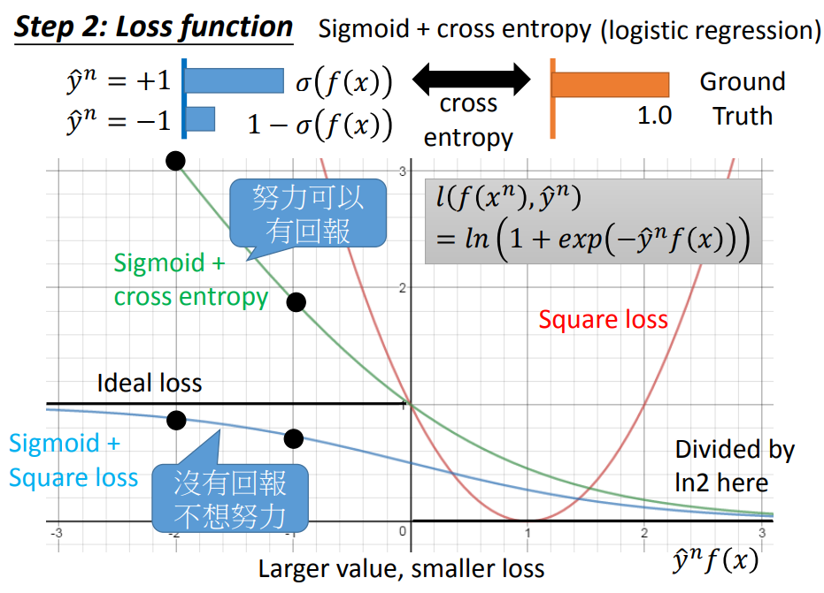

其中，绿色线的可视化是在值上除以了 $\log 2$ ，以表示 sigmoid + cross entropy 是 ideal loss 的一个上界。

不能最小化 ideal loss ，可以最小化它的上界。

### hinge loss

$$
Hinge\ loss = f(x, y) = \max(0, 1 - xy)
$$

如果使用 Hinge Loss ：（紫色线）

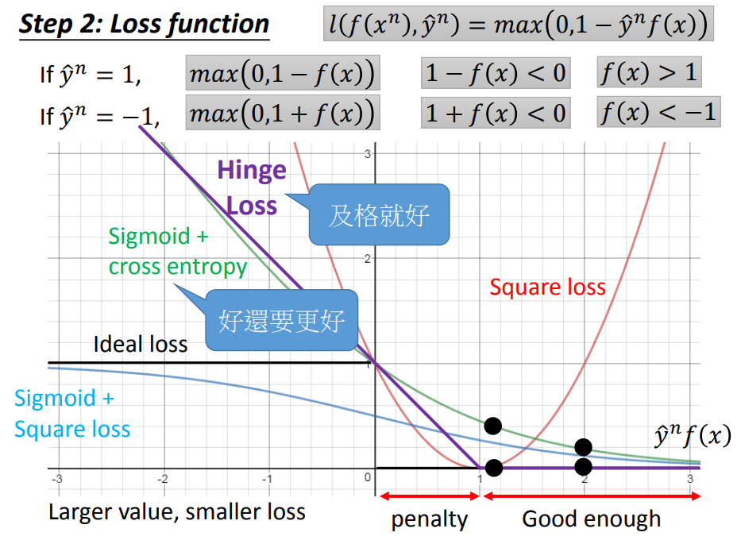

可见，对于 Hinge Loss：

- 横轴 $\gt 1$时，结果就足够好，loss 为 $0$ ，更大也停止优化它，这个数据不再起作用。
- 如果横轴位于 $[0, 1]$ ，结果好，但还不够好（正得不够多），仍然给出 penalty 继续优化。
	- 这个足够好的程度就是 margin 。

对比：

- cross entropy 会继续优化大于 $1$ 的值。
	- 对 inliner 优化程度更高。
	- 将 outliner 视为 inliner 。
- hinge loss 只要这个值大于 margin 就不再优化。
	- 对 inliner 综合优化。（及格就好，可能优化程度不够）
	- 对 outliner 抗性更强。

## Linear SVM

linear SVM 表示对 linear function model 进行优化的情况。

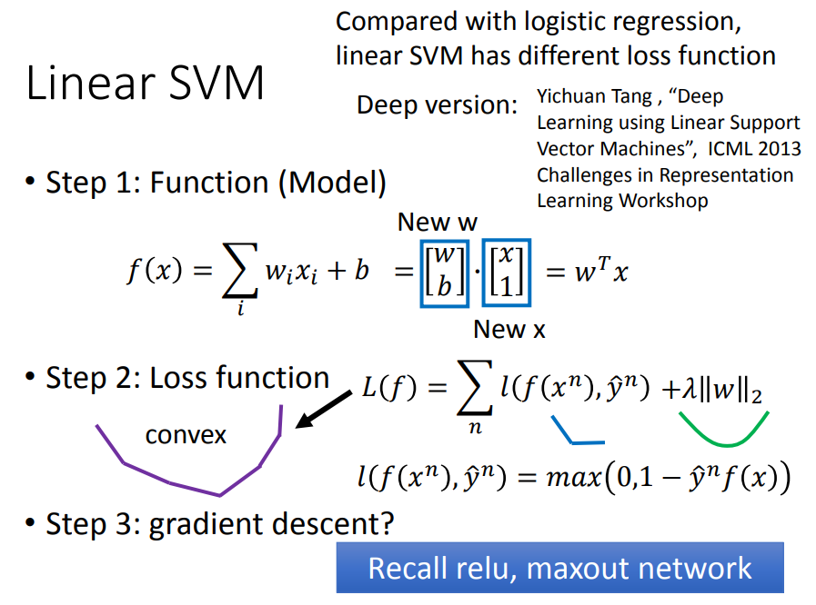

其中，New 表示表示为新的变量，$\lambda||w||_2$ 表示添加的正则项。

对比：

- linear SVM 就是使用了 hinge loss 的 logistic regression 。

实际上，$f(x)$ 不是 linear 的也可以训练，可以使用 Deep version 的 linear SVM 。

对比：

- 用 DNN 做分类时，如果没有使用 cross entropy，而是使用 hinge loss ，那么就是 deep version 的 SVM 。

### Picasso

SVM 可以使用 gradient descent 训练，该方法叫 Picasso ：

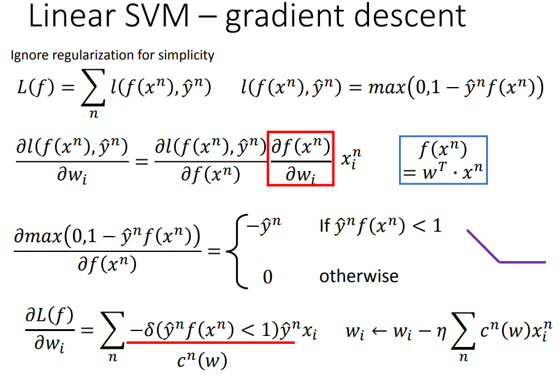

### SVM 的一般形式

用 $\epsilon^n$ 表示 hinge loss，并做变换：

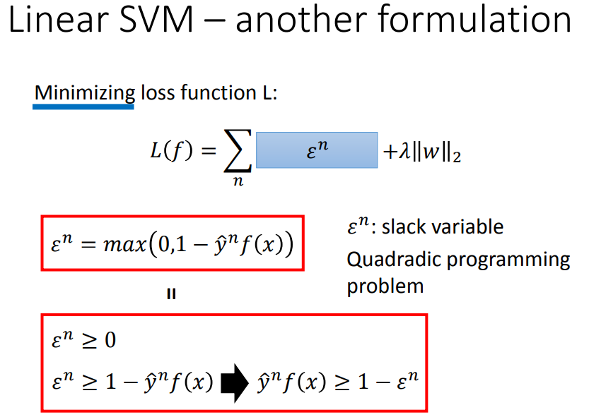

其中，在 minimize 的情况下，两个红框的式子作用相同。

这样就得到 SVM 的一般形式：

- $\hat y^n$ 与 $f(x)$ 要是同号的。
- 它们相乘后应该大于 margin $1$  。
- 由于 margin 比较难满足，所以使用 soft margin ，也即使用 $\varepsilon^n$（slack variable）降低 margin 的要求。
- 因为要减小 margin 的要求，所以 slack variable 要大于等于 $0$ ，即 $\varepsilon^n \gt 0$ 。

可以使用 Quadraidc Programmin（QP，二次规划）的方法求解，也可以使用 gradient descent 。

## Kernel Method

### Dual Representation

实际上，找到的 minimize loss function 的 weight 与 data 存在一定的关系，即 weight 是 data 的线性组合。

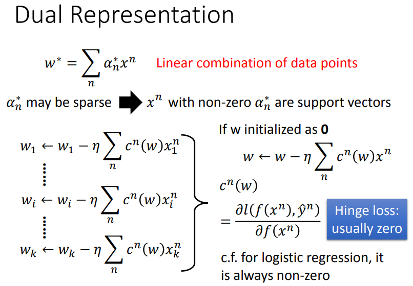

其中，$x^n$ 表示第 $n$ 个 sample 向量，$\alpha^*_n$ 表示对应的组合系数，$w^*$ 即是 model 的权重。

考虑梯度下降的过程，分别使用 $x^n$ 的 $1 \dots k$ 维更新  $w^n$ 的 $1 \dots k$ 维，如果 $w$ 初始化时都是 $0$ ，则更新后的 $w$ 必是 data 的线性组合。

对于 hinge loss：

- $c^n(w)$ 可能为 $0$ ，这意味着不是所有 $x^n $ 都会被加到 $w$ 中去。
- 从而解出的 $w$ 可能是 sparse 的，从而很多的 data point 对应的 $\alpha$ 值为 $0$ 。
- $\alpha \not = 0$ 的那些 sample（向量），就是 support vector ，它们决定了 $w$ 的最终值。（在 SVM 中，一般只有少数的点会是 support vector）

将权重的线性组合表示为 $X\alpha$ 后，可以得到 $f(x) = \alpha^TX^Tx = \sum \alpha_nK(x^n, x)$ ：

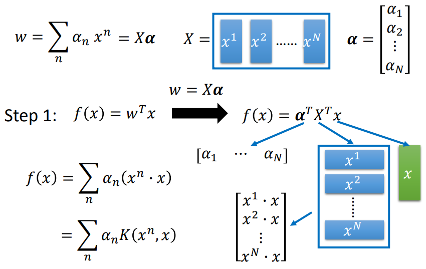

其中，$(x^n \cdot x)$ （内积），可以用 $K(x^n, x)$ 表示，称为 kernel function 。

### Kernel Trick

将 $f(x)$ 用 kernel function 表示后，优化寻找的对象不再是 $w$，而是 $\alpha^*$ ：

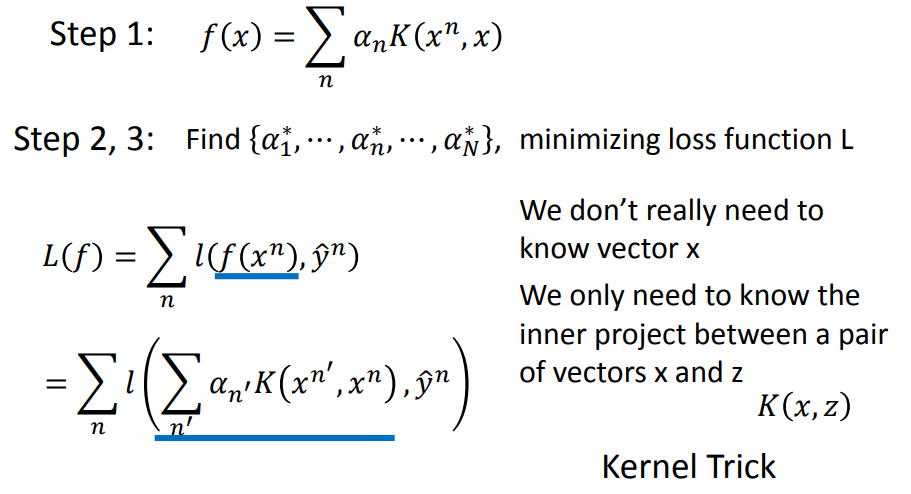

损失函数 $L(f)$ 可进一步写为上图形式，从而不再需要知道 $x$ 的具体值，只需要知道 $x$ 和另一个 sample vector $z$ 的 kernel function 的值，就可以做优化。

这个技巧就是 kernel trick 。

推论：只要满足权重是数据的线性组合这一性质的方法，都可以使用 kernel trick ，比如：

- kernel based logistic regression 
- kernel based linear regression

linear model 存在很多限制，可能需要对数据做一些非线性 feature transform（往往使用几层神经网络进行）后才能用 linear model 处理。

假设 $x$ 经过非线性的 feature transform 后变为了 $\phi(x)$ ，再这基础上再做 linear SVM（一个 linear model）：

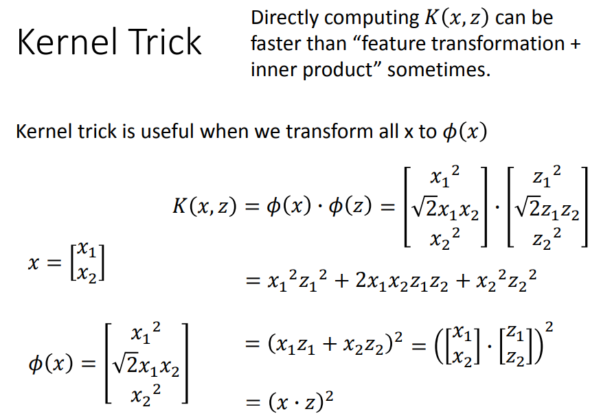

可知，将 $x,z$ 先转换再内积（$K$），等同于先内积（$K$）再平方。

往往后者能够计算更快（没有前者的非线性变换的过程），这在 sample 是高维向量时计算速度的差异会更明显。

### RBF Kernel

（Radial Basis Function Kernel，RBF Kernel）

如果取 kernel function 为：
$$
K(x, z) = \exp(- \frac 1 2 ||x-z||_2)
$$
其中：

- $x,z$ 越相近，kernel 的值就越大。
- $x,z$ 相等，kernel 的值就为 $1$ 。
- $x,z$ 完全不同，kernel 的值就为 $0$ 。

这个 kernel function 也可以表示为两个非线性变换后再内积的结果，不过这个非线性变换会将 sample 变为无穷多维，如果先变换到无穷多维再做内积，根本无法计算。

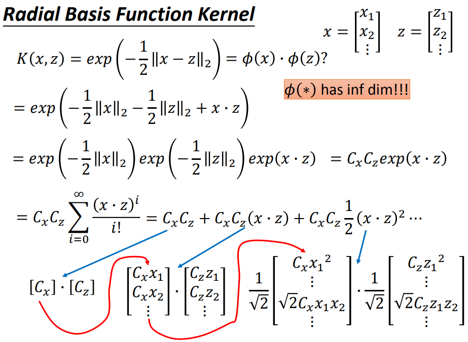

其中，第四行用到了泰勒展开，有无穷多项。每一项可以看做一个向量和另一个向量的内积，全部串起来就是无穷项的内积。

如果直接计算 kernel function 的结果，就相当于在无穷多维的空间做内积，相当于在无穷多维的平面上计算，非常容易 overfitting 。

### Sigmoid Kernel

当使用 sigmoid kernel 时：
$$
K(x, z) = \tanh(x, z)
$$
$f(x)$ 就相当于只有一个 hidden layer 的神经网络：

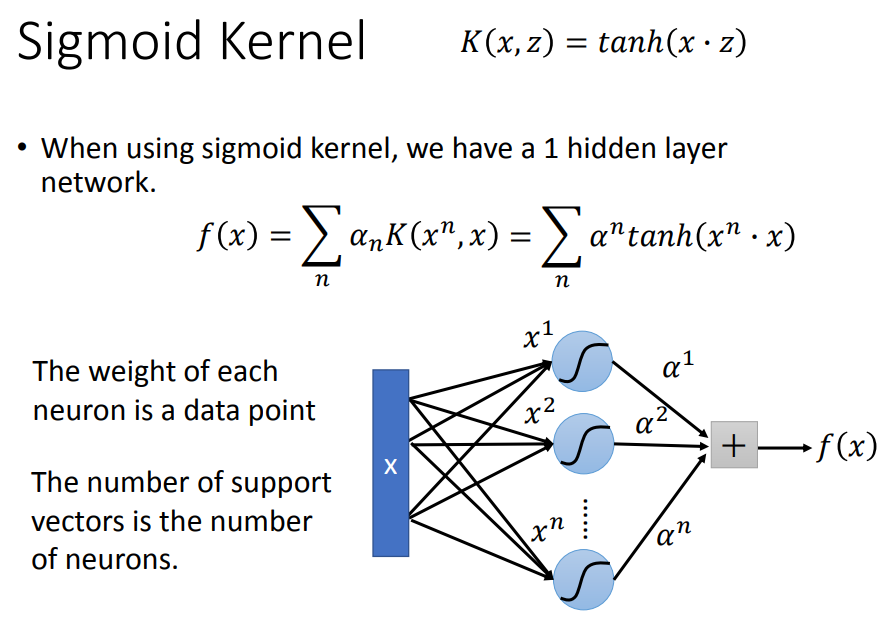

其中，$\alpha^n$ 应当写为 $\alpha_n$ 。

### self-define kernel function

可以直接设计 kernel function ，它的值等于两个 sample 在高维空间进行内积的结果。

这时不用在意 sample 具体的值是多少，具体的形式是什么，如果 sample 是结构化的数据，比如是一个序列，但不同 sample 的长度不同，那么我们难以去统一定义表示它的特征向量。

kernel function 就类似于相似度，不需要在意 smaple 是什么样的，只要可以定义相似度，就可以优化计算（不是所有 kernel function 的定义都可以，可以使用 Mercer's theory 进行检查）。

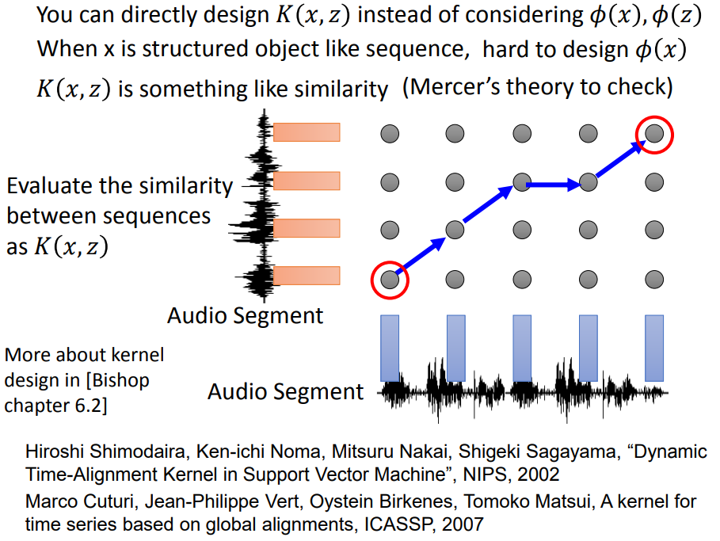

### SVM 与 Deep Learning 的差异

- deep Learning

	feature transformation + linear classifier 。

- SVM

	先将 sample 转换到高维空间，然后使用 linear classifier（一般使用 hinge loss）。

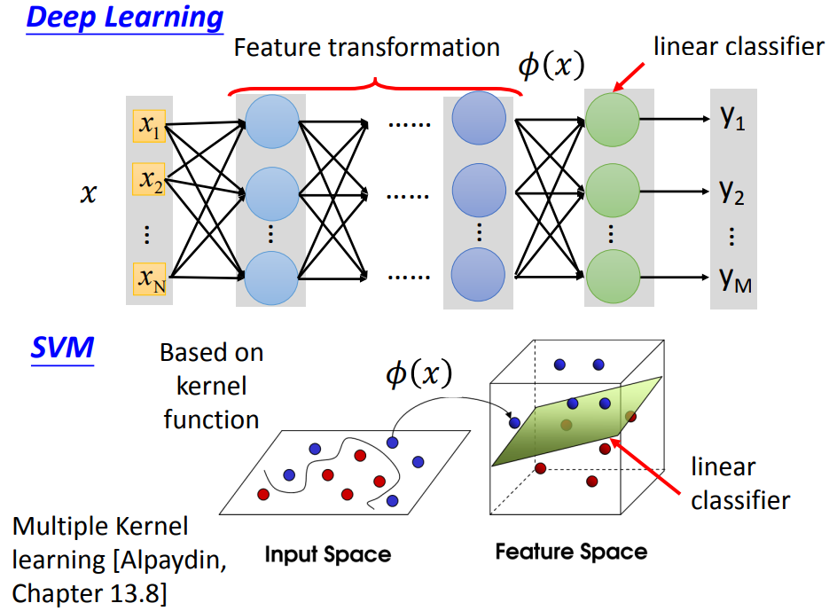
