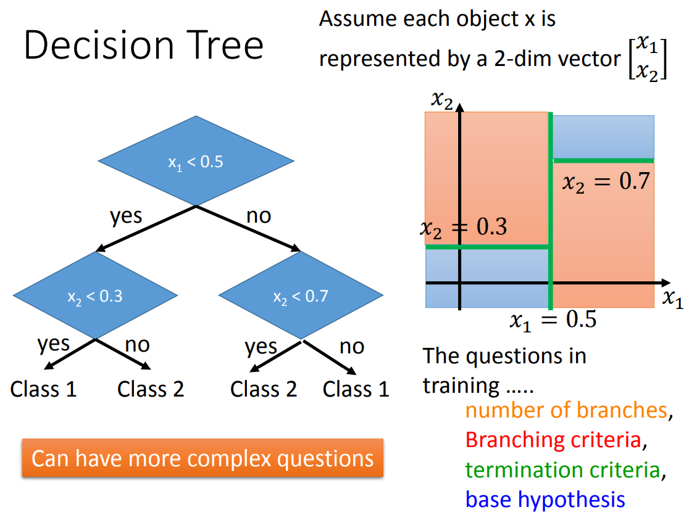

# 决策树

（Decision Tree， DT）

DT 是一个分类算法（分类树），也可以用它做回归（回归树）。

DT 是一个树结构。（不一定是 DAG）

DT 的决策边界是不平滑的。梯度下降产生的决策边界是平滑的。

DT 越深，划分能力越强，也越容易 overfitting 。

DT 是个非常容易 overfitting 的算法，只要结构足够复杂，可以 overfitting 任何数据。

## 推理

一个样本输入 DT 的根结点，然后依据每个分支结点（也叫决策结点）处的条件进行划分，最终到达叶结点，输出叶结点对应的类别。

- 样本含有多个维度的特征，每个结点可以一次对多个维度进行划分。
- 划分条件一般为阈值（一个平行于 x 或 y 轴的直线），也可使用其它函数。

## 构建

1. 构建根结点，设置初步的条件，划分数据。
	- 一般使用信息熵的阈值作为划分条件，使得划分后两个子结点的熵之后最小的阈值即是该分支结点的划分条件。
2. 继续构建分支结点，划分数据。
3. 当数据只含有一类时，设置叶结点。

