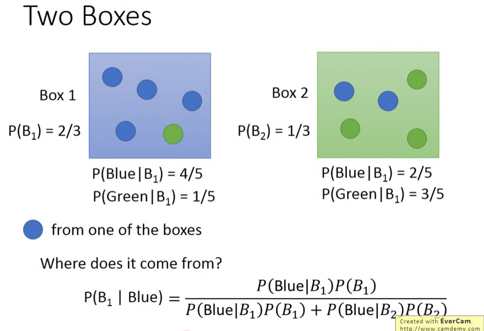
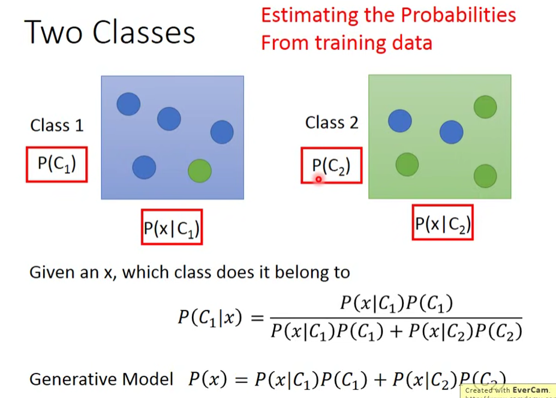
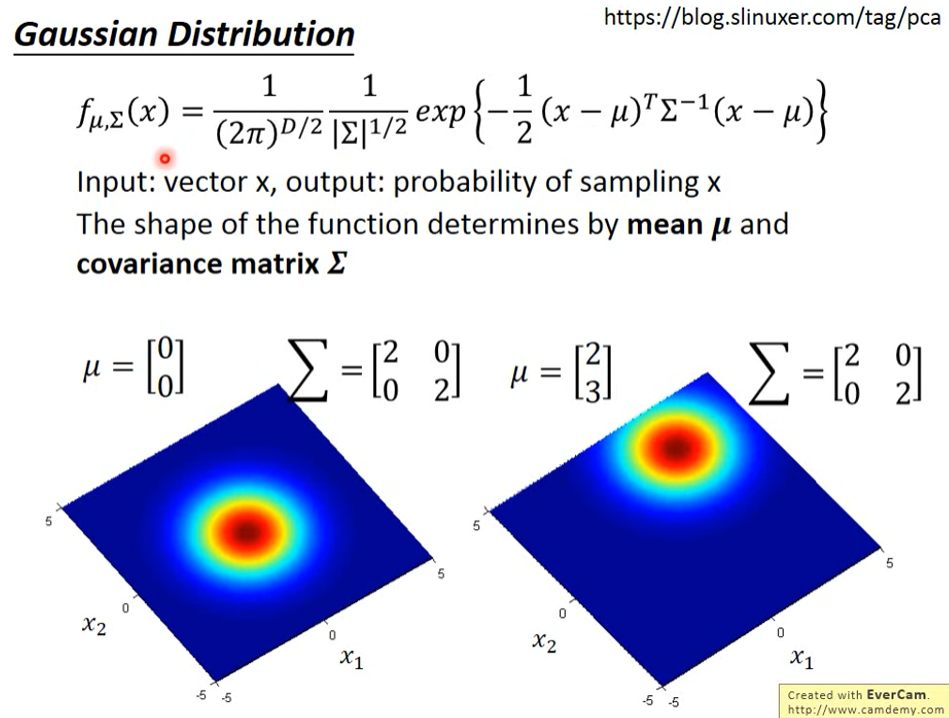
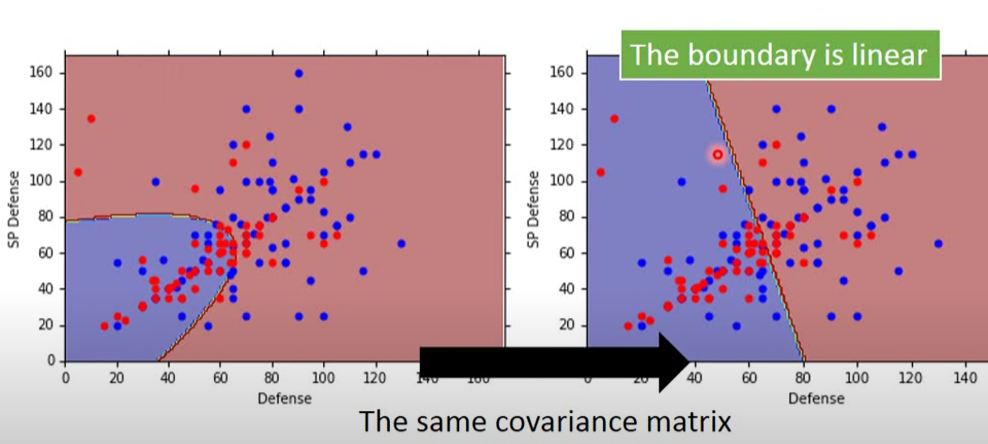

# 贝叶斯

- 先验概率（Prior Probability）

	因果中“果”的发生概率。$P(X)$

- 后验概率（Posterior Probability）

	因果中，在“果”发生后，其是由某个“因”导致的概率。$P(Y|X)$

- 生成模型（Generation Model）

	知道样本产生的几率，能够依据该几率自行生成样本。
	
- 贝叶斯分类（Bayes Classification）

  应用后验概率进行分类。

  - 朴素贝叶斯分类（Naive Bayes Classification）

  	假设特征相互独立。

## 贝叶斯分类

以二分类为例，宝可梦样本空间 $\chi = \{\boldsymbol x_1 \dots \boldsymbol x_n\}$ 含标记，每个宝可梦样本采用两个特征，用特征向量 $\boldsymbol x_i$ 表示。

### 后验概率

对于两个盒子，其中球的分布情况已知，可以得到某个盒子取出某个球的概率，和某个球来自某个盒子的概率。

对于两类，如果两类的情况全部已知，可以得到某类中取出某个样本的概率，和**某个样本归属于某个类的概率**。

### 分布假设

目前我们只有训练集，故只能假设样本在类中的分布情况，即某个类的具有某特征的成员的概率分布，我们假设为高斯分布，特征向量为二维，使用二元高斯分布。

- 高斯分布（Gaussian Distribution）

	即正态分布（Normal distribution）。

- 多元高斯分布（Multivariate Gaussian Distribution）

	即高斯分布的多元形式，一般的正态分布即一元的高斯分布。

多元高斯分布的概率密度函数：
$$
f(\boldsymbol x;\boldsymbol \mu , \boldsymbol \Sigma) = \frac {1} {(2\pi)^{D \over 2} |\boldsymbol \Sigma|^{1 \over 2}} \exp \{- {1 \over 2}(\boldsymbol x - \boldsymbol \mu)^T \boldsymbol \Sigma^{-1}(\boldsymbol x - \boldsymbol \mu)\}
$$

其中，$\boldsymbol \mu$ 是均值（mean）向量，包含各特征的均值， $D$ 是元数，$\boldsymbol \Sigma$  为协方差矩阵（Covariance Matrix）（方阵），其维数与元数一致。（$\Sigma$ 是大写 Sigma，不是累加）

二元高斯分布的概率密度的等高线图为椭圆形：

- $\boldsymbol \mu$ 决定了高斯分布的中心位置。
- $\boldsymbol \Sigma$ 决定了高斯分布的椭圆形状。
- 整个空间都有可能产生样本，只是越靠近中心，概率密度越大。
- 得到 $\boldsymbol \mu , \boldsymbol \Sigma$ 即确定了一个高斯分布。

对于某类的样本点，我们假设它们都是从一个高斯分布中产生的（服从这个高斯分布），只要求得最可能产生这些样本点的分布，就能算出测试数据由某个高斯分布产生的概率，较大的那个即是归属类别。

### 损失函数

$$
L(\boldsymbol \mu , \boldsymbol \Sigma) = \prod\limits_i P(\boldsymbol x_i)
$$

其中，$P(\boldsymbol x_i)$ 代表从该类的高斯分布中产生 $\boldsymbol x_i$ 概率，该类所有样本点被产生的概率即是累乘的结果。实际上，产生该点的概率最大也意味着该点的概率密度最大，可以直接使用概率密度函数，能达到一样的效果：
$$
L(\boldsymbol\mu , \boldsymbol\Sigma) = \prod\limits_i f(\boldsymbol x_i)
$$
我们需要求得某类样本点对应的高斯分布的 $\boldsymbol\mu^*,\boldsymbol\Sigma^* = \arg \max L(\boldsymbol\mu, \boldsymbol\Sigma)$，即求得了该分布，其使得该类的所有样本点由该高斯分布产生的概率最大。

### 求解方法

可使用微分求极值的方法求得，也可直接由公式得到 $\boldsymbol\mu$ 为均值时，$L$ 最大，即：
$$
\boldsymbol\mu^* = {1 \over m} \sum\limits_i^m \boldsymbol x_i \ \ \ \ \boldsymbol\Sigma^* = {1 \over m} \sum\limits_i^m (\boldsymbol x_i - \boldsymbol\mu*)(\boldsymbol x_i - \boldsymbol\mu*)^T
$$
其中 $m$ 为该类样本点的个数。

求得各类对应的高斯分布后，对每个样本点计算其归属于某个高斯分布的概率，最大的即为归属类别（在二分类中，$P(Class_i|\boldsymbol x) \gt 0.5$ 也能说明为归属类别）。

### 示例结果

若效果不好，可考虑升高维度，提升采用的特征数，也可考虑多个高斯分布共用一个协方差矩阵，共用的协方差矩阵可以考虑采用分别的协方差矩阵的加权平均。共用减少了参数，可以一定程度上防止过拟合。

二元情况下，共用协方差矩阵后，决策边界变为了一条直线，模型变为了线性模型。

### 朴素贝叶斯分类

本例中，对于特征向量 $\boldsymbol x = (x_1, x_2 \dots)^T$ ，我们假设它是由多元高斯分布中产生。

若假设这些特征向量的各个维度是相互独立的，即有 $P(\boldsymbol x|Class) = P(x_1|Class)P(x_2|Class) \dots$ ，从而每个特征变为独立的一元高斯分布，协方差矩阵变为对角矩阵。

这种假设各个特征相互独立的贝叶斯分类就是朴素贝叶斯分类。

### 扩展

可做变换：
$$
P(C_1|\boldsymbol x) = \frac {P(\boldsymbol x|C_1) P(C_1)} {P(\boldsymbol x|C_1) P(C_1) + P(\boldsymbol x|C_2) P(C_2)}
= \frac {1} {1 + \frac {P(\boldsymbol x|C_2) P(C_2)} {P(\boldsymbol x|C_1) P(C_1)}}
= \frac 1 {1 + e^{(-z)}}\ \ \ where\ \ z = \ln \frac {P(\boldsymbol x|C_1) P(C_1)} {P(\boldsymbol x|C_2) P(C_2)}
$$
$z$ 可继续变换，中间的 $P(\boldsymbol x|C_1),P(\boldsymbol x|C_1)$ 使用分布进行变换，共用协方差矩阵后，最终结果可用新的参数表示，即有：（$\boldsymbol {w,x}$ 都是向量）
$$
P(C_1|\boldsymbol x) = Sigmoid(z) = Sigmoid(\boldsymbol{ \boldsymbol w^T \boldsymbol x} + b)
$$
本例是使用高斯分布，使用**其它分布时也能变换出类似的结果**。

实际上，不必再计算出具体分布的参数，可以直接计算 $\boldsymbol w, b$ ，从而变换为**逻辑回归（Logistic Regression）**问题。