# 基本概念

## 常用平台

- [Kaggle](https://www.kaggle.com)

	数据科学竞赛社区，提供数据，测评，云端 Jupyter 环境，竞赛。

- [Colab](https://colab.research.google.com)

	提供云端 Jupyter 环境。

## 符号约定

不同人有不同的书写习惯，以下对本人的书写习惯中易混淆点作简要介绍。

- 向量与矩阵
	- 第 $i$ 个向量：$\boldsymbol v_i$（向量加粗） 
	- 第 $i$ 个向量的第 $j$ 个分量：$v^{(i)}_j$ （标量不加粗）
	- 第 $i$ 个矩阵：$\boldsymbol M_i$（矩阵加粗） 
	- 第 $k$ 个矩阵的第 $i,j$ 个元素：$m^{(k)}_{ij}$ （标量不加粗）
	- 存在导数时，上标 $v^{(i)}$ 可换为 $v^{[i]}$ 。

## 领域划分

粗略的大概划分，各领域大量具有交叉。

- 数据科学（Data Science）

  数据相关的解决问题的方法都可以归纳到数据科学中。

  - 数据分析（Data Analysis，DA）

    对数据进行分析，寻找数据表现与现实现象的关系。

  - 数据挖掘（Data Mining，DM）

    挖掘数据中蕴含的信息。

  - 商业智能（Business Intelligence，BI）

    使用数据科学方法在商业领域创造商业价值，主要是应用数据可视化（Data Visualization）技术。

  - 模式识别（Pattern Recognition，PR）

    通过已有特征去训练机器，从而识别模式（认识事物）。模式识别相当于早期的机器学习，也可以认为模式识别是机器学习的目的。

  - 人工智能（Artificial Intelligence， AI）

    数据科学中的一个领域。它是研究、开发用于模拟、延伸和扩展人的智能的理论、方法、技术及应用系统的一门新的技术科学。

    - 机器学习（Machine Learning，ML）

      一种实现人工智能的方法，通过机器提取特征，并学习，以便认识事物。
  
      - 传统机器学习
  
        当今机器学习领域中深度学习最热门，可将以前的机器学习方法称为传统或经典机器学习。
  
      - 深度学习（Deep Learning，DL）
  
        应用神经网络解决问题。
  
      - 监督学习（Supervised Learning）
  
        训练数据需要标签。
  
      - 无监督学习（Unsupervised Learning）
  
        训练数据不需要标签。
      
      - 强化学习（Reinforcement Learning，RL）
      
        交互反馈式训练数据。

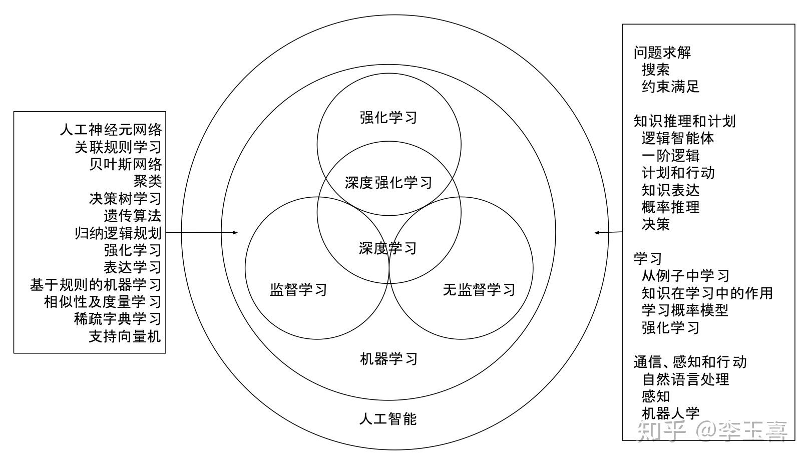

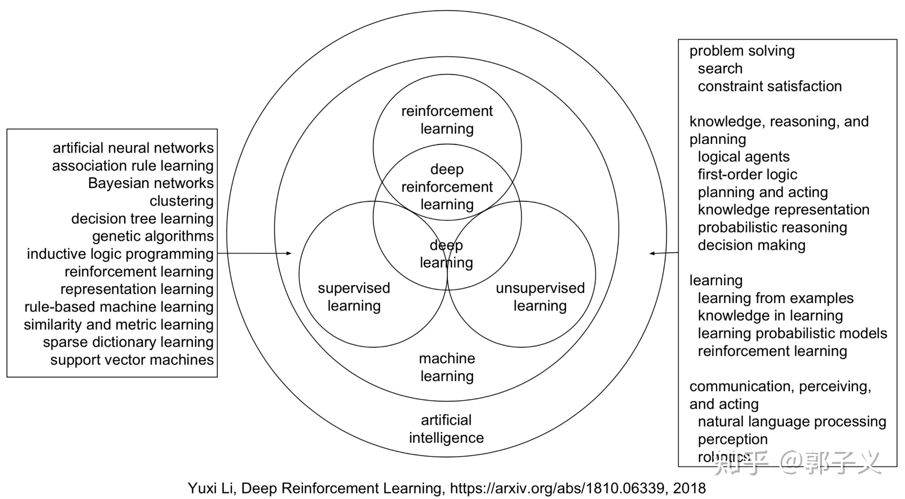

## 数据概念

- 记录（Record）、示例（Instance）、样本（Sample）

	对于一个事件或对象的描述。

- 属性（Attribute）、特征（Feature）

	事物在某方面的表现。

- 模式（Pattern）

	事物多个特征的组合，一组特征。

- 属性值（Attribute Value）

	用于体现属性的取值。

- 标记（Label）

	某些属性对应的正确结果。

- 目标（Target）

	要预测的目标。

- 样例（Example）

	拥有了标记信息的示例。若将标记看作属性，则**样例（Example）**等同于样本（Sample）。

- 维数（Dimensionality）

	一个事物所含属性的个数。

- 特征向量（Feature Vector）

	描述一个事物的多个特征或属性的多维的坐标向量。

- 分布（Distribution）

	样本空间中全体样本可能服从的某种规律。

- 独立同分布（Independent and Identically Distributed，简称 $i.i.d.$ ）

	我们获得的每个样本都是独立地从某个样本空间的分布上采样获得的，这样的采样过程即独立同分布。

---

- 训练集（Training Set）

  训练样本组成的集合。

- 验证集（Validation Set）

	用于正式测试前调整超参数的数据集。

- 测试集（Testing Set）

	测试数据的集合。
	
	- 公有测试集（Public Testing Set）
	
		一般意义的用于测试模型的测试集。
	
	- 私有测试集（Private Testing Set）
	
		实际应用场景中的测试数据。

---

- 假设（Hypothesis）

  满足输入输出的某种可能的映射（即模型），其对应了关于数据的事物的某种可能的规律。

- 模型（Model）

  对事物规律的一种描述，对事物规律的一种假设。

- 真相、真实（Ground-truth）

  事物的真正的潜在的规律，常指 Label 。

- 预测（Prediction）

  由已知事物推导出其它事物的过程。

- 学习（Learning）、训练（Training）

  从数据中学得模型的过程，通过某个算法实现。

- 验证（Validation）

  对模型进行验证，以便于调整模型。

- 测试（Testing）

  测试模型的最终效果。
  
- 推断（Inference）

  一般与 testing 等价使用。

---

- 标记空间（Label Space）

  标记的集合。

- 特征空间（Feature Space）

  所有特征向量的集合。

- 属性空间（Attribute Space）、样本空间（Sample Space）、输入空间（Input Space）

  所有属性、样本、输入数据的集合。

- 输出空间（Output Space）

  预测结果的集合。

- 假设空间（Hypothesis Space）

  所有对事物规律的假设（模型）的集合。

  - 可以把学习过程看作一个在假设空间中寻找与训练集相**匹配（Fix）**的某些假设的过程。

  - 假设的表示一但确定，假设空间及其规模也就确定了。

- 版本空间（Version Space）

  现实问题中常面临很大的假设空间，但学习过程是基于**有限样本数据集（Finite Sample Data Set）**进行的，因此可能有多个假设与训练集一致，由这些假设组成的的假设集合即**版本空间**。

---

- 归纳（Induction）

	从特殊到一般的**泛化（Generalization）**过程，即从具体事实总结出一般性规律。

- 演绎（Deduction）

	从一般到特殊的**特化（Specialization）**过程，即从基础原理推导出具体状况。

- 归纳学习（Inductive Learning）

	从样例中学习的过程。

	- 广义上

		即指从样例中学习。

	- 狭义上

		指从训练数据中学得**概念（Concept）**，因此又称**概念学习（Concept Learning）**或**概念形成（Concept Formation）**，最基本的概念学习是**布尔概念学习（Bool Concept Learning）**，即对“是”或“不是”的目标概念的学习。

- 归纳偏好（Inductive Bias）

	机器学习算法在学习过程中对某种假设的偏好。

- 健壮性（鲁棒性，Robustness）

	训练数据出现偏差或异常（扰动）不会对模型效果造成太大影响。

- 泛化（Generalization）能力

	学得的模型适用于训练集以外的样本（即新样本）的能力。

- 奥卡姆剃刀（Occam's Razor）

	一种基本原则，即“若有多个假设与观察一致，选最简单那个”。

- NFT 定理（No Free Lunch Theorem）

	在非特定条件下，任意两个算法间的期望性能相等。这说明衡量算法优劣时，必须要针对具体的学习问题。

## 常见任务

- 分类（Classification）

  预测**离散值（Discrete Value）**的学习任务。

  - 二分类任务（Binary Classification）

  	只涉及两个类别的分类任务。通常其中一个称为**正类（Positive Class）**，一个称为**反类（Negative Class）**。

  - 多分类任务（Multi-class Classification）

  	涉及多个类别的分类任务。
  	
  - 多标记学习（Multi-label Learning）

    对一个样本归多个类，即打上多个标签的分类任务。

- 回归（Regression）

  预测**连续值（Continuous Value）**的学习任务。

- 聚类（Clustering）

  将训练集中的样本分为若干组，每一组叫一个**簇（Cluster）**，这些自动形成的簇可能对应一些事物内在的划分特征。

- 结构学习（Structured Learning）

  让机器生成有结构的事物，比如图片，文档。
  
- 输入数据

  - 向量（Vector）

  - 矩阵（Matrix）

    例如一张图片。

  - 序列（Sequence）

    例如一段表示语音信号的数字，一段文本。

- 输出数据

  - 标量（Scalar）

  - 类别（Class）

  - 结构化文件（Structured Document）

    例如文本（Text）和图像（Image）。

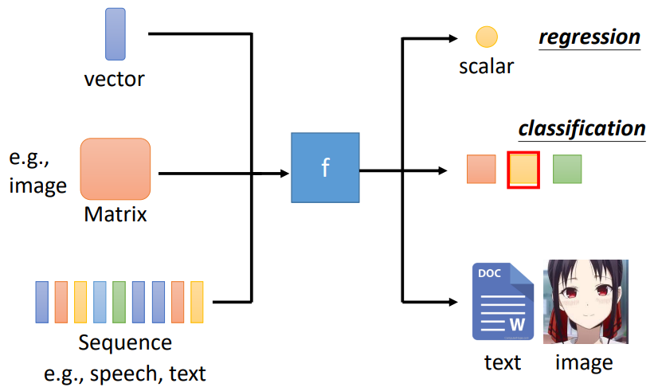

## 模型分类

机器学习的各类模型的演示一般是在低维情况演示，看起来好像可以用肉眼直接得出结果，但机器学习主要是要解决高维情况的复杂问题。一定要学会在高维度的情况里理解区分它们，这样才能体会出机器学习模型的强大之处。

### 基本分类

- 监督学习（Supervised Learning）（被动学习）

  训练数据拥有标记的学习任务。以**分类**和**回归**为代表的。
  
  - 判别模型（Discriminative Model）
  
  	通过学习特征预测输出。
  
  - 生成模型（Generative Model）
  
  	通过学习特征的分布预测输出。

- 无监督学习（Unsupervised Learning）

  训练数据没有标记的学习任务。以**聚类**为代表。

- 半监督学习（Semi-supervised Learning）

  含有少量标注数据，大量未标注数据，利用未标注数据的信息辅助标注数据，减少数据标注的工作量。

- 自监督学习（Self-supervised Learning)

  不需要标签，在无监督学习中学习数据的特性，然后应用在其它监督学习任务上。
  
- 主动学习（Active Learning）

  机器主动选出对学习最有帮助的实例请求标注，以较小的标记代价达到较好的效果。

### 按模型属性分类

- 是否概率

	- 概率模型（Probabilistric Model）

		模型取条件概率分布形式 $P(y|x)$ 。

	- 非概率模型（Non-probabilistric Model）或确定性模型（Deterministic Model）

		模型取函数形式 $y = f(x)$ 。

- 是否线性
	- 线性模型（Linear Model）
	- 非线性模型（Non-Linear Model）

- 是否参数

	- 参数化模型（Parametric Model）

		模型维度固定。

	- 非参数化模型（Non-Parametric Model）

		模型维度不固定或无限。

### 按学习方式分类

- 在线学习（Online Learning）

	逐步接受数据进行训练。

- 批量学习（Batch Learning）

	一次性接受数据进行训练。

### 按学习技巧分类

- 贝叶斯学习（Bayesian Learning）也叫贝叶斯推理（Bayesian Inference）

	利用贝叶斯定理。

- 核方法（Kernel Method）

	利用核函数。
	
- 迁移学习（Transfer Learning）

	在某个领域或任务上学习到的知识或模式应用到不同但相关的领域或问题上。

## 机器学习

- 领域知识（Domain Knowledge）

  特定学科专业的知识。根据具体任务的不同，常常需要涉及到不同领域的知识。

- 未知参数（Unknown Parameter）

  需要模型求出的未知参数。

- 超参数（Hyperparameter）

  模型中自行设定值的参数。常会根据实际经验调整其取值。

- 损失函数（Loss Function，$L$）

  衡量模型预测结果与实际结果差异的函数。

- 损失表面（Error Surface）

  可通过观察曲线的表面分析少量参数的不同取值的损失情况。

- 最优化（Optimization）

  寻找使损失函数最小的参数取值的过程。

- 变元（Argument，自变量）

  $\arg \min\limits_{x,y} L$ 表示使 $L(x,y)$ 最小的参数 $x, y$ 的取值。

- 梯度下降（Gradient Descent）

  对损失函数求微分偏导进行最优化的一种方法。

  - 学习率（Learning Rate）

  	即学习速率，控制梯度下降的速率，是一个超参数，常作为偏导数的系数。
  	
  - 局部最优解（Local Optimum）局部最小值（Local minimum）（minimum 的复数为 minima）

    - 有很多手段可以尽量避免局部最优解。
    - 实际环境中，因为参数众多，不容易出现局部最优解的情况。
    - 即便是全局最优解，也会有数据集量级等因素影响模型性能。

  - 全局最优解（Global Optimum）全局最小值（Global minimum）

- 模型偏差（Model‘s Bias）

	模型结果与事物真实情况的偏差。
	
- 过拟合（Overfitting）

  模型缺乏泛化能力，学习到了无关因素，在训练集上表现好，在测试集上表现差。

- 欠拟合（underfitting）

  模型没有学习到事物的规律，不能很好地预测事物。

## 深度学习

基于李宏毅老师预测频道观看人数的例子。

初步使用的线性模型精度容易不够，考虑增加其参数，变为非线性。

- 激活函数（Activation Function）

	激活函数应当易于求导。

### 激活函数 Sigmoid

将所有的蓝色曲线相加即可得到红色的曲线（注意转角位置与斜率关系），当累加的蓝色的曲线足够多，就能得到任何的红色曲线：

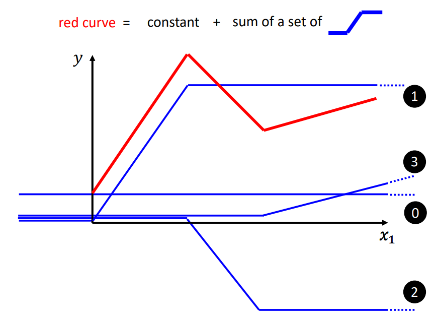

蓝色曲线表示的函数（Hard Sigmoid）不易写出，可用 **Sigmoid 函数**（意为 “S 形的函数”）近似，而 Sigmoid 函数中最常用的就是**对数几率函数（Logistic Function）**：
$$
Logistic : f(x) = \frac {1} {1 + e^{-x}}
$$
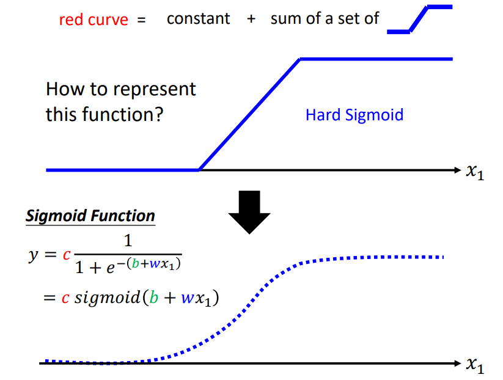

为 Sigmoid 函数添加参数（$c,b,w$），即可通过调整参数的值达到改变函数形态的目的：

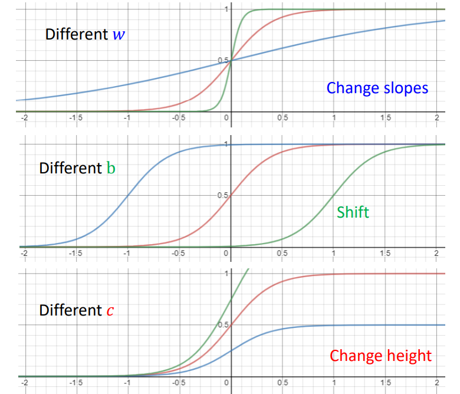

从而用于累加出我们想要的更复杂的曲线：

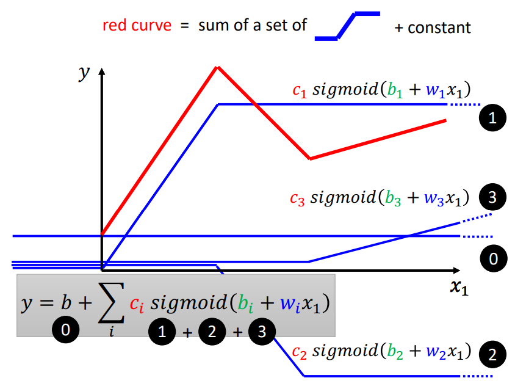

为了提升模型精度，我们将线性函数改为了 Sigmoid 函数，接着不是只利用前一天的数据，而改为利用前 $j$ 天的数据：

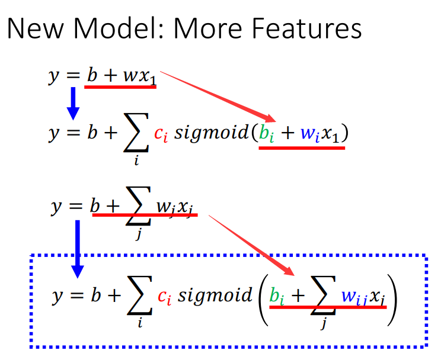

### 计算结构

将 Sigmoid 函数的自变量部分表示为 $r$，蓝色虚线框所示：

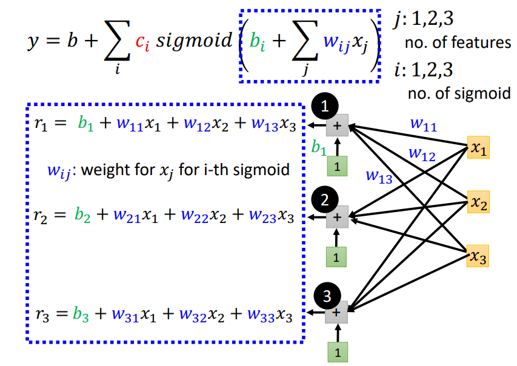

$r$ 的计算可写为矩阵形式：

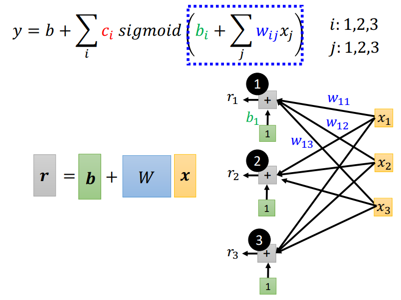

将 $r$ 输入激活函数 Sigmoid ，得到 $a$ ，蓝色虚线框所示：

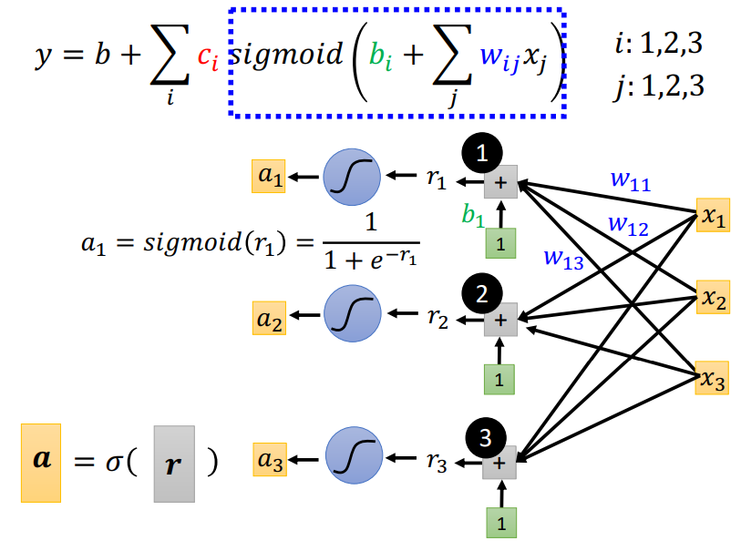

将 $a$ 进一步处理，蓝色虚线框所示：

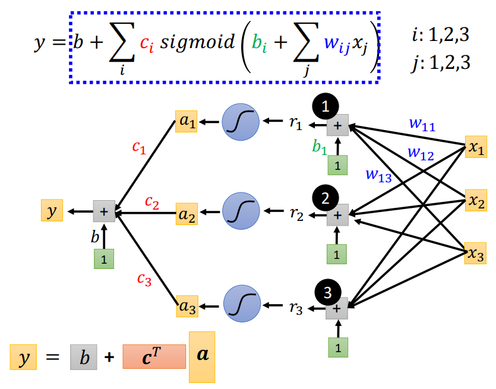

全流程如下：（这是一个**单层神经网络**，含有一层隐藏层）

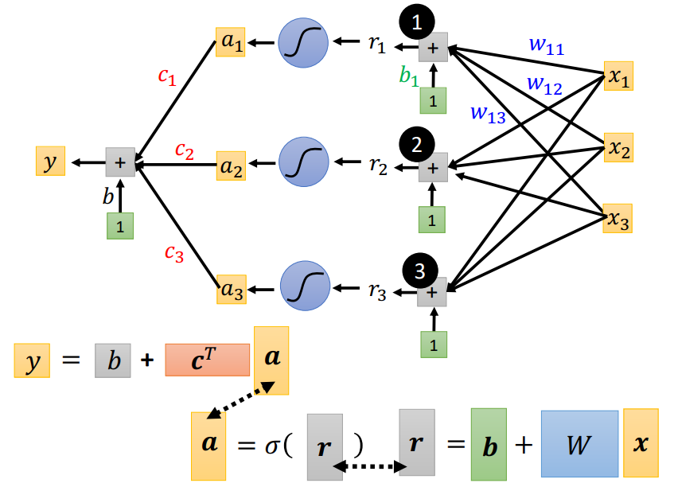

即：

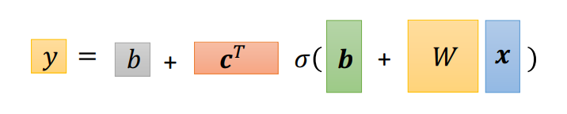

整个从输入参数得到输出参数 $\boldsymbol y$ 的计算过程即是**正向传播（Forward Propagation / Forward Pass）**。

### 梯度下降

将所有未知参数放到一起，用一个向量 $\boldsymbol { \theta }$ 表示：

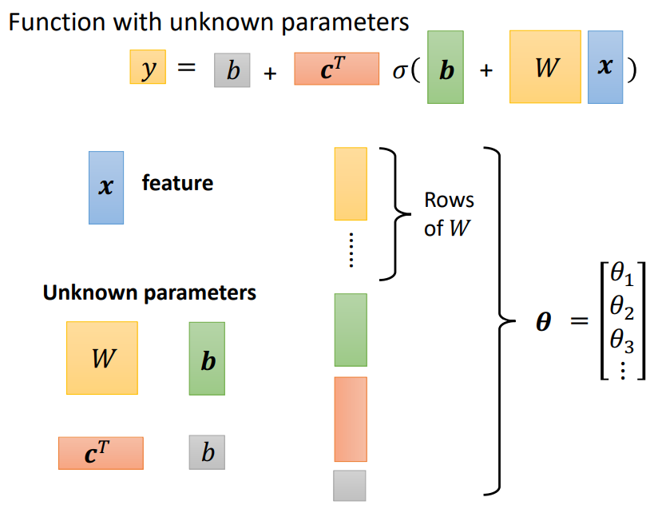

新的模型的损失函数：

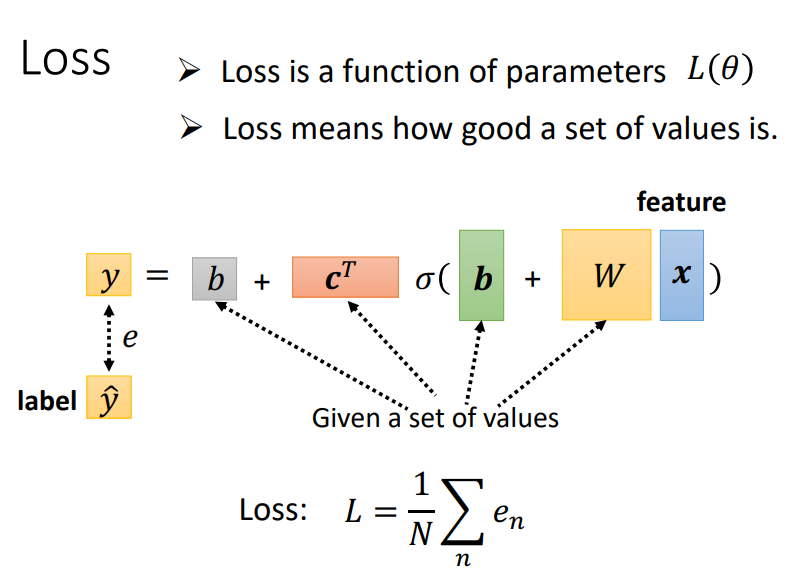

对新的损失函数进行最优化，若采用梯度下降：

1. 随机选取一个初始值 $\boldsymbol\theta^0$ 。
2. 对全部参数求偏导 $\boldsymbol g = \nabla L(\boldsymbol \theta^i),\boldsymbol \theta^{i+1} = \boldsymbol \theta^i - \eta \boldsymbol g$ 。
3. 不断重复迭代，直到设定次数停止或结果无法继续求偏导。

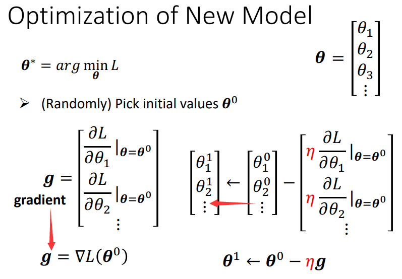

梯度下降更新参数的过程亦称**反向传播（Backpropagation）**。

### 激活函数 ReLU

**线性整流函数（Linear Recitification Function）**，又称**修正线性单元（Rectified Linear Unit，ReLU）**。
$$
ReLU: f(x) = \max (0, x)
$$
两个 ReLU 可合成一个 Hard Sigmoid ：

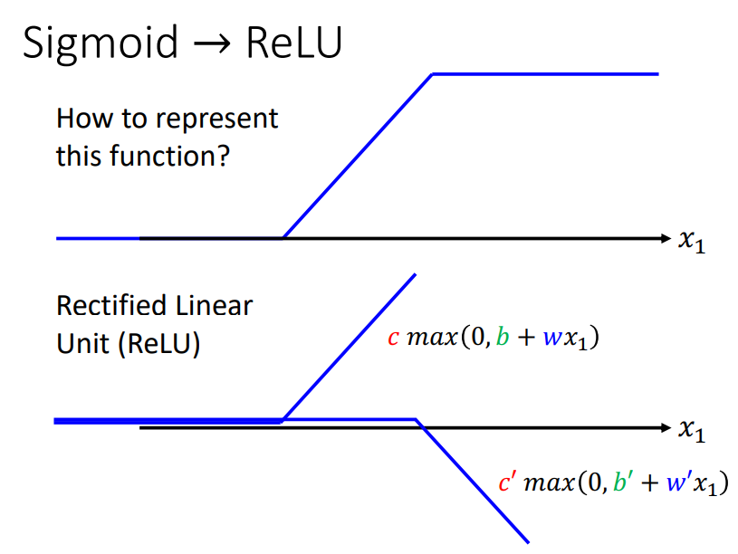

将模型中的一个 Sigmoid 替换为两个 ReLU ：（单层神经网络的隐藏层加宽为原来的两倍）

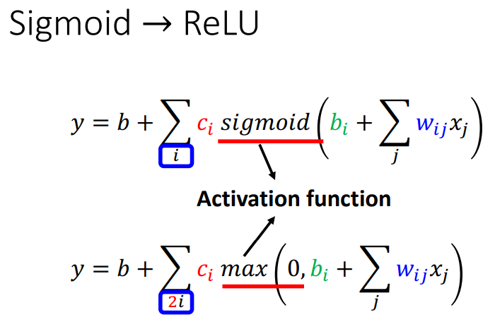

激活函数主要为神经网络引入非线性因素，而 ReLU 是具有非线性逼近能力的函数。（分段函数是非线性函数）

### 神经网络

- 神经元（Neuron）

- 神经网络（Neural Network，NN）

- 层（Layer）

	某一级的所有神经元。

- 输入层（Input Layer）

- 隐藏层（Hidden Layer）

	神经网络的层数以隐藏层的数量称呼。

- 输出层（Output Layer）

- 深度学习（Deep Learning）

	有许多隐藏层。

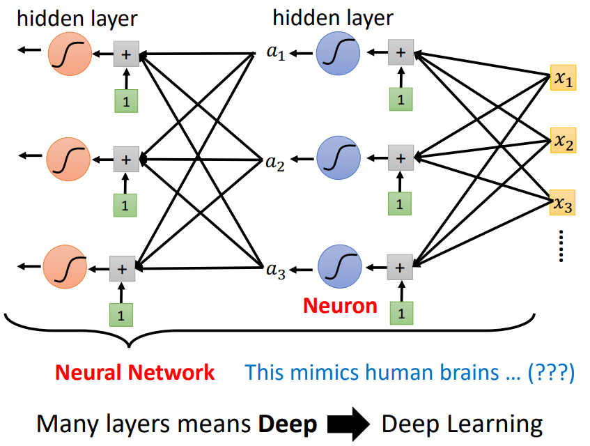

## GPU 加速

- GPU（Graphics Processing Units，图像处理单元，图形处理器）

- TPU（Tensor Processing Unit，张量处理单元，张量处理器）

	TPU 是 Google 开发的专用于机器学习训练的芯片。
	
- CUDA

  由英伟达（NVIDIA）开发的用于自家 GPU 加速的并行计算框架，CUDA 只支持 NVIDIA 的显卡。

GPU 一般用于图像应用的计算，但其适合进行并行的简单而重复的运算（例如矩阵运算）的特性，使得 GPU 能够提升 ML 模型的训练速度。

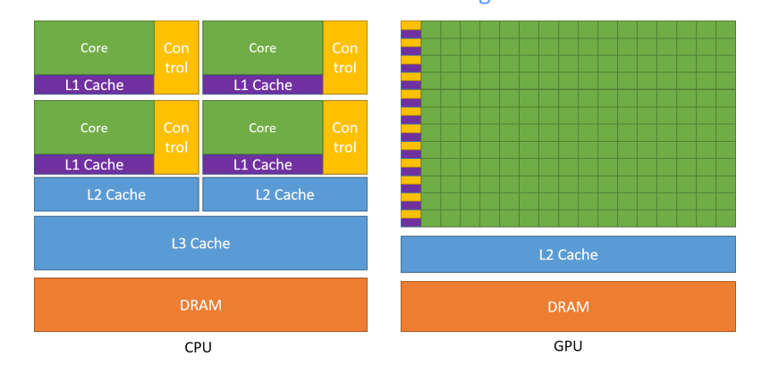

GPU 有更多的核心（Core），包含更多的算术运算单元（ALU），比 CPU 更适合大规模的并行浮点运算。

训练模型时，CPU 会把更适合用 GPU 运算的部分交给 GPU 运算。
