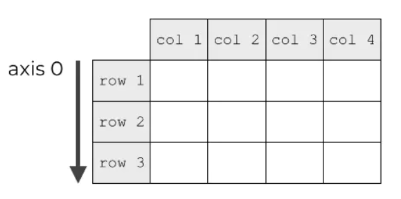
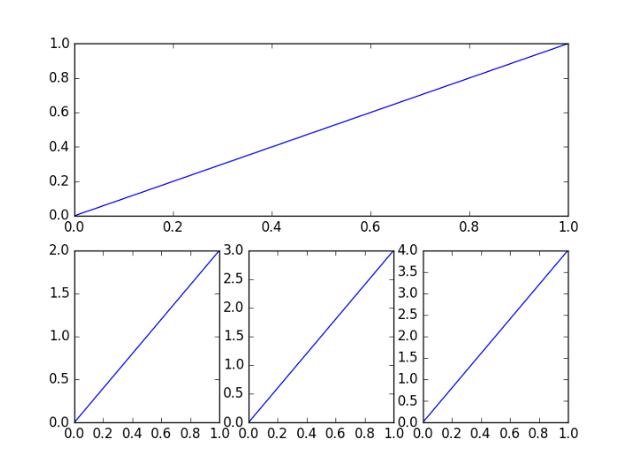
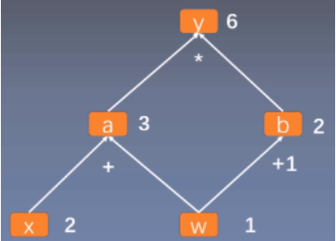

# 常用包与框架

只记录基本和关键的知识，更多知识应当多读官方文档。

## 类型转换

- 在不同库和框架间切换时，要注意数据类型的转化。
  - Python 列表（List）包含数据和原生类方法。
  - NumPy 多维数组（Ndarray）包含数据和扩展的类性质类方法。
  - Pandas
    - 数据序列（Series）包含数据和（行）标签
    - 数据表（DataFrame）包含数据和行列标签。
  - PyTorch
    - 张量（Tensor）包含数据和扩展的类性质类方法。
    - 计算图变量（Variable）包含 Tensor 和梯度信息。

注意依据具体问题随时搜索相关内容。

一般 Series 和 DataFrame 要先转化为 Ndarray 再转化为 Tensor，反之也要经过 Ndarray，所以一般使用以 Ndarray 为主。

```python
# List Series DataFrame Tensor
# to
# Ndarray
np.array()

# List Dictionary Ndarray Tensor
# to
# Series DataFrame
pd.Series()
pd.DataFrame()

# List Ndarray
# to
# Tensor
torch.Tensor()
torch.FloatTensor()

# extract values to Ndarray
Series.values
DataFrame.values

# Variable
# to
# Tensor
Variable.detach()   # 仍然是 Tensor ，阻断梯度传播。

# Ndarray Tensor
# to
# List
xxx.tolist()   # 不再是 Tensor ，存储位置转到 CPU 。

# one element Ndarray
# one element Tensor
# to
# a value
xxx.item()   # 不再是 Tensor ，存储位置转到 CPU 。
```

## NumPy

- [NumPy 官网](https://numpy.org/)

一个开源的 Python 语言扩展程序库。

- 底层大量基于 C 语言。
- 支持多维数组与矩阵的快速运算。

### 基本概念

- np

	常用别名。`import numpy as np`

- Ndarray

	多维数组类型，常简称 array 。NumPy 的数组只能包含相同类型的元素。

### Ndarray

#### 基本概念

- axis

  轴，也即维度（Dimension）。

  - 相当于坐标轴的“轴”，用于定位数据在多维空间中的位置。
  - 沿第几个轴计算即沿数组第几个下标增加的方向计算。`e.g. arr[axis = 0][axis = 1]`

- rank

  秩，轴的数量，也即维度的数量。

- shape

  `.shape` 属性。

  - shape 的长度是维度个数 ，等于`.ndim`。
  - shape 的数字是各维度长度，即各维度数据个数。

- 二维数组

  - `axis = 0` 代表行增加的方向，亦列伸展的方向。
  - `axis = 1` 代表列增加的方向，亦行伸展的方向。



- 三维数组

  `axis = 2` 代表立方体的第三个轴方向，即平面增加的方向。

- 多维数组

  考虑将低维的数组抽象为单个整体元素，再按三维或二维数组思考。


#### 维度变换

将一堆数据划分维度时，要从最后一个维度开始，从后往前逐步抽象为整体，以确定各维度的长度：

```python
# 将 1, 2, 3, 4, 5, 6, 7, 8, 9, 10, 11, 12 划分为：(2, 2, 3)

# 长度都是 3
[1, 2, 3] and [4, 5, 6] and [7, 8, 9] and [10, 11, 12]

# 长度都是 2
[[1, 2, 3], [4, 5, 6]]   # as A
and
[[7, 8, 9], [10, 11, 12]]   # as B

# 此时最后一维已经自动划分好长度。
[
[[1, 2, 3], [4, 5, 6]]
,
[[7, 8, 9], [10, 11, 12]]
]

# 排列一下形式
[ [ [1, 2, 3], 
    [4, 5, 6] ]，
 
  [ [7, 8, 9], 
    [10, 11, 12] ] ]

# 亦为
[A, B]
```

#### 存储结构

Ndarray 与 C 语言的多维数组存储方式一致，都使用一块连续的内存和索引方案，但 Ndarray 的索引方案更灵活。

以数据类型为 `int32`（4 字节）的二维数组 $A$ 为例：
$$
A = \begin{bmatrix}
0 & 1 & 2 & 3 \\
4 & 5 & 6 & 7 \\
8 & 9 & 10 & 11 \\
12 & 13 & 14 & 15 \\
\end{bmatrix}
$$
其 $shape = (4, 4), itemsize = 4$ ，从而可以计算出其跨度列表 $strides = [16, 4]$ 。

若访问 `A[2][1]`，内存的地址解析为：$\&A[2][1] = A + 2 \times strides[0] + 1 \times strides[1] = A + 36$ ，即元素 $9$ 。

其中，$N$ 维 Ndarray 的跨度列表 $strides$ 的计算方式为：
$$
strides[k] = \begin{cases}
itemsize \times \prod\limits^{N-1}_{j = k + 1} shape[j], k = 0, \cdots, N-2 \\
itemsize, k = N - 1
\end{cases}
$$

### 构建数组

```python
np.array()
	依据参数创建一个 Ndarry 对象，可用于掌握转化。
np.asarray()
	转换为一个 Ndarry 对象。
ndarray.copy()
	创建一个副本。

np.empty()
	创建一个未初始化的空数组。
np.zeros()
	创建元素全为 0 的数组。
np.ones()
	创建元素全为 1 的数组。
np.identity()
	创建单位数组
np.eye()
	创建单位数组
# 可创建维度长度为 0 的数组，做为某些操作初始。

np.arange(start, stop, step, dtype)
	生成数组
np.linspace()
	创建等差数列数组
np.logspace()
	创建等比数列数组
```

### 切片索引

与 Python 一致，但 NumPy 可设置切片对象 slice 。

```python
np.slice()
	创建切片对象


in:
a = np.array([[1,2,3], [3,4,5], [4,5,6]])  
print (a[...,1])   # 第 2 列元素
print (a[1,...])   # 第 2 行元素，后部的 ... 可省略
print (a[...,1:])  # 第 2 列及剩下的所有元素

out:
[2 4 5]
[3 4 5]
[[2 3]
 [4 5]
 [5 6]]
```

### 高级索引

NumPy 提供了比 Python 更多的索引方式。	

- 整数索引

	用两个数组分别表示行下标和列下标。

- 布尔索引

	可使用布尔数组或布尔运算筛选数据。如 `arr[x > 5]` 将索引出所有大于 $5$ 的元素。

- 花式索引

	索引出元素对应的整个轴的数据。

### 广播

（Broadcast）

当两个形状不同的数组相互运算时会触发广播机制。

- 将各维度的长度的较大值作为结果数组的各维度的长度。
- 当每个对应维度的长度相等或有一个长度为 $1$ 时才能正确运算。
- 运算结果会将形状较小的数组的数据进行重复，从而使每个对应维度扩充到相等长度才运算。

### 数组操作

```python
np.reshape()
	不改变数据修改形状。
np.flat
	数组元素迭代器，逐元素迭代。 for x in ndarray.flat:
np.flatten()
	将数组展平为一维数组，返回拷贝。
np.ravel()
	将数组展平为一维数组，作为原数组的视图。


形状变换
np.transpose()
	对换指定的轴，若不指定参数，则对换所有轴，相当于转置。
ndarray.T
	转置
np.rollaxis()
	将指定轴移动。
np.swapaxes()
	对换数组的轴。
np.squeeze()
	去除长度为 1 的维度。
np.resize()
	改变数组的形状，返回副本，当新形状比原形状大时，会出现元素重复。


借助广播变换形状
np.broadcast(arr1, arr2)
	返回两个数组的广播结果。
np.broadcast_to()
	将一个数组广播到指定的形状，返回只读视图。
np.expand_dims()
	在某一个轴的位置增加一个维度，长度为 1 。


连接数组
np.concatenate()
	将数组在指定维度上连接（指定维度外形状相同），不增加维度，只增加维度长度。
np.stack()
	将数组的指定维度在新的维度上连接（相同形状），不增加维度长度，增加维度。


分割数组
np.split()
	传入一个整数，表示划分子数组的大小。
    传入一个数组，表示每个划分子数组的最后一个元素的位置，用以指示分割点。
    
    
元素修改
np.append()
	在指定维度末尾增加元素，不指定轴会返回一维数组。
np.insert()
	在指定维度的指定位置插入元素，不指定轴会返回一维数组。
np.delete()
	删除元素，不指定轴会返回一维数组。
np.unique(arr, return_index = false, return_inverse = false, return_counts = false)
	返回去重后的列表。
	return_index : 额外返回新列表元素在旧列表中的下标。
	return_inverse : 额外返回旧列表元素在新列表中的下标。
    return_counts : 额外返回去重数组中的元素在原数组中的出现次数。
```

### 字符串

可对字符串或字符串列表进行操作。

```python
np.char.add()
	对两个字符串数组逐个对应连接。
np.char.mutltiply()
	返回将字符串重复指定次后的字符串。
np.char.center()
	返回指定长度的将指定字符串居中，两边以指定字符填充的字符串。
np.char.capitalize()
	将字符串的首字符转换为大写。
np.char.title()
	将每个单词的首字符转换为大写。
np.char.lower()
	转换为小写。
np.char.upper()
	转换为大写。
np.char.split()
	指定分隔符对字符串进行分割，返回数组。
np.char.splitlines()
	返回字符串中的行列表，以换行符分割。
np.char.strip()
	移除字符串开头或结尾的特定字符。
np.char.join()
	指定分隔符连接数组中的元素。
np.char.replace()
	替换字符串中的所有相应子字符串。
```

### 数学

```python
sin() cos() tan()
around()
floor()
ceil()

np.reciprocal()
	返回逐元素的倒数。
np.power()
	返回对应各元素的幂。
    可传入两个数组，前一个指定各底数，后一个指定各幂次。
np.mod() np.remainder()
	返回对应元素取余后的余数。
    可传入两个数组，前一个指定各被除数，后一个指定各除数。
   

np.max() np.min()
	返回沿指定轴的最大最小值。
np.ptp()
	返回沿指定轴的最大最小值之差（极差）
np.percentile()
	返回指定的百分位数。
np.median()
	返回中位数。
np.mean()
	返回算术平均值。
np.average()
	返回指定权值（加权）的算术平均值。
np.std()
	返回标准差。
np.var()
	返回方差。
```

### 额外库

- `numpy.matlib`

	矩阵库。

- `numpy.linalg`

	线性代数库。

## Matplotlib

- [Matplotlib 官网](https://matplotlib.org/stable/index.html)

	其中的 Example 模块可做图形检索，复制代码。

一个开源的绘图库，可以绘制静态，动态，交互式图表。

### 基本概念

- Pyplot

  Pyplot 是 Matplotlib 的子库，提供了和 MATLAB 类似的绘图 API ，用以绘制 2D 图形。

- plt

	Pyplot 的常用别名 。`import matplotlib.pyplot as plt`

- Axes3D

	3D 绘图模块，包含了 3D 绘图需要用到的接口。`from mpl_toolkits.mplot3d import Axes3D`

### 基本函数

```python
plt.figure()
	定义一个图形窗口。
plt.plot()
	画出图形
plt.show()
	显示图像
    
    
plt.xlabel() plt.ylabel()
	横纵坐标标签。
plt.xlim() plt.ylim()
	横纵坐标轴范围。
plt.xticks() plt.yticks()
	横纵轴刻度以及刻度标签。
    刻度标签可使用 LaTeX 数学公式。
plt.legend()
	图例，需要在 plot 中设置曲线的 label 属性。
    
    
plt.annotate()
	添加特殊标注。
plt.text()
	添加文本注释。
```

### plot 函数

```python
plot([x], y, [fmt], label="")
	单条线
plot([x1], y1, [fmt1], [x2], y2, [fmt2])
	多条线

color
	颜色

marker
	点形
    
linestyle
    线形
    
fmt
	组合参数
	fmt = "[color][marker][linestyle]"

可向 plot 指定起点和终点坐标，从而画出一条任意直线。
```

常用颜色：

| 参数 | 颜色                          |
| ---- | ----------------------------- |
| g    | 绿（green）                   |
| b    | 蓝（blue）                    |
| r    | 红（red）                     |
| y    | 黄（yellow）                  |
| k    | 黑（black）（b 已被蓝色占用） |
| w    | 白（white）                   |

常用点型：

| 参数 | 点型 |
| ---- | ---- |
| `.`  | 点   |
| `o`  | 圆心 |
| `*`  | 星形 |
| `x`  | 叉形 |
| `|`  | 竖线 |
| `_`  | 横线 |

常用线型：

| 参数 | 线型   |
| ---- | ------ |
| `-`  | 实线   |
| `--` | 虚线   |
| `-.` | 点画线 |
| `:`  | 点线   |

### 参考线

```python
plt.axhline(x, c, ls, lw)
	水平参考线
plt.axvline(y, c, ls, lw)
	竖直参考线
    
x y
	参考线在坐标轴上的刻度起点。
c
	线条颜色
ls
	线形
lw
	线宽
```

### 3D 图形

```python
导入模块
import matplotlib.pyplot as plt
from mpl_toolkits.mplot3d import Axes3D


定义图像窗口，关联 3D 模块。
fig = plt.figure()
ax = Axes3D(fig)


准备数据


使用 ax 中的绘图函数即可绘制 3D 图形。
```

### 子图

多个图表在一张图像中显示，这些图表即是子图。

#### 均匀子图

```python
plt.subplot(2, 3, 1)
	指定将整张图分为 2 行 3 列，当前子图在第 1 个位置。

然后使用 plt.plot() 画出该子图即可。
```

#### 不均匀子图

- 先画大图，再画小图。

绘制示例：



```python
plt.subplot(2,1,1)   # 划分为 2 行 1 列，在第 1 个位置
plt.plot([0,1],[0,1])

plt.subplot(2,3,4)   # 重新划分为 2 行 3 列，在第 4 个位置
plt.plot([0,1],[0,2])   # 大图占据了整个第 1 行的 3 列位置。

plt.subplot(235)    # 划分为 2 行 3 列，在第 5 个位置
plt.plot([0,1],[0,3])

plt.subplot(236)
plt.plot([0,1],[0,4])

plt.show()
```

#### 分格画法

当子图较复杂时，重新划分的方法就不便于使用。

```python
plt.subplot2grid((2,3), (0, 0), rowspan=3, colspan=2)
	划分为 2 行 3 列，从 0 行 0 列开始画图，行跨度为 3，列跨度为 2 。
```

### 图中图

在大图中层叠显示小图。

```python
指定大图的 位置 宽高，四个参数都是占 fig 面板的百分比。
ax1 = fig.add_axes([left, bottom, width, height])

ax1.plot(x, y, 'r')


画小图方法一、
left, bottom, width, height = 0.2, 0.6, 0.25, 0.25   # 指定小图的位置与宽高
ax2 = fig.add_axes([left, bottom, width, height])
ax2.plot(y, x, 'b')


画小图方法二、
plt.axes([0.6, 0.2, 0.25, 0.25])   # 该函数也可
plt.plot(y[::-1], x, 'g') # 注意对y进行了逆序处理
```

## Pandas

- [Pandas 官网](https://pandas.pydata.org/)

一个开源库。

- 易于使用的数据结构。
- 便利的数据分析工具。

### 基本概念

- pd

	常用别名。`import pandas as pd`

- Series

	数据类型，相当于一列，有索引（行标签），列标签（列名），包含索引列和数据列，支持任何数据类型。

- DataFrame

	表格型数据类型，有索引（行标签）和列标签（列名）。

### Series

- 数据和索引均可为任意类型。

```python
pd.Series(data, index, dtype, name, copy)

data
	一维数据
index
	索引（行标签），如果不指定，默认为 0 开始的数字。
传入字典    
	可由字典创建 Series 。
    可使用 index 筛选字典中的数据。
    
dtype
	数据类型，可默认。
name
	列标签（列名）。
copy
	是否拷贝数据，默认为 False。
    
返回一个 Series 对象。

元素访问方式和一般用法可参见 DataFrame 的方式。
```

### DataFrame

```python
pd.DataFrame( data, index, columns, dtype, copy)

data
	二维数据
index
	索引（行标签）。
columns
	列标签（列名）
	传入字典数组
	会将 key 作为列标签，空的 value 会显示为 NaN 。

取列数据，可数字，可标签。
df[]
    
取行的某些列数据（逗号分隔，先行标签切片，后列标签切片，省略列标签则取整行）
df.loc[]
	只能使用标签索引。
    df.loc[a:b, c:d]   # 取 a 到 b 行，c 到 d 列。
df.iloc[]
	只能使用数字索引。
    
取单个数据
df.at[]
	只能标签索引。
df.iat[a,b]
	取 a 行 b 列，只能数字索引。
    
可在 [] 中使用条件表达式取行。
	df = df.drop(df[df.score < 50].index)
	删除 score < 50 的所有行。
    
df.values 返回无标签数组（Ndarray）
```

### 其它函数

```python
df = pd.read_csv()
	读取 CSV 文件。
df.to_csv(index_label='Id')
	保存为 CSV 文件。
    
df.head(n = 5)
	返回开头 n 行。
df.tail(n = 5)
	返回末尾 n 行。
df.info()
	返回表格基本信息。
```

### 数据清洗

空值类型：

- NaN

	（Not a Number）float 类型。

- NaT

	（Not a Time）时间日期类型。

- None

	NoneType 类型。

#### 空值缺失值

```python
df.dropna(axis=0, how='any', thresh=None, subset=None, inplace=False)
	删除含有空值的行

axis
	默认为 0，表示逢空值剔除整行，如果设置参数 axis＝1 表示逢空值去掉整列。
how
	默认为 'any' 如果一行（或一列）里任何一个数据有出现 NA 就去掉整行
    如果为 'all' 一行（或列）都是 NA 才去掉这整行。
thresh
	设置需要多少非空值的数据才可以保留下来。
subset
	设置想要检查的列。如果是多个列，可以使用列名的 list 作为参数。
inplace
	如果设置 True，将计算得到的值直接覆盖之前的值并返回 None，修改的是源数据。
    
    
missing_values = ["a", "b", "c"]
df = pd.read_csv('data.csv', na_values = missing_values)
	指定空值
    
df.fillna(n, inplace = True)
	用 n 替换空值，可指定列。
```

#### 重复数据

```python
pd.duplicated()
	返回布尔列表，如果对应位置的值与之前的元素有重复，则为 true 。

pd.drop_duplicates(inplace=True)
	删除重复值。
```

## Scikit-Learn

- [Scikit_Learn 官网](https://scikit-learn.org/stable/)

一个经典机器学习库，实现了常见的经典机器学习算法以及一些数据处理函数。

### 基本结构

split_train_valid

skleran 分为了

## 计算图

**计算图（Computational Graph）**是用来描述运算的有向无环图形式的数据结构，主要包含结点 (Node) 和边 (Edge)。

- 结点表示数据

	如向量、矩阵、张量。

- 边（分支结点）表示运算

	如加减乘除卷积等。

$y=(x+w) \times (w+1)$ 如下图所示：（中缀表达式）



其中 $y=a \times b$ ， $a=x+w$ ，$b=w+1$ 。

- 叶子结点（自变量）
- 分支结点（中间变量）
- 根节点（结果变量）

计算图可以方便地求各个结点对应的梯度，对整个式子求梯度即从根结点依次对每条路径的孩子结点求导，一直到叶子结点  w ，最后把每条路径的导数相加即可。

- PyTorch 采用**动态图机制 (Dynamic Computational Graph)**

	动态图是运算和搭建同时进行，也即可以先计算前面的结点的值，再根据这些值搭建后面的计算图。优点是灵活，易调节，易调试。

- Tensorflow 采用**静态图机制 (Static Computational Graph)**

	静态图是先搭建图，然后再输入数据进行运算。优点是高效，因为静态计算是通过先定义后运行的方式，之后再次运行的时候就不再需要重新构建计算图，所以速度会比动态图更快，但是不灵活。

#### PyTorch 计算图

- Variable 类型

  包含 Tensor 和梯度信息（各变量关于自变量的导函数信息）。

  - 0.4 版本后的 Variable 已经和 Tensor 合并为 Tensor ，Tensor 指定 `requires_grad=True` ，就可以实现 Variable 的功能。
  - 只有基于浮点类型的 Tensor 才有梯度信息。

- 影响
  - 计算图中每个结点是一个 Variable 变量。
  - Variable 与 Variable 或 Tensor 的运算结果转化为 Variable 。
  - Variable 在计算过程中会逐步构建出整个计算图。

- `requires_grad `参数

  其置为 true 的变量将会在表达式计算时自动计算梯度，默认为 `false`。

  - 只能对自变量设置该参数，表示是否计算对该自变量的梯度。
  - 其余变量的该参数的值会根据自变量参数情况推导得出。

- `backward()` 成员函数

  从调用该函数的结点开始计算梯度。

  - 该结点关于所有叶结点的梯度值会保存在 `.grad` 属性中。
  - 当该结点不是标量（只含一个元素的 Tensor），需要传入一个与其同维的 Tensor 用以指定各维度的分配系数，因为最终要计算的梯度值是一个标量？？？？？？？？？？？？？？？？。
  	- 每个计算图的根节点都是标量，当不是标量时，需要对每维的计算分别建立计算图。
  	- 分配系数即用以将每维的梯度计算结果综合起来。
  	- 实现上是对多个计算图的根节点，用分配系数线性组合起来，然后对综合后的梯度标量值求导即可得所需的梯度。
  	- 只能标量对张量求导，张量对张量求导无法确定变量的依赖关系？？？？？？？

- 计算梯度后要清空梯度信息 `optimizer.zero_grad()`，否则会累加多次梯度的结果。

- pytorch 的计算图计算完后就会释放？？？？

```python
Variable.detach()
	将该结点的 Tensor 数据分离出来，同时在该结点阻断梯度的传播（只参与前向传播，不更新反向传播）。
Variable.grad
	获取该结点梯度信息。
Variable.grad_fn
	表示该变量由什么运算得来，若为自变量则返回 None 。
```

## PyTorch

[PyTorch 官网](https://pytorch.org/)

一个开源的机器学习库，主要由 Facebook 开发。

- 底层由 C++ 实现。
- 支持张量计算，可使用 GPU 加速。
- 带自动微分系统的神经网络。

### 基本概念

- Tensor

	张量数据类型。类似 NumPy 的 Ndarray ，不过能使用 GPU 加速。
	
- 导入 PyTorch

  `import torch`

### 基本操作

#### 类型转换

```python
torch.IntTensor()
	生成元素为 int 类型的 Tensor。
torch.FloatTensor()    # 别名 torch.Tensor()
	生成为 FloatTensor 类型。
    不能指定梯度。
torch.tensor()
	将数据转化为 Tensor ，数据类型可指定，或依据数据自动。
    可指定梯度。
```

#### 随机数种子

在任务中，往往要使用到一些随机数的算法，相同的种子产生完全相同的随机数序列。

为了不让模型每次跑出的结果因为随机数而非常不同（可复现性），需要为用到随机数的地方设置统一的随机数种子，这样别人也可以使用复制的代码复现结果。

```python
def same_seed(seed): 
    torch.backends.cudnn.deterministic = True   # 卷积都使用默认的卷积算法
    torch.backends.cudnn.benchmark = False   # 关闭系统卷积算法选择优化（带随机性）
    np.random.seed(seed)   # 为程序算法设置种子。
    torch.manual_seed(seed)   # 为 CPU 设置种子。
    if torch.cuda.is_available():
        torch.cuda.manual_seed_all(seed)   # 为所有 GPU 设置种子。
```

#### 存储转移

有两个硬件存储和计算位置：（以下函数都是返回新的变量）

- CPU `.cpu() or .to('cpu')`
- GPU（或 TPU) 显存 `.cuda() or .to('cuda')`
	- Tensor 才能转移到 GPU 。
	- 也可指定 GPU 编号。

不同存储位置的变量不能直接相互运算，将**模型**和**数据**转移到 GPU 计算，再将结果转移到 CPU 。

- 判断 GPU 是否可用：`device = 'cuda' if torch.cuda.is_available() else 'cpu'` 。
- 查看数据存储位置：`.device or .is_cuda` 。

### 数据处理与集成

处理后的数据需要集成为简易的 “item 列表" 形式，从而才能被更简易地划分，迭代。

- Dataset

  一个抽象类，用以使各 Dataloader 区分 data 与 label 。

  - 所有自行构建的数据集类都必须继承它
  - 要重写 `__init__(self), __len__(), __getitem__(self, idx)` 方法。
  -  `__getitem__()` 用于通过下标返回训练和测试的一个 item 数据。
  -  可返回一个列表，假设 `list_len, batch_size `，一个 batch 的维度会是 `(list_len, batch_size, ...)`。

- DataLoader

  将 Dataset 转化为划分好  batch 的可迭代对象（data 的 loader），用以迭代 batch 。

  - 每次迭代一个 batch 。

  - batch 不能被数据规模整除时，最后一个 batch 会小一些，如果有影响（一般没影响），可设置 `drop_last=True` 。

  - 注意，test 时不要打乱顺序，要保证 `shuffle=False`，默认即为 False 。

```python
from torch.utils.data import Dataset, DataLoader
```

### 模型构建

- 导入神经网络模块

  `import torch.nn as nn` 。

- 网络结构类

  自定义网络结构类必须继承 `nn.Module` 类，并实现 `__init__()` 和前向传播方式 `forward()`。 

- 神经网络结构

  在模型的 `__init__()` 函数中设置神经网络的组件结构。

  - `nn.Sequential()`

  	顺序定义各网络层结构。

- 子结构组合

  可用变量、循环语句和生成器等对多个神经网络子结构进行拼接组合，将子结构再传入 `nn.Sequential` 组合起来即可。

  - 用变量表示子结构

  - 用自定义类表示子结构（可传入参数）

  	每个神经网络子结构类相当于一个小模型（函数结构一致），其也要实现初始化函数（包括其网络结构）以及前向传播函数。
  	
  - 也可在前向传播函数中组合各子结构的输入输出值，并添加一些特殊的处理。

- 前向传播

  实现 `forward(x)` 函数，传入模型需要的参数，返回前向传播的结果。

  -  `forward(x)` 函数要负责拼接神经网络的组件结构，同时设定其它复杂的连接方式，以供计算。
  - 模型一次返回一个 batch 的结果，维度要考虑 batch 的大小。

```python

# 直接创建，或用变量拼接组合

class MyNN(nn.Module):   # 必须继承该类
    def __init__(self, input_dim):
        super().__init__()   # 调用父类的初始化函数。
        self.layers = nn.Sequential(   # layers 是自行添加的变量
            nn.Linear(input_dim, 16),   # 注意逗号
            nn.ReLU(),
            nn.Linear(16, 8),
            nn.ReLU(),
            nn.Linear(8, 1)
        )
        
    def forward(self, x):
        x = self.layers(x)   # 将输入数据传入神经网络计算，返回前向计算的结果。
        return x

# 用类拼接组合
    
class BasicBlock(nn.Module):
    def __init__(self, input_dim, output_dim):
        super().__init__()

        self.block = nn.Sequential(
            nn.Linear(input_dim, output_dim),
            nn.ReLU(),
        )

    def forward(self, x):
        x = self.block(x)
        return x


class Classifier(nn.Module):
    def __init__(self, input_dim, output_dim=41, hidden_layers=1, hidden_dim=256):
        super().__init__()

        self.fc = nn.Sequential(
            BasicBlock(input_dim, hidden_dim),
            *[BasicBlock(hidden_dim, hidden_dim) for _ in range(hidden_layers)],
            nn.Linear(hidden_dim, output_dim)
        )

    def forward(self, x):
        x = self.fc(x)
        return x
    
### 前向传播

model = MyNN().to(Config.device)
model(x) 相当于 model.forward(x) # 因为 nn.Module 的 __call__ 方法调用了 forward()
```

- 注意
	- 模型的输入输出都是 GPU 上的 Tensor，模型及其子块也要转移到 GPU 上。
	- 要保证 Dataset 取出的数据为 Tensor 。

### 训练

自定义类或函数（train），用于训练模型，保存训练过程中最优状态的模型等。

- 模型模式

	模型在不同模式下，其内部的一些模块会有不同的行为，比如评估模式下不更新训练好的参数和启用在训练时被忽略的神经元。

	- 训练模式 `model.train()`

		计算梯度等要改变模型参数的行为前要设置为训练模式。

	- 评估模式 `model.eval()`
	
		验证和测试前要设置为评估模式。（仍然会计算梯度）

- 损失函数

- 优化器

- 迭代 epoch
	- 前向传播
	- 反向传播
	- 验证，每个 epoch 训练一次，验证一次。
	- 计算损失，记录变化。
	- 切换训练模式和评估模式。
	- 保存模型。

```python
criterion = nn.MSELoss()   # 指定损失函数的算式，用于求梯度或损失值。
optimizer = torch.optim.SGD(model.parameters())   # 设置优化器，传入模型参数。

for i, epoch in enumerate(len(n_epoch)):
    for batch in dataloader:
        x, y = batch
        x.to(Config.device)
        y.to(Config.device)

output = model(input)   # 前向传播
loss = criterion(output, label)   # 计算损失
optimizer.zero_grad()   # 将上一个样本（或 batch）的梯度清零，便于当前计算梯度。
loss.backward()   # 从 loss 开始反向传播，计算计算图的梯度。
optimizer.step()   # 使用计算图中计算好的梯度更新参数。

loss.item()   # 取出 loss 的值
```

### 模型保存

一般在训练时，每个 epoch 要保存：

- best state

	便于测试。

- latest state

	便于继续训练。

可构建一个 python 字典类型作为 checkpoint，用于保存需要的信息。

- checkpoint `.pth`
	- 网络结构
	
		网络结构一般保留代码即可。
	
	- 模型状态 `.ckpt` 
	
	- 优化器状态 `.ckpt`
	
	- 其它信息

```python
# 保存

# 构建字典，保存需要的信息。
checkpoint = {'model_structure': Classifier(),
          'model_state': model.state_dict(),   # state_dict 都是 .ckpt
          'optimizer' : optimizer.state_dict()}

# Saving a checkpoint
torch.save(checkpoint, 'checkpoint.pth')

# Loading a checkpoint
checkpoint = torch.load( 'checkpoint.pth')


# 加载

def load_checkpoint(filepath):
    checkpoint = torch.load(filepath)
    model = checkpoint['model_structure']
    model.load_state_dict(checkpoint['model_state'])
    for parameter in model.parameters():
        parameter.requires_grad = False
    model.eval()
    return model

model = load_checkpoint('checkpoint.pth')
```

### 测试（预测）

- 测试存储好的模型。

- 梯度计算上下文管理器

	在其内的所有语句计算得出的变量的 `requires_grad` 参数都被自动设置为 `false` ，即使其是由 `requires_grad=true` 的变量计算而来。

	- 在测试时使用可以保证模型的梯度不会再被计算（自动或手动），以节约资源。
	- 在训练时使用可以保证模型指定部分（取决于语句）的梯度不会再被计算（自动或手动），以控制梯度更新对象。
	
- 作图分析

```pyth
model = MyNN().to(Config.device)
model.load_state_dict(torch.load(Config.save_path))   # 从存储路径中加载模型的状态

model.eval()
with torch.no_grad():   # 梯度计算上下文管理器
	for batch in test_loader:
		语句
		语句
		...
```

## 实用工具

### os 包

虽然可以通过 `!`  使用系统命令，但 os 包能够提供跨平台的统一接口。

对系统做一些前置操作，准备代码运行环境，或做一些后置操作，处理代码运行的结果等。

```python
import os

os.getcwd()   # 获取当前工作目录。
```

### TensorBoard 包

TensorBoard 是 TensorFlow  的使用浏览器显示的可视化工具，其通过读取 log 进行可视化，故其它框架只要生成对应格式的 log ，也能正常使用它。

问题：对于 Kaggle ，会无法打开 Tensorboard 的本地服务网址，因为网址中的 localhost 是指 Kaggle 的服务器，而它的防火墙没有放行该端口。

- `add_scalar()` 

	可视化标量，常用来可视化 loss 、学习率、准确率等。

	- 可一图多条曲线，设置不同 tag 即可。
	- 可一个数据对应多个值，传入字典即可。

```python
from torch.utils.tensorboard import SummaryWriter

log_writer = SummaryWriter(log_dir="runs")   # 写入目录，写入时间间隔

for epoch in len(n_epoch):
        log_writer.add_scalar('train_loss', y, x)   # 第一个参数为图表的 tag 。
        log_writer.add_scalar('valid_loss', y, x)

log_writer.close() # 也可在语句前使用 with 语句。
```

- 启动 TensorBoard 读取 log


```python
# 使用系统命令：
！ tensorboard --logdir=runs   # log 目录为 runs

# 使用后显示一个网址，打开该网址即可查看。
```

- `add_graph()`

	可视化网络结构。

```python
model = NN()
log_writer.add_graph(model, input_data)
```

## 计算机视觉

### torchvision

PyTorch 关于计算机视觉的一个包，包含一些图像数据库、模型结构和常见的图像转换类与函数。

```python
import torchvision.transforms as transforms

transforms.Resize()   # 类，可用于 transforms.Compose([   ]) 组合
transforms.function.resize()   # 函数
```

### Pillow

- PIL（Python Imaging Library）

	一个 Python 图像处理包，但其不支持 Python3，现已被修改为 Pillow 包。

- PIL 格式

	由 Pillow 读取的图片即为 PIL 格式。

- `from PIL import Image`

	仍然需要从 PIL 中导入。

```python
Image.open(path)
	读取图片，为 PIL 格式。
Image.save()
	保存图片为指定格式。
    

类型转换：（使用 torchvision.transforms 内的）
# PIL to Tensor
ToTensor 类，或 functional.to_tensor() 函数。
# Tensor to PIL
ToPILImage 类，或 to_pil_image() 函数
```

