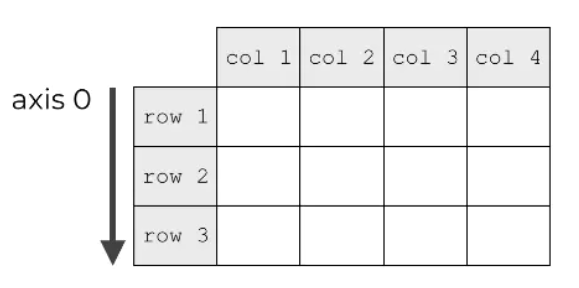
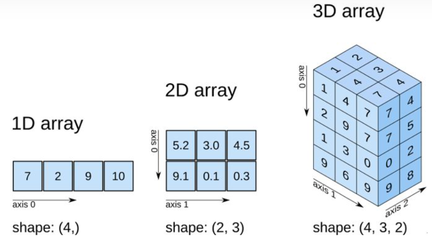
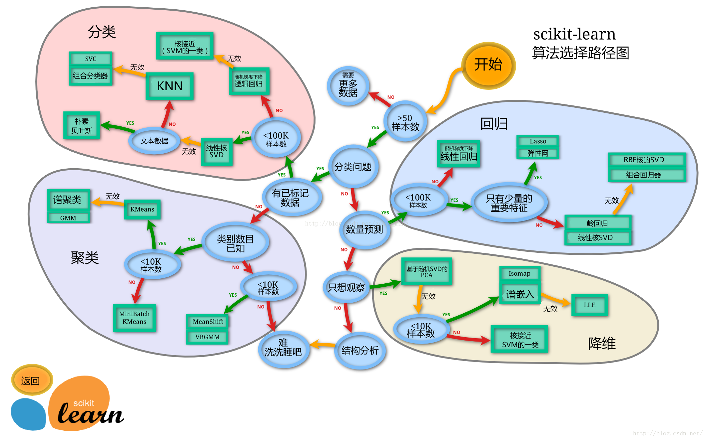

# 机器学习基础

## NumPy

一个开源的 Python 语言扩展程序库。

- 底层大量基于 C 语言。
- 支持多维数组与矩阵的快速运算。

### 基本概念

- np

	常用别名。`import numpy as np`

- Ndarray

	多维数组类型，常简称 array 。NumPy 的数组只能包含相同类型的元素。

### Ndarray

#### 基本概念

- axis

  轴，也即维度（Dimension）。

  - 相当于坐标轴的“轴”，用于定位数据在多维空间中的位置。
  - 沿第几个轴计算即沿数组第几个下标增加的方向计算。`e.g. arr[axis = 0][axis = 1]`

- rank

  秩，轴的数量，也即维度的数量。

- shape

  `.shape` 属性。

  - shape 的长度是维度个数 ，等于`.ndim`。
  - shape 的数字是各维度长度，即各维度数据个数。

- 二维数组

  - `axis = 0` 代表行增加的方向，亦列伸展的方向。
  - `axis = 1` 代表列增加的方向，亦行伸展的方向。



- 三维数组

  `axis = 2` 代表立方体的第三个轴方向，即平面增加的方向。

- 多维数组

  考虑将低维的数组抽象为单个整体元素，再按三维或二维数组思考。



一个行向量是一维数组，一个列向量是二维数组：

```python
# 行向量
[1, 2, 3]

# 列向量
[
    [1],
    [2],
    [3]
]
```

#### 维度变换

将一堆数据划分维度时，要从最后一个维度开始，从后往前逐步抽象为整体，以确定各维度的长度：

```python
# 将 1, 2, 3, 4, 5, 6, 7, 8, 9, 10, 11, 12 划分为：(2, 2, 3)

# 长度都是 3
[1, 2, 3] and [4, 5, 6] and [7, 8, 9] and [10, 11, 12]

# 长度都是 2
[[1, 2, 3], [4, 5, 6]]   # as A
and
[[7, 8, 9], [10, 11, 12]]   # as B

# 此时最后一维已经自动划分好长度。
[
[[1, 2, 3], [4, 5, 6]]
,
[[7, 8, 9], [10, 11, 12]]
]

# 排列一下形式
[ [ [1, 2, 3], 
    [4, 5, 6] ]，
 
  [ [7, 8, 9], 
    [10, 11, 12] ] ]

# 即为
[A, B]
```

### 构建数组

```python
np.array()
	依据参数创建一个 Ndarry 对象，可用于类型转化。
np.asarray()
	转换为一个 Ndarry 对象。
ndarray.copy()
	创建一个副本。

np.empty()
	创建一个未初始化的空数组。
np.zeros()
	创建元素全为 0 的数组。
np.ones()
	创建元素全为 1 的数组。
np.identity()
	创建单位数组
np.eye()
	创建单位数组
# 可创建维度长度为 0 的数组，做为某些操作初始。

np.arange(start, stop, step, dtype)
	生成数组
np.linspace()
	创建等差数列数组
np.logspace()
	创建等比数列数组
```

### 切片索引

与 Python 一致，但 NumPy 可设置切片对象 slice 。

```python
np.slice()
	创建切片对象

in:
a = np.array([[1,2,3], [3,4,5], [4,5,6]])  
print (a[...,1])   # 第 2 列元素
print (a[1,...])   # 第 2 行元素，后部的 ... 可省略
print (a[...,1:])  # 第 2 列及剩下的所有元素

out:
[2 4 5]
[3 4 5]
[[2 3]
 [4 5]
 [5 6]]
```

### 高级索引

NumPy 提供了比 Python 更多的索引方式。	

- 整数索引

	用两个数组分别表示行下标和列下标。

- 布尔索引

	可使用布尔数组或布尔运算筛选数据。如 `arr[x > 5]` 将索引出所有大于 $5$ 的元素。

- 花式索引

	索引出元素对应的整个轴的数据。

### 广播

（Broadcast）

当两个形状不同的数组相互运算时会触发广播机制。

- 将各维度的长度的较大值作为结果数组的各维度的长度。
- 当每个对应维度的长度相等或有一个长度为 $1$ 时才能正确运算。
- 运算结果会将形状较小的数组的数据进行重复，从而使每个对应维度扩充到相等长度才运算。

### 数组操作

```python
np.reshape()
	不改变数据修改形状。
np.flat
	数组元素迭代器，逐元素迭代。 for x in ndarray.flat:
np.flatten()
	将数组展平为一维数组，返回拷贝。
np.ravel()
	将数组展平为一维数组，作为原数组的视图。


形状变换
np.transpose()
	对换指定的轴，若不指定参数，则对换所有轴，相当于转置。
ndarray.T
	转置
np.rollaxis()
	将指定轴移动。
np.swapaxes()
	对换数组的轴。
np.squeeze()
	去除长度为 1 的维度。
np.resize()
	改变数组的形状，返回副本，当新形状比原形状大时，会出现元素重复。


借助广播变换形状
np.broadcast(arr1, arr2)
	返回两个数组的广播结果。
np.broadcast_to()
	将一个数组广播到指定的形状，返回只读视图。
np.expand_dims()
	在某一个轴的位置增加一个维度，长度为 1 。


连接数组
np.concatenate()
	将数组在指定维度上连接（指定维度外形状相同），不增加维度，只增加维度长度。
np.stack()
	将数组的指定维度在新的维度上连接（相同形状），不增加维度长度，增加维度。


分割数组
np.split()
	传入一个整数，表示划分子数组的大小。
    传入一个数组，表示每个划分子数组的最后一个元素的位置，用以指示分割点。
    
    
元素修改
np.append()
	在指定维度末尾增加元素，不指定轴会返回一维数组。
np.insert()
	在指定维度的指定位置插入元素，不指定轴会返回一维数组。
np.delete()
	删除元素，不指定轴会返回一维数组。
np.unique(arr, return_index = false, return_inverse = false, return_counts = false)
	返回去重后的列表。
	return_index : 额外返回新列表元素在旧列表中的下标。
	return_inverse : 额外返回旧列表元素在新列表中的下标。
    return_counts : 额外返回去重数组中的元素在原数组中的出现次数。
```

### 字符串

可对字符串或字符串列表进行操作。

```python
np.char.add()
	对两个字符串数组逐个对应连接。
np.char.mutltiply()
	返回将字符串重复指定次后的字符串。
np.char.center()
	返回指定长度的将指定字符串居中，两边以指定字符填充的字符串。
np.char.capitalize()
	将字符串的首字符转换为大写。
np.char.title()
	将每个单词的首字符转换为大写。
np.char.lower()
	转换为小写。
np.char.upper()
	转换为大写。
np.char.split()
	指定分隔符对字符串进行分割，返回数组。
np.char.splitlines()
	返回字符串中的行列表，以换行符分割。
np.char.strip()
	移除字符串开头或结尾的特定字符。
np.char.join()
	指定分隔符连接数组中的元素。
np.char.replace()
	替换字符串中的所有相应子字符串。
```

### 数学

```python
sin() cos() tan()
around()
floor()
ceil()

np.reciprocal()
	返回逐元素的倒数。
np.power()
	返回对应各元素的幂。
    可传入两个数组，前一个指定各底数，后一个指定各幂次。
np.mod() np.remainder()
	返回对应元素取余后的余数。
    可传入两个数组，前一个指定各被除数，后一个指定各除数。
   

np.max() np.min()
	返回沿指定轴的最大最小值。
np.ptp()
	返回沿指定轴的最大最小值之差（极差）
np.percentile()
	返回指定的百分位数。
np.median()
	返回中位数。
np.mean()
	返回算术平均值。
np.average()
	返回指定权值（加权）的算术平均值。
np.std()
	返回标准差。
np.var()
	返回方差。
```

### 额外库

- `numpy.matlib`

	矩阵库。

- `numpy.linalg`

	线性代数库。

## Matplotlib

- [Matplotlib 官网](https://matplotlib.org/stable/index.html)

	其中的 Example 模块可做图形检索，复制代码。

一个开源的绘图库，可以绘制静态，动态，交互式图表。

### 基本概念

- Pyplot

  Pyplot 是 Matplotlib 的子库，提供了和 MATLAB 类似的绘图 API ，用以绘制 2D 图形。

- plt

	Pyplot 的常用别名 。`import matplotlib.pyplot as plt`

- Axes3D

	3D 绘图模块，包含了 3D 绘图需要用到的接口。`from mpl_toolkits.mplot3d import Axes3D`

### 基本函数

```python
plt.figure() -> Figure
	定义一个画板。一般可不处理该返回值。
plt.plot()
	画出图形
plt.show()
	显示图像
    
plt.xlabel() plt.ylabel()
	横纵坐标标签。
plt.xlim() plt.ylim()
	横纵坐标轴范围。
plt.xticks() plt.yticks()
	横纵轴刻度以及刻度标签。
    刻度标签可使用 LaTeX 数学公式。
plt.legend()
	图例，需要在 plot 函数的参数中设置曲线的 label 属性。
    
    
plt.annotate()
	添加特殊标注。
plt.text()
	添加文本注释。
```

### plot 函数

```python
plot([x], y, [fmt], label="")
	单条线
plot([x1], y1, [fmt1], [x2], y2, [fmt2])
	多条线

color
	颜色

marker
	点形
    
linestyle
    线形
    
fmt
	组合参数
	fmt = "[color][marker][linestyle]"

可向 plot 指定起点和终点坐标，从而画出一条任意直线。
```

常用颜色（color）：

| 参数 | 颜色                          |
| ---- | ----------------------------- |
| g    | 绿（green）                   |
| b    | 蓝（blue）                    |
| r    | 红（red）                     |
| y    | 黄（yellow）                  |
| k    | 黑（black）（b 已被蓝色占用） |
| w    | 白（white）                   |

常用点型（marker）：

| 参数 | 点型 |
| ---- | ---- |
| `.`  | 点   |
| `o`  | 圆心 |
| `*`  | 星形 |
| `x`  | 叉形 |
| `|`  | 竖线 |
| `_`  | 横线 |

常用线型（linestyle）：

| 参数 | 线型   |
| ---- | ------ |
| `-`  | 实线   |
| `--` | 虚线   |
| `-.` | 点画线 |
| `:`  | 点线   |

### 参考线

```python
plt.axhline(x, c, ls, lw)
	水平参考线
plt.axvline(y, c, ls, lw)
	竖直参考线
    
x y
	参考线在坐标轴上的刻度起点。
c
	线条颜色
ls
	线形
lw
	线宽
```

### 3D 图形

```python
导入模块
import matplotlib.pyplot as plt
from mpl_toolkits.mplot3d import Axes3D


定义图像窗口，关联 3D 模块。
fig = plt.figure()
ax = Axes3D(fig)


准备数据


使用 ax 中的绘图函数即可绘制 3D 图形。
```

### 子图

多个图表在一张图像中显示，这些图表即是子图。

#### 均匀子图

```python
fig, axes = plt.subplots(nrows, ncols, figsize=(12, 5))
	fig 表示图像窗口
    axes 为表示各位置的子图对象的 ndarry 数组
    figsize 设置画布的大小，单位为英寸，一英寸等于 2.54 厘米

# 注意
for ax in axes.flatten():  # 若需要 axs 为一维数组，可以 flatten
    ax.plt()
    ax.imshow()
# 或
axes[][].plt()

当 nrows=ncols=1 时，返回的 axs 将不再是数组，只是单个子图对象。

# 布局

plt.tight_layout()
	紧密布局，可用于调整子图布局。

plt.subplots_adjust()
	调整子图位置，间距。

# 删除多余子图

plt.delaxes(ax)
	删除一个子图，默认删除最后一个子图。
   	传入子图对象即可删除指定子图。
    可用于删除多余子图。
ax.remove()
	删除当前 ax
ax.has_data()
	ax 是否含有数据
```

#### 不均匀子图

绘制示例：


```python
plt.subplot(2, 3, 1)
	指定将整张图分为 2 行 3 列，当前子图在第 1 个位置。
    也可使用 subplot 画均匀子图，但 subplots 会更方便。

然后使用 plt.plot() 画出该子图即可。


先画大图，再画小图。

plt.subplot(2,1,1)   # 划分为 2 行 1 列，在第 1 个位置
plt.plot([0,1],[0,1])

plt.subplot(2,3,4)   # 重新划分为 2 行 3 列，在第 4 个位置
plt.plot([0,1],[0,2])   # 大图占据了整个第 1 行的 3 列位置。

plt.subplot(235)    # 划分为 2 行 3 列，在第 5 个位置
plt.plot([0,1],[0,3])

plt.subplot(236)
plt.plot([0,1],[0,4])

plt.show()
```

### 图中图

在大图中层叠显示小图。

```python
指定大图的 位置 宽高，四个参数都是占 fig 面板的百分比。
ax1 = fig.add_axes([left, bottom, width, height])

ax1.plot(x, y, 'r')


画小图方法一、
left, bottom, width, height = 0.2, 0.6, 0.25, 0.25   # 指定小图的位置与宽高
ax2 = fig.add_axes([left, bottom, width, height])
ax2.plot(y, x, 'b')


画小图方法二、
plt.axes([0.6, 0.2, 0.25, 0.25])   # 该函数也可
plt.plot(y[::-1], x, 'g') # 注意对y进行了逆序处理
```

## Pandas

一个开源库。

- 易于使用的数据结构。
- 便利的数据分析工具。

### 基本概念

- pd

	常用别名。`import pandas as pd`

- Series

	数据类型，相当于一列，有索引（行标签），列标签（列名），包含索引列和数据列，支持任何数据类型。

- DataFrame

	表格型数据类型，有索引（行标签）和列标签（列名）。

### Series

- 数据和索引均可为任意类型。

```python
pd.Series(data, index, dtype, name, copy)

data
	一维数据
index
	索引（行标签），如果不指定，默认为 0 开始的数字。
传入字典    
	可由字典创建 Series 。
    可使用 index 筛选字典中的数据。
    
dtype
	数据类型，可默认。
name
	列标签（列名）。
copy
	是否拷贝数据，默认为 False。
    
返回一个 Series 对象。

元素访问方式和一般用法可参见 DataFrame 的方式。
```

### DataFrame

```python
pd.DataFrame(data, index, columns, dtype, copy)

data
	二维数据
index
	索引（行标签）。
columns
	列标签（列名）
	传入字典数组
	会将 key 作为列标签，空的 value 会显示为 NaN 。

取列数据，可数字，可标签。
df[]
    
取行的某些列数据（逗号分隔，先行标签切片，后列标签切片，省略列标签则取整行）
df.loc[]
	只能使用标签索引。
    df.loc[a:b, c:d]   # 取 a 到 b 行，c 到 d 列。
df.iloc[]
	只能使用数字索引。
    
取单个数据
df.at[]
	只能标签索引。
df.iat[a,b]
	取 a 行 b 列，只能数字索引。
    
可在 [] 中使用条件表达式取行。
	df = df.drop(df[df.score < 50].index)
	删除 score < 50 的所有行。
    
df.values 返回无标签数组（Ndarray）
```

### 其它函数

```python
df = pd.read_csv()
	读取 CSV 文件。
df.to_csv(index_label='Id')
	保存为 CSV 文件。
    
df.head(n = 5)
	返回开头 n 行。
df.tail(n = 5)
	返回末尾 n 行。
df.info()
	返回表格基本信息。
```

### 数据清洗

空值类型：

- NaN

	（Not a Number）float 类型。

- NaT

	（Not a Time）时间日期类型。

- None

	NoneType 类型。

#### 空值缺失值

```python
df.dropna(axis=0, how='any', thresh=None, subset=None, inplace=False)
	删除含有空值的行

axis
	默认为 0，表示逢空值剔除整行，如果设置参数 axis＝1 表示逢空值去掉整列。
how
	默认为 'any' 如果一行（或一列）里任何一个数据有出现 NA 就去掉整行
    如果为 'all' 一行（或列）都是 NA 才去掉这整行。
thresh
	设置需要多少非空值的数据才可以保留下来。
subset
	设置想要检查的列。如果是多个列，可以使用列名的 list 作为参数。
inplace
	如果设置 True，将计算得到的值直接覆盖之前的值并返回 None，修改的是源数据。
    
    
missing_values = ["a", "b", "c"]
df = pd.read_csv('data.csv', na_values = missing_values)
	指定空值
    
df.fillna(n, inplace = True)
	用 n 替换空值，可指定列。
```

#### 重复数据

```python
pd.duplicated()
	返回布尔列表，如果对应位置的值与之前的元素有重复，则为 true 。

pd.drop_duplicates(inplace=True)
	删除重复值。
```

## Scikit-Learn

一个经典机器学习库，实现了常见的传统机器学习算法以及一些数据处理函数。

skleran 主要包含以下功能模块:

- Classification
- Regression
- Clustering
- Dimensionality reduction
- Model selection
- Preprocessing

可以直接复制修改 example 的代码。




## 实用工具

### os

虽然可以通过 `!`  使用系统命令，但 os 包能够提供跨平台的统一接口。

对系统做一些前置操作，准备代码运行环境，或做一些后置操作，处理代码运行的结果等。

```python
import os

os.getcwd()   # 获取当前工作目
```

### pathlib

从 python3.4 开始，pathlib 已经正式成为标准库，可用于以更简便的方式取代 os 库。

```python
import pathlib
from pathlib import Path


data_folder = Path("source_data/text_files/")

# 拼接路径
file_to_open = data_folder / "raw_data.txt"

# 读取文件
print(file_to_open.read_text())

# 文件以面向对象形式描述，可直接使用各属性
filename = Path("source_data/text_files/raw_data.txt")

print(filename.name)
# prints "raw_data.txt"

print(filename.suffix)
# prints "txt"

print(filename.stem)
# prints "raw_data"

if filename.exists():
    pass
```

