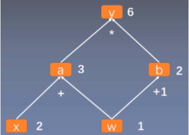

# 深度学习

## 计算图

**计算图（Computational Graph）**是用来描述运算的有向无环图形式的数据结构，主要包含结点 (Node) 和边 (Edge)。

- 结点表示数据

	如向量、矩阵、张量。

- 边（分支结点）表示运算

	如加减乘除卷积等。

$y=(x+w) \times (w+1)$ 如下图所示：（中缀表达式）



其中 $y=a \times b$ ， $a=x+w$ ，$b=w+1$ 。

- 叶子结点（自变量）
- 分支结点（中间变量）
- 根节点（结果变量）

计算图可以方便地求各个结点对应的梯度，对整个式子求梯度即从根结点依次对每条路径的孩子结点求导，一直到叶子结点  w ，最后把每条路径的导数相加即可。

- PyTorch 采用**动态图机制 (Dynamic Computational Graph)**

	动态图是运算和搭建同时进行，也即可以先计算前面的结点的值，再根据这些值搭建后面的计算图。优点是灵活，易调节，易调试。

- Tensorflow 采用**静态图机制 (Static Computational Graph)**

	静态图是先搭建图，然后再输入数据进行运算。优点是高效，因为静态计算是通过先定义后运行的方式，之后再次运行的时候就不再需要重新构建计算图，所以速度会比动态图更快，但是不灵活。

#### PyTorch 计算图

- Variable 类型

  包含 Tensor 和梯度信息（各变量关于自变量的导函数信息）。

  - 0.4 版本后的 Variable 已经和 Tensor 合并为 Tensor ，Tensor 指定 `requires_grad=True` ，就可以实现 Variable 的功能。
  - 只有基于浮点类型的 Tensor 才有梯度信息。

- 影响
  - 计算图中每个结点是一个 Variable 变量。
  - Variable 与 Variable 或 Tensor 的运算结果转化为 Variable 。
  - Variable 在计算过程中会逐步构建出整个计算图。

- `requires_grad `参数

  其置为 true 的变量将会在表达式计算时自动计算梯度，默认为 `false`。

  - 只能对自变量设置该参数，表示是否计算对该自变量的梯度。
  - 其余变量的该参数的值会根据自变量参数情况推导得出。

- `backward()` 成员函数

  从调用该函数的结点开始计算梯度。

  - 该结点关于所有叶结点的梯度值会保存在 `.grad` 属性中。
  - 当该结点不是标量（即不是单元素 Tensor），需要给 `gradient`参数指定一个与梯度计算结果相同 shape（也即该结点的 shape）的 Tensor ，其代表各标量位置的梯度的分配系数。
  	- 该结点是标量时，缺省传入 `[1.0]`，不是时一般传入全 `1.0` 即可。
  	- 通过分配系数可以用当前梯度求其它方向的方向导数。
  	- 每个计算图的根节点都是标量，当不是标量时，需要对每个标量的计算分别建立计算图。
  	- 实现上是对多个计算图的根节点，用分配系数线性组合起来，然后对综合后的标量值求导即可得所需的梯度。

- 计算梯度后要清空梯度信息 `optimizer.zero_grad()`，否则会累加多次梯度的结果。

- 动态计算图调用 `backward()`计算完后就会释放。

```python
Variable.detach()
	将该结点的 Tensor 数据分离出来，同时在该结点阻断梯度的传播（只参与前向传播，不更新反向传播）。
Variable.grad
	获取该结点梯度信息。
Variable.grad_fn
	表示该变量由什么运算得来，若为自变量则返回 None 。
```

## PyTorch

一个开源的机器学习库，主要由 Facebook 开发。

- 底层由 C++ 实现。
- 支持张量计算，可使用 GPU 加速。
- 带自动微分系统的神经网络。

### 基本概念

- Tensor

	张量数据类型。类似 NumPy 的 Ndarray ，不过能使用 GPU 加速。
	
- 导入 PyTorch

  `import torch`

### 基本操作

#### 类型转换

```python
torch.IntTensor()
	生成元素为 int 类型的 Tensor。
torch.FloatTensor()    # 别名 torch.Tensor()
	生成为 FloatTensor 类型。
    不能指定梯度。
torch.tensor()
	将数据转化为 Tensor ，数据类型可指定，或依据数据自动。
    可指定梯度。
```

#### 张量基本运算

基本运算进行了 element-wise 的重载。

```python
+ - * / //
% ** 
比较运算符，结果为布尔值。

.mul()  点乘
.mm()   矩阵相乘
```

#### 随机数种子

在任务中，往往要使用到一些随机数的算法，相同的种子产生完全相同的随机数序列。

为了不让模型每次跑出的结果因为随机数而非常不同（可复现性），需要为用到随机数的地方设置统一的随机数种子，这样别人也可以使用复制的代码复现结果。

```python
def same_seed(seed): 
    torch.backends.cudnn.deterministic = True   # 卷积都使用默认的卷积算法
    torch.backends.cudnn.benchmark = False   # 关闭系统卷积算法选择优化（带随机性）
    np.random.seed(seed)   # 为程序算法设置种子。
    torch.manual_seed(seed)   # 为 CPU 设置种子。
    if torch.cuda.is_available():
        torch.cuda.manual_seed_all(seed)   # 为所有 GPU 设置种子。
```

#### 存储转移

有两个硬件存储和计算位置：（以下函数都是返回新的变量）

- CPU `.cpu() or .to('cpu')`
- GPU（或 TPU) 显存 `.cuda() or .to('cuda')`
	- Tensor 才能转移到 GPU 。
	- 也可指定 GPU 编号。

不同存储位置的变量不能直接相互运算，将**模型**和**数据**转移到 GPU 计算，再将结果转移到 CPU 。

- 判断 GPU 是否可用：`device = 'cuda' if torch.cuda.is_available() else 'cpu'` 。
- 查看数据存储位置：`.device or .is_cuda` 。

### 数据处理与集成

处理后的数据需要集成为简易的 “item 列表" 形式，从而才能被更简易地划分，迭代。

- Dataset

  一个抽象类，用以使各 Dataloader 区分 data 与 label 。

  - 所有自行构建的数据集类都必须继承它
  - 要重写 `__init__(self), __len__(), __getitem__(self, idx)` 方法。
  -  `__getitem__()` 用于通过下标返回训练和测试的一个 item 数据。
  -  可返回一个列表，假设 `list_len, batch_size `，一个 batch 的维度会是 `(list_len, batch_size, ...)`。

- DataLoader

  将 Dataset 转化为划分好  batch 的可迭代对象（data 的 loader），用以迭代 batch 。

  - 每次迭代一个 batch 。

  - batch 不能被数据规模整除时，最后一个 batch 会小一些，如果有影响（一般没影响），可设置 `drop_last=True` 。

  - 注意，test 时不要打乱顺序，要保证 `shuffle=False`，默认即为 False 。

```python
from torch.utils.data import Dataset, DataLoader
```

### 模型结构

- 导入神经网络模块

  `import torch.nn as nn` 。

- 网络结构类

  自定义网络结构类必须继承 `nn.Module` 类，并实现 `__init__()` 和前向传播方式 `forward()`。 

- 神经网络结构

  在模型的 `__init__()` 函数中设置神经网络的组件结构。

  - `nn.Sequential()`

  	顺序定义各网络层结构。

- 子结构

  可用变量、循环语句和生成器等对多个神经网络子结构进行拼接组合。

  - 方式

  	- 用变量表示子结构

  	- 用自定义类表示子结构（可传入参数）

  	  每个神经网络子结构类相当于一个小模型（函数结构一致），其也要实现初始化函数（包括其网络结构）以及前向传播函数。

  	- 也可在前向传播函数中组合各子结构的输入输出值，并添加一些特殊的处理。

  - 函数

  	- 使用 `nn.Sequential()` 

  	  - 其内的子结构需要具有顺序的参数传递关系。
  	  - 父结构不用使用 forward 函数连接各子结构，但需要使用其整体。
  	  
  	- 使用 `nn.ModuleList()` 
  	
  	  - 其内的子结构都是独立的，操作方法相当于子结构原生列表。
  	  - 父结构需要使用 forward 函数连接各子结构。
  	
  	- 使用 `nn.ModuleDict()` 
  	
  		- 可以字典形式为子结构命名。
  		
  	- 结构注册
  	
  	  不要使用 python 原生列表组合子结构，这会使得子结构无法注册到模型中，从而无法被反向传播，即该部分参数不会被更新。（forward 函数使用了子结构则可以前向传播）

- 前向传播

  实现 `forward(x)` 函数，传入模型需要的参数，返回前向传播的结果。

  -  `forward(x)` 函数要负责拼接神经网络的组件结构，同时设定其它复杂的连接方式，以供计算。
  - 模型一次返回一个 batch 的结果，维度要考虑 batch 的大小。

```python

# 直接创建，或用变量拼接组合

class MyNN(nn.Module):   # 必须继承该类
    def __init__(self, input_dim):
        super().__init__()   # 调用父类的初始化函数。
        self.layers = nn.Sequential(   # layers 是自行添加的变量
            nn.Linear(input_dim, 16),   # 注意逗号
            nn.ReLU(),
            nn.Linear(16, 8),
            nn.ReLU(),
            nn.Linear(8, 1)
        )
        
    def forward(self, x):
        x = self.layers(x)   # 将输入数据传入神经网络计算，返回前向计算的结果。
        return x

# 用类拼接组合
    
class BasicBlock(nn.Module):
    def __init__(self, input_dim, output_dim):
        super().__init__()

        self.block = nn.Sequential(
            nn.Linear(input_dim, output_dim),
            nn.ReLU(),
        )

    def forward(self, x):
        x = self.block(x)
        return x


class Classifier(nn.Module):
    def __init__(self, input_dim, output_dim=41, hidden_layers=1, hidden_dim=256):
        super().__init__()

        self.fc = nn.Sequential(
            BasicBlock(input_dim, hidden_dim),
            *[BasicBlock(hidden_dim, hidden_dim) for _ in range(hidden_layers)],
            nn.Linear(hidden_dim, output_dim)
        )

    def forward(self, x):
        x = self.fc(x)
        return x
    
### 前向传播

model = MyNN().to(Config.device)
model(x) 相当于 model.forward(x) # 因为 nn.Module 的 __call__ 方法调用了 forward()

# 查看模型结构
print(model)
```

- 注意
	- 模型的输入输出都是 GPU 上的 Tensor，模型及其子块也要转移到 GPU 上。
	- 要保证 Dataset 取出的数据为 Tensor 。

### 训练

自定义类或函数（train），用于训练模型，保存训练过程中最优状态的模型等。

- 模型模式

	模型在不同模式下，其内部的一些模块会有不同的行为。

	- 训练模式 `model.train()`

		计算梯度等要改变模型参数的行为前要设置为训练模式。启用 Batch Normalization 和 Dropout 。

	- 评估模式 `model.eval()`
	
		验证和测试前要设置为评估模式。（仍然会计算梯度）关闭 Batch Normalization 和 Dropout 。

- 梯度计算上下文管理器

	`with torch.no_grad():  ` 停止自动求导机制，不计算梯度。

- 损失函数

- 优化器

- 迭代 epoch
	- 前向传播
	- 反向传播
	- 验证，每个 epoch 训练一次，验证一次。
	- 计算损失，记录变化。
	- 切换训练模式和评估模式。
	- 保存模型。

```python
criterion = nn.MSELoss()   # 指定损失函数的算式，用于求梯度或损失值。
optimizer = torch.optim.SGD(model.parameters())   # 设置优化器，传入模型参数。

for i, epoch in enumerate(len(n_epoch)):
    for batch in dataloader:
        x, y = batch
        x.to(Config.device)
        y.to(Config.device)

output = model(input)   # 前向传播
loss = criterion(output, label)   # 计算损失
optimizer.zero_grad()   # 将上一个样本（或 batch）的梯度清零，便于当前计算梯度。
loss.backward()   # 从 loss 开始反向传播，计算计算图的梯度。
optimizer.step()   # 使用计算图中计算好的梯度更新参数。

loss.item()   # 取出 loss 的值
```

### 模型保存

一般在训练时，每个 epoch 要保存：

- best state

	便于测试。

- latest state

	便于继续训练。

可构建一个 python 字典类型作为 checkpoint，用于保存需要的信息。

- checkpoint `.pth`
	- 网络结构
	
		网络结构一般保留代码即可。
	
	- 模型状态 `.ckpt` 
	
	- 优化器状态 `.ckpt`
	
	- 其它信息

```python
# 保存

# 构建字典，保存需要的信息。
checkpoint = {'model_structure': Classifier(),
          'model_state': model.state_dict(),   # state_dict 都是 .ckpt
          'optimizer' : optimizer.state_dict()}

# Saving a checkpoint
torch.save(checkpoint, 'checkpoint.pth')

# Loading a checkpoint
checkpoint = torch.load( 'checkpoint.pth')


# 加载

def load_checkpoint(filepath):
    checkpoint = torch.load(filepath)
    model = checkpoint['model_structure']
    model.load_state_dict(checkpoint['model_state'])
    for parameter in model.parameters():
        parameter.requires_grad = False
    model.eval()
    return model

model = load_checkpoint('checkpoint.pth')
```

### 测试（预测）

- 测试存储好的模型。

- 梯度计算上下文管理器

	在其内的所有语句计算得出的变量的 `requires_grad` 参数都被自动设置为 `false` ，即使其是由 `requires_grad=true` 的变量计算而来。

	- 在测试时使用可以保证模型的梯度不会再被计算（自动或手动），以节约资源。
	- 在训练时使用可以保证模型指定部分（取决于语句）的梯度不会再被计算（自动或手动），以控制梯度更新对象。
	
- 作图分析

```pyth
model = MyNN().to(Config.device)
model.load_state_dict(torch.load(Config.save_path))   # 从存储路径中加载模型的状态

model.eval()
with torch.no_grad():   # 梯度计算上下文管理器
	for batch in test_loader:
		语句
		语句
		...
```

### torchvision 包

PyTorch 关于计算机视觉的一个包，包含一些图像数据库、模型结构和常见的图像转换类与函数。

```python
import torchvision.transforms as transforms

transforms.Resize()   # 类，可用于 transforms.Compose([   ]) 组合
transforms.function.resize()   # 函数
```

## TensorFlow

### TensorBoard 包

TensorBoard 是 TensorFlow  的使用浏览器显示的可视化工具，其通过读取 log 进行可视化，故其它框架只要生成对应格式的 log ，也能正常使用它。

问题：对于 Kaggle ，会无法打开 Tensorboard 的本地服务网址，因为网址中的 localhost 是指 Kaggle 的服务器，而它的防火墙没有放行该端口。

- `add_scalar()` 

	可视化标量，常用来可视化 loss 、学习率、准确率等。

	- 可一图多条曲线，设置不同 tag 即可。
	- 可一个数据对应多个值，传入字典即可。

```python
from torch.utils.tensorboard import SummaryWriter

log_writer = SummaryWriter(log_dir="runs")   # 写入目录，写入时间间隔

for epoch in len(n_epoch):
        log_writer.add_scalar('train_loss', y, x)   # 第一个参数为图表的 tag 。
        log_writer.add_scalar('valid_loss', y, x)

log_writer.close() # 也可在语句前使用 with 语句。
```

- 启动 TensorBoard 读取 log


```python
# 使用系统命令：
！ tensorboard --logdir=runs   # log 目录为 runs

# 使用后显示一个网址，打开该网址即可查看。
```

- `add_graph()`

	可视化网络结构。

```python
model = NN()
log_writer.add_graph(model, input_data)
```