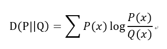
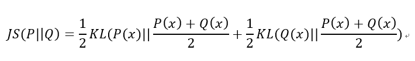
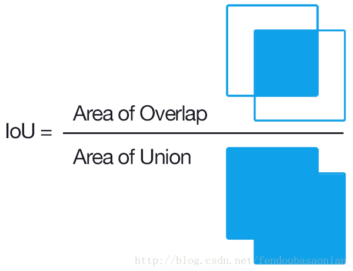

# 常见 loss

以下分类为粗略的分类，以实际使用为准。

## 一般

### F1-score

对于二分类问题，一般预测值可分为：

- TP

	true positive，预测正确, 预测结果是正类, 真实是正类。

- TN

	true negative，预测正确, 预测结果是负类, 真实是负类。

- FP

	false positive，预测错误, 预测结果是正类, 真实是负类。

- FN

	false negative，预测错误, 预测结果是负类, 真实是正类。

有：
$$
F1\text{-}score = 
\frac {2 \times precision \times recall} {precision + recall} ,\ \ 
\begin{cases}
precision = \frac {TP} {TP + FP}\\
recall  = \frac {TP} {TP + FN}
\end{cases}
$$
F1-score 同时隐含 precision 和 recall 两个指标。

## 回归

### MSE

均方误差（Mean Square Error，MSE）

详见《线性模型》
$$
MSE = {1 \over m} \sum\limits_{i = 1}^m (y_i - \hat{y})^2
$$

## 分类

### Cross Entropy

（交叉熵，Cross Entropy）

详见《线性模型》

对于两个离散概率分布 $p,q$，有离散分布形式的交叉熵：
$$
H(p, q) = - \sum\limits_x p(x) \ln (q(x))
$$
离散分布 $p,q$ 需要按不同的类别对应“相乘”：
$$
H(p, q) = - \sum\limits_i [\hat y_i \ln f(x_i) + (1 - \hat y_i) \ln (1 - f(x_i))] 
\begin{cases}
\hat y_i \ln f(x_i), x = 1 \\\\
(1 - \hat y_i) \ln (1 - f(x_i)), x = 0
\end{cases}
$$
最小化交叉熵就是最大化似然函数。

### KL divergence

（相对熵，KL 散度，KL 距离，Kullback–Leibler divergence）

当 $P(x)$ 和 $Q(x)$ 的相似度越高，KL散度越小。

### JS divergence

（JS 散度，Jensen–Shannon divergence）

详见《GAN》

JS 散度是 KL 散度的一种变形。

JS 具有对称性，且结果更加平滑。

### Wasserstein distance

沃瑟斯坦距离（Wasserstein distance， 推土机距离）

详见《GAN》

一个分布中的点移动到另一个分布中的最小平均移动距离。（将一个土堆变成另一个土堆的最小代价）

## 目标检测

### IoU

（Intersection over Union）

IoU 也就是两个区域的“交集”, 除以两个区域的“并集”：
$$
IoU = \frac {A \cap B} {A \cup B} = 
\frac {TP} {TP + FP + FN}
$$

## 语义分割

### Dice Loss

[V-Net: Fully Convolutional Neural Networks for Volumetric Medical Image Segmentation 2016](https://arxiv.org/abs/1606.04797)

一种集合相似度度量函数，用于应对语义分割中正负样本强烈不平衡的场景。

取值范围在0到1之间，取值越大表示越相似。

Dice loss 来自 Dice Coefficient（Dice 系数），如下：
$$
dice\_coefficient = \frac {2|X\cap Y|} {|X| + |Y|}
$$
Dice loss 为：
$$
dice\_loss = 1 - dice\_coefficient = 1- \frac {2|X\cap Y|} {|X| + |Y|}
$$
其中，$X,Y$ 为两个集合，分子乘 $2$ 是为了保证分母重复计算后取值范围在 $[0,1]$ 内。

dice coefficient 可以写为：
$$
dice\_coefficient = \frac {2TP} {2TP + FP + FN}
$$
可见 dice coefficient 等同于 F1-score ，同时隐含 precision 和 recall 两个指标，从而 dice loss 是直接优化 F1-score 。

交叉熵损失把每个像素都当作一个独立样本进行预测，而 dice loss 则以一种“区域相关”的方式来看待最终的预测输出，所以能够一定程度应对正负样本不平衡。

dice loss 使用经过 sigmoid 或 softmax 后的网络预测值（取值$(0,1)$）与非 $0$ 即 $1$ 的 ground truth 。

Soft Dice Loss  即直接使用网络预测值，不使用 sigmoid 或 softmax 。