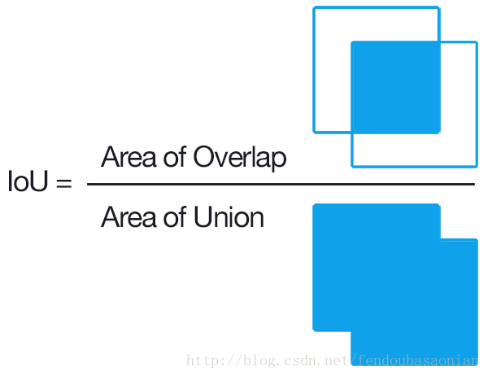
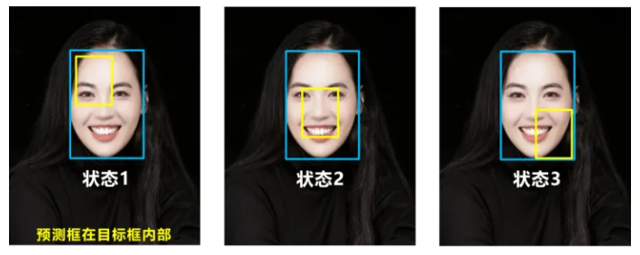

# 常见指标与 loss

以下分类为粗略的分类，以实际使用为准。

数据集介绍中也含有一些指标。

很多 loss 可以由 metric 构建。

## 分类指标

### F1-score

对于二分类问题，一般预测值可分为：

- TP

	true positive，预测正确, 预测结果是正类, 真实是正类。

- TN

	true negative，预测正确, 预测结果是负类, 真实是负类。

- FP

	false positive，预测错误, 预测结果是正类, 真实是负类。

- FN

	false negative，预测错误, 预测结果是负类, 真实是正类。

有：
$$
F1\text{-}score = 
\frac {2 \times precision \times recall} {precision + recall} ,\ \ 
\begin{cases}
precision = \frac {TP} {TP + FP}\\
recall  = \frac {TP} {TP + FN}
\end{cases}
$$
F1-score 同时隐含 precision 和 recall 两个指标。

## 回归 loss

### MSE

均方误差（Mean Square Error，MSE），也叫 L2 loss 。

$$
MSE = {1 \over n} \sum\limits_{i = 1}^n (y_i - \hat{y})^2
$$

忽略下标 $i$，取 $n = 1$，将真实值与预测值的差值和 MSE 值作图：

可见，MSE 光滑、连续，处处可导，便于使用梯度下降。

误差大时有大梯度，收敛快（但容易受离群点影响），同时，随着误差（即差值）的减小，梯度也减小，有利于收敛。

误差较大时（$\gt 1$），会放大差值，误差较小时（$\lt 1$），会缩小差值，因为有平方，也就是说，MSE 对离群点比较敏感，离群点会产生较大的 loss ，会牺牲正常数据的预测效果，降低模型性能：

其中，回归曲线向离群点偏转。

### MAE

均绝对误差（Mean Absolute Error，MAE) ，也叫 L1 loss 。
$$
MSE = {1 \over n} \sum\limits_{i = 1}^n |y_i - \hat{y}|
$$
忽略下标 $i$，取 $n = 1$，将真实值与预测值的差值和 MAE 值作图：

MAE 曲线连续，但在误差为 0 时不可导，可能影响收敛。

MAE 在大部分情况下梯度值相等，对不同误差的样本都给予一样的 loss ，受离群点影响较小：

### Smooth L1 Loss

Smooth L1 loss 使 L1 loss 不可导的部分变得可导：
$$
\rm SmoothL_1(x) = 
\begin{cases}
0.5x^2,\ \ if |x| \lt 1 \\
|x| - 0.5 ,\ \ otherwise
\end{cases}
$$

其中，$x = \hat y_i - y_i$ ，即预测值与真实值的差值。

Faster R-CNN 和 SSD 中用其进行边框回归。

Smooth L1 能从两个方面限制梯度：

- 当预测框和 GT 相差特别大时，梯度值不至于过大。
- 当预测框和 GT 相差非常小时，梯度值足够小。

将 MAE 和 MSE 改写：

求其梯度有：

可见，L2 loss 的梯度随误差增大而增大（$2x$），L1 的梯度保持恒定值（$1 \text{ or} -1$）。

Smooth L1 loss 在误差小时有 loss ，在误差大时，具有 loss 上限（$\pm 1$），限制了大误差的影响，解决了离群点梯度过大的问题。

Smooth L1 loss 比 L1 loss 收敛快，又比 L2 loss 受离群点影响小。

画在一起有：

可见本质上，Smooth L1 在 $[-1,1]$ 内是 L2 loss ，在之外是 L1 loss 。

## 分类 loss

### Cross Entropy

（交叉熵，Cross Entropy）

详见《线性模型》

对于两个离散概率分布 $p,q$，有离散分布形式的交叉熵：
$$
H(p, q) = - \sum\limits_x p(x) \ln (q(x))
$$
离散分布 $p,q$ 需要按不同的类别对应“相乘”：
$$
H(p, q) = - \sum\limits_i [\hat y_i \ln f(x_i) + (1 - \hat y_i) \ln (1 - f(x_i))] 
\begin{cases}
\hat y_i \ln f(x_i), x = 1 \\\\
(1 - \hat y_i) \ln (1 - f(x_i)), x = 0
\end{cases}
$$
最小化交叉熵就是最大化似然函数。

### KL divergence

（相对熵，KL 散度，KL 距离，Kullback–Leibler divergence）

当 $P(x)$ 和 $Q(x)$ 的相似度越高，KL散度越小。

### JS divergence

（JS 散度，Jensen–Shannon divergence）

详见《GAN》

JS 散度是 KL 散度的一种变形。

JS 具有对称性，且结果更加平滑。

### Wasserstein distance

沃瑟斯坦距离（Wasserstein distance， 推土机距离）

详见《GAN》

一个分布中的点移动到另一个分布中的最小平均移动距离。（将一个土堆变成另一个土堆的最小代价）

## 目标检测指标

- Top-5 错误率

	对一个样本做出 5 个预测，都不含正确标签即为预测错误，预测错误样本占测试集比例即为 Top-5 错误率。

- Top-5 正确率

	对一个样本做出 5 个预测，至少含有一个正确标签即为预测正确。

	- 原因在于一张图片可能有多个物体，有多个标签。

## 目标检测 loss

### 分类

#### Focal Loss

见 《RetinaNet》

### box 回归

bounding box 的回归 loss 的发展：

Smooth L1 Loss-> IoU Loss（2016）-> GIoU Loss（2019）-> DIoU Loss（2020）->CIoU Loss（2020）

这些 loss 都是由 IoU ，GIoU ，DIoU ，CIoU 这些 metric 构建的。

#### IoU loss

（Intersection over Union）

IoU 也就是两个区域的“交集”, 除以两个区域的“并集”：
$$
IoU = \frac {A \cap B} {A \cup B} = 
\frac {TP} {TP + FP + FN}
$$

IoU loss 即写为 loss 的形式：

IoU loss 仍然存在一些问题：

- GT 和预测 box 不相交

	状态 1，$IoU = 0$ ,无法反应两个 box 的远近，此时 loss 不可导，无法优化。

	- 使用 anchor 进行 match 可以避免这种情况，这也是引入 anchor 的原因之一；
	- 另一个是 anchor 将 box 的预测转化为了一个简单的回归问题。

- GT 和预测 box 外交

	状态 2 和状态 3，无法进一步区分差异。

- GT 和预测 box 包含

	预测 box 在 GT 内部，无法进一步区分差异。

#### GIoU loss

（Generalized IOU）

GIoU 考虑了 IoU 和差集的占比，解决了 IoU 的两个问题：

- GT 和预测 box 不相交

	GT 和 box 相距越远，最小外接矩形越大，差集越大，两者比值越接近 $1$（考虑无限远），IoU 不变，整体 GIoU loss 变大。

- GT 和预测 box 外交

	GT 和 box 相距越远，最小外接矩形越大，差集越大，两者比值需要计算速度，假设恒定，IoU 变小，整体 GIoU loss 变大。

	- 注意，预测 box 在 GT 周围的对称分布的情况仍无法区分，但该情况或许不需要区分。

在 GT 和预测 box 包含时，GIoU 退化为 IoU ，loss 值都相等。

#### DIoU loss

（Distance IOU）

DIoU 考虑了重叠面积和中心点距离，解决了包含时 GIoU 退化为 IoU 的情况：

- GT 和预测 box 不相交

	GT 和 box 相距越远，对角线距离越大，中心点距离越大，两者比值越接近 $1$（考虑无限远），IoU 不变，整体 DIoU loss 变大。

- GT 和预测 box 外交

	GT 和 box 相距越远，对角线距离越大，中心点距离越大，两者比值需要计算速度，假设恒定，IoU 变小，整体 DIoU loss 变大。

- GT 和预测 box 包含

	对角线距离不变，中心点相距越远，两者比值越大，IoU 不变，整体 DIoU loss 变大。

DIoU loss 无法解决中心点距离一样，但长宽比不一样的情况，此时 DIoU loss 值都相同：

#### CIoU loss

（Complete IOU）

CIoU 在 DIoU 考虑重叠面积和中心点距离的基础上，进一步考虑宽高比：
$$
\text {CIoU-Loss} = 1 - \rm CIoU = 1 - (\rm IoU - \frac {\text{distance-2}^2} {\text{distance-C}^2} - 
\frac {\nu^2} {(1 - \rm IoU) + \nu})
$$
其中，$\nu$ 用以衡量长宽比的一致性，定义为：

## 语义分割 loss

### Dice Loss

[V-Net: Fully Convolutional Neural Networks for Volumetric Medical Image Segmentation 2016](https://arxiv.org/abs/1606.04797)

一种集合相似度度量函数，用于应对语义分割中正负样本强烈不平衡的场景。

取值范围在0到1之间，取值越大表示越相似。

Dice loss 来自 Dice Coefficient（Dice 系数），如下：
$$
dice\_coefficient = \frac {2|X\cap Y|} {|X| + |Y|}
$$
Dice loss 为：
$$
dice\_loss = 1 - dice\_coefficient = 1- \frac {2|X\cap Y|} {|X| + |Y|}
$$
其中，$X,Y$ 为两个集合，分子乘 $2$ 是为了保证分母重复计算后取值范围在 $[0,1]$ 内。

dice coefficient 可以写为：
$$
dice\_coefficient = \frac {2TP} {2TP + FP + FN}
$$
可见 dice coefficient 等同于 F1-score ，同时隐含 precision 和 recall 两个指标，从而 dice loss 是直接优化 F1-score 。

交叉熵损失把每个像素都当作一个独立样本进行预测，而 dice loss 则以一种“区域相关”的方式来看待最终的预测输出，所以能够一定程度应对正负样本不平衡。

dice loss 使用经过 sigmoid 或 softmax 后的网络预测值（取值$(0,1)$）与非 $0$ 即 $1$ 的 ground truth 。

Soft Dice Loss  即直接使用网络预测值，不使用 sigmoid 或 softmax 。