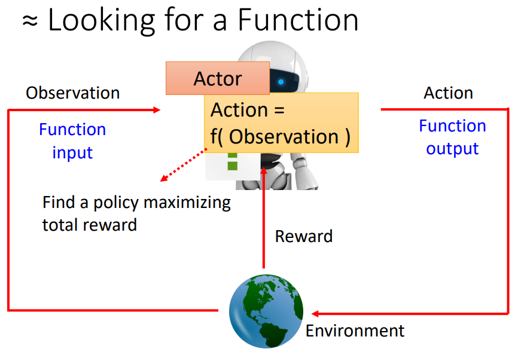
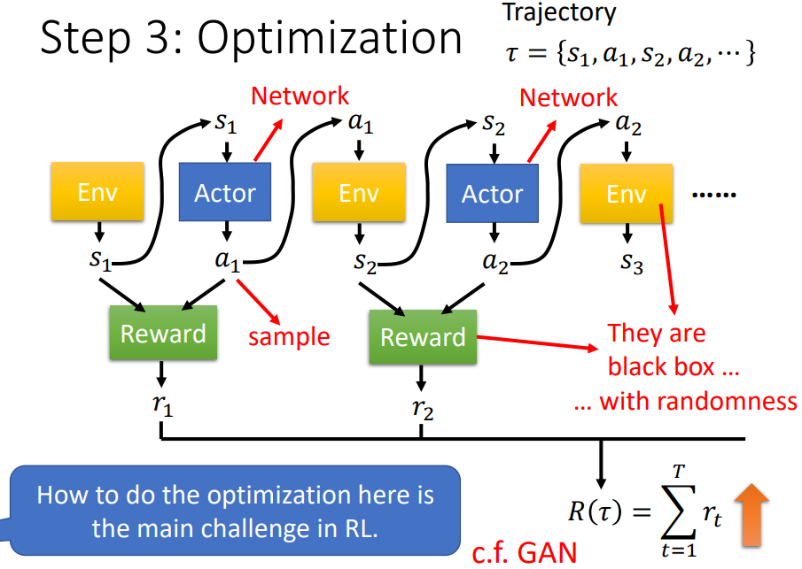
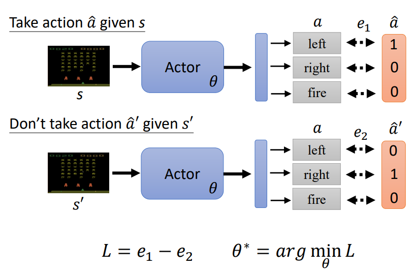
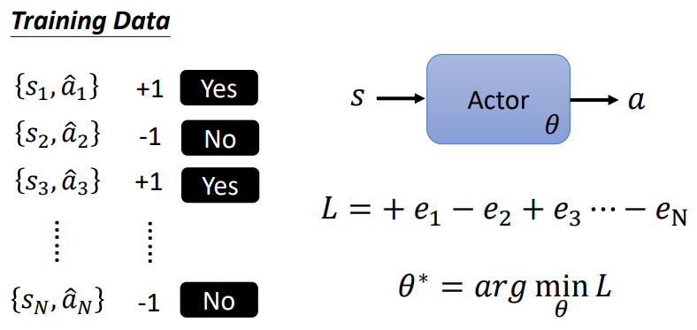
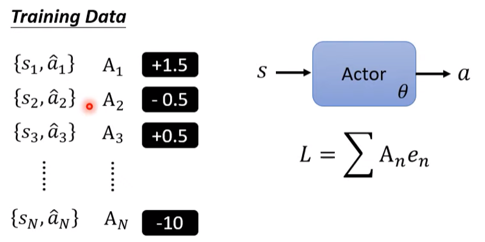

# 强化学习

（Reinforcement Learning，RL）

## 基本概念

RL 也是一个寻找 function 的最优参数的过程：

- Actor（也叫 Agent）

	即是要找的 function，有 $\rm Action = f(\rm Observation)$ 。

- Environment

	客观环境和环境中的客体。（不断变化）

- Observation

	Actor 对 Environment 的观测。

- Action

	Actor 在 Observation 下做出的行动。

- Reward

	依据 Action 产生的结果好坏，给 Actor 提供 Reward 。

整个寻找 function 的参数的过程称为一个 episode，通过最大化 Total Reward 实现：（Total Reward也叫 Return）

如果 Actor 使用一个神经网络实现，可称其 Policy Network 。

Env 输出 observation $s$，Actor 输出 action $a$ ，训练过程中所有 observation 和 action 组成的一种序列称为一个 Trajectory 。

Reward 也是一个规则（本质也是一个函数），它输入 $s,a$ ，输出 $r$ ，所有 $r$ 的总和即 Return $R$ （total reward）。

这个优化过程不同于 RNN 的训练过程：

- Actor 需要用 sample 的方式产生 action （从分布中 sample），以在相同环境下可以有不同的输出，这是一个有随机性的网络。
- Env 和 Reward 不是神经网络。
- Env 和 Reward 往往也有随机性，在规则明确的情况下（比如游戏规则），Reward 才是确定的。

与 GAN 的相似之处：

- GAN 有 Generator 和 Discriminator ，Discriminator 的输出越大越好。
- RL 中， Actor 像 Generator 。Environment 和 Reward 一起像 Discriminator ，Discriminator 的输出越大越好。

与 GAN 的不同之处：

- GAN 中 Discriminator 是一个神经网络，受人控制。
- RL 中，Environment 和 Reward 不是神经网络，特别是 Environment ，不受人控制。

## Policy Gradient

### control actor

以 Environment 为游戏画面，Action 为左右移动和开火，为例。

可以将 Actor 当作一个 Classifier ，假设有两个 data ：

- 要让 Actor 在 $s$ 的情况下采取行动 $\hat a$ ，只需输出 $a$ ，然后做最小化 cross entroy $e_1$ 。
- 要让 Actor 在 $s^{\prime}$ 的情况下不采取行动 $\hat a^{\prime}$ ，只需输出 $a$ ，然后做最小化负的 cross entroy $e_2$ 。（与行动相差越大越好）

loss 为 $L = e_1 - e_2$ 。

在更多 data 下，可以最小化所有 data 组成的 loss ：

其中，表示是否行动的 $+1,-1$ ，也可以进一步采用连续的表示，表示采取行为的概率，或者说我们希望采取行为的概率：

问题：

- 如何定义 $A$ ?
- 如何产生 $s,a$ 的 pair ？