# 强化学习

（Reinforcement Learning，RL）

## 基本概念

RL 也是一个寻找 function 的最优参数的过程：

- Actor（也叫 Agent）

	即是要找的 function，有 $\rm Action = f(\rm Observation)$ 。

- Environment

	客观环境和环境中的客体。（不断变化）

- Observation

	Actor 对 Environment 的观测。

- Action

	Actor 在 Observation 下做出的行动。

- Reward

	依据 Action 产生的结果好坏，给 Actor 提供 Reward 。

整个寻找 function 的参数的过程称为一个 episode，通过最大化 Total Reward 实现：（Total Reward 也叫 Return）

如果 Actor 使用一个神经网络实现，可称其 Policy Network 。

Env 输出 observation $s$，Actor 输出 action $a$ ，训练过程中所有 observation 和 action 组成的一种序列称为一个 Trajectory 。

Reward 也是一个规则（本质也是一个函数），它输入 $s,a$ ，输出 $r$ ，所有 $r$ 的总和即 Return $R$ （total reward）。

这个优化过程不同于 RNN 的训练过程：

- Actor 需要用 sample 的方式产生 action （从分布中 sample），以在相同环境下可以有不同的输出，这是一个有随机性的网络。（一般的神经网络相同输入会有相同输出）
- Env 和 Reward 不是神经网络。
- Env 和 Reward 往往也有随机性，在规则明确的情况下（比如游戏规则），Reward 才是确定的。

与 GAN 的相似之处：

- GAN 有 Generator 和 Discriminator ，Discriminator 的输出越大越好。
- RL 中， Actor 像 Generator 。Environment 和 Reward 一起像 Discriminator ，Discriminator 的输出越大越好。

与 GAN 的不同之处：

- GAN 中 Discriminator 是一个神经网络，受人控制。
- RL 中，Environment 和 Reward 不是神经网络，特别是 Environment ，不受人控制。

## Policy Gradient

### control actor

以 Environment 为游戏画面，Action 为左右移动和开火，为例。

可以将 Actor 当作一个 Classifier ，假设有两个 data ：

- 要让 Actor 在 $s$ 的情况下采取行动 $\hat a$ ，只需输出 $a$ ，然后做最小化 cross entroy $e_1$ 。
- 要让 Actor 在 $s^{\prime}$ 的情况下不采取行动 $\hat a^{\prime}$ ，只需输出 $a$ ，然后做最小化负的 cross entroy $e_2$ 。（与行动相差越大越好）

loss 为 $L = e_1 - e_2$ 。

在更多 data 下，可以最小化所有 data 组成的 loss ：

其中，$+1,-1$ 表示是否采取行动 $\hat a$，也可以进一步采用连续的表示，表示采取行动的概率，或者说我们希望采取行为的概率：

问题：

- 如何定义 $A$ ？（每个 action 有一个 reward，$A$ 表示 reward 的利用规则，表示一个 action 的好坏（对于所有 action 的好坏））
- 如何产生 $s,a$ 的 pair ？

### version 0

一个简单的，不够正确的版本。

- 收集 pair

	随机初始化一个 Actor ，然后和环境互动，不断记录 $s,a$ 。（足够的资料可能需要多个 episode 的互动）

- 定义 $A$ 

	每次互动可以得到一个 reward ，如果直接认为 reward 是正的就是好的，是负的就是不好的，那么 $A$ 可以直接定义为 reward 。

version 0 是一个短视（short-sighted）的模型，它只考虑当前步最优，不考虑全局最优。（即采取贪心的方式做出行动）

好的模型应当能够实现 reward delay ，即可以牺牲短期利益，换取长期利益。

### version 1

将执行 $a$ 后得到的所有 $r$ 加起来，得到 $G$（称为 cumulated reward），让 $A = G$ ：

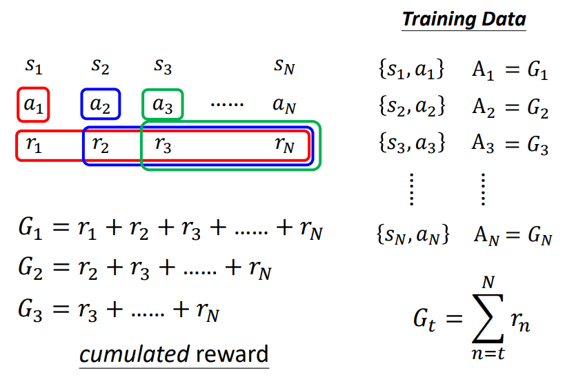

如果 action 序列非常长，将 $r_N$ 归功于 $a_1$ 就会显得权重过度。

### version 2

设置一个 discount factor ，使得 $r$ 的权重逐步衰减：

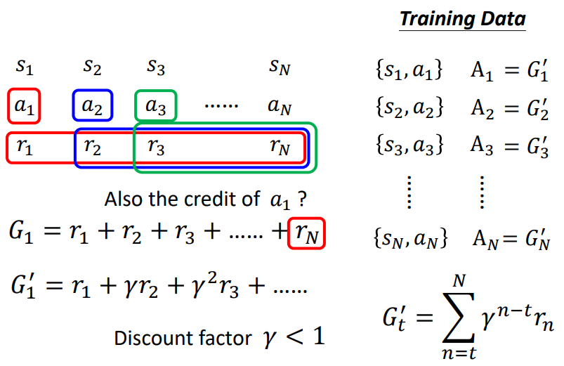

### version 3

好和坏是相对的，如果每次 action 都能得到一个最低分，虽然最低分有数值，当时没有太大意义。

如果所有分数都是正的，那么模型鼓励所有行为，从而不能很好地抑制某些不好的 action 的产生，对不好的行为的抑制的意义不够明确，会对优化带来困难。

可以将 $G^{\prime}$ 都减去一个 $b$（baseline），使其有正有负。

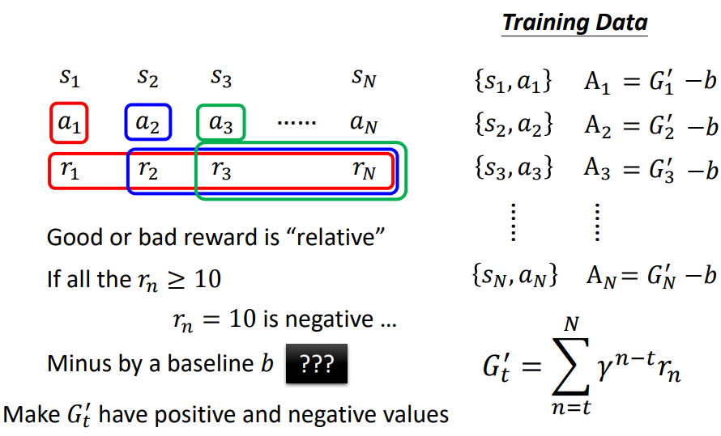

### 详细步骤

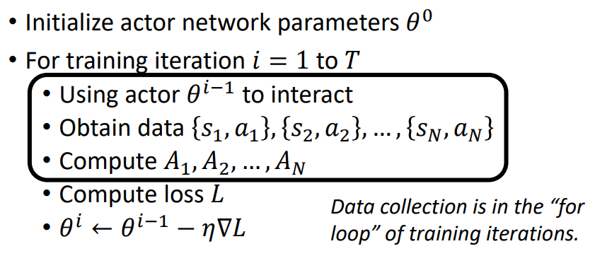

其中，data collection 会反复进行多次，每次 data collection 只能更新一次参数，所以 RL 一般比较耗时间。

$\theta^{i-1}$ 产生的 data（$\theta^{i-1}$ 的经验），可以用来更新 $\theta^{i-1}$ ，但不代表能用来更新  $\theta^{i}$ ，所以每次要重新收集 data ：

- 对不同的模型状态，好的 action 序列可能是不同的，不能用之前的 reward 评价当前 reward 。
- 对不同的人，达成目标的好的 action 序列可能是不同的。

### On-policy v.s. Off-policy

- on-policy learning

	用于训练的 actor 和用于交互产生 data 的 actor 是同一个。

- off-policy learning

	用于训练的 actor 和用于交互产生 data 的 actor 不是同一个。（可以减少 data collection 的次数）

经典的 off-policy 方法是 Proximal Policy Optimization (PPO) ，重点在于 actor 必需要知道 train 和 interact 的差别，并根据这个差别做出一定的改变，详可见宏毅老师的视频： [PPO](https://youtu.be/OAKAZhFmYoI) 。

### exploration

如果 actor 需要有充足的随机性，如果随机性不够，会影响训练效果。（如果 actor 不采取某个 action ，那么永远无法知道该 action 都好坏)

比如可以对 interact 的 actor 加入噪声。

## Actor-Critic

Critic 用于预估指定的 Actor $\theta $ 对 observation $s$ 做出的 action $a$ 的好坏。

比如 value function 可用于预估某个 $s$ 下，该 actor 可能得到的 discounted cumulated reward（$G^{\prime}$）是多少。

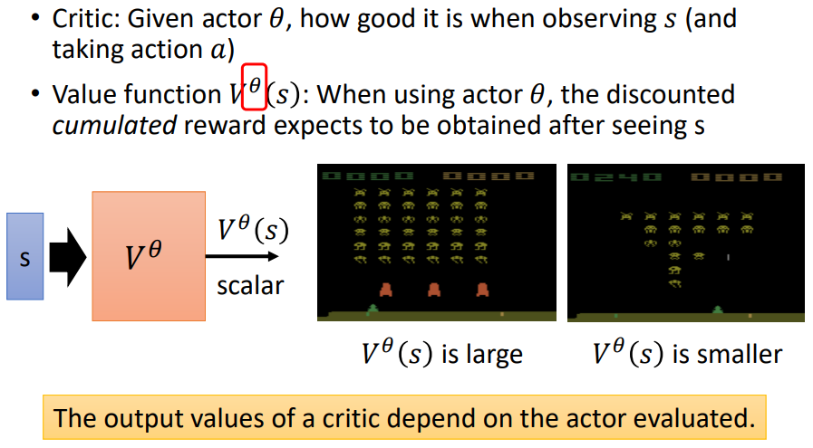

其中，左边的游戏画面下（observation），还剩比较多的怪，如果 actor 比较强，可能可以得到比较多的 reward ，预估值高。

右边游戏画面，还剩比较少的怪，可以得到的 reward 可能比较少。

value function 是针对某个 actor 而言的，不同 actor 的预估情况应当不同。如果 actor 比较弱，怪比较多时，可能预估值会小（被更快杀死）。

### 如何训练出 critic

一般有两种方法：

- Monte-Carlo (MC) based approach
- Temporal-difference (TD) approach

#### MC

让 actor 与环境交互，每个 episode 可以得到对应的 discounted cumulated reward ，作为训练 value function 的数据。

训练 value function 时，对于某一个 $s_a$ 的输出，其与之前的 reward 越接近越好：

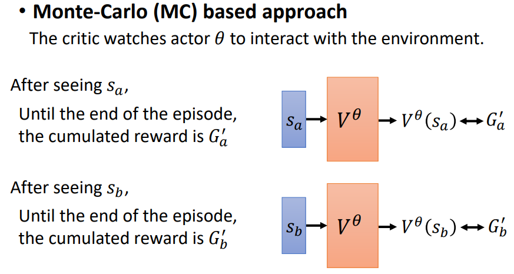

#### TD

TD 不需要训练一个完整的 episode 才能训练 value function 。

只需要产生出 $s_t, a_t, r_t, s_{t+1}$（当前 observation，当前 action，当前相应的 reward，下一时刻的 observation）的数据即可训练 value function 。

TD 假设前后相邻时刻的 $V^{\theta}(s_t), V^{\theta}(s_{t+1})$ 间存在关系，更具体的，是递推关系。

将 $s_t,s_{t+1}$ 分别输入 value function ，得到 $V^{\theta}(s_t), V^{\theta}(s_{t+1})$ ，我们不知道他们的 label ，但知道它们的差是多少，最小化与差的差距即可：

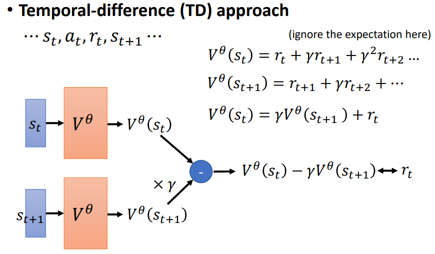

其中，分别输入的 $V^{\theta}$ 参数相同。

### version 3.5

可以将 version 3 的 $b$ 设置为 critic 的值：

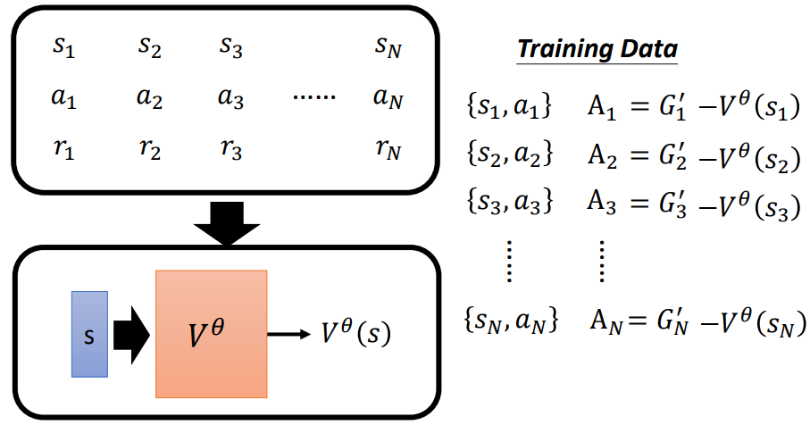

critic 相当于对某个 $s_a$ 的可能对应的多个 action 的 $G'$ 的期望值（平均值）：

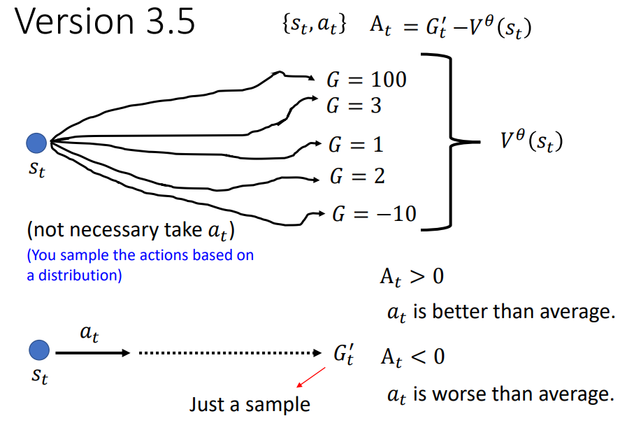

其中，上图的 $G$ 应为 $G'$ 。

如果比 critic 好，就给 $A_t \gt 0$ ，比 critic 差，就给 $A_t \lt 0$ 。

action 是 sample 出来的，有多个可能结果。

使用 $G'_t$ 减去 critic，相当于用 $s_a$ 可能对应的其中一个 action 与 critic 相比去衡量这个决策的好坏，而 critic 代表了多个可能 action 的平均结果。

sample 出的其中一个 action 可能特别好或特别坏，可以考虑 sample 多个 action 后综合起来衡量。

### version 4

version 4 使用多个 action 的 reward 的平均，与 critic 相减，衡量该决策的好坏（用期望衡量期望）。

这个方法叫 Advantage Actor-Critic ：

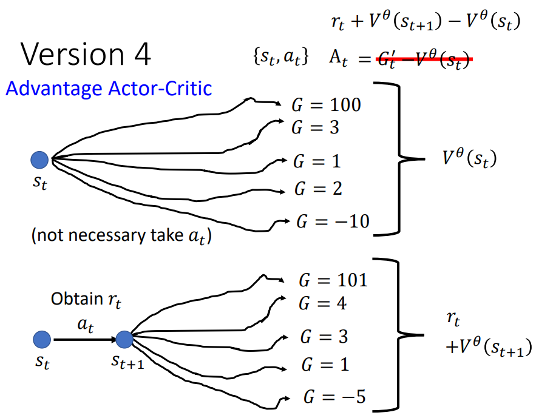

其中，上图的 $G$ 应为 $G'$ 。

本来需要多次交互才能得到 $s_a$ 对应的所有 action 的 reward 的平均值，但如果 critic 比较好，可以多走一步，使用 $r_t + V^{\theta}(s_{t+1})$ 代表该平均值。

由 $A_t$ 的意义，如果 $r_t + V^{\theta}(s_{t+1})$ 比 $V^{\theta}(s_{t})$ 大，则当前 $a_t$ 比较好，比随机 sample 出的 action $a_t$ 好。

### Tip of Actor-Critic

Actor 和 Critic 输入一样的数据，它们的一些参数可以共用：

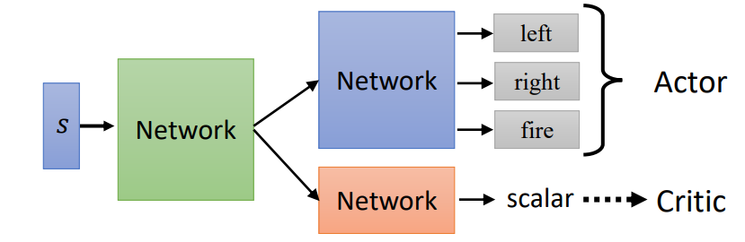

其中，绿色部分为共用 network 。

## Reward Shaping

- Sparse Reward 的情况

	大部分 reward 都是 0 ，只在某些情况有一个比较大的 reward 。

比如下围棋，只在最后一子决定胜负。

如果是训练机械手抓取物品，如果只有拿到物品才有 reward，那么随机初始的 Actor 会导致机械手胡乱挥舞，无法训练。

可以使用 reward shaping 提供额外的 reward ，这往往需要 domain knowledge 。

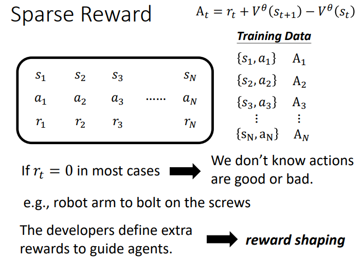

## No Reward: Learning from Demonstration

- 有些情况的 reward 可能非常难以定义。
- 手工的 reward 可能导致不可控的行为。

### Imitation Learning

让 actor 和环境互动，但没有 reward 。

为了让 actor 在没有 reward 的情况下学习，使用人类进行示范，记录人类和环境的互动数据，作为 demonstration ：

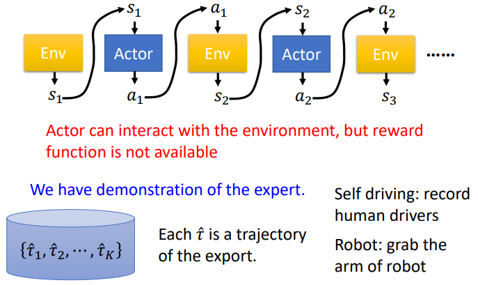

其中，export 应当为 expert 。

这类似监督学习，如果将所有示范当作 label ，全部 observation 都进行示范，那么叫做 behavior cloning ：

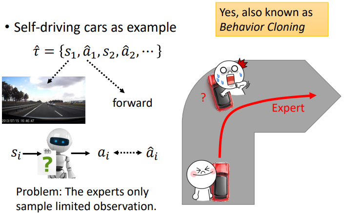

- cloning 会导致 actor 没有办法应对没有学习过的情况。

- cloning 可能会让 actor 学习到不需要学习的人类的个人习惯的特征。

	这些不需要学习的特征，学习到后，可能不会导致严重的后果；但 actor 能力有限，如果只学习到部分的个人习惯的特性，可能导致不好的后果。

### Inverse Reinforcement Learning

正向的 RL 中，actor 从 environment 和 reward 学习。

而 inverse RL（IRL）中，actor 从 demonstration 和 environment 学习 reward ，然后再用这个 reward 进行训练。

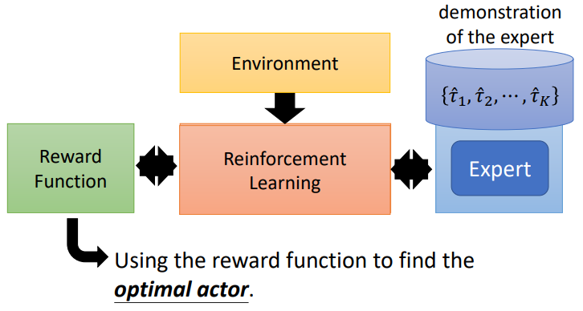

inverse RL 假设 demonstration 可以取得最高的 reward ，但不一定是最好的行为：

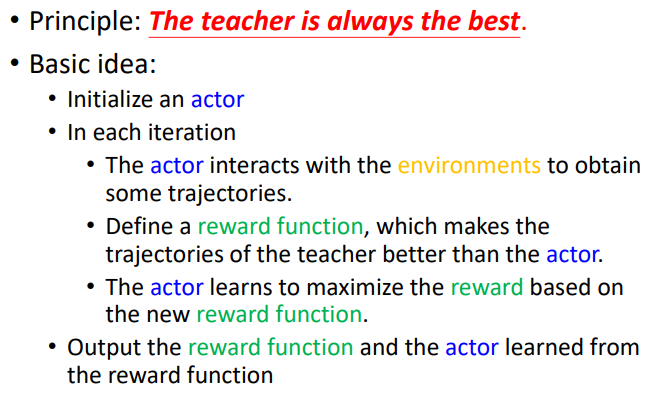

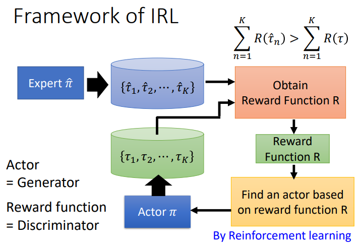

IRL 与 GAN 类似：

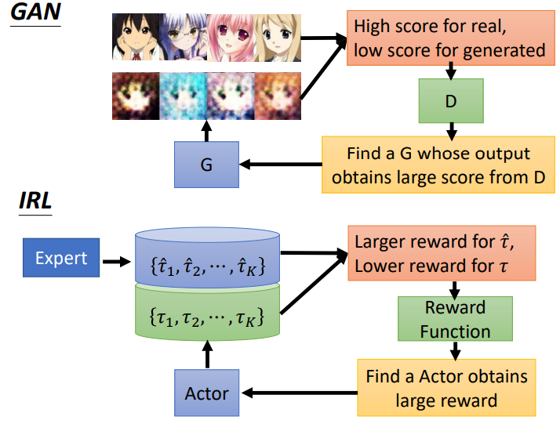

