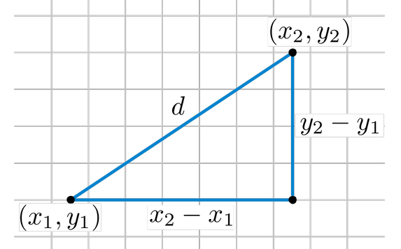
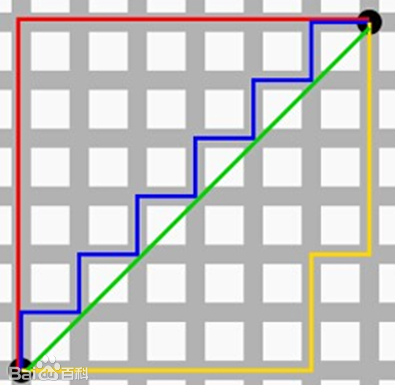
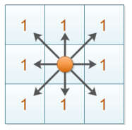

# 距离度量

## 三种基本距离

### 欧氏距离（Euclidean Distance）

其在二维中即是两点间的直线距离。

对于 $X(a_1, a_2 \cdots a_n)$ 与 $Y(b_1, b_2 \cdots b_n)$：

$$Euclidean\ distance = \sqrt{\sum\limits_{i=1}^n(a_i - b_i)^2}$$

### 曼哈顿距离（Manhattan Distance）

两点间投影到坐标轴上的长度之和。

对于 $X(a_1, a_2 \cdots a_n)$ 与 $Y(b_1, b_2 \cdots b_n)$：

$$Manhattan\ distance = \sum\limits_{i=1}^n|a_i - b_i|$$

上图中绿线是欧氏距离，红蓝黄是三个等价的曼哈顿距离。

### 切比雪夫距离（Chebyshev Distance）

两点各维度数值差的最大值。

对于 $X(a_1, a_2 \cdots a_n)$ 与 $Y(b_1, b_2 \cdots b_n)$：

$$Chebyshev\ distance = \max\limits_i^n(|a_i - b_i|)$$

上图即在切比雪夫距离 $1$ 下能够辐射到的范围。

曼哈顿距离与切比雪夫距离的差别：前者只能上下左右走，后者还能斜着走。

## 闵可夫斯基距离（Minkowski Distance）

闵可夫斯基距离不是一种距离，而是一组距离的定义，随其参数的改变，其代表不同的距离。

$$Minkowski\ distance = \sqrt[p]{\sum\limits_{i=1}^n|a_i - b_i|^p}$$

其中 $p$ 是一个变参：

- $p = 1$ 时，为曼哈顿距离。
- $p = 2$ 时，为欧氏距离。
- $p \to \infty$ 时，为切比雪夫距离。
- $p = one\ of\ others$ 时，表示其它距离。

