# 最优化方法

**最优化方法（Optimization Method）**即使损失函数最小化的方法，也可叫**优化器（Optimizer）**。

- 局部最优解（Local Optimum）局部最小值（Local minimum）（minimum 的复数为 minima）

- 全局最优解（Global Optimum）全局最小值（Global minimum）

- 梯度上升（Gradient Increase）

	将下降问题转化为上升问题。

优化器的优化不是万能的，其在模型整体优化的作用只占一小部分，当更换或改进优化器后仍不能取得满意的结果，要考虑是否是数据或模型架构等因素出了问题。

## 总览

- 普通梯度下降（Vanilla Gradient Descent，Gradient Descent，**GD**）
- 批次训练
  - **BGD**
  - **SGD**
  - **MBGD**
- 动量梯度下降（Gradient Descent with Momentum， **Momentum**）
  - 随机动量梯度下降（SGD with Momentum，**SGDM**）
  - Nesterov 加速梯度（Nesterov Accelerated Gradient，**NAG**）
- 自适应学习率（Adaptive Learning Rate）
  - 自适应梯度下降（Adaptive Gradient Descent，**AdaGrad**）
  - 均方根传播（Root Mean Square Propagation，**RMSProp**）
  - 自适应梯度差值下降（Adaptive Gradient Descent with Delta，**AdaDelta**）
  - 学习率调度（Learning Rate Scheduling，**Scheduling**）
- 梯度下降优化基（AdaGrad + Momentum + Scheduling）
- 自适应矩估计（Adaptive Moment Estimation)
  - 自适应矩估计（Adaptive Moment Estimation，**Adam**）
  - 基于无穷级数的 Adam 变体（a variant of Adam based on the infinity norm, **AdaMax**）
- 算法切换（Switch Adam to SGDM，**SWATS**）
- Adam 的优化
	- 使用最大化平方梯度的 Adam（Adam with Max Square Gradient，**AMSGrad**）
	- 动态边界 Adam（Adam with Dynamic Bound，**AdaBound**）
	- Nesterov 加速的 Adam（Nesterov Accelerated Adam，**NAdam**）
	- 修正的 Adam（Rectified Adam，**RAdam**）
	- 权重衰减 Adam（Adam with Weight Decay，**AdamW**）
		- 权重衰减 SGDM（SGD with Weight Decaied Momentum，**SGDWM**）
- **Lookahead**

## 重要对比

SGDM 和 Adam 分别抢到了优化算法的两个极端。

- SGDM
  - 训练速度中等，收敛效果好。
  - 验证准确率高。
  - 测试集上泛化能力强，较稳定。
- Adam
  - 训练快，收敛效果中等。
  - 验证准确率中等。
  - 测试集上泛化能力中等，不稳定。

尝试综合两种算法特性的算法有 AdaBound，SWATS 。

- SGDM 一般用在 CV 领域。
- Adam 一般用在 NLP ，语音识别，GAN ，强化学习等领域。

## 普通梯度下降

函数在可微点沿负梯度方向下降最多。

1. 将参数表示为一个向量 $\boldsymbol \theta$ 。

2. 随机选取一个初始值 $\boldsymbol\theta_0$ 。也可随机选取多个初始值，多做几次。

3. 对全部参数求偏导 $\boldsymbol g = \nabla L(\boldsymbol \theta_t),\boldsymbol \theta_{t} = \boldsymbol \theta_{t-1} - \eta \boldsymbol g$ ，学习率 $\eta$ 可控制下降的跨度。

4. 不断重复迭代，直到设定次数停止或结果无法继续求偏导。

$$
\boldsymbol \theta_{t} \leftarrow \boldsymbol \theta_{t-1} - \eta \boldsymbol g
$$

注意，不是对输入参数求偏导，而是对模型权重参数求偏导，输入参数，输出参数和标签的值将被代入到偏导中，以计算出偏导的具体值，从而用于更新权值。

## 批次训练

- 批量梯度下降法（Batch Gradient Descent，BGD）

	每次更新使用所有样本。

- 随机梯度下降法（Stochastic Gradient Descent，SGD）

	每次更新随机使用一个样本。目前常说的 SGD 准确地说应该是 MBGD 。

- 小批量梯度下降法（Mini-batch Gradient Descent，MBGD）

	每次更新使用一个批次的样本。

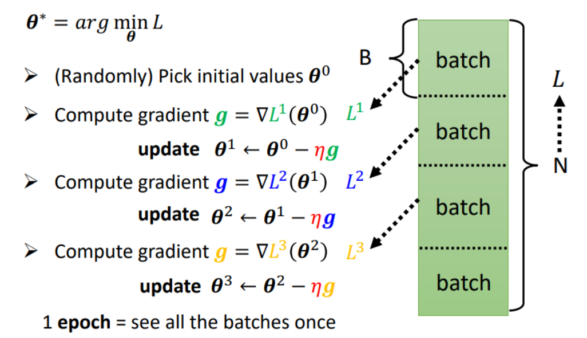

- 批次（Batch）

  将样本分批次输入模型进行训练，更新参数（每批次的梯度一般取每个样本梯度的平均值），以加速计算过程。

- Epoch

	将所有样本都分批训练完，即将训练集使用完一次，称为一个 epoch 。

- step，Iteration

	梯度（模型）更新的次数。划分 batch 后，一个 batch 更新算一个 step。
	

一个批次的大小（Batch Size）和进行 epoch 的次数常做为超参数。

一个样本包含神经网络的所有输入参数，一个样本的训练包含前向传播和反向传播两个过程。

在神经网络的训练过程中，训练集会被利用多次，即同一个样本会被多次输入神经网络进行训练，次数取决于 epoch 。

## Momentum

### SGDM

SGD + Momentum ，严格地说应该是 MBGD + Momentum 。

普通梯度下降中每次往当前梯度的反方向更新参数，而引入**动量（Momentum）**计算后，每次往当前梯度的反方向与上一次更新的（正）方向的综合方向更新参数。
$$
\begin{cases}
	\boldsymbol m_{t} \leftarrow \lambda \boldsymbol m_{t-1} - \eta \boldsymbol g_{t} \\\\
	\boldsymbol \theta_{t} \leftarrow \boldsymbol \theta_{t-1} + \boldsymbol m_{t}
\end{cases}
$$
其中，上一次动量 $m_i$ 就是上一次更新的方向，超参数 $\lambda$ 控制上一次动量的作用强度，$\eta$ 为梯度的学习率。

注意：$\boldsymbol \theta$ 是位置向量，$\boldsymbol m, \boldsymbol g$ 是方向向量。

普通梯度下降：

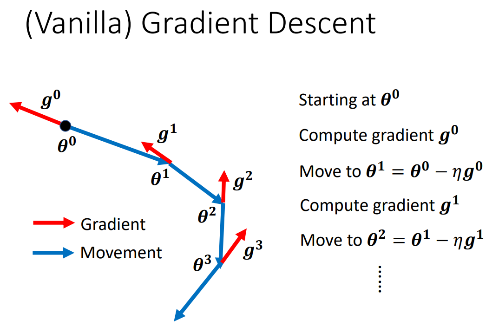

动量方法：

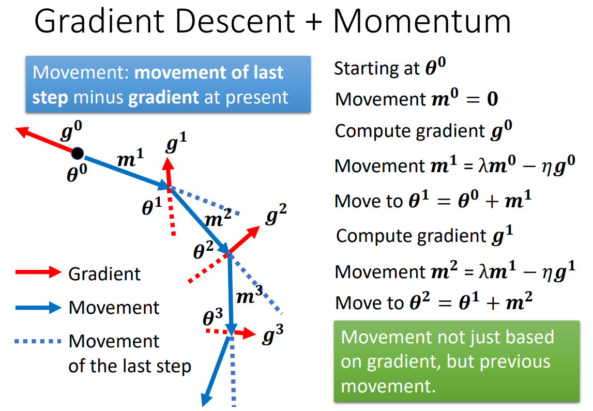

实际上，动量 $\boldsymbol m_i$ 也可以理解为此前所有梯度 $\boldsymbol g_0, \boldsymbol g_1, \dots , \boldsymbol g_{i-1}$ 的综合：
$$
\begin{align}
	\boldsymbol m_0 & = 0 \\
	\boldsymbol m_1 & = -\eta \boldsymbol g_0 \\
	\boldsymbol m_2 & = - \lambda \eta \boldsymbol g_0 - \eta \boldsymbol g_1 \\
	& \ \ \vdots \\
\end{align}
$$
若取 $\lambda = 1$ ，有 $\boldsymbol m_i = - \eta \sum\limits^{i - 1}_{j = 0} \boldsymbol g_j$ 。

在有动量时，即使陷入局部最小值（梯度为 $0$），仍然可以依靠动量提供的作用继续运动：

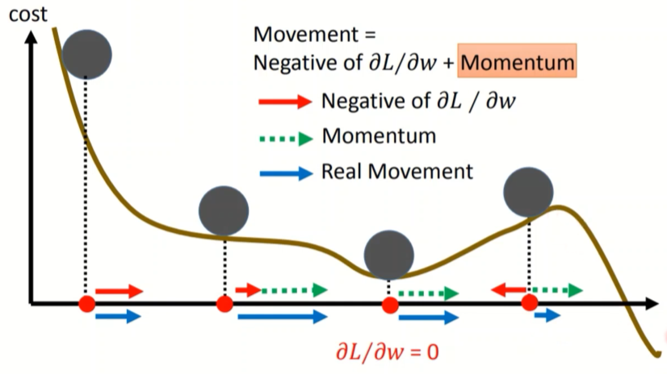

### NAG

Nesterov 是算法发明人的名字。

含有 Momentum 的优化器都可以使用 Nesterov 优化。

#### 朴素 NAG

在走到某处时，NAG 不利用当前的梯度，而是先利用之前的动量试探下一步的梯度 $\boldsymbol g(\boldsymbol \theta_{t-1} + \gamma \boldsymbol m_{t-1})$，再与之前的动量综合，更新当前参数：
$$
\begin{cases}
	\boldsymbol m_t \leftarrow \lambda \boldsymbol m_{t-1} - \eta \boldsymbol g(\boldsymbol \theta_{t-1} + \gamma \boldsymbol m_{t-1}) \\\\
	\boldsymbol \theta_t \leftarrow \boldsymbol \theta_{t-1} + \boldsymbol m_t
\end{cases}
$$
其中，朴素 NAG 可以新增超参数 $\gamma$ ，表示在计算试探梯度时使用多少强度的之前动量（使用多少强度动量达到的试探梯度），若不新增，用 $\lambda$ 替换即可。

朴素 NAG 的计算需要保存试探前后两套参数，可以进行优化。

#### 优化 NAG

将 $\gamma$ 用 $\lambda$ 替换，结合朴素 NAG 的更新式，作以下推导：
$$
\begin{align}
let \ \ \boldsymbol \theta_t^{\prime}
& = \boldsymbol \theta_{t} + \lambda \boldsymbol m_t \\
& = \boldsymbol \theta_{t-1} + \boldsymbol m_t + \lambda \boldsymbol m_t \\
& = \boldsymbol \theta_{t-1} + \lambda \boldsymbol m_t + \lambda \boldsymbol m_{t-1} - \eta \boldsymbol g(\boldsymbol \theta_{t-1} + \lambda \boldsymbol m_{t-1}) \\
& = \boldsymbol \theta_{t-1}^{\prime} + \lambda \boldsymbol m_t - \eta \boldsymbol g(\boldsymbol \theta_{t-1}^{\prime})
\end{align}
$$
有：
$$
\begin{cases}
\boldsymbol m_t \leftarrow \lambda \boldsymbol m_{t-1} - \eta \boldsymbol g(\boldsymbol \theta_{t-1}^{\prime}) \\\\
\boldsymbol \theta_t^{\prime} \leftarrow \boldsymbol \theta_{t-1}^{\prime} + \lambda \boldsymbol m_t - \eta \boldsymbol g(\boldsymbol \theta_{t-1}^{\prime})
\end{cases}
$$
其中，$\boldsymbol\theta_0^{\prime}$ 初始化为 $0$ ，从而只需保存一套参数。（可将 $\boldsymbol \theta^{\prime}$ 看作 $\boldsymbol \theta$）

#### 效果

NAG 向前试探：

- 如果前方梯度大，可能是大坡，使用前方梯度进行大步长移动，更快到达前方。
- 如果前方梯度小，使用前方梯度进行小步长移动，更谨慎地前进。

向前试探本质上是利用了近似二阶导的信息，所以比 SGDM 收敛更快。

#### 动量改写

SGDM 可以进行改写：
$$
\begin{cases}
	\boldsymbol m_{t} \leftarrow \lambda \boldsymbol m_{t-1} - \eta \boldsymbol g_{t} \\\\
	\boldsymbol \theta_{t} \leftarrow \boldsymbol \theta_{t-1} + \boldsymbol m_{t}
\end{cases}
\implies
\begin{cases}
	\boldsymbol m_{t} \leftarrow \lambda \boldsymbol m_{t-1} - \eta \boldsymbol g_{t} \\\\
	\boldsymbol \theta_{t} \leftarrow \boldsymbol \theta_{t-1} + \lambda \boldsymbol m_{t-1} - \eta \boldsymbol g_{t}
\end{cases}
$$
可以看到，优化 NAG 只是把 SGDM 的 $\lambda \boldsymbol m_{t-1}$ 换成了 $\lambda \boldsymbol m_{t}$ 。

## 自适应学习率

一般希望在平坦的位置学习率大，加快提升移动距离；在陡峭的位置学习率小，防止越过最优解。

采用动态学习率，使学习率在**每个参数**和**每个 iteration** 间动态变化大小。

对于第 $t+1$ 次更新的 $\boldsymbol \theta_{t+1}$ 的每一分量，变换学习率 $\eta \to \frac {\eta} {\boldsymbol \sigma_t}$：
$$
\boldsymbol \theta_{t+1} \leftarrow \boldsymbol \theta_t - \frac {\eta} {\boldsymbol \sigma_t} \boldsymbol g_t
$$
需要考虑 $\boldsymbol \sigma_t$ 的计算方法。

### AdaGrad

#### 原始策略

采用累计平方梯度，初始化 $\boldsymbol r_0 = \boldsymbol 0$ ：
$$
\begin{cases}
	\boldsymbol r_t = \boldsymbol r_{t-1} + \boldsymbol g_t^2 = \sum\limits^t_{i = 0} \boldsymbol g_i^2 \\\\
	\boldsymbol \sigma_t = \sqrt{\boldsymbol r_t + \epsilon}
\end{cases}
$$
其中，$\boldsymbol g^2_t = \boldsymbol g_t \odot \boldsymbol g_t$ ；$\epsilon$ 是一个很小的常数，防止初始梯度为 $0$ 时 $\sigma$ （分母）为 $0$ ，一般取 $\epsilon = 10^{-7}$，当初始化 $\boldsymbol r_0 = \epsilon$ 时，可以在更新式中省略 $\epsilon$ 。

采用累计平方梯度， $\boldsymbol r$ 可能快速增大，从而学习率快速减小，导致模型更新速率过早变得缓慢。

#### 改进策略

来自李宏毅老师的课程版本。

对梯度做**指数移动平均（Exponential Moving Average，EMA）**：
$$
\begin{cases}
	\boldsymbol r_t = \frac 1 {t + 1} \sum\limits^t_{i = 0} \boldsymbol g_i^2 \\\\
	\boldsymbol \sigma_t = \sqrt{\boldsymbol r_t + \epsilon}
\end{cases}
$$
也可将 $\boldsymbol \sigma_t$ 看做此前及当前所有梯度的**均方根（Root Mean Square）**：
$$
\boldsymbol \sigma_t
= RMS(\boldsymbol g_{(\dots)})
= \sqrt {\frac 1 {t + 1} \sum\limits^t_{i = 0} \boldsymbol g_i^2}
$$
当坡度平缓时，历次求得的梯度较小，从而求出的 $\sigma$ 较小，学习率变大；反之坡度陡峭时，学习率变小。

#### 缺陷

下方是两个参数的 error surface 。黑点是起点，黄叉是最优解，红色高，紫色底，黄叉上下两侧是山谷状。

左侧是大学习率，在山谷震荡；右侧是小学习率，进入谷底后移动缓慢。

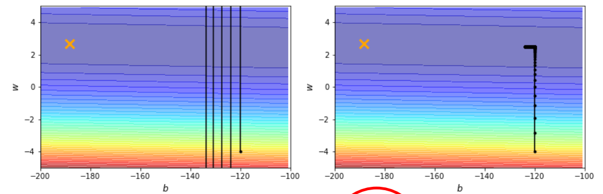

使用 AdaGrad 后，在 C 阶段出现异常情况：

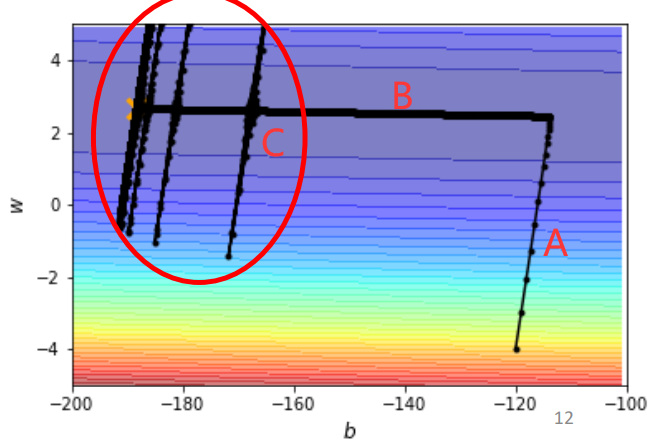

AdaGrad 综合了此前所有的梯度。

- 在 A 阶段，横向梯度小，纵向梯度大，于是横向分量的 $\sigma$ 积累得非常小，纵向学习率小。
- 在 A 转 B 处，积累的横向分量的小 $\sigma$ 到一个程度，就使得横向学习率增大，横向大距离移动。
- 在 B 阶段，横向梯度大，纵向梯度小，于是纵向分量的 $\sigma$ 积累的非常小，横向学习率大。
- 在 B 到 C 突变处，积累的纵向分量的小 $\sigma$  到一个程度，就使得纵向学习率增大，纵向大距离移动，产生突变。
- 在 C 阶段，突变后在山谷两侧震荡，但山谷上梯度大，于是 $\sigma$ 变大，学习率变小，震荡逐步变小，然后又沿着山谷前进，反复突变，直到到达最优点。

使用 Learning Rate Scheduling 可以消除这种分量突变现象。

### RMSProp

RMSProp 是 AdaGrad 的改进，添加了超参数 $\alpha$ ，对梯度做**指数加权移动平均（Exponential Weighted Moving Average，EWMA）**，然后开根号：
$$
\begin{cases}
	\boldsymbol r_t = \alpha \boldsymbol r_{t-1}^2 + (1 - \alpha) \boldsymbol g_t^2 \\\\
	\boldsymbol \sigma_t = \sqrt{\boldsymbol r_t + \epsilon}
\end{cases}
$$
其中，$\epsilon$ 的意义和处理与 AdaGrad 一致。

也可将 $\boldsymbol \sigma_t$ 看做此前及当前所有梯度的**加权均方根（Weighted Root Mean Square）**：
$$
\boldsymbol \sigma_t
= WRMS(\boldsymbol g_{(\dots)})
= \sqrt {\alpha \boldsymbol r_{t-1}^2 + (1 - \alpha) \boldsymbol g_t^2}
$$
在考虑此前及当前梯度大小的基础上，通过调整 $\alpha$ 可以调整当前梯度相对于此前所有梯度的重要性，即当前梯度的作用强度，能够在当前梯度发生变化时，更快改变学习率的值。

$\alpha$ 也称为**衰减系数（Attenuation Coefficient）**指某些物理量例如光子、声波、电子、粒子的数量或能量等，在物体中单一方向行进贯穿的难易程度。$\alpha$ 设置越大，前进阻力越大，越难“贯穿“。

### AdaDelta

AdaDelta 是 AdaGrad 的另一种改进，与 RMSProp 同一时期出现。以下使用原文的符号表示。

AdaDelta 在 RMSProp 的策略上又考虑了前后步**位置差**的指数加权移动平均 $\Delta \boldsymbol x$ ，初始化 $\boldsymbol s_0 = 0, \Delta \boldsymbol x = 0$ ：
$$
\begin{cases}
	\boldsymbol s_t = \rho \boldsymbol s_{t-1}^2 + (1 - \rho) \boldsymbol g_t^2 \\\\
	\boldsymbol g_t^{\prime} = \frac {\sqrt{\Delta \boldsymbol x_{t-1} + \epsilon}} {\sqrt{\boldsymbol s_t + \epsilon}} \boldsymbol g_t \\\\
	\boldsymbol x_t \leftarrow \boldsymbol x_{t-1} - \boldsymbol g_t^{\prime} \\\\
	\Delta \boldsymbol x_t = \rho \Delta \boldsymbol x_{t-1} + (1-\rho) (\boldsymbol g_t^{\prime})^2
\end{cases}
$$
其中 $\epsilon$ 是为了保持数值稳定性而添加的小常数，更改初始化值可以从式子中消去 $\epsilon$ 。

AdaDelta 不必设置学习率这个超参数，相当于用 $\sqrt{\Delta \boldsymbol x_{t-1}}$ 作为了 $\eta$ （ $\sqrt{\boldsymbol s_t}$ 作为 $\sigma$ ）。

- 当 $\Delta \boldsymbol x$ 大，$\boldsymbol s$ 大时

	- 可能处在大坡上。（应大步长移动，但具体步长需看相对大小）
	- 也可能处在陡峭的山谷中震荡。（应小步长深入山谷，但具体步长需看相对大小）

- 当 $\Delta \boldsymbol x$ 大，$\boldsymbol s$ 小时

	可能从坡到达平地。（大步长移动，广泛探索）

- 当 $\Delta \boldsymbol x$ 小，$\boldsymbol s$ 大时

	可能从平地到达坡。（小步长移动，仔细搜索最优解）

- 当 $\Delta \boldsymbol x$ 小，$\boldsymbol s$ 小时

	可能平地，可能最优解。（应记录局部最优解，并大步长跳出，但具体步长需看相对大小）

### Scheduling

变换学习率 $\eta \to \frac {\eta_t} {\boldsymbol \sigma_t}$ ，使得 $\eta$ 随时间（迭代次数）变化。
$$
\boldsymbol \theta_{t+1} \leftarrow \boldsymbol \theta_t - \frac {\eta_t} {\boldsymbol \sigma_t} \boldsymbol g_t
$$
需要考虑随时间变化的方式。

#### LR range test

测试不同**学习率（Learing Rate，LR）**的效果，绘制图像寻找最优学习率。（该方法并未动态调度学习率）

#### Decay

随着训练进行，不断减小 $\eta$ 。即随着不断接近最优点，不断使学习率减小。

加上 Decay 后，AdaGrad 的分量突变现象得到解决：

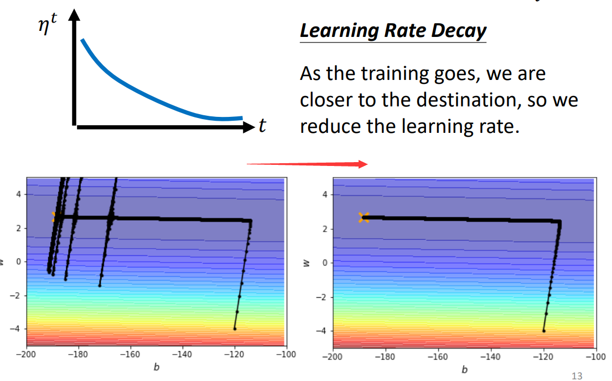

#### Warm Up

随着训练进行，先增大 $\eta$ ，再减小 $\eta$ 。即先使学习率从小变大，再逐步变小。

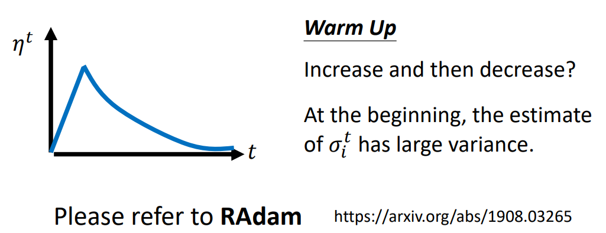

一种粗略的解释是：$\sigma$ 是统计结果，优化一开始，数据较少，$\sigma$ 精准，不易用大学习率大幅移动；等到初期探索积累了足够的 error surface 的情况后，逐步增大学习率，探索；最后再逐步减小学习率，收敛。（RAdam 是 Adam 的进阶版）

#### Cyclical LR

使学习不断周期性大小变化。

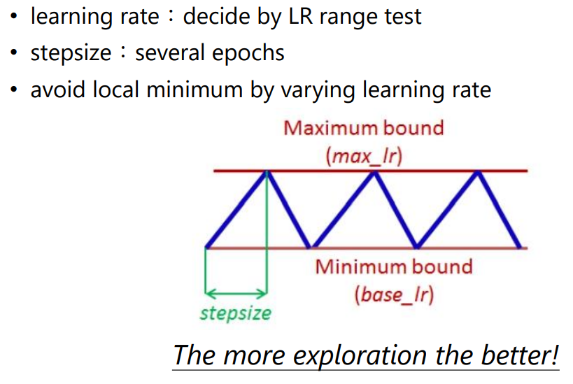

学习率大时，尝试探索，学习率小时，尝试收敛。

一般的学习率调度是学习率越来越小，该策略比一般的学习率调度更鼓励进行探索，以跳出局部最小值，当已经收敛的一个较好的最优解时（平坦的最优解），学习率变大应当不易跳出该解。

#### SGDR

（SGD with Warm Restarts）

学习率从大到小，每周期学习率变小后不缓慢增加，直接调到最大，继续减小。

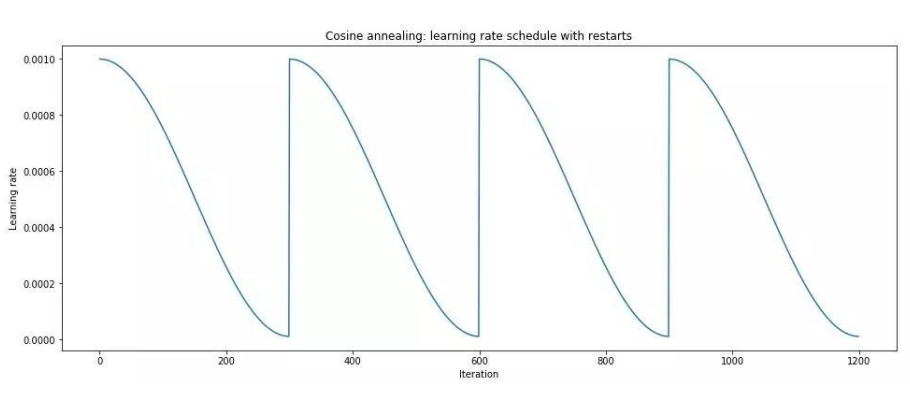

#### One-Cycle LR

不周期性变化，只进行一个周期（one-cycle），但分成三个阶段，先大胆探索，然后尝试收敛，最后仔细收敛。

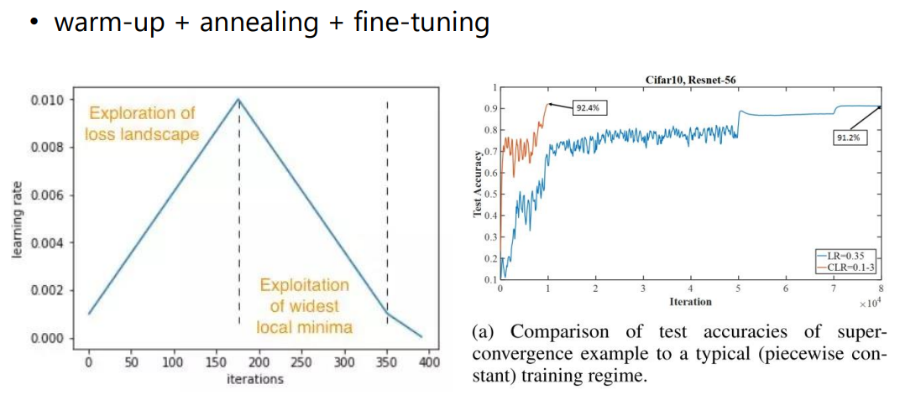

## 梯度下降优化基

AdaGrad + Momentum + Scheduling

李宏毅老师讲到的一个综合用法。

- 此前及当前
	- 控制梯度大小和方向，即**动量** $m$（Momentum） 
	- 控制梯度**大小** $\sigma$（AdaGrad） 

- 学习率
	- 控制**调度** $\eta$ （Scheduling）

**梯度下降优化方法基本都是对以上三个参数计算方法的不同设置（对其的泛化）。**
$$
\boldsymbol \theta_{t+1} \leftarrow \boldsymbol \theta_t - \frac {\eta_t} {\boldsymbol \sigma_t} \boldsymbol m_t\ ,\ \ 
\begin{cases}
	\boldsymbol m_t = \sum\limits^{t - 1}_{i = 0} \boldsymbol g_i \\\\
	\boldsymbol \sigma_t = \sqrt {\frac 1 {t + 1} \sum\limits^t_{i = 0} \boldsymbol g_i^2}
\end{cases}
$$

- 分子的动量考虑此前梯度的大小及方向。（Momentum）
- 分母的 $\sigma$ 只考虑此前及当前梯度的大小。（AdaGrad）

## 自适应矩估计

### Adam

相当于 RMSProp + Momentum ，是目前最常用的梯度下降策略。

#### 原文描述

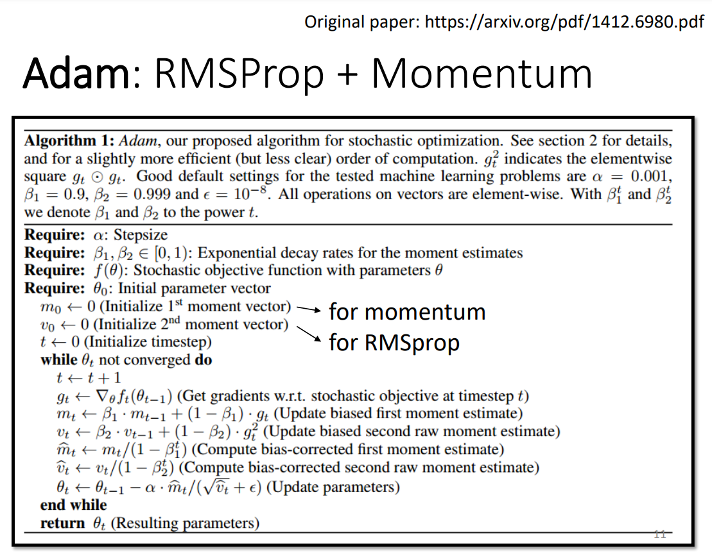

推荐超参数默认值：
- $\alpha = 0.001$
- $\beta_1 = 0.9$
- $\beta_2 = 0.999$
- $\epsilon = 10^-8$

#### 矩估计

计算梯度的一阶原点矩（变量的期望）和二阶原点矩（变量平方的期望）：
$$
\begin{cases}
    \boldsymbol{m}_t = \beta_1 \boldsymbol{m}_{t-1} + (1 - \beta_1) \boldsymbol{g}_t, \\\\
    \boldsymbol{v}_t = \beta_2 \boldsymbol{v}_{t-1} + (1 - \beta_2) \boldsymbol{g}_t^2
\end{cases}
$$

- $\boldsymbol m$ 是累计梯度的动量（含方向）。（控制方向）

- $\boldsymbol v$ 是累计梯度大小的相对于零向量（原点矩）的变化剧烈程度（方差）。（控制速率，步长）
- $\beta$ 是衰减系数。（控制当前梯度的作用强度）

矩估计在训练初期样本使用尚少时（梯度方向较混乱）方差估计不准确，其会随着训练进行（已使用的样本变多）而估计准确度上升。

#### 修正

将 $\boldsymbol m_t, \boldsymbol v_t$ 展开有：
$$
\begin{cases}
	\boldsymbol m_t = (1 - \beta_1) \sum\limits^t_{i = 1} \beta^{t - i}_1 \boldsymbol g_i \\\\
	\boldsymbol v_t = (1 - \beta_2) \sum\limits^t_{i = 1} \beta^{t - i}_2 \boldsymbol g^2_i
\end{cases}
$$
其中 $\beta^t$ 代表 $\beta$ 的 $t$ 次方。

为了使样本 $\boldsymbol m_t$ 成为总体 $\boldsymbol g_t$ 的无偏估计，使样本 $\boldsymbol v_t$ 成为总体 $\boldsymbol g^2_t$ 的无偏估计，需要使期望 $E(\boldsymbol m_t) = E(\boldsymbol g_t)$ ，$E(\boldsymbol v_t) = E(\boldsymbol g^2_t)$ 。以后者为例：
$$
\begin{align}
	E(\boldsymbol v_t) & = E\left[(1 - \beta_2) \sum\limits^t_{i = 1} \beta^{t - i}_2 \boldsymbol g^2_i \right] \\
	& = E(\boldsymbol g^2_t) (1 - \beta_2) \sum\limits^t_{i = 1} \beta^{t - i}_2 + \zeta \\
	& = E(\boldsymbol g^2_t) (1 - \beta^t_2) + \zeta
\end{align}
$$
其中，$\sum\limits^t_{i = 1} \beta^{t - i}_2$ 是个等比数列和，$\zeta$ 是估计偏差，其会随着计算步数增多而趋近于 $0$，从而能修正为 $E(\boldsymbol { \hat m_t}) = E(\boldsymbol g_t)$ ， $E(\boldsymbol{ \hat v_t }) = E(\boldsymbol g^2_t)$ 。

较直观地说，由于 $\boldsymbol m, \boldsymbol v$  初始为 $\boldsymbol 0$ ，若不修正，则在默认初始值下初期 $\boldsymbol m_t, \boldsymbol v_t$ 的计算结果会偏小（趋于 $0$），从而初期步长 $\frac {\boldsymbol {\hat m}_t} {\sqrt {\boldsymbol {\hat v}_t} + \epsilon}$ 过大。

应对一阶矩和二阶矩做修正：
$$
\begin{cases}
	\boldsymbol {\hat m}_t = \frac {\boldsymbol m_t} {1 - \beta^t_1} \\\\
	\boldsymbol {\hat v}_t = \frac {\boldsymbol v_t} {1 - \beta^t_2}
\end{cases}
$$
随着训练进行，$\beta^t$ 越来越小，分母越来越接近 $1$ ，从而该修正对初期计算影响大，后期影响逐渐减小。

#### 梯度更新式

修正后得到的梯度更新式如下：

$$
\boldsymbol \theta_t \leftarrow \boldsymbol \theta_{t-1}
	- \frac {\alpha} {\sqrt {\boldsymbol {\hat v}_t} + \epsilon} \boldsymbol {\hat m}_t
$$

- $\boldsymbol g\prime$  是调整后的梯度。
- $\alpha$ 是调整后梯度的学习率。
- $\epsilon$ 是一个非常小的值，用于防止初始梯度为 $0$ 时导致的分母为 $0$ 。

#### 矩效果

- $||\boldsymbol m_t||$ 大，$\boldsymbol v_t$ 也大时

	说明梯度正负抵消的情况少，基本同号，且梯度的程度较大，处在一个"大坡“上。（大步长，快速下降）

- $||\boldsymbol m_t||$ 很小，$\boldsymbol v_t$ 大时

	说明梯度程度大，但正负抵消情况多，处在一个山谷中震荡。（小步长，深入山谷）

- $||\boldsymbol m_t||$ 很大，$\boldsymbol v_t$ 趋于 $0$ （很小）时

	这种情况不可能出现。

- $||\boldsymbol m_t||$ 趋于 $0$ （很小），$\boldsymbol v_t$ 趋于 $0$ （很小）时

	说明梯度趋于 $0$ ，可能处于一个局部最优解或大平原。（记录局优解，并大步长跳出）

#### 缺陷

模型训练后期，修正的效果几乎可以忽略不计，从而 Adam 的计算过程：
$$
\begin{cases}
    \boldsymbol{m}_t = \beta_1 \boldsymbol{m}_{t-1} + (1 - \beta_1) \boldsymbol{g}_t, \\\\
    \boldsymbol{v}_t = \beta_2 \boldsymbol{v}_{t-1} + (1 - \beta_2) \boldsymbol{g}_t^2 \\\\
    \boldsymbol \theta_t \leftarrow \boldsymbol \theta_{t-1}
		- \frac {\eta} {\sqrt {\boldsymbol {\hat v}_t} + \epsilon} \boldsymbol {\hat m}_t
\end{cases}
$$

其中关于自适应学习率的部分 $\boldsymbol{v}_t = \beta_2 \boldsymbol{v}_{t-1} + (1 - \beta_2) \boldsymbol{g}_t^2$ ，其使用移动加权平均，当取默认超参数值 $\beta = 0.999$ 时，过去的梯度造成的影响将近持续 1000 次更新。此时大部分的梯度都会比较小，提供的方向信息微弱不显著，只有某几个 batch 的梯度会很大，提供明确的方向信息。当出现以下情况：

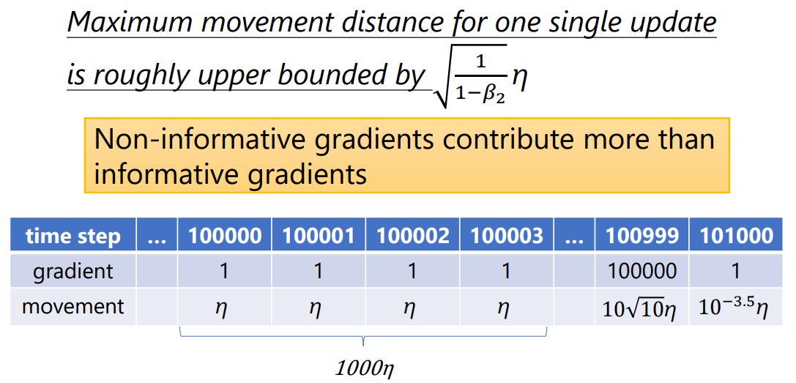

其中，在后期有持续 1000 个梯度为 $1$ ，每次造成 $\eta$ 的更新量，一共造成 $1000 \eta$ 的更新量（后期的大量小梯度）。

当出现一个 $g = 100000$ 的大梯度时，此时冲量 $\hat { \boldsymbol m}$ 较小，近似等于梯度，根据梯度更新式计算后，该梯度只产生大约 $10 \sqrt {10} \eta \approx 30 \eta$ 的更新量。其后又出现一个小梯度，将产生 $10^{-3.5} \eta$ 的更新量。

可见，后期中较少出现的较有意义的梯度的效果被大量效果小的梯度所限制。Adam 的作者提出的该情况解法为 AMSGrad 。

### AdaMax

AdamMax 是 Adam 基于无穷范数的变体，其更改了 Adam 中梯度长度（大小）的计算方式（范数）。

#### 原文描述

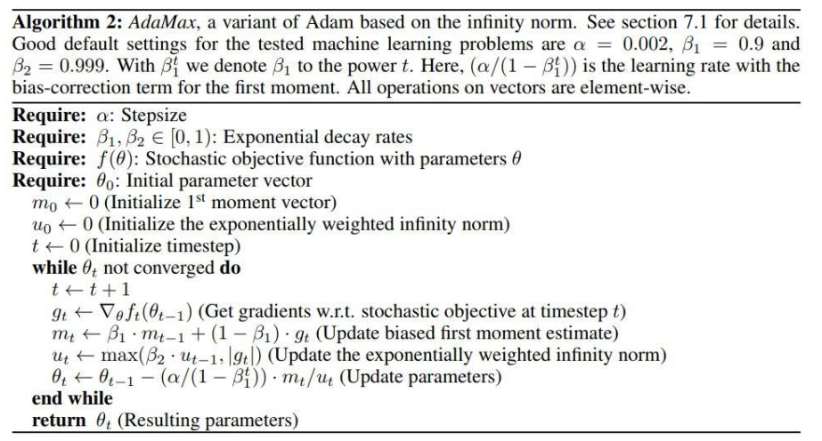

推荐超参数默认值：

- $\alpha = 0.002$
- $\beta_1 = 0.9$
- $\beta_2 = 0.999$

#### 范数

**范数（Norm）**是具有“长度”概念的函数，对于向量，**向量范数**是对向量长度的某种定义，是衡量向量长度的某种度量标准，可以看作向量到零向量的某种距离。综合上向量方向可以看作向量之间的差异。

- $L_p$ 范数

	向量范数通式，对应二维平面**闵可夫斯基距离（Minkowski Distance）**。

$$
L_p = ||\boldsymbol x||_p = (\sum\limits^n_{i=1} |x_i|^p)^{\frac 1 p}
$$

- $L_0$ 范数，$p = 0$（0 范数）

	 0 范数并不是一个真正的范数，但表示向量中非零元素的个数。

- $L_1$ 范数，$p = 1$（1 范数）

	向量各元素绝对值之和，对应二维平面**曼哈顿距离（Manhattan Distance）**。

- $L_2$ 范数，$p = 2$（2 范数）

	向量各元素平方之和再开平方根，对应二维平面**欧几里得距离（Euclidean Distance）**。

- $L_{\infty}$ 范数，$p \to \infty$（无穷范数）

	向量各元素无穷次方和再开无穷次方根，对应二维平面**切比雪夫距离（Chebyshev Distance）**。

$$
L_{\infty}
= ||\boldsymbol x||_{\infty}
= \lim\limits_{p \to \infty} (\sum\limits^n_{i=1} |x_i|^p)^{\frac 1 p}
= \max\limits^n_{i=1} (|x_i|)
$$

#### 变换推导

将 $\boldsymbol v_t$ 做变换：
$$
\begin{align}
	\boldsymbol v_t
	& \to \beta_2^p \boldsymbol{v}_{t-1} + (1 - \beta_2^p) \boldsymbol{g}_t^p \\
	& = (1 - \beta_2^p) \sum\limits^t_{i = 1} \beta^{p(t - i)}_2 \boldsymbol g^p_t
\end{align}
$$
扩展为无穷范数：
$$
\begin{align}
	\boldsymbol u_t = \lim\limits_{p \to \infty} (\boldsymbol v_t)^{\frac 1 p}
	& = \lim\limits_{p \to \infty} \left( (1 - \beta_2^p) \sum\limits^t_{i = 1} \beta^{p(t - i)}_2 |\boldsymbol g_i|^p \right)^{\frac 1 p} \\
	& = \lim\limits_{p \to \infty} (1 - \beta_2^p)^{\frac 1 p} \left( \sum\limits^t_{i = 1} \beta^{p(t - i)}_2 |\boldsymbol g_i|^p \right)^{\frac 1 p} \\
	& = \lim\limits_{p \to \infty} \left( \sum\limits^t_{i = 1} \left(\beta^{t - i}_2 |\boldsymbol g_i| \right)^p \right)^{\frac 1 p} \\
	& = \max\limits^t_{i=1} (\beta^{t - i}_2 |\boldsymbol g_i|)
\end{align}
$$
其中，$0 \lt \beta_2 \lt 1$，最终结果相当于迭代式：
$$
\boldsymbol u_t = \max(\beta_2 \boldsymbol u_{t-1}, |\boldsymbol g_t|)
$$
其中 $\boldsymbol u_0 = \boldsymbol 0$ 。

#### 算法形式

一阶矩，二阶矩：
$$
\begin{cases}
    \boldsymbol{m}_t = \beta_1 \boldsymbol{m}_{t-1} + (1 - \beta_1) \boldsymbol{g}_t, \\\\
    \boldsymbol u_t = \max(\beta_2 \boldsymbol u_{t-1}, |\boldsymbol g_t|)
\end{cases}
$$
$\boldsymbol{m}_t$ 仍然需要修正为 $\boldsymbol {\hat m}_t$ ，但 $\boldsymbol u_t$ 使用 $\max$ 操作，不存在初始化偏向 $0$ 的情况，不需要再修正。

最终梯度更新式如下：
$$
\boldsymbol \theta_t \leftarrow \boldsymbol \theta_{t-1} - \frac {\alpha} {\boldsymbol u_t} \boldsymbol {\hat m}_t
$$

## SWATS

Begin with Adam(fast), end with SGDM(better convergence).

- 前期用训练速度快的 Adam 。

- 满足一定条件切换优化器。

	- 需要确定切换时机满足的条件。

	- 需要将 Adam 的参数转换到 SGDM 。

		Adam 使用自适应学习率，而 SGDM 是全局固定学习率。

- 后期用收敛效果好的 SGDM 。

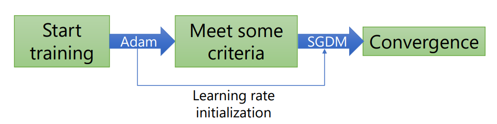

## Adam 的优化

### AMSGrad

使用最大化过去平方梯度 $\hat {\boldsymbol v_t}$ 来更新参数，而不是使用移动加权平均 $\boldsymbol v_t$ ，这样就解决了移动加权平均造成的 Adam 后期大梯度被小梯度抑制的收敛问题。

同样要使用一阶矩估计和二阶矩估计：
$$
\begin{cases}
    \boldsymbol{m}_t = \beta_1 \boldsymbol{m}_{t-1} + (1 - \beta_1) \boldsymbol{g}_t, \\\\
    \boldsymbol{v}_t = \beta_2 \boldsymbol{v}_{t-1} + (1 - \beta_2) \boldsymbol{g}_t^2
\end{cases}
$$
其使用过去最大的平方梯度更新参数：
$$
\hat {\boldsymbol v_t}=max(\hat {\boldsymbol v}_{t-1}, \boldsymbol v_t)
$$
更新式：
$$
\boldsymbol \theta_t \leftarrow \boldsymbol \theta_{t-1}
	- \frac {\alpha} {\sqrt {\boldsymbol {\hat v}_t} + \epsilon} \boldsymbol m_t
$$
模仿 SWATS，在训练前期使用 Adam，在训练后期使用 AMSGrad ，从而 AMSGrad 不再需要修正，迁移参数也是容易的。

当梯度突然变得很大时，AMSGrad 粗暴地选取最大的梯度值，从而学习率会突然变得很小，导致训练停滞，有人提出了 AdaBound 这个解决方法。

### AdaBound

不能让梯度小时的学习率太大，梯度大时的学习率太小，AdaBound 采用对学习率设置动态上下界的方式裁剪学习率的范围。

计算一阶和二阶矩估计：
$$
\begin{cases}
    \boldsymbol{m}_t = \beta_1 \boldsymbol{m}_{t-1} + (1 - \beta_1) \boldsymbol{g}_t, \\\\
    \boldsymbol{v}_t = \beta_2 \boldsymbol{v}_{t-1} + (1 - \beta_2) \boldsymbol{g}_t^2
\end{cases}
$$
更新式：
$$
\boldsymbol \theta_t \leftarrow \boldsymbol \theta_{t-1}
	- Clip\left( \frac {\eta} {\sqrt {\boldsymbol {\hat v}_t + \epsilon} } \right) \hat {\boldsymbol m}_t
$$
其中，作者给出的 $Clip()$ 函数定义如下（作者没有解释该式子的由来）：
$$
Clip(x) = Clip\left( x, 0.1 - \frac {0.1} {(1-\beta_2)t + 1}, 0.1 + \frac {0.1} {(1-\beta_2)t} \right)
$$
$Clip()$ 函数为学习率设置一个**下界（Lower Bound）**，一个**上界（Upper Bound）**，其范围随时间增大不断收紧。

该函数是对 SGDM 和 Adam 的一般化：

- 当  $L = U = \eta^*$ 时，学习率被固定为 $\eta^*$ ，只与一阶矩有关，相当于 SGDM 。
- 当 $L = 0, U = \infty$ 时，学习率动态变动， $L,U$ 最终收敛为同一个值，与一阶矩和二阶矩有关，相当于 Adam 。

AdaBound 训练速度比肩 Adam，性能媲美 SGDM ，但在后期调优时仍然常用到 SGDM 。

### NAdam

Adam 相当于 Momentum + RMSProp，而 Momentum 可以使用 Nesterov 加速，从而将 Nesterov 用于 Adam 就有了 NAdam，其相当于 Nesterov + Adam （Nesterov + Momentum + RMSProp）。

Adam 中有关动量的部分：
$$
\begin{cases}
	\boldsymbol{m}_t = \beta_1 \boldsymbol{m}_{t-1} + (1 - \beta_1) \boldsymbol{g}_t, \\\\
	\boldsymbol {\hat m}_t = \frac {\boldsymbol m_t} {1 - \beta^t_1} \\\\
	\boldsymbol \theta_t \leftarrow \boldsymbol \theta_{t-1}
		- \frac {\alpha} {\sqrt {\boldsymbol {\hat v}_t} + \epsilon} \boldsymbol {\hat m}_t
\end{cases}
$$
#### 朴素 NAG

朴素 NAG 先利用之前的动量试探下一步的梯度 $\boldsymbol g(\boldsymbol \theta_{t-1} + \gamma \boldsymbol m_{t-1})$，再与之前的动量综合，更新当前参数，只需要修改：
$$
\boldsymbol{m}_t = \beta_1 \boldsymbol{m}_{t-1} + (1 - \beta_1) \boldsymbol{g} \left(
	\boldsymbol \theta_{t-1} - \gamma \frac {\boldsymbol {\hat m}_{t-1}} {\sqrt {\boldsymbol {\hat v}_{t-1}} + \epsilon}
\right)
$$

#### 优化 NAG

展开 Adam 关于动量的式子：
$$
\begin{align}
\boldsymbol \theta_{t}
& = \boldsymbol\theta_{t-1}-\frac{\alpha}{\sqrt{ \hat {\boldsymbol v}_{t}}+\epsilon}(\frac{\beta_{1} \boldsymbol m_{t-1}}{1-\beta_{1}^t}+\frac{(1-\beta_{1}) \boldsymbol g_{t}}{1-\beta_{1}^t}) \\
& = \boldsymbol\theta_{t-1}-\frac{\alpha}{\sqrt{ \hat {\boldsymbol v}_{t}}+\epsilon}(\beta_{1} \boldsymbol {\hat m}_{t-1} + \frac{(1-\beta_{1}) \boldsymbol g_{t}}{1-\beta_{1}^t})
\end{align}
$$
与 SGDM 的动量改写同理，直接用 $\boldsymbol {\hat m}_{t}$ 替换 $\boldsymbol {\hat m}_{t-1}$ ，得到 NAdam 的更新式（其余式子同 Adam）：
$$
\boldsymbol \theta_{t} = \boldsymbol\theta_{t-1}-\frac{\alpha}{\sqrt{ \hat {\boldsymbol v}_{t}}+\epsilon}(\beta_{1} \boldsymbol {\hat m}_{t} + \frac{(1-\beta_{1}) \boldsymbol g_{t}}{1-\beta_{1}^t})
$$

### RAdam

相当于自动 warm up 的 Adam 。

Adam 训练速度较快，但初期梯度混乱，学习率误差大，容易在少量数据下进行过度跳跃，做出错误决策，陷入局部最优解。

#### 梯度分布

矩估计在训练初期样本使用尚少时（梯度方向较混乱）**方差（Varience）**估计不准确，从而需要 warm up 在初期使用较小的学习率，从而限制初期的探索。

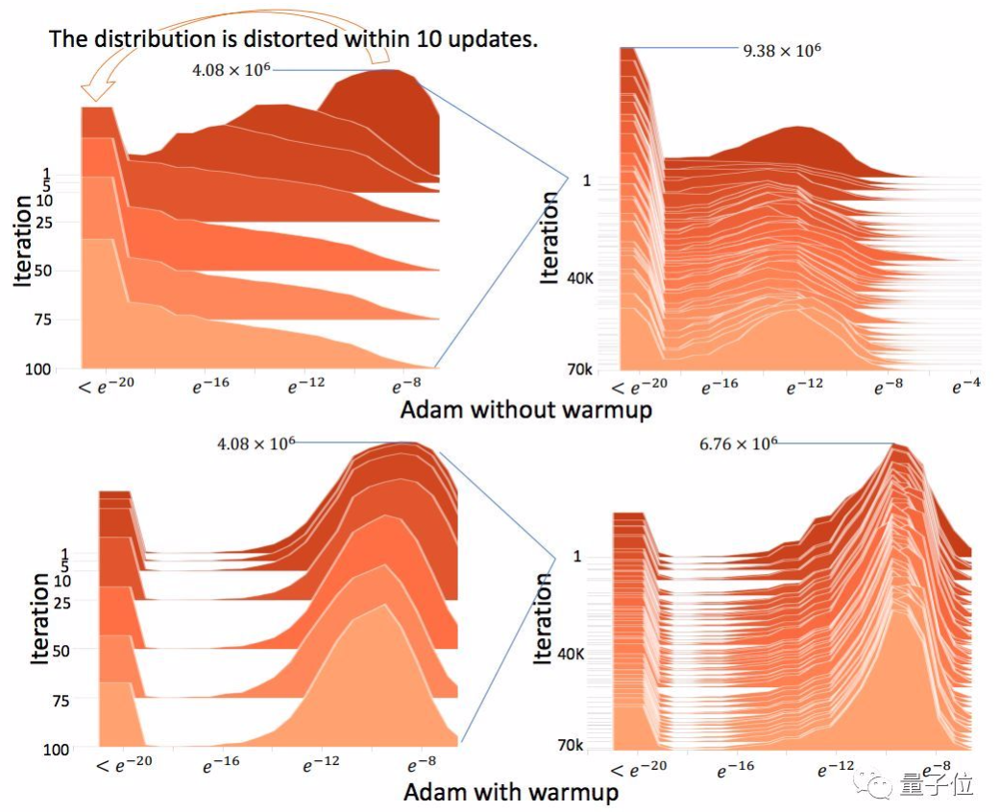

可以看到，没有 warm up 时，初期梯度大小的分布偏大且比较混乱，容易误导方向；warm up 之后分布变得稳定。

#### 原文描述

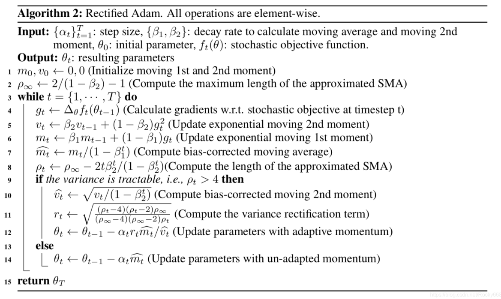

#### 矩估计

RAdam 的矩估计与 Adam 的矩估计略有不同：
$$
\begin{cases}
    \boldsymbol{m}_t = \beta_1 \boldsymbol{m}_{t-1} + (1 - \beta_1) \boldsymbol{g}_t \\\\
    \boldsymbol{v}_t = \frac 1 {\beta_2} \boldsymbol{v}_{t-1} + (1 - \beta_2) \boldsymbol{g}_t^2
\end{cases}
$$
修正也略有不同：
$$
\begin{cases}
    \boldsymbol {\hat m}_t = \frac {\boldsymbol m_t} {1 - \beta^t_1} \\\\
    \hat{ \boldsymbol v}_t = \sqrt \frac {\boldsymbol v_t} {1 - \beta_2^t}
\end{cases}
$$

#### SMA

warm up 启用的时机由 $\rho_t$ 来估计:

$$
\rho_{t}=\rho_{\infty}-\frac{2t\beta_{2}^2}{1-\beta_{2}^t}\ ,\ \ 
\rho_{\infty}=\frac{2}{1-\beta_{2}}-1
$$
$\rho_t$ 是近似**简单移动平均值（SMA）**的长度，作者认为当 $SMA \le 4$ 时，修正项的方差是难以控制的，是无效的（$r_t$ 根号内为负） 。

- 当 $\rho_t \le 4$ ，使用 SGDM 。

$$
\boldsymbol \theta_t \leftarrow \boldsymbol \theta_{t-1} - \alpha_t \hat { \boldsymbol m}_t
$$

#### 修正项

为了提升 Adam 的稳定性，作者定义了**修正项（Rectification Term）**，提供自适应学习率方差的功能，将 $\boldsymbol v_t$ 的二阶矩估计（方差）控制在一个常数范围内。

作者证明，当迭代次数趋于无穷大时，二阶矩估计的方差 $var(\boldsymbol v_t)$ 会趋于一个稳定的常数，因此定义 $r_t = \sqrt \frac {var(\boldsymbol v_{\infty})} {var(\boldsymbol v_t)}$，有：
$$
r_t = \sqrt \frac {(\rho_t - 4) (\rho_t - 2) \rho_{\infty}} {(\rho_{\infty} - 4) (\rho_{\infty} - 2) \rho_t}
$$

- 当 $\rho_t \gt 4$ ，使用 Adam + 修正项。

$$
\boldsymbol \theta_t \leftarrow \boldsymbol \theta_{t-1}
	- \frac {\alpha_t r_t} {\boldsymbol {\hat v}_t} \boldsymbol {\hat m}_t
$$

修正项乘在学习率上，以修正学习率。（相当于学习率调度 warmup）

作者假设梯度是从某个分布中抽样出来的，因此 $r$ 只与 $t$ 有关，$r$ 与 $t$ 的图像（warm up 的图像）：

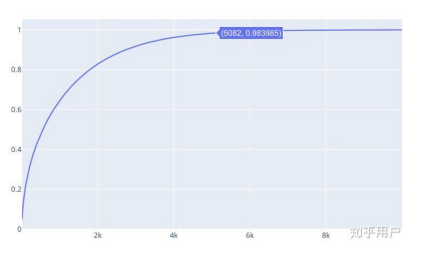

### AdamW

正则化和权重衰减都可以防止过拟合，AdamW 采用**权重衰减（Weight Decay）**，其对于 Adam 效果更好。

#### 正则化

一般的 L2 正则化是在损失函数后添加正则项 $L_{l_2}() = L() + \frac 1 2 \gamma ||\boldsymbol \theta||^2$，其会影响梯度的计算。

有 Adam + L2 regularization ：
$$
\begin{cases}
    \boldsymbol{m}_t = \beta_1 \boldsymbol{m}_{t-1} + (1 - \beta_1) [\nabla(L) + \gamma \boldsymbol \theta_{t-1}], \\\\
    \boldsymbol{v}_t = \beta_2 \boldsymbol{v}_{t-1} + (1 - \beta_2) [\nabla(L) + \gamma \boldsymbol \theta_{t-1}]^2
\end{cases}
$$

#### 权重衰减

weight decay 不同于正则化，它直接作用于梯度更新式，不作用于一阶矩和二阶矩。

有 Adam + weight decay（AdamW）：
$$
\boldsymbol \theta_t \leftarrow \boldsymbol \theta_{t-1}
	- \alpha (\frac {1} {\sqrt {\boldsymbol {\hat v}_t} + \epsilon} \boldsymbol {\hat m}_t - \gamma \boldsymbol \theta_{t-1})
$$

#### SGDWM

SGDM + weight decay ，直接作用于梯度更新式，不作用于动量：
$$
\begin{cases}
	\boldsymbol m_{t} \leftarrow \lambda \boldsymbol m_{t-1} - \eta \boldsymbol g_{t} \\\\
	\boldsymbol \theta_{t} \leftarrow \boldsymbol \theta_{t-1} + \boldsymbol m_{t} -\gamma \boldsymbol \theta_{t-1}
\end{cases}
$$

## Lookahead

一个优化器（Optimizer）的包装器（Wrapper），可以套用到各种优化算法上。

类似 Nesterov 的思想，向前试探后再做出最终行动： step forward, $1$ step back.

先按内部优化器更新 $k$ 次，然后取这 $k$ 次的起点和终点连线的中间点为这 $k$ 次更新的最终位置（回退点），反复。

step back 可以避免进入到太陡峭的山谷，只有在非常平坦的区域才能收敛，这增强了模型收敛的稳定性，加强了泛化性能。

起点和终点的中间点是 step back 回退程度最大的位置（最需要更平坦的区域用于收敛），回退点靠起点或靠终点时，对收敛区域的平坦性要求都没有中间点高。

lookahead 对参数不敏感，对超参数具备较好的鲁棒性。

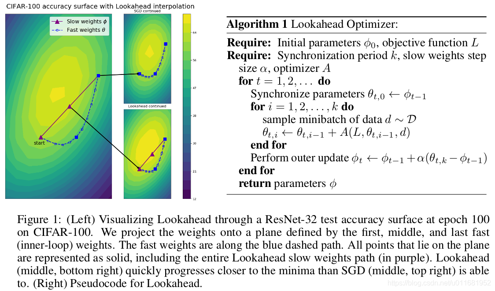

Lookahead 包含两套权重：

- Fast Weights（蓝线）

	由内循环优化器（inner-loop）生成的 $k$ 次序列权重。

- Slow Weights（红线）

	每轮内循环结束后由 $k$  次内部权重计算得到的权重。
