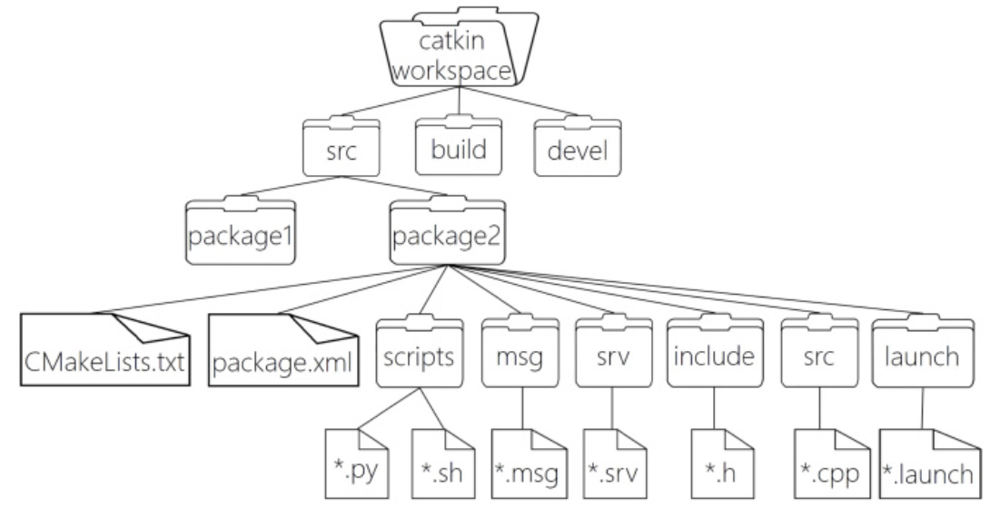
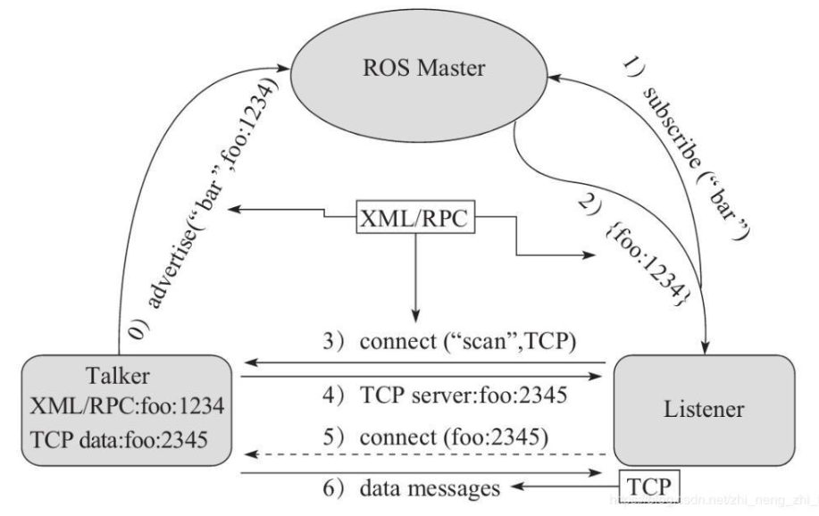
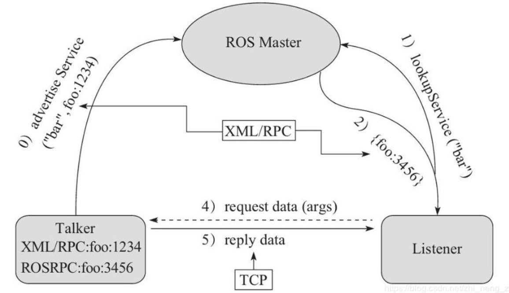
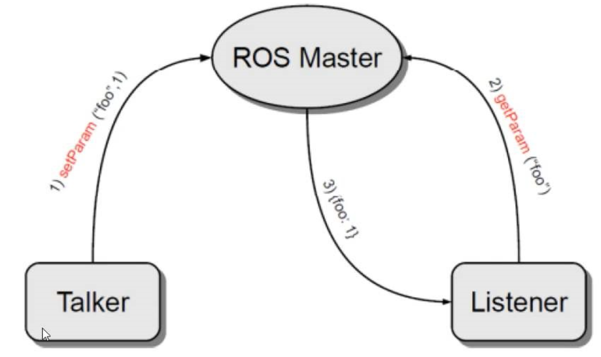
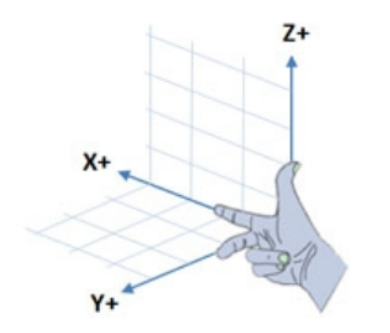
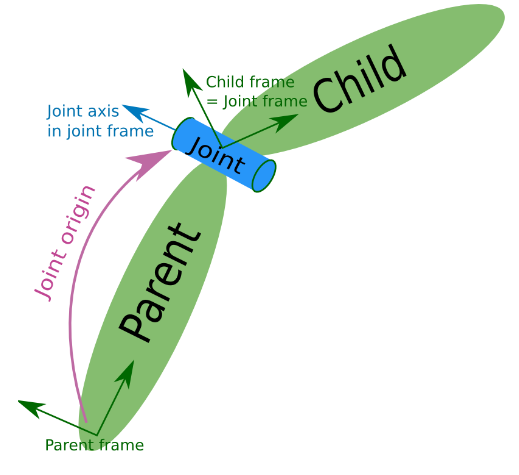

# ROS

- 机器人操作系统（Robot Operating System，ROS）

	对机器人的软硬件进行抽象模块化的一套软件框架。

[视频课程参考文档-赵虚左](http://www.autolabor.com.cn/book/ROSTutorials/)

ROS 是进程（也称为 Node，节点）的分布式框架，每个节点由一个进程表示。

ROS 一般在 Ubuntu 上使用，新版本 ROS2 也可在 Windows 10 上使用，可能工作是使用历史上的版本，所以建议使用 Ubuntu 。

ROS 程序一般使用 C++ 或 Python 。

## 使用注意

- 安装的版本一定要和 Ubuntu 的版本对应上，否则会找不到包。
- 安装可参考：[Ubuntu20.04.4安装ROS Noetic详细教程 - 知乎](https://zhuanlan.zhihu.com/p/515361781)

## ROS 程序构建基本步骤

1. 创建工作空间（workspace）

	1. `mkdir -p demo_ws/src`
	2. 在工作空间内使用 catkin_make 命令建立环境，会生成 build devel 两个文件夹。

2. 创建功能包并添加依赖

  一般在 src 子目录下建立，使用 `catkin_create_pkg <自定义包名> roscpp rospy std_msgs` 命令。

  - 包名没有特定扩展名。
  - 该功能的依赖项
	- roscpp 为 C++ 实现的库。
	- rospy 为 Python 实现的库。
	- std_msgs 为标准消息库。


3. 编辑源文件

4. 编辑配置文件（基于 CMake）

5. 编译及运行

### C++

- 在包内编辑源代码文件：

```c++
#include "ros/ros.h"   // 头文件

int main(int argc, char *argv[])
{
    //执行 ros 节点初始化
    ros::init(argc,argv,"hello");   // 节点名称
    
    //创建 ros 节点句柄(本例非必须)
    ros::NodeHandle nh;
    
    //控制台输出 hello world
    ROS_INFO("hello world!");   // 输出日志

    return 0;
}
```

- 编辑包内的 Cmakelist.txt 文件：

```shell
add_executable(
	可执行文件名
    src/源文件名.cpp
)
    
target_link_libraries(
    可执行文件名
	${catkin_LIBRARIES}
)
```

- 设置基本运行环境变量 `source ~/工作空间/devel/setup.bash` 。（不必每次反复执行，也可添加进环境变量配置文件）
- 在工作空间目录执行 `catkin_make` 进行编译。
- 启动核心 `roscore` 。
- 启动节点：`rosrun 包名 C++节点（即可执行文件名）` 。

### Python

- 在包内建立 `scripts` 文件夹。
- 编辑 Python 文件：

```python
#! /usr/bin/env python   # 指定解释器

import rospy   # 导入包

if __name__ == "__main__":   # 主入口
    rospy.init_node("hello")   # 节点名称
    rospy.loginfo("Hello World!!!!")
```

- 添加可执行权限：`chmod +x 文件名.py ` 。
- 编辑包内的 Cmakelist.txt 文件：

```shell
catkin_install_python(
    PROGRAMS scripts/文件名.py
    DESTINATION ${CATKIN_PACKAGE_BIN_DESTINATION}
)
```

- 设置基本运行环境变量 `source ~/工作空间/devel/setup.bash` 。
- 在工作空间目录执行 `catkin_make` 进行编译。
- 启动核心 `roscore` 。
- 启动节点：`rosrun 包名 文件名.py` 。

### launch 文件

launch 文件可以一次并发（不是从上到下）启动多个节点，自动完成启动核心等动作（仍要先使用 `source` 和进行编译）。

- 在包内建立 launch 文件夹，然后建立 `文件名.launch` 文件（XML 格式），设置启动的节点：

```xml
<launch>
    <!-- 输出 hello world 的节点 -->
    <node pkg="helloworld" type="demo_hello" name="hello" output="screen" />
    
    <!-- 海龟示例 -->
    <node pkg="turtlesim" type="turtlesim_node" name="t1"/>
    <node pkg="turtlesim" type="turtle_teleop_key" name="key1" />
    
</launch>
```

- 标签及属性：

  - node

  	包含的某个节点。

  - pkg

  	功能包。

  - type

  	要使用的可执行文件名（不是路径）。

  	- C++ 为编译后的可执行文件名。
  	- Python 为源文件名（有可执行权限）。

  - name

  	节点名。

  - output

  	日志输出到屏幕上要为 `output="screen"`。
  	
  - args

    传入参数。

- 运行 launch 文件：`roslaunch 包名 launch文件名` 。

更多设置见文档。

## ROS 架构

### ROS 文件系统

即 ROS 的项目文件夹结构。



- WorkSpace 
	
	自定义的工作空间。

    - build

        编译空间，用于存放 CMake 和 catkin 的缓存信息、配置信息和其他中间文件。

    - deve

        开发空间，用于存放编译后生成的目标文件，包括头文件、动态&静态链接库、可执行文件等。

    - src 源码

        - `CMakeLists.txt`

            工作空间内多个包的编译的配置。

        - package

            功能包（ROS 基本单元）包含多个节点、库与配置文件，包名所有字母小写，只能由字母、数字与下划线组成

            - `CMakeLists.txt`

            	包的配置编译规则，比如源文件、依赖项、目标文件。

            - `package.xml`

            	包的信息，如：包名、版本、作者、依赖项等（以前版本是 `manifest.xml`）。

            - scripts

            	存储 Python 或 Shell 等脚本文件。
  
            - src
  
            	存储 C++ 源文件。
  
            - include
  
            	头文件。
  
            - msg
  
            	消息通信格式文件。
  
            - srv
  
            	服务通信格式文件。
  
            - action
  
            	动作格式文件。
  
            - launch
  
            	存放 launch 文件。
  
            - config
  
            	配置信息。

### ROS 计算图

- `rqt_graph` 

	节点启动后使用，可以启动 ROS 的节点数据通信图形演示程序。

## ROS 通信机制

主要有三种形式：

- 话题通信（发布订阅模式）
- 服务通信（请求响应模式）
- 参数服务器（参数共享模式）

对比：

- topic 一般用于数据高频需要的功能，如雷达，里程计。
- service 一般用于数据低频需要的功能，如拍照，语音识别。

### 话题通信

- ROS Master

	管理者，根据话题建立 Talker 和 Listener 到连接。

- Talker（Publisher）

	发布者。

- Listener（Subscriber）

	订阅者。

话题相同可以互相通信。

使用 RPC 协议和 TCP 协议。



1. 注册信息

	使用 RPC 注册话题和自身节点信息。（Talker 或 Listener，都可存在多个）

2. 话题匹配

	Master 根据注册表中的信息进行匹配，并通过 RPC 向 Listener 发送 Talker 的 RPC 地址信息。

3. 连接请求

	Listener 根据接收到的 RPC 地址，通过 RPC 向 Talker 发送连接请求，传输订阅的话题名称、消息类型以及通信协议（TCP/UDP）。

4. 确认请求

	Talker 接收到 Listener 的请求后，也是通过 RPC 向 Listener 确认连接信息，并发送自身的 TCP 地址信息。

5. 建立连接

	Listener 通过 TCP 与 Talker 建立连接。（建立连接后可关闭 Master）

6. 发布消息

	Talker 可以开始发布消息。

#### C++

- 发布者

```c++
#include "ros/ros.h"
#include "std_msgs/String.h"   // 数据类型

int main(int argc, char *argv[]) {

    // 传入参数。
    // 设置节点名称，要保证在 ROS 网络中唯一。
    ros::init(argc,argv,"publisher");
    
    ros::NodeHandle nh;

    // 注册话题。
    // 发布的消息类型，话题名，消息队列最大长度。
    ros::Publisher publisher = nh.advertise<std_msgs::String>("topic_name", 10);

    // 设置执行频率，这里是 1 Hz，即每秒 1 次。
    ros::Rate rate(1);
    
    // 消息类型
    std_msgs::String msg;

    char str[] = "hello";

    // 若当前节点正在运行 ok
    while(ros::ok) {
        msg.data = str;
        publisher.publish(msg);

        // 打印日志
        ROS_INFO("publish: %s", str);   

        // 按设置的频率睡眠
        rate.sleep();

        // 让 subscriber 立即处理一次回调函数。
        ros::spinOnce();   // 这句也可不加，官方建议加上。
    }

    return 0;
}
```

- 订阅者

```c++
#include "ros/ros.h"
#include "std_msgs/String.h"


// 回调函数，处理收到的信息，一次一条，由 ConstPtr 指向。
void process_msg(const std_msgs::String::ConstPtr & msg_p) {
    ROS_INFO("get: %s", msg_p->data.c_str());
}

int main(int argc, char * argv[]) {
    ros::init(argc, argv, "subscriber");

    ros::NodeHandle nh;

    ros::Subscriber subscriber = nh.subscribe<std_msgs::String>("topic_name", 10, process_msg);

    // 自动循环处理回调函数。
    ros::spin();

    return 0;
}
```

#### Python

- 发布者

```python
#! /usr/bin/env python   # 指定解释器

import rospy   # 导入包
from std_msgs.msg import String

if __name__ == "__main__":   # 主入口
    rospy.init_node("publisher_py")
    
    publisher = rospy.Publisher("topic_name", String, queue_size=10)
    msg = String("hello hello")

    rate = rospy.Rate(1)
    while not rospy.is_shutdown():
        publisher.publish(msg)
        
        rospy.loginfo(f"publish {msg.data}")
        rate.sleep()
```

- 订阅者

```python
#! /usr/bin/env python   # 指定解释器

import rospy   # 导入包
from std_msgs.msg import String

def process_data(msg):
    rospy.loginfo(f"get {msg}")

if __name__ == "__main__":   # 主入口
    rospy.init_node("subscriber_py")

    publisher = rospy.Subscriber("topic_name", String, process_data, queue_size=10, )
    
    rospy.spin()   # 阻塞当前线程，使回调函数线程不断处理。
```

- 记得添加可执行权限。
- 注意，rospy 中没有 `spinOnce()` 函数，其有的 `.spin()` 函数功能为使该线程阻塞。rospy 有自己的处理回调函数的线程。

### 消息类型

#### 基本类型

ROS 常用数据类型包括：

- int32，uint32 ...

- float32，float64

- string

- time

	时间。

- duration

	时间间隔。

- header

	包含时间戳和坐标信息。
	
- variable-length array 和 fixed-length array

#### 自定义消息类型

即自定义一个消息类，其内的变量成员是 ROS 的原生类型。

1. 在工作空间建立 `msg` 目录创建 `类名.msg` 文件，最后会生成包含该文件指定数据类型的类，文件格式如下：

```
# 以下数据类型必须使用小写
string name
int32 age
...
```

2. 修改配置文件。

```xml
# 在 package.xml 中添加编译依赖和执行依赖。  
<build_depend>message_generation</build_depend>
<exec_depend>message_runtime</exec_depend>

# 以下为编辑 CMakeLists.txt 文件

# 在 find_package 添加 message_generation
find_package(catkin REQUIRED COMPONENTS
	std_msgs   # 必须有
	message_generation
)

# 配置 msg 源文件
add_message_files(
  FILES
  <类名>.msg
)

# 生成消息时依赖于 std_msgs
generate_messages(
  DEPENDENCIES
  std_msgs
)

# 执行时依赖
catkin_package(
  CATKIN_DEPENDS roscpp rospy std_msgs message_runtime   # 添加了 message_runtime
)
```

3. 使用 `catkin_make` 编译即可生成可以被 Python 或 C++ 调用的中间文件。
  - 在 `devel/include` 中会生成 `类名.h` 文件，可由 C++ 导入。
  - 在 `devel/lib` 中会生成 `_类名.py` 文件，可由 Python 导入。

- C++ 使用

```
# 导入
#include "包名/类名.h"
//可修改 VS Code 的 C++ include 路径，以供代码提示。

# 将包名作为其的名称空间。
包名::类名 obj   //建立对象

# 修改 CMakeLists.txt 的 add_dependencies
add_dependencies(原文件生成的目标文件名 ${PROJECT_NAME}_generate_messages_cpp)
```

- Python 使用

```python
# 导入
from 包名.msg import 类名
//可修改 VS Code 的 Python include 路径，以供代码提示。
```

### 服务通信

- ROS master
- Server
- Client

服务名称相同可以互相通信。

使用 RPC 协议和 TCP 协议。

1. 注册信息。
2. 信息匹配。
3. 发送请求。
4. 发送响应。

#### 服务文件

- srv 文件

	一个 srv 文件描述一个服务的信息结构（类型），包括两部分。将 srv 文件建立在 srv 目录下。

	- 请求（request）
	- 响应（response）

```
# 客户端请求时发送的信息
int32 num1
int32 num2

---     # 分隔线

# 服务器响应发送的信息
int32 sum
```

- 配置

```xml
# 在 package.xml 中添加依赖
<build_depend>message_generation</build_depend>
<exec_depend>message_runtime</exec_depend>

# 以下为 CMakeLists.txt 文件内

# find_package 添加 message_generation
find_package(catkin REQUIRED COMPONENTS
  roscpp
  rospy
  std_msgs
  message_generation
)

# 添加 srv 文件
add_service_files(
  FILES
  文件.srv
)

# 生成消息时依赖于 std_msgs
generate_messages(
  DEPENDENCIES
  std_msgs
)
```

- srv 文件生成的中间文件的目录和用法与自定义消息一致。

#### C++

- 服务端

```c++
#include "ros/ros.h"
#include "test/addition.h"   // 测试的 srv 文件，描述一个加法运算服务的数据

// 处理请求。
bool process_data(test::addition::Request & requst, test::addition::Response & response) {
    response.sum = requst.a + requst.b;
    return true;
}

int main(int argc, char * argv[]) {
    ros::init(argc, argv, "server");
    ros::NodeHandle nh;

    // 声明服务，建立 server 。
    ros::ServiceServer server = nh.advertiseService("service_name", process_data);

    ROS_INFO("service started");

    // 不断处理请求。
    ros::spin();

    return 0;
}
```

- 客户端

```c++
#include "ros/ros.h"
#include "test/addition.h"

int main(int argc, char * argv[]) {
    ros::init(argc, argv, "client");
    ros::NodeHandle nh;

    // 注册到服务，方式 1，建立 client
    ros::ServiceClient client = nh.serviceClient<test::addition>("service_name");

    // 注册到服务，方式 2，阻塞，成功后才继续执行。
    ros::service::waitForService("service_name");

    // srv 文件定义的信息，包含 request 和 response 两部分。
    test::addition info;
    info.request.a = 1;
    info.request.b = 2;

    // 发起请求。
    bool flag = client.call(info);

    if (flag) {
        ROS_INFO("got response %d", info.response.sum);   // response
    }

    return 0;
}
```

#### Python

- 服务端

```python
#! usr/bin/env python

import rospy

# 导入 srv 文件建立的包。
from test.srv import addition, additionRequest, additionResponse

# 处理请求。
def process_data(request):

    # 建立响应。
    response = additionResponse(request.a + request.b)

    rospy.loginfo(f"receive request {request.a} and {request.b}")
    return response

if __name__ == "__main__":
    rospy.init_node("server_py")

    # 声明服务。
    server = rospy.Service("service_name", addition, process_data)

    # 不断处理请求。
    rospy.spin()
```

- 客户端

```python
#! usr/bin/env python

import rospy
from test.srv import addition, additionRequest, additionResponse

if __name__ == "__main__":
    rospy.init_node("client_py")

    # 注册到服务，方式 1
    client = rospy.ServiceProxy("service_name", addition)

    # 注册到服务，方式 2
    rospy.wait_for_service("service_name")

    # 建立请求
    request = additionRequest(1, 2)

    # 发送请求，得到响应
    response = client.call(request)

    rospy.loginfo(f"receive response {response.sum}")
```

- 添加可执行权限。

### 参数服务器

- ROS Master
- Talker（参数设置者）
- Listener（参数调用者）

参数服务器是一个独立于所有节点的公共数据容器，可以被不同节点设置或获取数据。

使用 RFC 协议。



- 设置参数。
- 获取参数。

无需建立参数服务器，直接设置或获取参数即可。

#### C++

roscpp 提供了两种方式：

- `ros::NodeHandle nh`
- `ros::param::`

```c++
# 方式 1
ros::NodeHanele nh;
nh.setParam("key", value);
nh.getParam("key", variable)
nh.getParamCached()
nh.getParamNames()
nh.hasParam()
nh.deleteParam()
nh.searchParam()
nh.param("key", 默认值)   // 存在则返回对应结果，否则返回默认值。
    
# 方式 2
ros::param::set()
ros::param::get()
ros::param::getCached()
ros::param::getParamNames()
ros::param::has()
ros::param::del()
ros::param::search()
ros::param::param()
```

#### Python

```python
rospy.*param()
```

## 常用命令

- rosnode

	对节点的操作。

```shell
rosnode ping    测试节点的连接状态。
rosnode list    列出活动节点。
rosnode info    打印节点信息。
rosnode machine 列出所有设备，或某个设备的所有节点。
rosnode kill    杀死一个运行节点。
rosnode cleanup 清除不可连接的节点。
```

- rostopic

	对话题的操作。

```shell
rostopic bw     显示话题的带宽。
rostopic delay  显示话题的延迟，通过 header 的信息。
rostopic echo   打印信息到屏幕。
rostopic find   通过类型找到话题。
rostopic hz     显示话题的发布频率。  
rostopic info   显示活动话题的信息。
rostopic list   列出活动的话题。
rostopic pub    发布数据到话题。
rostopic type   打印话题类型。
```

- rosmsg

	对消息的操作。

```shell
rosmsg show     显示消息描述。
rosmsg info     对齐格式显示消息描述。
rosmsg list     列出所有消息。
rosmsg md5      显示消息 md5 加密后的结果。
rosmsg package  列出指定包内的消息。
rosmsg packages 列出包含指定消息的包。
```

- rosservice

	对服务的操作。

```shell
rosservice args 打印服务参数。
rosservice call 指定参数使用服务。
rosservice find 通过服务消息类型查找服务。
rosservice info 打印服务信息。
rosservice list 列出活动的服务。
rosservice type 打印服务消息类型。
rosservice uri  打印 ROSRPC uri 。
```

- rossrv

	对服务消息的操作。基本与 rosmsg 一致。

- rosparam

	对参数服务器的操作。

```shell
rosparam set    设置参数
rosparam get    获取参数
rosparam load    从外部文件加载参数
rosparam dump    将参数写出到外部文件
rosparam delete    删除参数
rosparam list    列出所有参数
```

- rqt_publisher

	一个 GUI 插件，可以可视化节点间的信息。启动：`rosrun rqt_publisher rqt_pulisher` 。

## 坐标变换

各传感器或组件的坐标系是不一样的，需要进行一定的转换，以保证数据的正确。

ROS 的坐标变换模块 tf （Transform Frame）使用右手坐标系，现 tf 已被弃用，迁移到 tf2 。



通过坐标变换可以实现点或向量在不同坐标系下的变换。

- 可以使用 `rviz` 命令启用 GUI 程序查看各坐标系相对位置关系。
- 现实的全局的绝对坐标系常称为世界坐标系（world）。
- 子坐标系基于父坐标系。

### 坐标 msg

- `geometry_msgs/TransformStamped`

	描述坐标系的相对关系。

```
std_msgs/Header header                     # 头信息
  uint32 seq                                # 序列号
  time stamp                                # 时间戳
  string frame_id                            # 坐标系 ID
string child_frame_id                    # 子坐标系 id，即目标坐标系 id。
geometry_msgs/Transform transform        # 坐标信息
  geometry_msgs/Vector3 translation        # 偏移量，表示坐标系的相对位置。
    float64 x                                # X 方向的偏移量
    float64 y                                # Y 方向的偏移量
    float64 z                                # Z 方向上的偏移量
  geometry_msgs/Quaternion rotation        # 四元数，表示坐标系的相对姿态，一般从欧拉角转换获取。
    float64 x                                
    float64 y                                
    float64 z                                
    float64 w
```

欧拉角描述坐标轴的旋转角度，即翻滚，俯仰，偏航，通过旋转达成坐标系方向的转换。从一个坐标系转换到另一个坐标系存在多种欧拉角变换，四元数可以克服欧拉角对于坐标系方向变换方式的二义性，保持两个坐标系间变换方式唯一。

- `geometry_msgs/PointStamped`

	描述坐标系内坐标点的位置。

```
std_msgs/Header header                    # 头
  uint32 seq                                # 序号
  time stamp                                # 时间戳
  string frame_id                            # 所属坐标系的 id
geometry_msgs/Point point                # 点坐标
  float64 x                                    # x y z 坐标
  float64 y
  float64 z
```

### 静态坐标变换

详见参考文档。

静态指两个坐标系的相对关系是固定的。

- 设置发布方发布两个坐标系的相对关系，静态坐标变换发布一次即可。
- 订阅方获取信息后使用 tf2 封装的算法转换坐标点到目标坐标系。

相对关系固定时，发布逻辑相同，只是参数不同， ROS 提供了专门负责发布的节点，可使用该命令直接启用**预定义发布节点**：

```shell
# 参数说明
rosrun tf2_ros static_transform_publisher x偏移量 y偏移量 z偏移量 z偏航角度 y俯仰角度 x翻滚角度 父级坐标系 子级坐标系

# 使用示例
rosrun tf2_ros static_transform_publisher 0.2 0 0.5 0 0 0 /baselink /laser
```

### 动态坐标变换

设置发布方不断传递相对关系，订阅方不断获取信息用于转换即可。

也可使用 launch 文件直接建立发布方。

```xml
<launch>
    <node pkg="" type="static_transform_publisher" name="child" args="0.2 0.8 0.3 0 0 0 /world /child" output="screen" />
</launch>
```

### 多坐标变换

- 发布方分别发布坐标系 A（源坐标系），B（目标坐标系） 与 world 的相对关系。
- 订阅方计算 A ，B 的相对关系，然后实现 A ，B 间的转换。

```c++
geometry_msgs::TransformStamped geometry_A_to_B =
    buffer.lookupTransform("B", "A", ros::Time(0))  # 计算两个时间间隔最近版本的坐标系的相对关系。
```

## 常用工具

### rosbag

rosbag 可以录制和回放数据。

rosbag 本质也是 ros 的节点，当录制时，rosbag 是一个订阅节点，可以将订阅的话题的数据写入磁盘文件；当重放时，rosbag 是一个发布节点，可以读取磁盘文件，发布文件中的话题消息。

rosbag 可以 rosrun 启动，也可用 launch 文件启动。

#### 命令方式

- 录制 `rosbag record`

	会记录命令开始时刻到按 `Ctrl + C` 停止的所有数据到 bag 文件。

	- `-a`

		所有话题。

	- `-o`

		指定输出路径。

- 查看 `rosbag info <bag 文件>`

- 回放 `rosbag play <bag 文件>`

#### 编码方式

录制，写 bag 文件。

```c++
#include "ros/ros.h"
#include "rosbag/bag.h"
#include "std_msgs/String.h"

int main(int argc, char *argv[])
{
    ros::init(argc,argv,"bag_write");
    ros::NodeHandle nh;
    // 创建 bag 对象
    rosbag::Bag bag;
    // 打开文件
    bag.open("/home/rosdemo/demo/test.bag", rosbag::BagMode::Write);
    // 写
    std_msgs::String msg;
    msg.data = "hello world";
    
    // 指定话题，时间戳，消息类型。
    bag.write("/chatter",ros::Time::now(),msg);
    bag.write("/chatter",ros::Time::now(),msg);
    bag.write("/chatter",ros::Time::now(),msg);
    bag.write("/chatter",ros::Time::now(),msg);
    // 关闭
    bag.close();

    return 0;
}

```

回放，读 bag 文件。

```c++
#include "ros/ros.h"
#include "rosbag/bag.h"
#include "rosbag/view.h"
#include "std_msgs/String.h"
#include "std_msgs/Int32.h"

int main(int argc, char *argv[])
{
    setlocale(LC_ALL,"");
    ros::init(argc,argv,"bag_read");
    ros::NodeHandle nh;

    // 创建 bag 对象
    rosbag::Bag bag;
    // 打开 bag 文件
    bag.open("/home/rosdemo/demo/test.bag", rosbag::BagMode::Read);
    // 读数据
    for (rosbag::MessageInstance const m : rosbag::View(bag))
    {
        std_msgs::String::ConstPtr p = m.instantiate<std_msgs::String>();
        if(p != nullptr){
            ROS_INFO("读取的数据:%s",p->data.c_str());
        }
    }

    // 关闭文件流
    bag.close();
    return 0;
}

```

### rqt 工具箱

rqt 工具箱提供了一些 GUI 调试工具。

一般有两种使用方式：

- 使用 `rqt` 启动工具箱，通过 plugins  选项添加所需的功能插件。
- 直接使用命令启动所需的功能插件。

常用功能：

- `rqt_graph`

	显示节点数据通信结构。

	- 圆为节点。
	- 矩形为话题。
	- 箭头为消息的方向。

- `rqt_console `

	过滤和查看日志。

- `rqt_plot`

	但发布在 topic 上的数据，以 2D 图像显示。

- `rqt_bag`

	录制和重放 bag 文件。

## 机器人系统仿真

有三部分：

- URDF（Unified Robot Description Format）

	对机器人建模。

- Rviz（ROS Visualization Tool）

	感知环境。

- Gazebo

	搭建仿真环境。

仿真缺陷：

- 仿真器所使用的物理引擎不能够完全精确模拟真实世界的物理情况。
- 仿真器构建的是关节驱动器（电机和齿轮箱）、传感器等信号通信的绝对理想情况，不能模拟实际硬件缺陷或者一些临界状态等特殊情况。

URDF 只是构建文件，不能单独使用，显示需要结合其它组件：

- 非仿真环境

	使用 URDF 结合 Rviz 直接显示感知的真实环境信息。

- 仿真环境

	使用 URDF 结合 Gazebo 搭建仿真环境，并结合 Rviz 显示感知的虚拟环境信息。

### URDF

编辑 `.urdf` 文件，描述仿真机器人。

一个简单的 urdf 文件：

```xml
<robot name="mycar">
    <link name="base">
        <visual>
            <geometry>
                <box size="0.5 0.2 0.1" />
            </geometry>
        </visual>
    </link>
</robot>
```

#### urdf 方式

urdf 文件是 XML 格式的文件，主要包含以下标签：

- robot

	根标签

- link

	连杆标签，即机器人所有可见的组件。

	- 描述外观和一些物理参数。

		- 可视部分

			形状，尺寸，颜色，偏移量与倾斜弧度等。

		- 不可视部分

			惯性矩阵，碰撞参数等。

	- 各连杆的坐标系中心默认在其物理中心。

- joint

	关节标签，表示组件与组件的相互连接。

	- 描述机器人关节的运动学和动力学属性。
	- joint 标签对应的数据在模型中不可见。

- gazebo

	仿真时用以设置仿真参数的标签。

标签语法详见 [ROS urdf XML 文档](https://wiki.ros.org/urdf/XML)

##### link

- 属性

	- name

- 子标签

	- visual

		描述可视部分 。

		- geometry

			形状。

		- origin

			偏移量与倾斜弧度。

		- matrial

			颜色等材料属性。

	- collision

		碰撞属性。

	- inertial

		惯性矩阵。

##### joint

- 属性

	- name

	- type

		关节运动形式。

		- continuous

			旋转关节，可以绕单轴无限旋转。

		- revolute

			旋转关节，类似于 continues ，但是有旋转角度限制。

		- prismatic

			滑动关节，沿某一轴线移动的关节，有位置极限。

		- planer

			平面关节，允许在平面正交方向上平移或旋转。

		- floating

			浮动关节，允许进行平移、旋转运动。

		- fixed

			固定关节，不允许运动的特殊关节。

- 子标签

	- parent（必需）

		父级连杆。

	- child（必需）

		子级连杆。

	- origin

		x，y，z 各轴线上的偏移量，r，p，y 各轴线上的偏移弧度。

	- axis

		x，y，z 属性用于设置围绕哪个关节轴运动。



### xacro 方式


### launch 配置

需要发布机器人不同组件的坐标系关系，可使用 ROS 预定义的机器人**连杆坐标系**和**关节坐标系**发布节点。


？？？

```xml
<launch>
    <!-- 将 urdf 文件内容设置进参数服务器 -->
    <param name="robot_description" textfile="$(find demo01_urdf_helloworld)/urdf/urdf/test.urdf" />

    <!-- 启动 rivz -->
    <node pkg="rviz" type="rviz" name="rviz_test" args="-d $(find demo01_urdf_helloworld)/config/helloworld.rviz" />

    <!-- 启动机器人状态和关节状态发布节点 -->
    <node pkg="robot_state_publisher" type="robot_state_publisher" name="robot_state_publisher" />
    <node pkg="joint_state_publisher" type="joint_state_publisher" name="joint_state_publisher" />

    <!-- 启动图形化的控制关节运动节点 -->
    <node pkg="joint_state_publisher_gui" type="joint_state_publisher_gui" name="joint_state_publisher_gui" />

</launch>

```


### Rviz

1. 创建功能包，导入依赖 `urdf` 或 `xacro` 或都导入。 

2. 新建目录：

	- `urdf`

		存储 urdf 文件。

	- `config`

		配置文件。

	- `launch`

		存放 launch 文件。

使用 lauch 文件集成 urdf ：

```xml
<launch>

    <!-- 设置参数，将 urdf 文件的路径传入参数服务器的 robot_description 参数 -->
    <param name="robot_description" textfile="$(find 包名)/urdf/urdf01_HelloWorld.urdf" />

    <!-- 启动 rviz -->
    <node pkg="rviz" type="rviz" name="rviz" />
    
    <!-- 使用配置文件启动 rviz -->
    <node pkg="rviz" type="rviz" name="rviz" args="-d $(find 包名)/config/rviz/show_mycar.rviz" />
    
    <!-- 注意，自己的包名不能叫 rviz ， 否则需要删除工作空间中自建的名为 rviz 的相关文件夹-->
    <!-- 注意，要 roscore 已启动-->
    
</launch>
```

启动 rviz 后需要用 Add 按钮手动添加机器人显示组件。

### Gazebo


## 杂项

- `shutdown()`

	关闭节点。

- `ROS_DEBUG()` 

	只在调试时生效，输出信息。
