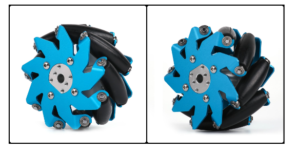

# 基本概念

- 无人航空载具（Unmanned Aerial Vehicle，UAV），或称无人飞行器系统（Unmanned Aircraft System，UAS），简称无人机，蜂型机（drone）。

- 无人地面载具（Unmanned Ground Vehicle，UGV）或称地面无人机，简称无人车。
	- 轮式移动机器人（Wheeled Mobile Robots，WMR）
	
- WD（Wheel Drive）
  - 2WD 二轮驱动
  - 4 WD 四轮驱动
  
- 点云（Point Cloud）

  获取物体表面每个采样点的空间坐标后得到的点的集合。

## 设备

- 麦克纳姆轮（Mecanum Wheel）

	一种全向轮，通过调节各个车轮独自的转向和转速，可以实现整个车体前行、横移、斜行、旋转及其组合等全方位运动方式。

## 传感器

### 图像

- 单目相机（Monocular）

- 双目相机（Stereo，立体摄像头）

	通过两个单目镜头的视差计算深度。

- 深度相机（RGB-D）

	依据 ToF 原理，通过发射红外结构光测距。

- 全景相机（Omnidirectional Camera，360-degree Camera）

	通过对单个多个相机的成像进行旋转拼接生成视场 360 度的图像。

- 事件相机（Event-based Camera，Event Camera）

	只记录像素亮度的变化情况，即事件。

### 运动

- 里程计（Geometry）

	记录运动状态，可根据运动状态计算轨迹与里程。
	
- 惯性测量单元（Inertial Measurement Unit，IMU）

  测量物体姿态角（角速度）和加速度。

## 位姿

位姿（pose）即位置，姿态的合称。

- 位置

	以坐标系而定。

	- 二维坐标
	- 三维坐标

- 姿态

  - 朝向（$\theta$）

  - 欧拉角
  	- x 轴，偏航（yaw）$\gamma$

  	- y 轴，俯仰（pitch）$\alpha$
  	- z 轴，翻滚（roll）$\beta$

## 速度

- 线速度（linear）

	行进速度，米每秒（`m/s`）

	- x 轴，前后
	- y 轴，左右
	- z 轴，上下

- 角速度（angular）

	姿态变动速度，一般用欧拉角表示，弧度每秒（`rad/s`）

偏航：

俯仰：

翻滚：

