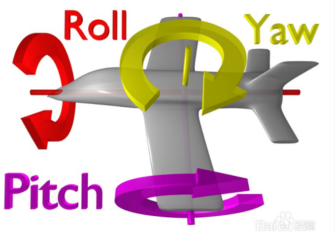

# 基本概念

## 位姿

位姿（pose）即位置，姿态和速度的合称。

- 位置

	以坐标系而定。

	- 二维坐标
	- 三维坐标

- 姿态

	- 朝向（$\theta$）

	- 欧拉角
		- x 轴，偏航（yaw）$\gamma$

		- y 轴，俯仰（pitch）$\alpha$
		- z 轴，翻滚（roll）$\beta$

- 速度

  - 线速度（linear）

  	行进速度，米每秒（`m/s`）

  	- x 轴，前后
  	- y 轴，左右
  	- z 轴，上下

  - 角速度（angular）

  	姿态变动速度，一般用欧拉角表示，弧度每秒（`rad/s`）

偏航：

俯仰：

翻滚：

