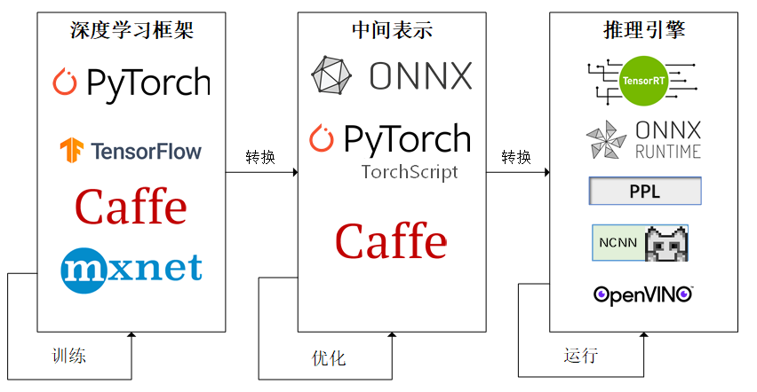
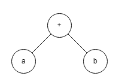
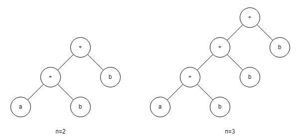

# 基本概念与方法

参考：[MMDeploy](https://mmdeploy.readthedocs.io/zh_CN/latest/tutorial/01_introduction_to_model_deployment.html)

## 流程

1. 使用框架编写训练模型。
2. 将模型转换到网络结构的中间表示，并进行一些网络结构的优化。
3. 将中间表示转换为特定的格式，推理引擎（面向硬件的高性能编程框架）使用高效的算子在对应硬件平台上运行模型。



- 常见深度学习框架
	- PyTorch
	- TensorFlow
	- Caffe
	- MXnet
	- MMLab
- 常见中间表示
	- ONNX
	- TorchScript
	- Caffe
- 常见推理引擎
	- TensorRT
	- ONNX Runtime
	- PPL
	- NCNN
	- OpenVINO

## 计算图

- 动态图

	一遍执行，一遍构建计算图。

	- 性能消耗大。

- 静态图

	先编译构建计算图，再运行。

	- 难以描述控制流（分支和循环语句）

`a + b` 可表示为：



如果循环执行 n 次 `a=a+b` ：

- 动态图会不断动态构建计算图（顺应控制流执行）

	本质上并没有构建一个“图”，只是按照前向流程不断计算，在反向传播时依靠 `grad_fn` 进行自动微分。

- 静态图会在不同的 n 下生成不同的计算图（展开控制流执行）



部署：

- 动态图部署

	- 直接使用动态图深度学习框架的代码进行推理。

	- 动态图可以转换为静态图进行部署。

		使用追踪（trace）的模型转换方法：给定一组输入，再实际执行一遍模型，记录对应的计算图，保存为 ONNX 格式。

- 静态图部署

	- 直接使用静态图深度学习框架的代码进行推理。
	- 转换为中间表示。

### Netron

Netron 是一个开源神经网络可视化工具，支持多种神经网络格式。

可以使用[网页版](https://netron.app/) 。

## ONNX

（Open Neural Network Exchange）

ONNX 是当前流行的中间表示格式。

由于各框架兼容性不一，通常只用 ONNX 表示更容易部署的静态图。

### PyTroch to ONNX

转换为 onnx：

```python
# torch.onnx
import torch.onnx

# a imge with shape 3x256x256
x = torch.randn(1, 3, 256, 256)

with torch.no_grad():
    # trace method
    torch.onnx.export(
        model,
        x,
        "filename.onnx",
        opset_version=11,
        input_names=['input'],
        output_names=['output'])
```

其中：

- opset_version 是 ONNX 算子集的版本。（ONNX 会经常发布新的算子集）

验证 onnx 文件格式是否正确：

```python
# onnx
import onnx

onnx_model = onnx.load("srcnn.onnx")
try:
    onnx.checker.check_model(onnx_model)
except Exception:
    print("Model incorrect")
else:
    print("Model correct")
```

## ONNX Runtime

ONNX Runtime 直接对接 ONNX，可以直接读取并运行 `.onnx` 文件，而不需要把 `.onnx` 格式的文件转换成其他格式的文件。

```python
import onnxruntime

# 获取推理器
ort_session = onnxruntime.InferenceSession("filename.onnx")
# 指定输入字典的各项
# input_img 为 N C H W（ndarray）
ort_inputs = {'input': input_img}
# 执行推理，获取输出字典的指定项
ort_output = ort_session.run(['output'], ort_inputs)

# run 的输出是一个列表，表示 N 个对应结果
ort_output = ort_output[0]

# some post processes for image
ort_output = np.squeeze(ort_output, 0)
ort_output = np.clip(ort_output, 0, 255)
ort_output = np.transpose(ort_output, [1, 2, 0]).astype(np.uint8)
cv2.imwrite("output.png", ort_output)
```

