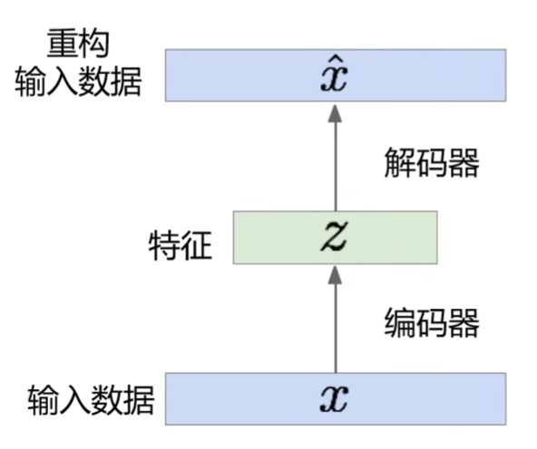
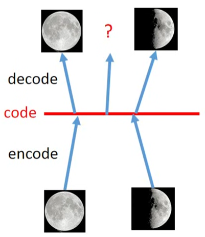

# Auto-encoder

（自动编码器）

深度学习中一个常见的架构。

编码器对输入数据进行降维（编码，低维特征表示），然后使用解码器从编码中恢复原数据。

- 编码器应用

	使用训练好的编码器提取低维特征，然后训练一个分类器对该低维特征进行分类。

	- 这样分类效果一般不好，因为不能保证编码器学到的是最适合分类的特征。

- 解码器应用

	输入一个低维特征（可以人为指定），重构数据，可用于生成任务。

	- 模型编码的特征空间不能很好地描述输入的分布，只能建立大致的离散直接映射。
	- 模型编码的特征空间中的点不能描述图像的过渡中间态（不一定连续，分布描述不佳），可能生成不理想的效果。

- 编码概念扩展

	编码可以表示为多种事物，比如一串数字，文字串等，从而完成编码到输出的映射的构建。

- 编码可行性，为什么 auto encoder 能够将数据进行低维表示并还原？

	以图片低维表示还原图片为例，并不是所有的矩阵都可能组成图片，所以可以压缩。

