# Auto-encoder

（自动编码器）

深度学习中一个常见的架构。

## 基本用法

编码器对输入数据进行降维（编码，低维特征表示），然后使用解码器从编码中恢复原数据。

- 编码器应用

	使用训练好的编码器提取低维特征，然后训练一个分类器对该低维特征进行分类。

	- 这样分类效果一般不好，因为不能保证编码器学到的是最适合分类的特征。

- 解码器应用

	输入一个低维特征（可以人为指定），重构数据，可用于生成任务。

	- 模型编码的特征空间不能很好地描述输入的分布，只能建立大致的离散直接映射。
	- 模型编码的特征空间中的点不能描述图像的过渡中间态（不一定连续，分布描述不佳），可能生成不理想的效果。

- 编码概念扩展

	编码可以表示为多种事物，比如一串数字，文字串等，从而完成编码到输出的映射的构建。

- 编码可行性，为什么 auto encoder 能够将数据进行低维表示并还原？

	以图片低维表示还原图片为例，并不是所有的矩阵都可能组成图片，所以可以压缩。

## Feature Disentanglement

encoder 能够将一个输入压缩，decoder 能够还原输入，说明输入的特征纠缠在压缩向量中，我们不知道压缩向量的哪些维代表了什么方面的特征：

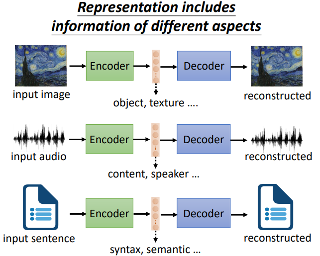

feature disentanglement 就是让我们知道压缩向量的哪些维代表了什么意义：

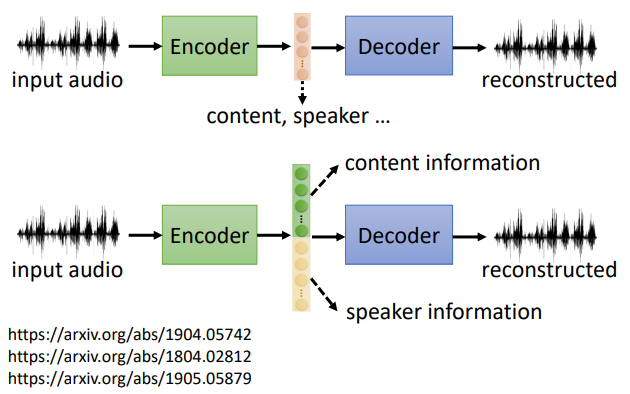

其中，具体方法见上图中的参考论文。

### Voice Conversion

（语音转换）

在过去，需要两个 speaker 对同一内容（相同语言）的语音数据，才能训练转换。

现在，借助 feature disentanglement ，两个 speaker 可以说不同内容，不同语言，一样可以训练。

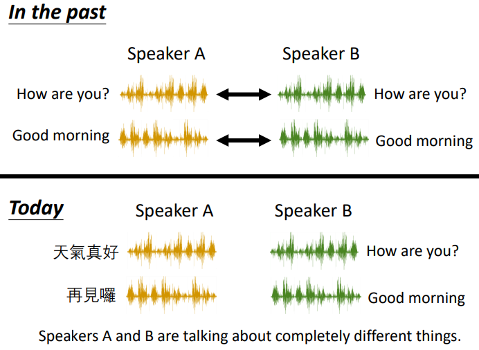

可以知道语音的风格由哪些维度代表：

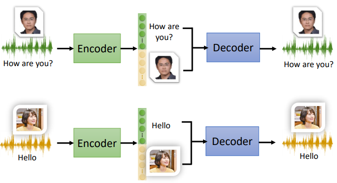

将风格维度，内容维度进行抽取拼接，即完成语言转换：

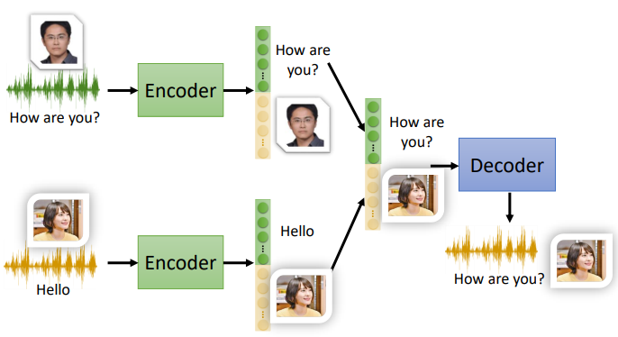

## Discrete Latent Representation

有时候，将连续的压缩向量训练为离散的，比如二进制，其维度可能就代表某个特征的存在与否，比如是否是 female ，是否有 glasses 。

当强制让 encoder 的学习到的编码是 one-hot 时，可以用其对应一个类别，从而完成 Unsupervised learning ，例如训练一个 auto-encoder ，输入手写数字，强迫其中间的压缩向量必须为 one-hot ，从而其就可以代表数字类别。（输入手写数字，还原手写数字，无需 label）

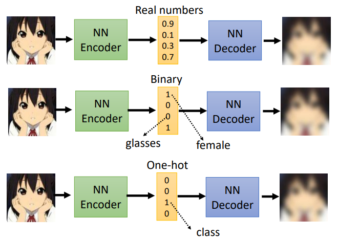

### VQVAE

（Vector Quantized Variational Auto-encoder）

准备好一个待学习的 codebook ，训练 encoder 压缩一个编码，计算编码与 codebook 中每个向量的相似度，将相似度最高的取出，输入 decoder ，还原图片。

从而 embedding 是离散的，只有 codebook 含有的向量个数种可能。

对于语音，codebook 可能就会学到语素信息。

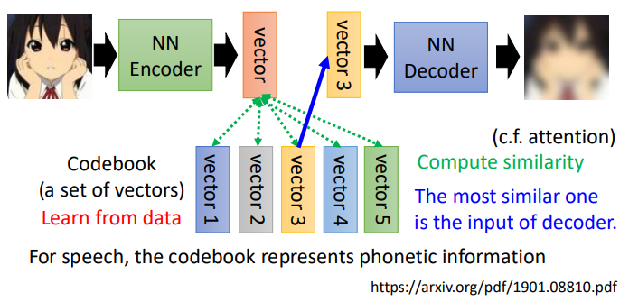

### Text as Representation

（文章摘要）

对与文字数据，如果 codebook 是一段文字，那么其就有可能是学习到的摘要：

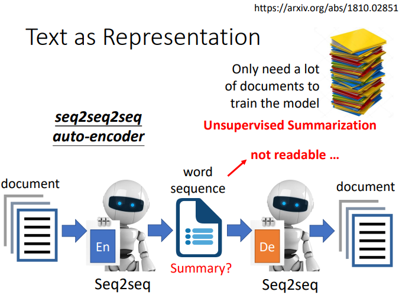

其中，encoder 和 decoder 都是 seq2seq 的模型，整个 auto-encoder 是一个 seq2seq2seq 的模型。

实际上，编码的 embedding 可能不是人类的文字，人可能根本无法看懂，此时再用 GAN 的方法，使用一个 Discriminator 分辨是否是人类语言：

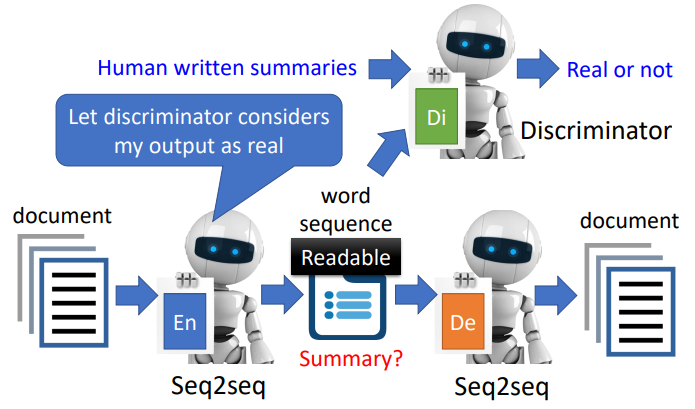

实际上，这就是一个 Cycle GAN 的架构。

## More Applications

### Generator

（生成器）

可以将 decoder 当作一个 generator 使用，从一个已知分布中 sample 一个向量，看 decoder 能不能用其生成（还原）图片：

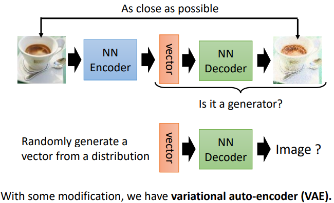

### Compression

（压缩）

可以将 encoder 当作一个压缩器，decoder 当作一个解压缩器（lossy 的压缩，即有失真的压缩）：

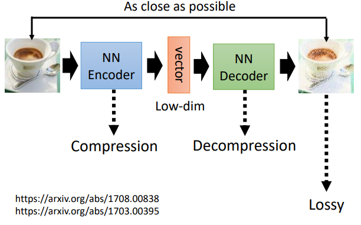

### Anomaly Detection

（异常检测）

详见《Anomaly Detection》笔记。
