# CNN

卷积神经网络（Convolutional Neural Network，CNN）

一般用于图像领域。

以下以图像分类为例，一般假设输入图像的尺寸一致。

## 总览

- 像素（Pixel）

- 通道（Channel）

  RGB 彩色图像有三个通道，每个数值代表了该通道位置的强度。

- 卷积层（Convolutional Layer）

  - 感受域（Receptive Field，RF）
  - 卷积核（Kernel）
  - 过滤器（Filter）
  - 特征图（Feature Map）

- 池化（Pooling）

- 空间转换网络（层）（Spatial Transformer Network / Layer，STN / STL）

	- 仿射变换（Affine Transformation）
	- 插值（内插，Interpolation）

### 注意

- 卷积使图像到特征图 channel 增多。
	- 未填充时，图像到特征图宽高变小。
	- 填充时，宽高不变。

- 池化使图像数据宽高变小。

在多次卷积等操作后，选择适当的时机，将数据 flatten 后输入神经网络。

## 卷积层

将每个像素组成的特征向量直接输入全连接神经网络，使得每个神经元都接受每个像素的信息，这将导致模型权重参数过多，容易过拟合。

### 感受域

一般一个模式只位于图像的一小部分，因此每个神经元只输入一小部分信息，用于监测模式。

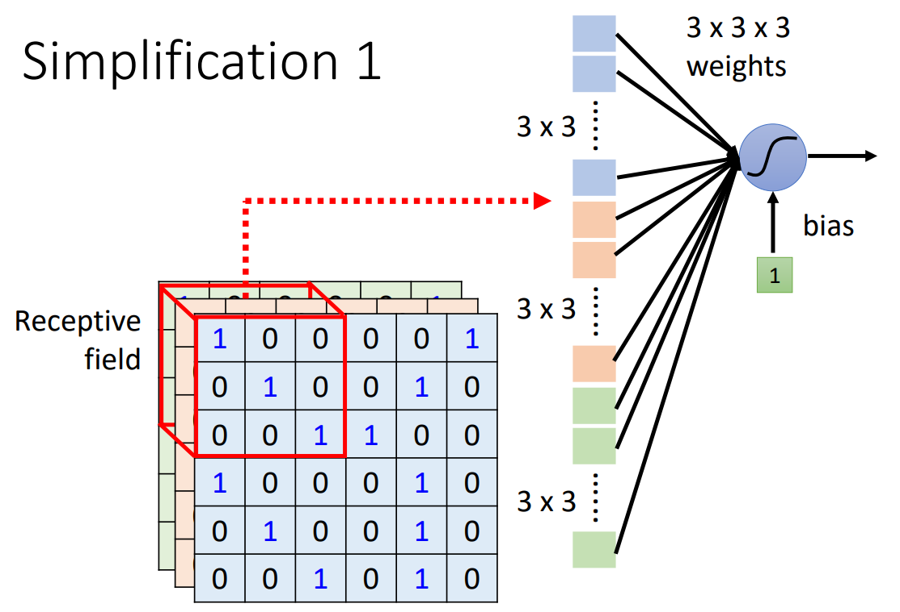

- 感受域可以有重叠。
- 不同神经元可以有不同大小的感受域。
- 神经元可以只输入感受域中的某些通道。
- 一个感受域一般由一组神经元监测。
- 感受域不一定是方形，甚至可以分成几块散布在图像各处，要根据实际模式的意义考虑。

### 移动

在所有通道上移动。

- 核大小（Kernel Size）

  感受域在一个通道上的大小。

- 步长（Stride）

  一个感受域按步长移动后产生下一个感受域。一般希望感受域之间有高度重叠（$stride = 1\ or\ 2$），否则当模式出现在感受域交界处时，会没有神经元去识别它，会错过模式。

- 重叠（Overlap）

  感受域与感受域间的重叠区域。

### 过滤器

#### 参数共享

相似的模式有可能分布在图像的各个位置，需要多个相似的神经元用于监测不同位置，但如此会导致模型参数过多，可以采取**参数共享（Parameter Sharing）**（也可叫权值共享）策略，使分布在不同位置感受域的神经元，只要其监测相似模式，就让他们共享权重参数。

- 过滤器（filter）

	一组神经元，其共享卷积核（Kernel）的权重参数，输入感受域数据，用于监测感受域。（Filter 和 Kernel 常互相指称）

filter 的权重参数，是需要用梯度下降求取的模型未知参数，其 tensor 的维数与感受域的 tensor 的维数相同。

将一组神经元对应感受域移动的图像位置，对不同感受域的输入数值做离散卷积（监测不同位置的模式，识别模式），从而达到共享权重参数的效果。

#### 填充

（Padding）

感受域完全保持在图像内的移动会导致过滤结果的边缘被裁剪，宽高变小。

当想要保持宽高不变时，可以在图像边缘填充数值，一般补 $0$ 或直接使用边缘值。

#### 模式监测

对于 channel 为 1 的黑白图像，stride 为 1，训练好的 Filter 1 如图所示，演示模式监测的意义：

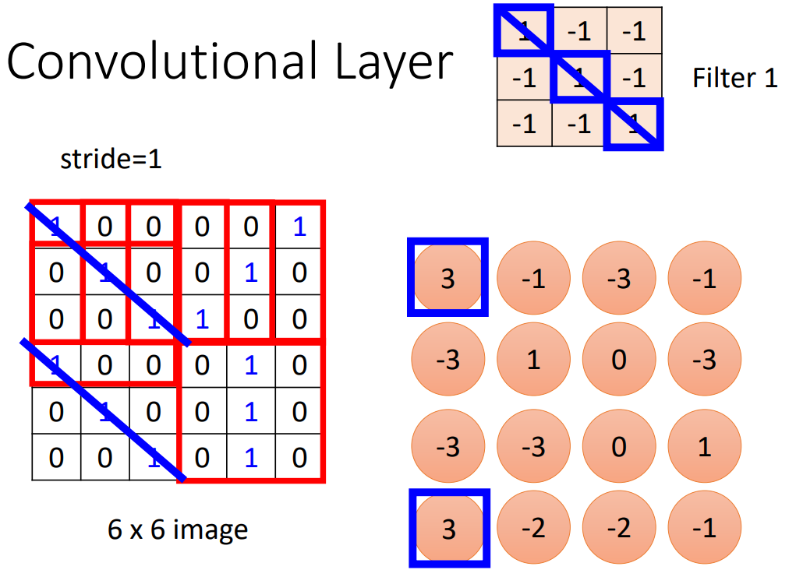

将 Filter 1 在图像上计算后，主对角线的三个 1 计算得出的值最大，该 FIlter 即是监测主对角线三个 1 的模式。（足够多的直线可以构成曲线）

实际上，filter 还有一个额外数值，对应神经元的 bias ，这在框架实现中是有考虑到的。

#### 卷积核

**卷积核（Kernel）**是 filter 在一个 channel 上的数据，卷积核是二维的，过滤器是三维的，差别在于通道。

有些文献将 kernel 与 filter 等同，具体理解即可。

#### 特征图

将 Filter 2 等 filter 继续计算，可以得到 **特征图（Feature Map）** 。

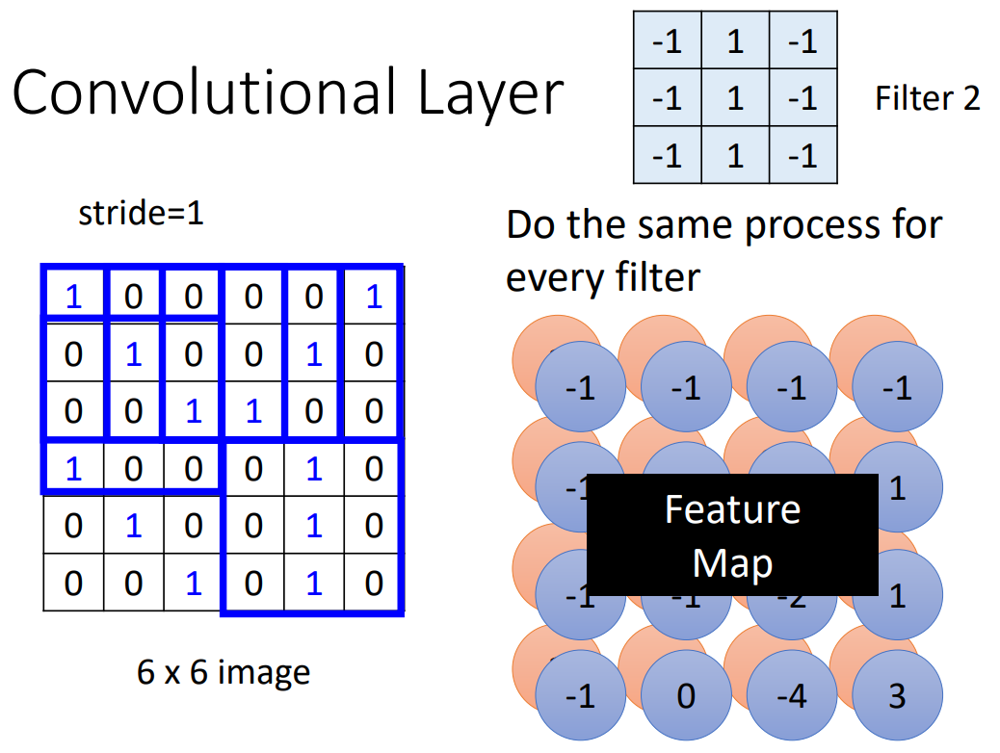

卷积层的输出结果即是 Feature Map ，卷积层有多少个 filter 就会产生多少层 feature ，Feature Map 相当于新产生的图像，每层 feature 相当于新图像的一个 channel 。

#### 多层卷积

卷积核的大小一直是 $3\times 3$ 会导致一些范围大的模式无法被监测吗？

以第二层卷积层为例，在第二层卷积层，$3\times 3$ 的卷积核可以监测到 $5 \times 5$ 的模式范围：

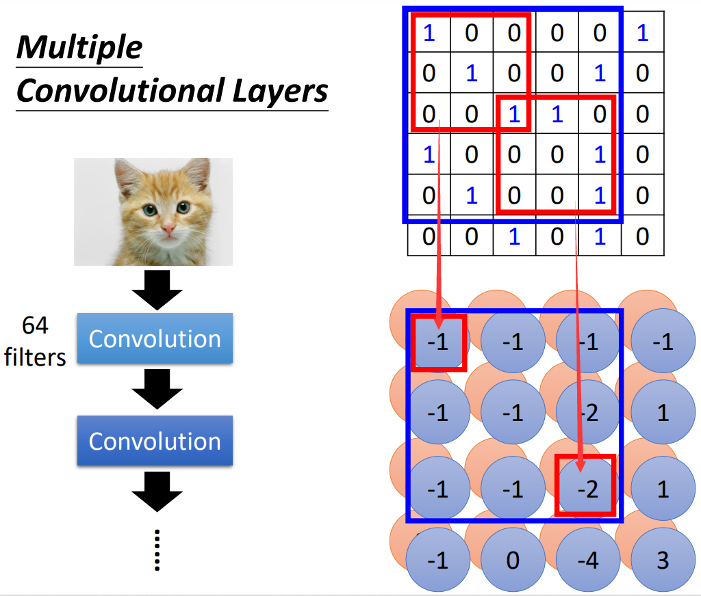

## 池化

池化没有未知参数，所以不算一个层。

池化是减少输入参数，从而减少运算量的操作（Subsampling），一般卷积后会搭配池化处理，可以一次卷积配一次池化，也可多次卷积配一次池化。

常见的是 Max-pooling 操作，即在 Feature Map 的 channel 的每个指定的范围内，只取最大值：

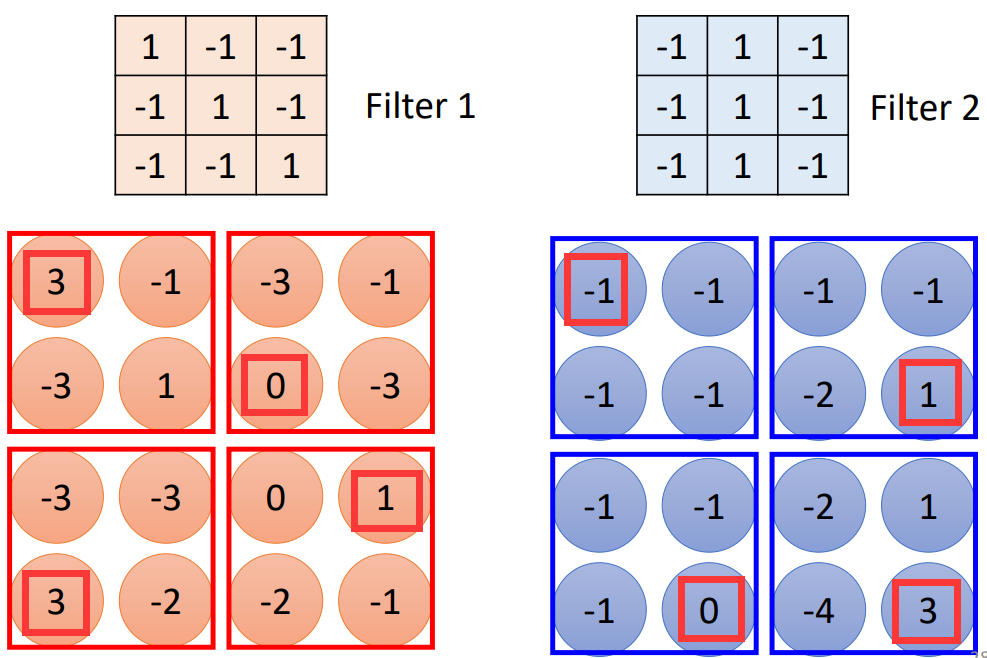

- 池化对特征存在一定损失，如果是检测特别细微的模式，就要限制池化操作。
- 如果算力足够，也完全可以去掉池化操作。

## 案例 AlphaGo

落子的可能位置有 $19 \times 19$ 个，即可以作为 $19 \times 19$ 的分类问题。每个位置用 $48$ 个 channel 描述，这个数字是根据围棋规则设计的。

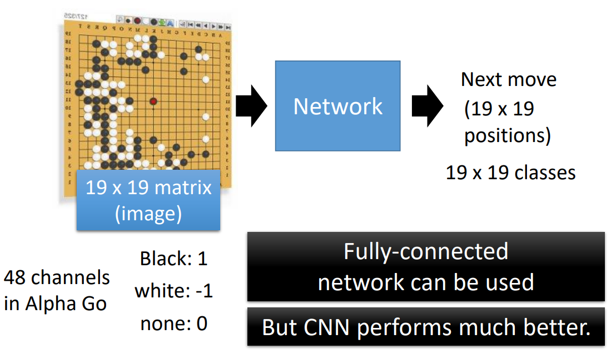

围棋存在许多模式只存在与小范围，而且可能存在不同区域，具有影像特征：

Alpha Go 的第一层卷积层使用 $kernel\ size = 5 \times 5$ 。

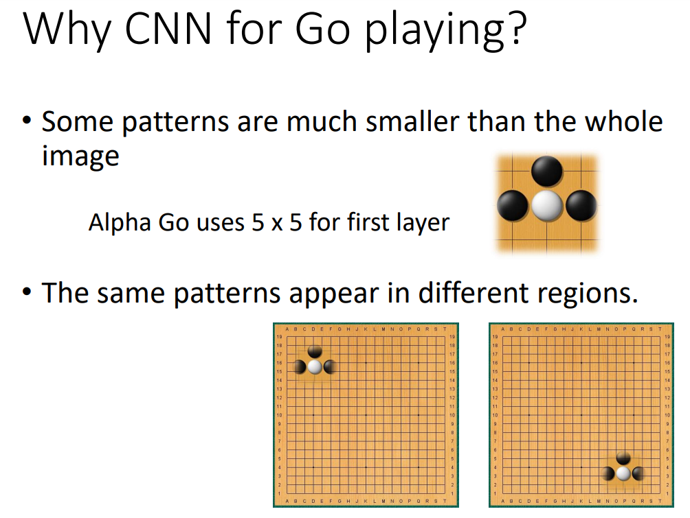

围棋存在细微的模式，若使用会损失特征的 Subsampling 方法，可能会对结果造成重大影响，因此 Alpha Go 没有使用 Pooling 技术。

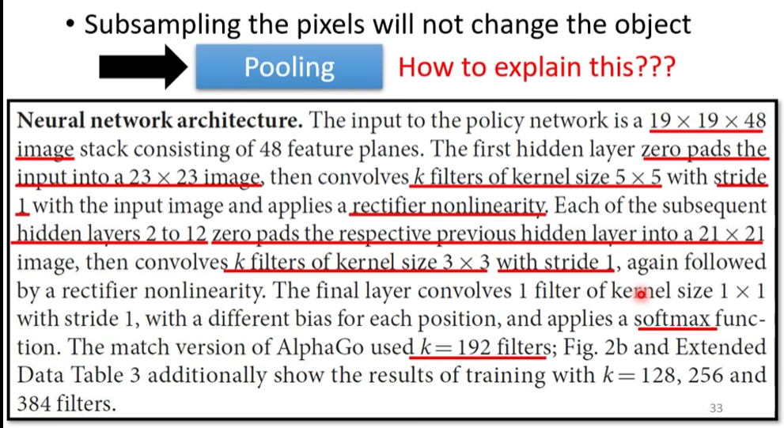

## 空间转换

单纯的 CNN 无法解决图像**放大缩小（缩放，Scalling）**、**旋转（Rotation）**、**平移（Translation）**、**翻转（包含（镜像，mirror），Flip）**、以及**剪切（Shear）**的问题，可以使用**数据增强（Data Augmentation）**技术（把进行各种变换后的图像加入训练）或 STN 技术。（单纯的 CNN 只具有小范围的平移不变性）

使用空间转换网络（STN）对输入参数进行空间转换，或对 feature map 进行空间转换，再进行识别。

STN 可以在多个位置出现多次，也可在同个位置使用多个 STN ，其使用不同的转换方式（修改变换矩阵即可）对数据进行转换，然后输入下一层。

### 仿射变换

对每个点的坐标进行仿射变换。

放大；缩小 + 平移：

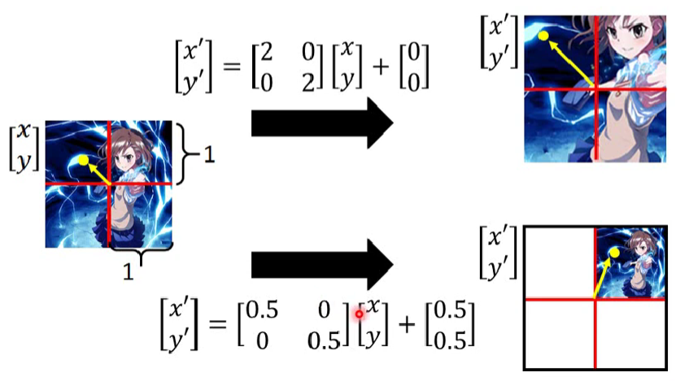

旋转：

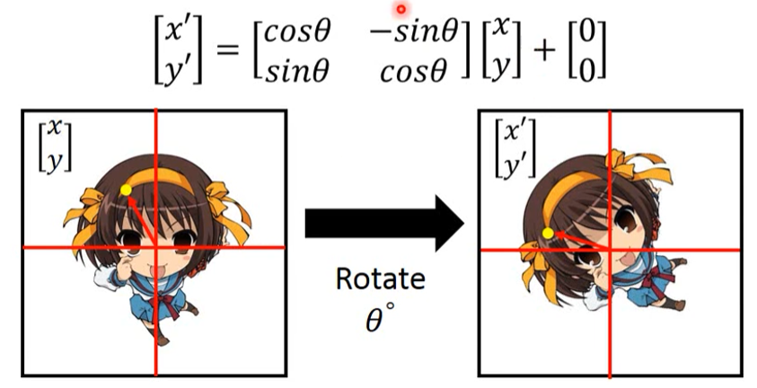

翻转：

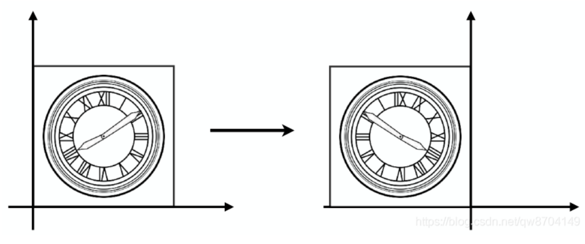

剪切：

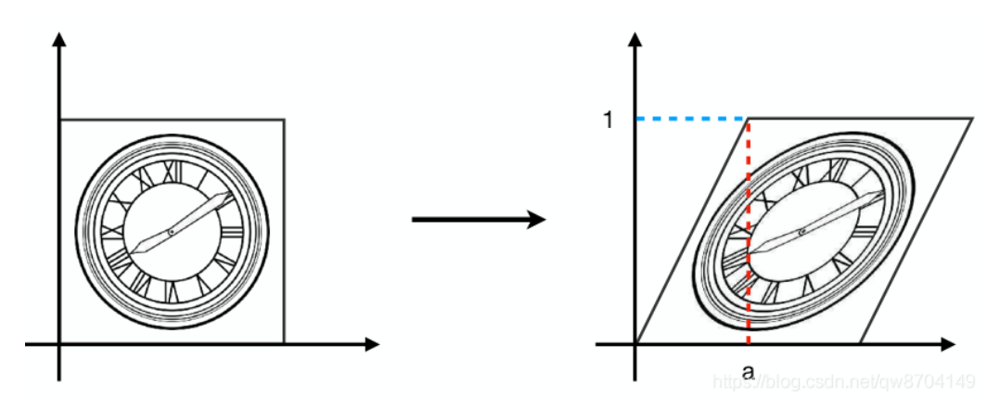

只需要六个参数就可以描述图像的各种变换，统称为仿射变换：
$$
\begin{bmatrix}
x^\prime \\
y^\prime
\end{bmatrix}
=
\begin{bmatrix}
a & b \\
c & d
\end{bmatrix}
\begin{bmatrix}
x \\
y
\end{bmatrix}
+
\begin{bmatrix}
e \\
f
\end{bmatrix}
$$
按照变换矩阵即可计算摆正前的图像与摆正后的图像的连接方式（参数输入关系）。

### 插值

当连接位置坐标为整数时，可以容易地由第 $l$ 层的位置得到第 $l-1$ 层（避免计算转置矩阵）的对应连接位置：

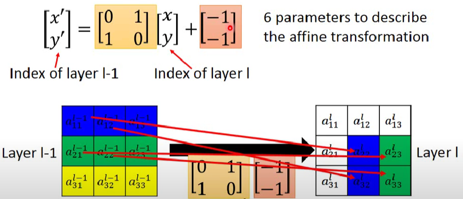

当连接位置坐标不是整数时，若采用**取整**则无法使用梯度下降，因为取整函数梯度几乎处处为 $0$ （当移动一小步时，函数值可能完全没有变化）。

需要采用插值处理。

可知 $[1.6,2.4]^T$ 介于四个整数坐标点之间，考察与其之间的距离： 

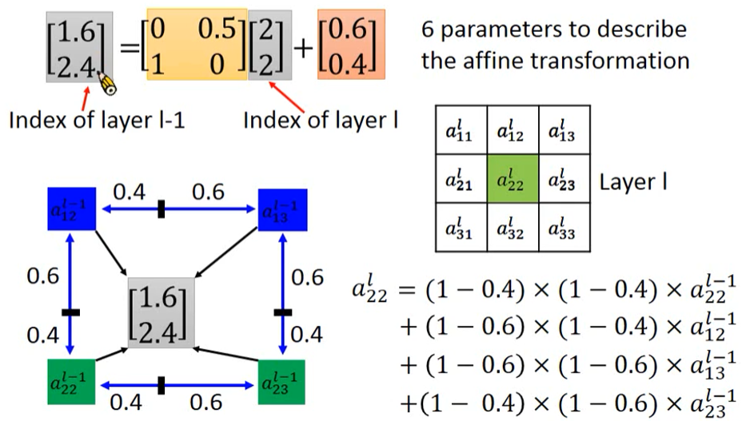

将 $a^l_{22}$ 同时连接至 $l-1$ 层的四个位置 $a^{l-1}_{22},a^{l-1}_{12},a^{l-1}_{23},a^{l-1}_{23}$，附带上权值即可。
