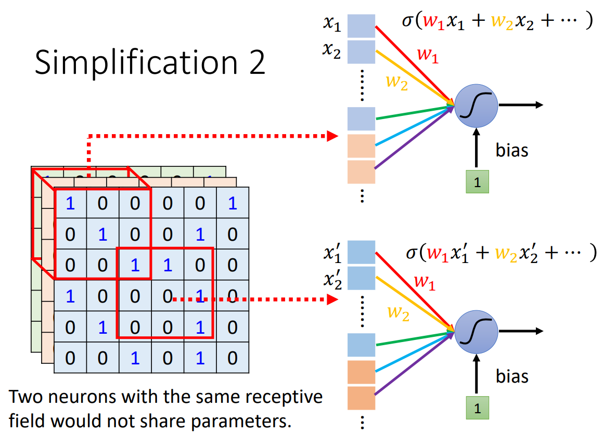

# CNN

卷积神经网络（Convolutional Neural Network，CNN）

一般用于图像领域。

以下以图像分类为例，假设输入图像的尺寸一致。

## 总览

- 像素（Pixel）

- 通道（Channel）

  RGB 彩色图像有三个通道，每个数值代表了该通道位置的强度。

- 卷积层（Convolutional Layer）

  - 感受野（Receptive Field，RF）
  - 卷积核（Kernel）
  - 过滤器（Filter）
  - 特征图（Feature Map）

- 池化（Pooling）

- 数据增强（Data Augmentation）

- 空间转换网络（层）（Spatial Transformer Network / Layer，STN / STL）

	- 仿射变换（Affine Transformation）
	- 插值（内插，Interpolation）

## 卷积层

如果将每个像素组成的特征向量直接输入全连接神经网络，使得每个神经元都接受每个像素的信息，这将导致模型权重参数过多，容易过拟合。

### 基本概念

一般一个模式只位于图像的一小部分，因此每个神经元只输入一小部分信息，用于监测模式。

- 感受野

	神经元输入信息的图片上的区域。

	- 感受野可以有重叠。
	- 不同神经元可以对应不同大小的感受野。
	- 神经元可以只输入感受野中的某些通道。
	- 一个感受野一般由一组神经元监测。
	- 感受野不一定是方形，甚至可以分成几块散布在图像各处，要根据实际模式的意义考虑。

- 核大小（Kernel Size）

  感受野在一个通道上的大小。

- 步长（Stride）

  一个感受野按步长移动后产生下一个感受野。一般希望感受野之间有高度重叠（$stride = 1\ or\ 2$），否则当模式出现在感受野交界处时，会没有神经元去识别它，会错过模式。

- 重叠（Overlap）

  感受野与感受野间的重叠区域。

- 填充（Padding）

  感受野完全保持在图像内的移动会导致过滤结果的边缘被裁剪，宽高变小。当想要保持宽高不变时，可以在图像边缘填充数值，一般补 $0$ 或直接使用边缘值。

- 过滤器（滤波器，Filter）

	感受野对应的神经元的权重参数，上图中的过滤器有三个通道。

- 卷积核（Kernel）

	filter 在一个 channel 上的数据，卷积核是二维的，过滤器是三维的，差别在于通道，单通道下二者等同。

- 注意

	- 卷积层的一个神经元输入一个 filter 的数据，输入多个 kernel 的数据。
	- filter（过滤器）和 kernel（卷积核）常互相指称，有些文献将二者等同，具体理解即可。

### 参数共享

相似的模式有可能分布在图像的各个位置，需要多个相似的神经元用于监测不同位置，但如此会导致模型参数过多，可以采取**参数共享（Parameter Sharing）**（也可叫权值共享）策略，使分布在图像不同位置的神经元，只要其监测相似模式，就让他们共享权重参数，包括 bias 。

- 每个卷积层有多个神经元，它们共享权重（过滤器数据），输入感受野数据，监测感受野。
- filter 的数据，是需要用梯度下降求取的模型未知参数（神经元权重参数）。

### 模式监测

对于 channel 为 1 的黑白图像，stride 为 1，训练好的 Filter 1 如图所示，演示模式监测的意义：

将 Filter 1 在图像上计算后，主对角线的三个 1 计算得出的值最大，该 FIlter 即是监测主对角线三个 1 的模式。（足够多的直线可以构成曲线）

### 特征图

将 Filter 2 等 filter 继续计算，可以得到 **特征图（Feature Map）** 。

卷积层的输出结果即是 feature map ，卷积层有多少个 filter 就会产生多少个 channel 的 feature map 。

feature map 相当于新产生的图像，每层 feature 相当于新图像的一个 channel 。

**特征图之后还要通过激活函数（神经元有激活函数），得到卷积层最终的输出。**

### 多层卷积

卷积核的大小一直是 $3\times 3$ 会导致一些范围大的模式无法被监测吗？

以第二层卷积层为例，在第二层卷积层，$3\times 3$ 的卷积核可以监测到 $5 \times 5$ 的模式范围：

## 池化

池化没有未知参数，也就没有神经元，所以不算一个神经网络层。

池化是减少输入参数，从而减少运算量的操作（Subsampling），一般卷积后会搭配池化处理，可以一次卷积配一次池化，也可多次卷积配一次池化。

常见的是 Max-pooling 操作，即在 Feature Map 的 channel 的每个指定的范围内，只取最大值：

- 池化对特征存在一定损失，如果是检测特别细微的模式，就要限制池化操作。
- 如果算力足够，也完全可以去掉池化操作。
- average pooling 会丢失一些空间结构信息，比如较大的数在哪个位置，max pooling 会少一些，即在一层层的池化中空间中值大的特征会得到保留，即能保留空间中各位置的大特征。

## 反向传播

### 卷积

卷积层的神经元共享权重参数，需要保持权重参数一致。

假设卷积层有两个共享权值的神经元 $s_1 = w_1x_1 + w_2x_2, s_2 = w_1x_3 + w_2x_4$ ，对于损失函数 $L$ 有：
$$
\begin{cases}
\frac {\partial L} {\partial w_1} = 
\frac {\partial L} {\partial s_1} \frac {\partial s_1} {\partial w_1} +
\frac {\partial L} {\partial s_2} \frac {\partial s_2} {\partial w_1} =
\frac {\partial L} {\partial s_1} x_1 +
\frac {\partial L} {\partial s_2} x_3
\\ \\
\frac {\partial L} {\partial w_2} = 
\frac {\partial L} {\partial s_1} x_2 +
\frac {\partial L} {\partial s_2} x_4
\end{cases}
$$

同一卷积层的神经元是为了检测某一个目标模式（因为共享了权值，所以只能检测一个模式），在不同图片的位置的神经元梯度由图片不同位置的数据贡献，但每个权重参数的梯度都会由其涉及的所有数据计算，所以其权值是天然保持一致的。

### 池化

池化会有维度的变化，这个将梯度从池化后区域还原到原区域的过程叫 upsample 。

若池化后区域的梯度为：
$$
\begin{pmatrix}
1 & 2 \\
3 & 4 \\
\end{pmatrix}
$$
若是 $\max$ 操作，池化时会记录前后对应的位置，其余位置梯度为 $0$ 。

根据记录的对应关系，则原区域的梯度可能为：
$$
\begin{pmatrix}
0 & 0 & 0 & 2 \\
0 & 1 & 0 & 0 \\
0 & 0 & 0 & 0 \\
0 & 3 & 0 & 4 \\
\end{pmatrix}
$$
若是取均值操作，upsample 时会将原区域对应的梯度取平均后分布到原区域各位置。

取均值为：$mean(x) = y(x) = \sum\limits^n_i x_i$ ，每个 $x$ 的梯度都是 $\frac 1 n$ ，则原区域梯度为：

$$
\begin{pmatrix}
0.25 & 0.25 & 0.5 & 0.5 \\
0.25 & 0.25 & 0.5 & 0.5 \\
0.75 & 0.75 & 1 & 1 \\
0.75 & 0.75 & 1 & 1 \\
\end{pmatrix}
$$

## 维度变化

- 通道与过滤器（卷积核）

  - 卷积层的输入通道数等于输入数据的通道数。
  - 卷积层的输出通道数等于过滤器的个数。
  - **过滤器的通道数等于输入数据的通道数，否则无法计算。**（所以过滤器（卷积核）的 channel 数常常省略）

- 填充与宽高
	- 未填充时，图像到特征图宽高变小。
	- 填充时，宽高不变。
- 池化使图像数据宽高变小，通道数不变
- 在多次卷积等操作后，选择适当的时机，将数据 flatten 后输入神经网络。

每个过滤器（卷积核）会产生 feature map 的一个通道，过滤器的通道数等于输入的通道数。在每一个位置（单个位置就跨越多个通道），过滤器的每个通道应用于输入数据的对应通道，然后每个通道的结果加起来（把得到的通道重叠相加）。

相当于一个神经元的末梢分成多个组（通道），每个组接收输入数据的对应通道，然后将每个组的末梢加起来，通过激活函数，于是得到一个过滤器的输出结果。

即每个过滤器都会作用到输入数据的所有通道。

设输入数据为 $(w , h , c)$ （weight，height，channel），卷积核尺寸为 $(k , k ,c)$ ，个数为 $x$ ，该卷积核的填充（等宽高）输出即为 $(w,h,x)$ 。

## 案例 AlphaGo

落子的可能位置有 $19 \times 19$ 个，即可以作为 $19 \times 19$ 的分类问题。每个位置用 $48$ 个 channel 描述，这个数字是根据围棋规则设计的。

围棋存在许多模式只存在与小范围，而且可能存在不同区域，具有影像特征：

Alpha Go 的第一层卷积层使用 $kernel\ size = 5 \times 5$ 。

围棋存在细微的模式，若使用会损失特征的 Subsampling 方法，可能会对结果造成重大影响，因此 Alpha Go 没有使用 Pooling 技术。

## STN

STN 是 Data Augmentation 外另一种解决图像变换问题的方法。

加入 STN 对输入参数进行空间转换，或对 feature map 进行空间转换，再进行识别。（单纯的 CNN 只具有小范围的平移不变性）

STN 可以在多个位置出现多次，也可在同个位置使用多个 STN ，其使用不同的转换方式（修改变换矩阵即可）对数据进行转换，然后输入下一层。

### 仿射变换

对每个点的坐标进行仿射变换。

放大；缩小 + 平移：

旋转：

翻转：

剪切：

只需要六个参数就可以描述图像的各种变换，统称为仿射变换：
$$
\begin{bmatrix}
x^\prime \\
y^\prime
\end{bmatrix}
=
\begin{bmatrix}
a & b \\
c & d
\end{bmatrix}
\begin{bmatrix}
x \\
y
\end{bmatrix}
+
\begin{bmatrix}
e \\
f
\end{bmatrix}
$$
按照变换矩阵即可计算摆正前的图像与摆正后的图像的连接方式（参数输入关系）。

### 连接位置插值

当连接位置坐标为整数时，可以容易地由第 $l$ 层的位置得到第 $l-1$ 层（避免计算转置矩阵）的对应连接位置：

当连接位置坐标不是整数时，若采用**取整**则无法使用梯度下降，因为取整函数梯度几乎处处为 $0$ （当移动一小步时，函数值可能完全没有变化）。

需要采用插值处理。

可知 $[1.6,2.4]^T$ 介于四个整数坐标点之间，考察与其之间的距离： 

将 $a^l_{22}$ 同时连接至 $l-1$ 层的四个位置 $a^{l-1}_{22},a^{l-1}_{12},a^{l-1}_{23},a^{l-1}_{23}$，附带上权值即可。
