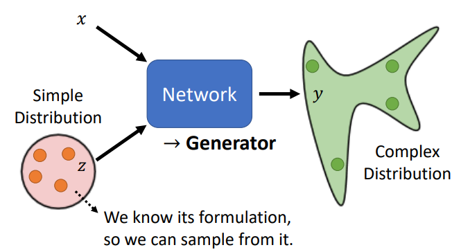
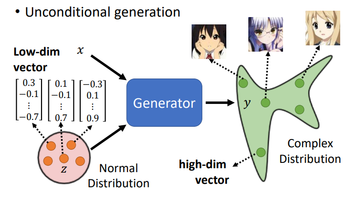

# GAN

- 生成对抗网络（Generative Adversarial Network，GAN）

- 条件 GAN（Conditional GAN）

	需要 label 。

- 无条件 GAN（Unconditional GAN）

	不需要 label ，只有生成器和辨别器的对抗。
	
- 沃瑟斯坦 GAN（Wasserstein GAN，WGAN）

- 循环 GAN（Cycle GAN）

## 基本架构

### Generator

将 NN 的 input 分为 $x$ 与 $z$ ，其中 $z$ 符合一个已知的简单 distribution ，每次给 NN 输入 $x$ 和 sample 出的$z$。

由于 $z$ 是一个分布，故输出 $y$ 也是一个分布，此时的网络即起生成器的作用。

为什么输出需要是一个分布呢？

若输出是一个定值，则可能在多种正确答案间迷失方向。当给模型输入一个分布，模型输出的分布就包含了各种正确答案的可能性，从而可以以一定概率输出某一个正确答案，而不是多个正确答案的混合结果。

当同样的输入有多种可能的（正确）输出时，distribution 就十分有用，可以赋予模型 “创造力”。

### Discriminator

也是一个 NN ，对输入做判定，可以输出一个度量值，用以衡量生成效果。

## 示例 Anime Faces Generation

### generator

假设 $z$ 符合 normal distribution ，每次 sample 出一个向量（一般设置为一个低维向量），输出一个图片（表示像素的长向量）：

### Discriminator

判定 generator 的输出质量，越接近二次元人脸分就越高，模糊图片分低：

## 对抗（训练）

generator 不断生成，discriminator 做判定，二者在不断的相互对抗中进化为新版本，提升生成能力和判定能力：

- 初始化 generator 和 discriminator ，随机参数。

在每个 iteration ：

- 固定住 generator ，更新 discriminator 的参数。
	- 此时 generator 的参数不完善，输出都是模糊的图片。
	- discriminator 学习如何衡量 generator 的输出结果，即分辨 generator 的输出与 ground truth 的差异。
	- 衡量可以把 generator 的输出标 $0$ ，把 ground truth 标 $1$ ，做 classification（分类，优或劣）或 regression（打分，高或低） ，然后最优化。

- 固定住 discriminator ，更新 generator 的参数。
	- 将 generator 和 discriminator 看做一个大的网络，其中某一层的输出是一张图片。
	- 这个大网络会输入一个 vector ，然后给出分数，分数越优越好。
	- 可以使用最优化方法更新这个大网络的参数，但不更新其中 discriminator 的参数。

- 如此反复训练 generator 和 discriminator 即可。

GAN 是非常难 train 的，因为 generator 和 discriminator 需要协同进步，当任何一方在某个情况下没有 train 好，就会影响整个对抗训练过程的效果。

### 过渡特殊效果

对两个向量做内插，生成其中间的过渡向量，输入 GAN ，可以得到两个向量对应图片的过渡过程：

其中，红框为起始态或结束态向量。（真实情况是多维向量，此处二维仅做演示）

插值给这两个点（两种状态）提供了某种变换路径，这个路径是连续的。

## 原理

### Divergence

generator 输入一个分布， 输出一个分布 $P_G$，其与真实数据的分布 $P_{data}$ 越接近越好，使用**散度（Divergence）**衡量这两个分布的差异，需要最小化 divergence ：

### 近似表示

如何计算 divergence ？

我们不知道如何计算 divergence ，因为不知道 $P_G$ 和 $P_{data}$ 的具体分布形式，但我们能从中 sample 数据（$P_G$ 由 generator 生成，$P_{data}$ 天然在资料中，随机选择即可），可以利用这些生成的数据近似表示分布的差异。

可以直接使用 JS divergence 、KL divergence 等尺度衡量 **generator 生成的分布与真实分布**的 divergence ，但也可以**使用 discriminator 衡量 generator 生成的分布与判别结果的关系**，用 classification 原理，使用 cross entropy 作为目标函数，其值就与 divergence 有关：

其中，$y$ 是从 $P_{data}$ 或 $P_G$ 中 sample 出的，$E$ 为期望，$D(y)$ 为 discriminator 的输出。 

如果 $y$ 是从 $P_{data}$ sample 出来的，那么 $D(y)$ 应该越大越好，如果是从 $P_G$ sample 出来的，那么越小越好。

$V$ 表示负的 cross entropy ，最大化 $V$ 相当于最小化 cross entropy ：

公式表示即为：
$$
\begin{align}
G^* & = \arg \min\limits_G Div(P_G, P_{data}) \\
& = \arg \min\limits_G D^* \\
& = \arg \min\limits_G \max\limits_D V(D, G)
\end{align}
$$
其中， $G^*$ 表示 generator 生成的分布与真实分布的 divergence ，需要最小化之，$D^*$ 即目标函数，可以替换衡量 divergence 的尺度。$\arg \min\limits_G \max\limits_D$ 的过程即是对抗优化的过程。

## 判定失效

### JS divergence

为什么不直接使用 JS divergence 衡量散度呢？

在许多情况下，$P_G$ 和 $P_{data}$ 的 overlap 的部分往往非常少：

- $P_G$ 和 $P_{data}$ 是高维空间的低维流形（manifold）。例如图像的高维空间的所有状态中只有少部分状态是二次元人物头像。对二维空间而言，$P_G$ 和 $P_{data}$ 是两条直线，除非它们刚好重合，否则它们相交的部分可以忽略。
- $P_G$ 和 $P_{data}$ 的重叠部分，如果 sample 的点不够多，那么 JS divergence 仍然是认为它们是没有重叠的。

如果两个分布没有重叠，则 JS divergence 的计算结果一直是 $\log 2$ ，但下图中间的 case 明显比左边的 case 好，可以看出 JS divergence 无法区分进步的过程：

### binary classifier

如果两个分布没有重叠或样本不够多，则 binary classifier（二分类）原理的 discriminator 的训练正确率可以达到 $100 \%$ ，因为样本不可能无限多，模型可以直接记忆的训练样本 $P_{data}$ ，从而在训练集上达到 $100 \%$ 的正确率。如此，也无法看出 generator 有没有越来越好。

## WGAN

### Wasserstein distance

- 沃瑟斯坦距离（Wasserstein distance， 推土机距离）

	一个分布中的点移动到另一个分布中的最小平均移动距离。（将一个土堆变成另一个土堆的最小代价）

使用 Wasserstein distance 替换 JS divergence 。

### 计算 distance

下面这个最优化问题的结果就是该次的 Wasserstein distance 的值：
$$
\max\limits_{D \in 1-Lipschitz} \{ E_{y \backsim P_{data}} [D(y)] - E_{y \backsim P_{G}} [D(y)]\}
$$
如果 $y$ 是从 $P_{data}$ sample 出来的，那么 $D(y)$ 应该越大越好，如果是从 $P_G$ sample 出来的，那么越小越好。

其中，$D$ 应当是一个 1-Lipschitz 到函数，即必须是一个足够平滑，变动不剧烈的函数，为什么？

可知，real 的资料的分布的 $D(y)$ 值越大越好，generated 的分布的值越小越好，如果没有平滑的限制，在 real 与 generated 没有重叠时，discriminator 都会给 real 无限大，给 generated 无限小，从而 discriminator 无法收敛（虽然实际不会训练到收敛），也无法判断 discriminator 是否真的得到改进：

当有平滑限制时，可以规避掉 real 无限大，generated 无限小的变化剧烈的情况。

具体如何计算这个最优化问题呢？有点困难，将问题做一些转化，参见 [Spectral Normalization（SNGAN）](https://arxiv.org/abs/1802.05957) 。

## GAN for Sequence Generation

若用 GAN 来生成文字是很难 work 的。

当 Decoder 更新一点参数，它的输出也会改变一点，但很可能其中最重要的那个 token 没能被这点参数改变影响到，将这个 token 输入 Discriminator ，那么与上一次就没有差别，无法做 gradient descent，discriminator 的参数没能改变：

无法做 gradient descent 时，尝试用 reinforcement 硬 train，但 RL 和 GAN 都是很难训练的，二者叠加训练难度过高。

不过 ScratchGAN 实现了用 GAN 来生成文字，参见 [Training language GANs from Scratch](https://arxiv.org/abs/) 。

## Supervised Generation

如何用 supervised learning 做 generation ？

以下以生成二次元人物头像为例。

对每个图片配置一个从已知分布 sample 出的 vector （vector 的配置是非常困难的），将这些 vector 输入模型，将原图片当作 target 硬做 supervised learning 即可：

## Quality Evaluation

以生成图片为例，如何衡量生成图片的好坏？

- 早期采用肉眼观测，花费大且不客观不稳定。
- 若针对二次元人物头像生成，可以用一个动画人脸自动检测系统，计算生成的图片中能抓到多少动画人脸，越多则生成效果越好。

### Classifier

一般的方法中，使用一个影像分类系统，**输入一张生成图片**，如果其输出的分布非常集中（系统很肯定其看到的事物），则可能生成效果好（Quality）：

但该只使用该方法是不够的。

### Mode Collapse

- Mode Collapse

	训练 GAN 时，可能生成一些质量好的图片，但最后发现，模型生成的一直都是那些图片。

此时，generator 发现了 discriminator 的弱点，并一直用弱点骗过 discriminator 。

目前的解决方法是训练时保存模型，当训练到 mode collapse， 就将其之前的模型作为训练结果。

### Mode Dropping

- Mode Dropping

	生成分布只有真实资料分布的一部分，虽然看起来多样性也够，但真实资料的分布多样性更大。

模型可能产生某些偏好，比如肤色都产生某一种颜色。

可能的解决方法对影像分类系统是**输入所有的生成图片**，观察所有输出构成的分布，如果分布非常集中，则可能模型多样性不够（Diversity）：

- IS（Inception Score）

	基于 Google 的 Inception Net 的一个生成效果评价指标，主要衡量清晰度和多样性，但其多样性的衡量是各类别的事物，其会认为二次元人物头像都是人脸，所以多样性低。

### FID

- FID（Frechet Inception Distance）

	一种衡量 GAN 输出分布质量的指标。

将图片输入 NN ，取进入 softmax 之前的 hidden layer 的向量代表一张图片。即使类别都是人脸，但也存在比如面部特征的细微差别，所有在 softmax 之前的向量存在细微的差异，避免和 IS 一样被判断多样性低。

将真实资料和生成图片都输入 NN ，取该向量，其各自对应的向量构成分布，假设两个分布都是 Gaussians Distribution ，然后计算它们的 Frechet Inception  Distance 。参见 [FID](https://arxiv.org/pdf/1706.08500.pdf) 。

实际上，都假设为 Gaussians Distribution 是有问题的，并且为了得到分布，需要产生大量的 sample 才行。

可以尝试同时看检测出来的人脸数目和 FID 这两个指标。

### Memory

- 当 GAN 生成的图片与真实资料一模一样，相当于其记忆了真实资料，此时在所有指标上都获得了好的结果。
- 当 GAN 生成的图片只是真实资料的左右翻转等情况，此时指标又难以侦测。

所以 GAN 是很难训练的。

## Conditional GAN

控制 GAN 的输出，输入 conditional 的 $x$ 。

### Text-to-image

资料图片需要有对应的文字描述，随机扩展性由 $z$ 负责：

generator 和 discriminator 对抗的 GAN 无法达到 conditional 的要求，因为 generator 只会不断试图产生欺骗 discriminator 的输出，而不会在意输入的 condition 。

给 discriminator 同时输入 $y$ 和 $x$ ，不仅要衡量输出质量，还要衡量与 $x$ 的关联性。

使用 pair 的资料，需要 discriminator 判别是否成 pair ，同时还要添加 $x$ 与 $y$ 不匹配的构造样例：

### Pix2Pix

- Image Transla 或 Pix2Pix

	输入图片，生成图片。

#### 应用示例

输入设计图生成房屋图像，输入素描输出实物图像等：

#### 联合

如果使用 supervised learning 进行该任务，会产生模糊的图片（多可能性的混合平均结果）。

使用 GAN 可以生成清晰的图片，但 GAN 富有创造力，可能生成许多输入没有的东西，可以同时使用 GAN 和 supervised learning ，让 GAN 生成图片的同时，也跟标准答案（label）越像越好。

#### 应用扩展

#### Sound-to-Image

加大声音，水花变大，示例：

#### Talking Head Genration

使用 GAN 生成动态图片，示例中让蒙娜丽莎做出说话的动作：

## Unsupervised Generation

semi-supervised learning 可以使用一些成对（unpaird）或没有标注（unlabeled）的资料，但也需要一些有标注的资料。

有时可能标注艰难、花费大，或者完全没有标注的资料，比如影像风格转换，将真人图片转化为动漫风格图片，标注是十分艰难的。

目标仍然是从一个分布生成另一个分布：

但使用一般 GAN 的训练方式是不够的，输入图片与生成图片可能没有关联，甚至可能 generator 只管生成动漫风格图像，而直接把输入图片当做 noise 。使用 Cycle GAN 。

## Cycle GAN

### 双 generator

训练两个 generator ，一个将 $x$ 分布的图片变为 $y$ 分布的图片，另一个将 $y$ 分布的图片还原回 $x$ 分布的图片，增加一个额外的训练目标，即还原后的图片与输入图片越接近越好：

 为了让 $G_{y \to x}$ 能够成功还原原来的图片，那么 $G_{x \to y}$ 的输出就不能和 $x$ 相差太多，即有一定关系。

如何保证这个关系时我们想要的呢？比如一个学习翻转，另一个学习翻转回去。

目前没有好的解法，但实际上这样的情况是比较少出现的。进一步的，实际的 GAN 的 generator 的输出也偏向与 $x$ 相似。

#### 双 discriminator

当然 $G_{y \to x}$ 需要一个 discriminator ，训练时可以两个方向同时训练：

#### 扩展

不同的团队在几乎一样的时间有了一样的想法（都是影像风格转换）：

StarGAN 可以在多种风格间做转换：

CycleGAN 可以尝试去做其它的 Unsupervised 任务，例如 translation。
