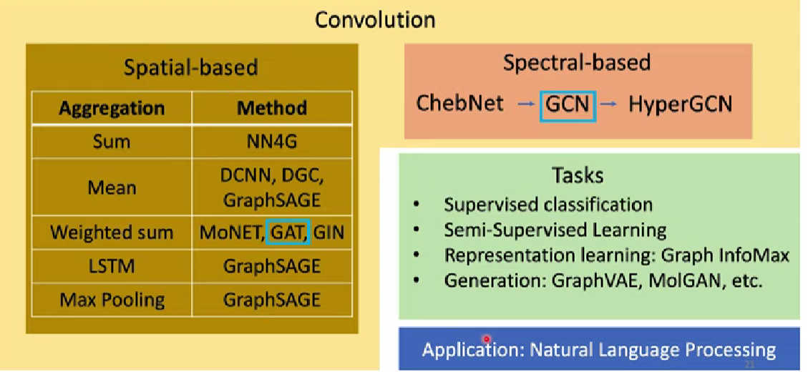
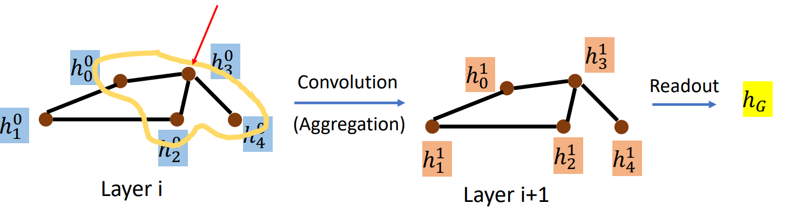
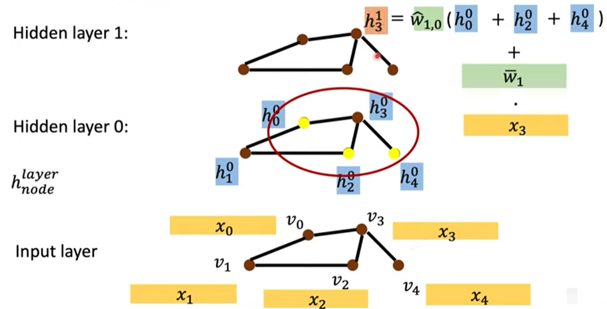
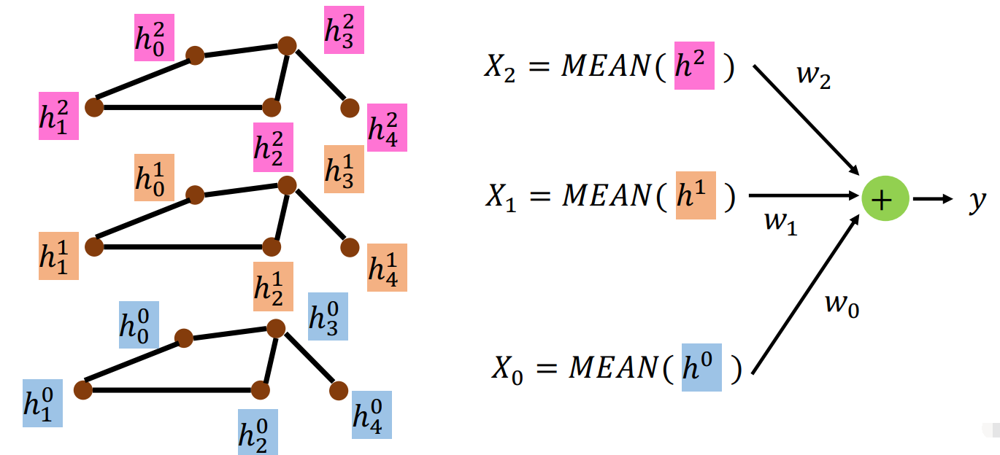
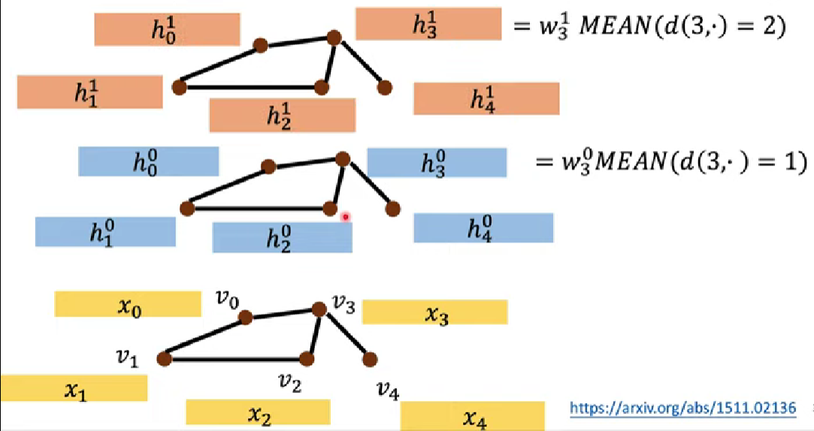
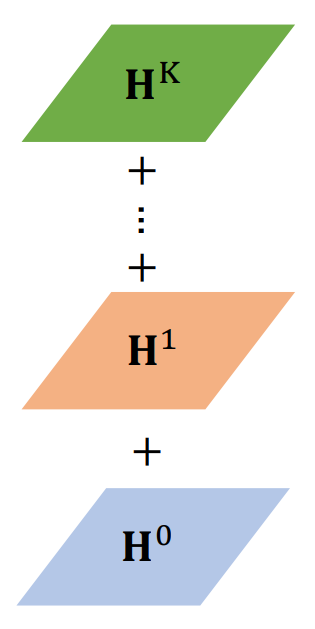
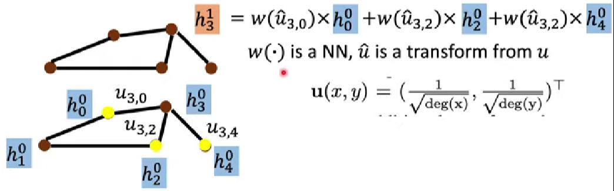
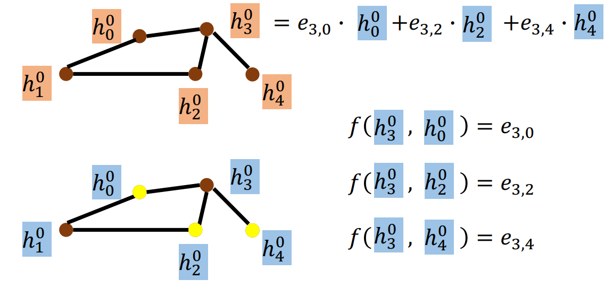
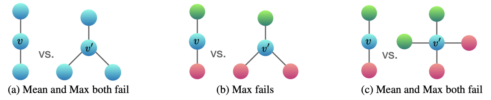
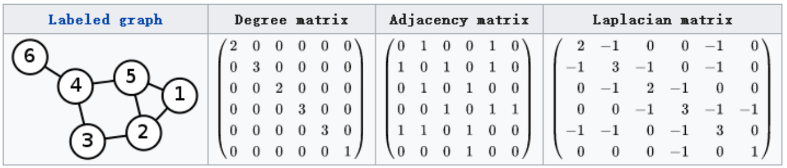

# GNN

## 总览

- 图神经网络（Graph Neural Network，GNN）（关系图）
	- 基于空间的卷积（空域卷积，Spatial-based Convolution）
		- 关系图的图神经网络（Neural Networks for Graph，NN4G）
		- 扩散卷积神经网络（Diffusion-Convolution Neural Network，DCNN）
		- 扩散图卷积（Diffusion Graph Convolution，DGC）
		- 混合模型网络（Mixture Model Networks，MoNET）
		- 图样本聚合（Graph SAmple and aggreGatE，GraphSAGE）
		- 图注意力网络（Graph Attention Networks，GAT）
		- 图同构网络（Graph Isomorphism Network，GIN）
	- 基于频谱的卷积（谱域卷积，Spectral-based Convolution）

## Graph and Convolution

GNN 处理由结点（Node）和边（Edge）构成的图的数据，输入或生成 graph 。

一个结点可以从邻居上学到结构信息，可以使用卷积（能考虑一个区域的信息）考虑相邻结点的关系，将 convolution 的原理应用到 node feature 上。

有两种方式：

- Spatial-based convolution

	模仿图像中的卷积。

- Spectral-based convolution

	利用信号处理中的傅里叶变换将卷积推广到图上。

其中 GAT 和 GCN 最常用。

## Spatial-based Convolution

### 原理

每个结点具有 hidden state （$\boldsymbol h^{(l)}_i$）。

- 聚合（Aggregation）

	用 neighbor feature 更新下一层的 hidden state 。

- 读出（Readout）

	把所有 node 的 feature 集合起来代表整个 graph 。

### NN4G

使用 embedding 等方式将输入 $\boldsymbol x_i$ 转换为 hidden state ：
$$
\boldsymbol h^0_i = \boldsymbol {\bar w}_i \boldsymbol x_i
$$
对邻居加和并做转换，最后再加上输入数据得到下一层的 hidden state ：（aggregation）
$$
\boldsymbol h^{(l+1)}_i = \boldsymbol {\hat w}^{(l)}_i (\sum \boldsymbol h^{(l)}_{neighbors}) + \boldsymbol {\bar w}_i \boldsymbol x_i
$$

将每一层的 hidden state 取 mean 再各自转换后相加，作为整个 feature map 的输出：（readout）

### DCNN

第 $0$ 层对与该结点距离为 $1$ 的结点的输入 $\boldsymbol x$ 取 mean，然后转换。

第 $1$ 层对与该结点距离为 $2$ 的结点的输入 $\boldsymbol x$ 取 mean，然后转换。

以此类推：（aggregation）

将每一层的 feature map 组合起来，做转换：（readout）

### DGC

aggregation与 DCNN 一致。

readout 只是将每一层的 feature map 加和。

### MoNET

为相邻结点计算权重或距离：（aggregation）

其中， $deg()$ 为取结点的度的倒数。

### GraphSAGE

尝试的 aggregation ：

- 对邻居取 mean 。

- 对邻居做 max pooling 。

- 对 LSTM 输入邻居的 feature ，最后一个 hidden state 作为最终 output 。

	邻居一般不具备顺序，每次更新随机 sample 顺序，以求忽略顺序的影响。

### GAT

对邻居做 attention ，学习邻居的权重（学习及计算邻居权重的函数）：

其中，$f()$ 为需要习得的函数，其内部含有需要学习的权重，其计算结果称为 Energy 。

### GIN

GIN 不仅提供了模型，还提供了理论证明，结论如下。

aggregation 应当将其邻居加和后，再加上自身与一个系数的积，即具有以下形式：
$$
\boldsymbol h^{(k)}_v = 
MLP^{(k)} \left( (1 + \epsilon^{(k)}) \boldsymbol h^{(k-1)}_v + \sum\limits_{neighbors(v)} \boldsymbol h^{(k-1)}_u \right)
$$
其中，$\boldsymbol h^{(k)}_v$ 为第 $k$ 层的 hidden representation ，$MLP$ 表示**多层感知（Multi Layer Perception，MLP）**， $\epsilon$ 可以由模型学习，但令 $\epsilon = 0$ ，结果也不会太差，此时相当于将自身与邻居一起加和。

- 加和（Sum）

	一定要用加和才能 work ，用 mean pooling 或 max pooling 都不 work ，因为加和能综合更多的信息。

Mean 无法分辨 $(a),(c)$ 中的两个 Graph ，Max 无法分辨 $(a),(b),(c)$ 中的两个 Graph 。

## Spectral-based convolution

频谱（spectrum）是信号与系统里的概念，谱域卷积利用信号与系统的原理，以下只做粗糙的简述。

### 原理

Spectral-based convolution 只支持无向图（这里的信号难以考虑方向）。

关键在于如何将对波谱的傅里叶变换（Fourier transform）和卷积，推广为对 graph 的傅里叶变换和卷积。

#### 拉普拉斯矩阵

- 邻接矩阵（Adjacency Matrix） $\boldsymbol A$
- 度矩阵（Degree Matrix）$\boldsymbol D$

拉普拉斯矩阵（Laplacian Matrix）常见三种：

- Combinatorial Laplacian ：$\boldsymbol L = \boldsymbol D - \boldsymbol A$
- Symmetric Normalized Laplacian ：$\boldsymbol L^{sys} = \boldsymbol D^{- \frac 1 2} \boldsymbol L \boldsymbol D^{- \frac 1 2}$
- Random Walk Normalized Laplacian ：$\boldsymbol L^{rw} = \boldsymbol D^{- 1 } \boldsymbol L$

拉普拉斯矩阵是半正定矩阵（半正定意味着对称），有以下性质：

- 实对称矩阵一定有 $n$ 个线性无关的特征向量。
- 半正定矩阵的特征值一定非负。
- 实对阵矩阵的特征向量总是可以化成两两相互正交的正交矩阵。

由性质可知，拉普拉斯矩阵一定可以谱分解（也叫特征分解，对角化），即有：
$$
\boldsymbol L =
\boldsymbol U 

\begin{pmatrix}
\lambda_1 & & \\
& \ddots & \\
& & \lambda_n
\end{pmatrix}

\boldsymbol U^{-1}
=
\boldsymbol U 

\begin{pmatrix}
\lambda_1 & & \\
& \ddots & \\
& & \lambda_n
\end{pmatrix}
\boldsymbol U^T
$$
其中，$\boldsymbol U$ 一定是正交矩阵。

#### 推广傅里叶变换

一般傅里叶变换为：
$$
F(w) = \mathcal{F}[f(t)] = \int f(t) e^{-iwt} dt
$$
其中，$f(t)$ 为信号，$e^{-iwt}$ 为基函数。

考虑广义的特征方程：$AV = \lambda V$ ，其中 $A$ 是一种变换，$V$ 是特征向量或者特征函数（无穷维的向量），$\lambda$ 是特征值。

对于拉普拉斯算子 $\Delta$ 和 $e^{-iwt}$ ，有：$\Delta e^{-iwt} = \frac {\partial^2} {\partial t^2} e^{-iwt} = - w^2e^{-iwt}$ ，从而 $e^{-iwt}$ 也是拉普拉斯算子的特征函数（满足特征方程）,其 $w$ 与特征值有关联。

拉普拉斯矩阵也就是离散拉普拉斯算子？？？，$\boldsymbol V$ 是拉普拉斯矩阵的特征向量，有：$\boldsymbol L \boldsymbol V = \lambda \boldsymbol V$ 
