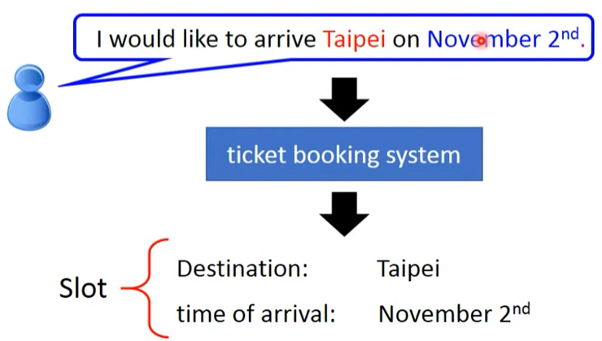

# RNN

## 总览

- 循环神经网络（Recurrent Neural Network，RNN）
	- 简单循环神经网络（SimpleRNN）
	- 长短期记忆（Lons Short-Term Memory，LSTM）
	- 门循环单元（Gated Recurrent Unit，GRU）
	
- 神经图灵机（Neural Turing Machine，NTM）

## 应用示例

- 槽填充（Slot Filling）

例如一个订票系统，顾客下达请求，系统需要将有效信息填充到正确的槽位（Slot）：

首先需要将可能的词汇表示为向量，可以采用 **1-of-N Encoding** ，即将每个词汇作为单位向量：

1-of-N Encoding 可能遇到一些问题，比如没有预料到的词汇，可以将其添加到 “other” 维度：

若神经网络一次输入一个词汇，输出槽位概率，那么就可能有相同词汇呈现不同意思的问题：

若是能够记忆当前词汇的前方词汇，比如 arrive 和 leave ，就可以为进一步区分意义提供帮助。

## SimpleRNN

RNN 会将 hidden layer 的输出存储下来，作为下一次输入的附加输入参数。

对于第一次输入，要为存储位置提供初始值。

当然，hidden layer 可多层。

- Elman Network

	存储 hidden layer 的输出再输入某一层。

- Jordan Network

	存储 target 再输入某一层。

- Bidirectional RNN

	同时训练一个正向扫描句子的 RNN 和一个反向扫描的 RNN ，$x$ 代表一次输入的一个词汇，整合二者的输出，能够综合考虑句子前后
	（整个句子）的信息。

## LSTM

### 单元

一个 LSTM 单元包括：（相当于 4 个输入，1 个输出的神经元）

- Memory Cell

	用于存储数据。

- Input Gate

	由信号控制何时输入。

- Output Gate

	由信号控制何时输出。

- Forget Gate

	由信号控制何时变换（“遗忘”）一些信息。

### 具体结构

其中，$c^\prime$ 为替代记忆单元中 $c$ 的值。

### 单层

将多个 LSTM 单元组合在一起作为 LSTM 层。（输入需要 $4$ 个转换矩阵（也是权重参数），最终输出需要 $1$ 个转换矩阵）

- $\boldsymbol c^{(t-1)}$ 代表 $t-1$ 时间的单层所有记忆单元的内容组成的向量。
- 输入向量 $\boldsymbol x^{(t)}$ 乘上一个转换矩阵，得到 $\boldsymbol z$，其各维分别作为 LSTM 层各单元的输入。
- 分别乘上一个转换矩阵，得到 $\boldsymbol z^{(i)},\boldsymbol z^{(f)},\boldsymbol z^{(o)}$，其各维分别作为 LSTM 层各单元的 input gate ，forget gate ，output gate 的输入。
- 经内部运算后得到 LSTM hidden layer 的输出结果 $\boldsymbol h^{(t)}$ ，将其再乘上一个转换矩阵，得到最终的输出结果 $\boldsymbol y^{(t)}$ 。
- 图中的乘法运算 $\times$ 应当是 element wise 的，即对应元素相乘，应写为 $\odot$ 。

单层的前后状态放在一起：（原理简化版）

真正的结构还会将以下两项连接到下一状态的输入（向量拼接）：

- LSTM hidden layer 的输出  $\boldsymbol h^{(t)}$ ，被称为**隐状态（Hidden State）**，其包含了之前状态的信息。
- memory cell 中的 $\boldsymbol c^{(t)}$ ，被称为**记忆状态（Memory State）**，也被称为 **peephole** 。

### 多层

双层为例，其前后状态放在一起如下：

## GRU

GRU 与 LSTM 的效果相当，但参数更少，更易于计算。

GRU 结构如下：（左下角为 LSTM 结构简图）

其中：

- $\boldsymbol x^{t}$ 经过黄色箭头代表的转换矩阵变为 $\boldsymbol h^{\prime}$ 。
- $\boldsymbol h^{(t)}$ 由 $\boldsymbol h^{(t-1)}$ 和 $\boldsymbol h^{\prime}$ 一起计算得来，$\boldsymbol z$ 与 $\boldsymbol {1-z}$  的权重分配调整二者的作用强度，一个强时，另一个就弱。
- **更新门（Update Gate）**相当于 LSTM 的 input gate 和 forget gate 。依据 $\boldsymbol z$ 与 $\boldsymbol {1-z}$  的权重分配，GRU 相当于联动了 LSTM 的 input gate 与 fotget gate ，即当有新到东西进来多时，就会忘掉多的东西，新的东西进来少时，就会忘掉少的东西。
- **重置门（Reset Gate）**仅对 $\boldsymbol h^{(t-1)}$ 做转换。

对比可以看到，LSTM 单层需要 $4$ 个权重参数矩阵（黄色，绿色，浅蓝色，深蓝色），GRY 只需要 $3$ 个（深蓝色，浅蓝色，黄色）。

## RNN 的训练

RNN 可以使用梯度下降训练，常称为 **Backpropagation throught Time（BPTT）**算法。

### SimpleRNN

SimpleRNN 是不易训练的，我们期望的 loss 应当是蓝色线，但实际上 SimpleRNN 的 loss 会剧烈震荡，呈现绿色线的样子：

考虑中 RNN 在 BPTT 的状况：

其中，？？？

从而 SimpleRNN 的 error surface 要么十分平坦（梯度小），要么十分陡峭（梯度大）。

- 可能从靠近悬崖底部的地方一下跳到悬崖顶部。

- 当从平坦的地方（梯度小，学习率大）到达悬崖底部，梯度突然变得非常大，学习率保持大，从而就“飞”出去了，训练变得混乱。

解决办法很简单，使用 Clipping 即可，即将梯度限制在一定范围内，超出这个范围就只使用范围的边缘值，从而能够继续训练。

### LSTM

LSTM 可以解决 SimpleRNN 的**梯度消失（Gradient Vanishing）**问题，即将非常平坦的地方处理掉；但其不能解决**梯度爆炸（Gradient Explode）**的问题，即仍然会存在非常陡峭的地方。从而 LSTM 需要在学习率非常小的情况下进行训练。

为什么 LSTM 能处理梯度消失？

在每一个时间点，SimpleRNN 的 memory 都会被输入完全更新：但 LSTM 中，memory 和输入是由加法联系的，这意味着每个时间点， LSTM 的 memory 不是被完全更新，而是逐步叠加，逐步变化的（除非 forget gate 被打开对其造成较大影响），所以不会有梯度消失的问题。

## 应用

### 一对一

One to One，每个向量一个 label 。（Sequence Labeling）

- 槽填充（Slot Filling）

### 多对一

Many to One，多个向量一个 label 。

将最后一个时间点的 hidden layer 的输出做一定变换后，作为最终输出。

- 情感分析（Sentiment Analysis）

- 关键词提取（Key Term Extraction）

	

### 多对多（输出更短）

Many to Many（Output is shorter），不过输出更短，输入多个向量，输出多个向量（更少）。（Sequence to Sequence，Seq2Seq）

- 语音识别（Speech Recognition）

	输入语言，输出文字。

取很短的时间间隔作为一个向量，通常会有多个向量对应同一个词汇，可以使用 Trimming 去掉重复的部分，但这样就不能处理叠词：

可以使用**连接时序分类（Connectionist Temporal Classification，CTC）**解决，其添加一个多余符号 $\emptyset$ 代表 Null ：

### 多对多（无限制）

Many to Many（No limitation），输入多个向量，输出多个向量。（Sequence to Sequence，Seq2Seq）

- 机器翻译（Machine Translation）

用 RNN 扫描整个 Sequence，在最后的时间点，RNN 网络就含有了整个 Sequence 的信息，让最后时间点的 RNN 输出一个向量，假设是“机”，然后将“机”输入 RNN，再输出一个向量，假设是"器"，以此类推，添加一个向量代表停止：

若能直接输入声音，然后输出文字，这样就可以解决一些文字系统不完善的语言或情况，比如输入方言语音，直接输出中文文字，这样就不需要知道方言的文字。

### 超 Sequence

事物转 Sequence 或 Sequence 转事物（该事物能够被 Sequence 描述）。（Beyond Sequence）

- 句法分析（Syntactic Parsing）

其中，$()_{NP}$ 代表左，$()_{VP}$ 代表右：

### Auto-encoder

Sequence to Sequence 。

#### Text

将 word sequence 输入 RNN ，在最后的时间点的 RNN 即包含重要的信息，然后使用 Decoder 将该信息 decode 解码出原来的句子：

- 该方法易于表达文法的意思。

当采用 Skip-thought 策略时，不是解码出原来的句子，而是下一个句子。

- Skip-thought 易于表达语义的意思。

该结构甚至可以是分层的：

- 编码

	将多个词向量编码为多个句向量，然后将多个句向量表示为文本向量

- 解码

	用文本向量产生多个句向量，再用多个句向量解回多个词向量。

#### Speech

如同将多个词向量表示为句向量，将多个句向量表示为文本向量，也可将**语音片段（Audio Segment）**表示为一个向量：

将语音划分 frame ，然后用训练一个 encoder 逐个扫描，一个 decoder 逐个生成（一起 train），$\boldsymbol x, \boldsymbol y$ 越接近越好：

## NTM

相当于 RNN 进阶版，也具有记忆功能，其 memory 更大，同时使用了 attention 机制使用 memory，

图灵机（Turing Machine）：

NTM 使用 Reading Head Controller 从 memory 找到重要信息读取（可多次，多个位置）：

使用 Writing Head Controller 从 memory 找到重要信息写的位置（可多次，多个位置）：

可以输入文本输出关键词、输入语音输出听力答案、输入图像输出物体的识别结果等：（图中为 banana）

