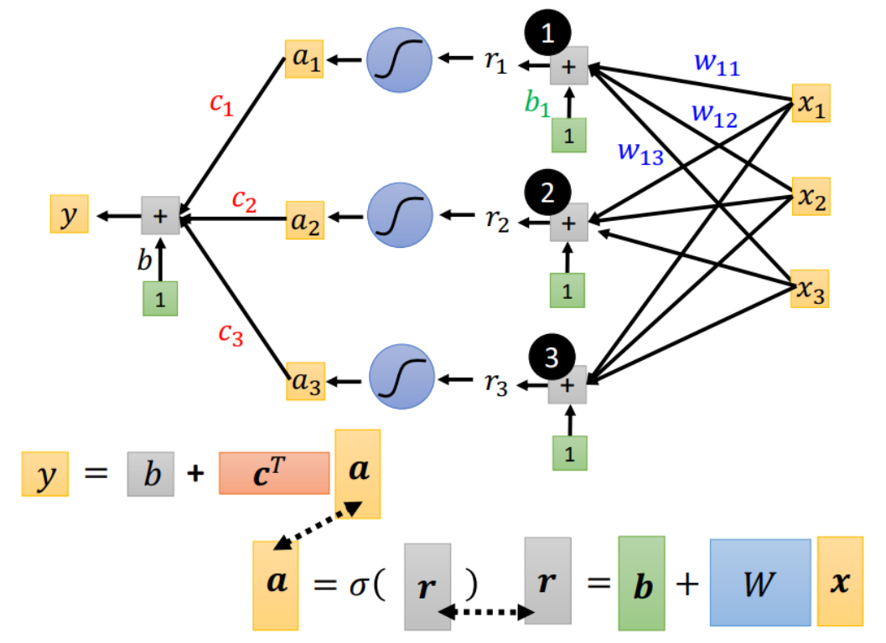
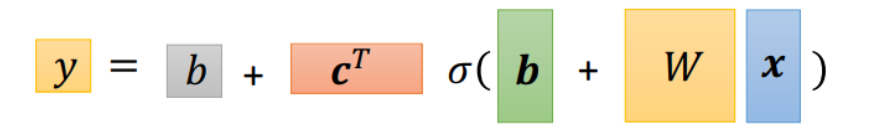
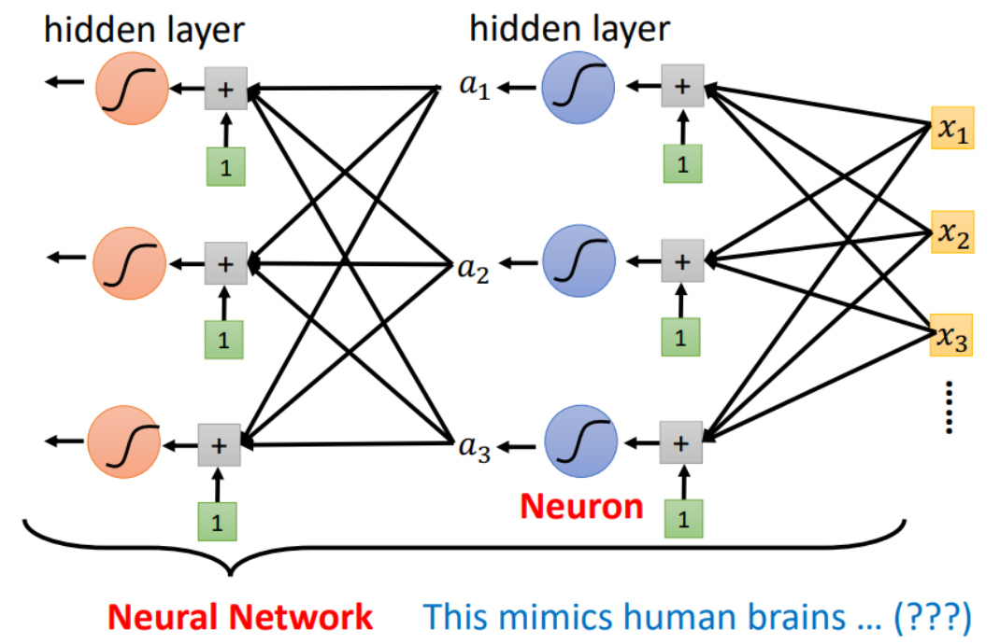

# 基本概念

- 自变量（independent variable，输入，input）
- 因变量（dependent variable，输出，output）
- 参数（parameter，权重，weight）

## 总览

- 神经网络（Neural Network，NN）

	- 神经元（Neuron），感知器（Perceptron）

	- 层（Layer）

		神经网络的层数一般指隐藏层的数目。

- 前馈神经网络（Feedforward Neural Network，FNN）

  - 多层感知器（Multilayer Perceptron，MLP）

  - 全连接神经网络（Fully Connected Neural Network，FC）

    有时也称为深度神经网络（Deep Neural Network，DNN）。

## 神经元（感知器）

- 输入参数 $x_j$
- 各连接参数权重 $w_j$
- 偏置项 $b$ （Bias）
- 激活函数 $A$
- 输出参数 $a$

$$
a = A(b + \sum\limits_j w_jx_j)
$$

将激活函数 $A()$ 的输入称为 $r$ ，一般取 $r$ 为多元线性函数，因为线性函数能够同时作用多个参数的最简单的函数，应当尽量保持神经元的结构简单，把复杂度交由网络实现。

## 前馈神经网络

神经元按层排列，每一层只接收上一层的输出，并只输出到下一层，即没有循环的单向多层结构。

“前馈”也可以作为一种神经网络的结构的属性。

### 多层感知器

MLP 是每个神经元都会与上一层所有神经元连接的前馈神经网络。

### 全连接神经网络

#### 单层神经网络

由多个神经元加和组成。

- 输入层

	- 输入参数 $x_j$
- 隐藏层（全连接层）

	- 第 $i$ 个神经元
	- 神经元输入参数 $x_{ij}$
	- 连接权重 $w_{ij}$
	- 神经元偏置项 $b_i$
	- 激活函数 $A_i$
	- 神经元输出参数 $a_i$
- 输出层

	- 放大系数 $c_i$
	- 网络偏置项 $b_n$
	- 输出参数 $y_n$

$$
\begin{cases}
x_{ij} = x_j \\\\
a_i = A(b_i + \sum\limits_j w_{ij} x_{ij}) \\\\
y_n = b_n + \sum\limits_i c_ia_i
\end{cases}
$$

即：

#### 多层神经网络

- 输入层

	- 第一个隐藏层的输入参数 $x_j$
- 第 $l$ 个隐藏层（全连接层），共 $m$ 层。

	- 第 $i$ 个神经元
	- 神经元输入参数 $x^{(l)}_{ij}$
	- 连接权重 $w^{(l)}_{ij}$
	- 神经元偏置项 $b^{(l)}_i$
	- 激活函数 $A^{(l)}_i$
	- 神经元输出参数 $a^{(l)}_i$
- 输出层

	- 最后一个隐藏层的输出参数 $a^{(m)}_i$
	- 放大系数 $c_i$ （相当于连接权重）
	- 网络偏置项 $b_n$
	- 输出参数 $y_n$

$$
\begin{cases}
x^{(1)}_{ij} = x_j \\
\vdots\\
\begin{cases}
x^{(l)}_{ij} = a^{(l - 1)}_j \\\\
a^{(l)}_i = A^{(l)}_i(b^{(l)}_i + \sum\limits_j w^{(l)}_{ij}x^{(l)}_{ij})
\end{cases} \\
\vdots \\
y_n = b_n + \sum\limits_i c_ia^{(m)}_i
\end{cases}
$$

**整个神经网络就是一个多层的嵌套函数，越接近输出参数，就处于越外层。**

## 计算结构

[矩阵求导](https://zhuanlan.zhihu.com/p/273729929)

### 梯度

在神经网络中一个样本的训练过程，一个 batch 的梯度一般取样本梯度的平均值。

#### 前向传播

（Forward Propagation / Forward Pass）

神经网络中整个从输入参数得到输出参数的计算过程。

- 神经网络的整体前向传播的计算过程是嵌套函数中**由内而外**的。
- 越接近输出参数，就越外层。

#### 反向传播

（Backpropagation / Backward Pass，BP 算法）

使用梯度下降更新权重参数的过程。

- 损失函数的参数为神经网络的输出参数，因此**损失函数是对神经网络嵌套函数的外加一层嵌套**。
- 神经网络的参数连接形式与链式法则中变量依赖关系形式一致。
- 神经网络的所有权重参数不是一个展开的向量，而是具有类似神经网络结构的依赖关系（嵌套关系）。
- 链式法则（Chain Rule）
	- 求**损失函数**对**权重参数**的偏导。
	- 由外而内，由深至浅逐层展开变量依赖关系。
	- 由内而外，由浅至深，逐层更新权重参数。该次样本的**输入参数**和产生的**输出参数**作为代入值。

#### 爆炸与消失

梯度在计算过程中，从浅到深，从内到外，容易因运算积累造成：

- 梯度爆炸

	在深层的梯度过大。

- 梯度消失

	在深层的梯度过小。

#### 对输入求导

对输入求导可得到权重（参数）的值：
$$
y = ax + bx + c
\implies
\frac {\partial y} {\partial x} = a + b
$$
其中， bias（即 $c$）会丢失。

对输入求导时，输入并不一定会被消去，比如 $\rm d x^2 = 2x$ ，比如 sigmoid 函数的导数：
$$
\begin{cases}
f(x)_{sigmoid} = \frac {1} {1 + e^{-x}} \\\\
f'(x)_{sigmoid} = f(x)[1 - f(x)]
\end{cases}
$$

### 深度与宽度

如同对折后再剪纸一样，“深度”可以比“宽度”用更少的神经元拟合出目标函数，也意味着权重参数更少。

深度使得神经元间的相互作用变得更复杂，因而相同数目神经元的可以拟合出更复杂的函数。
